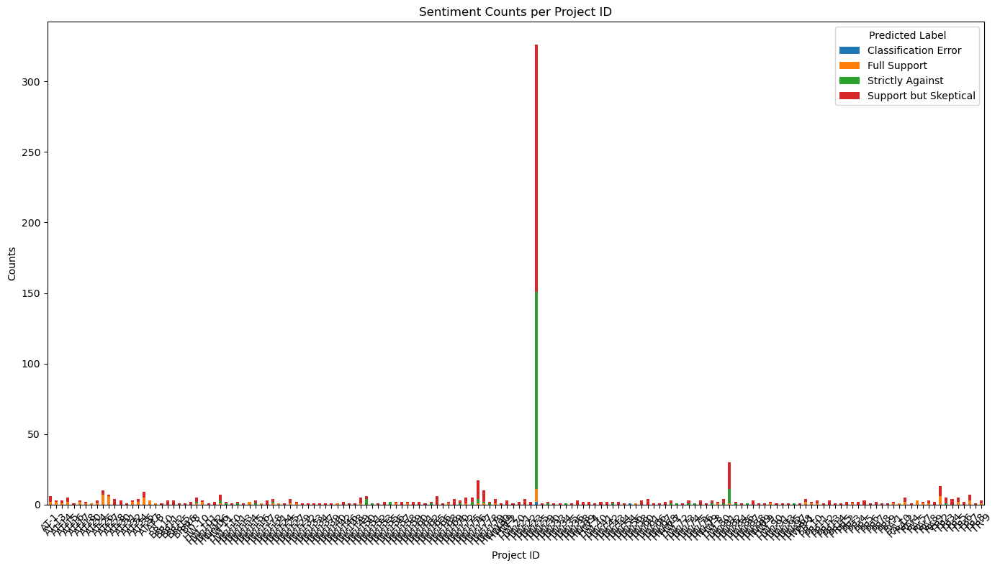
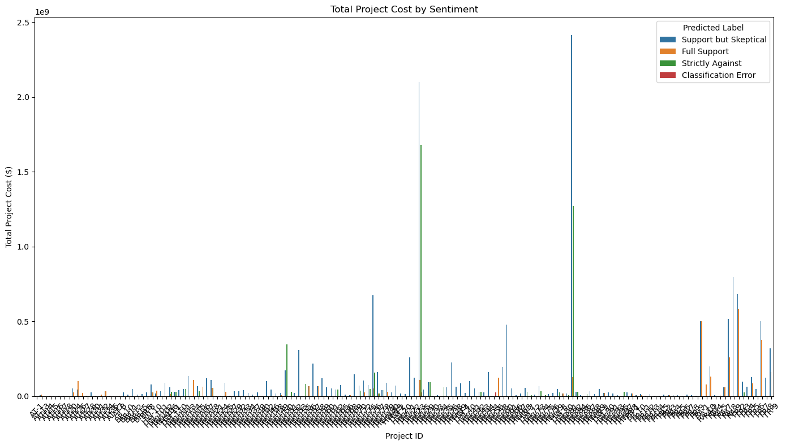
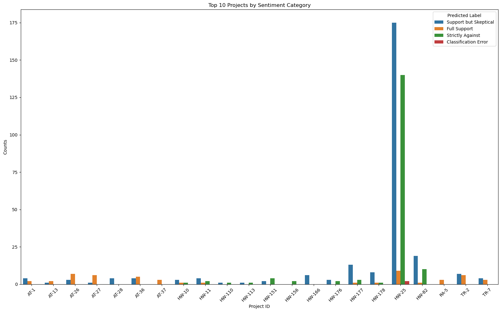
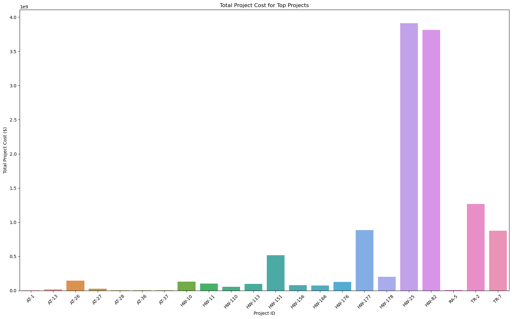
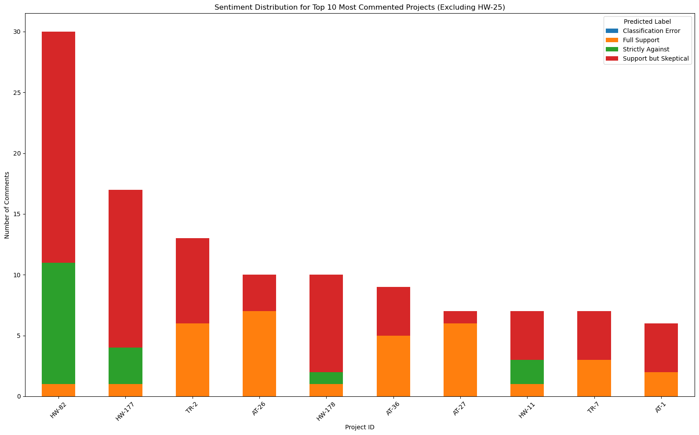
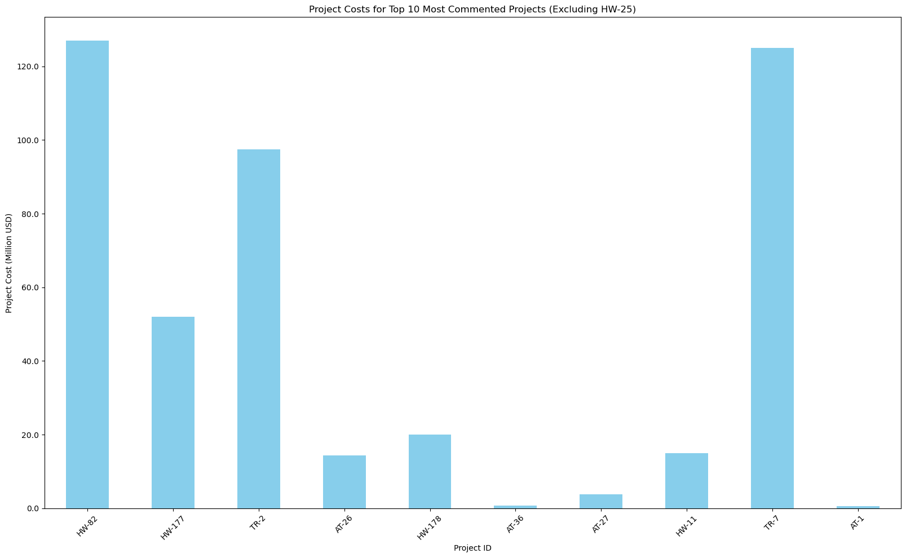
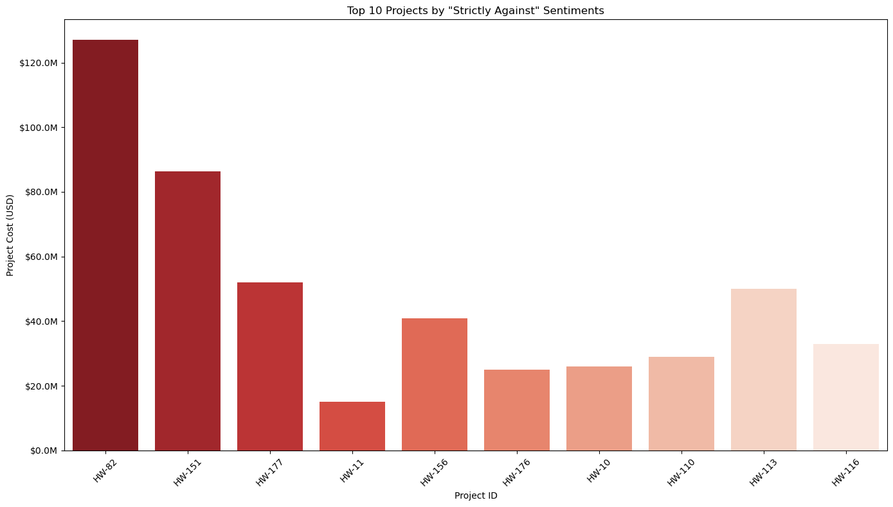
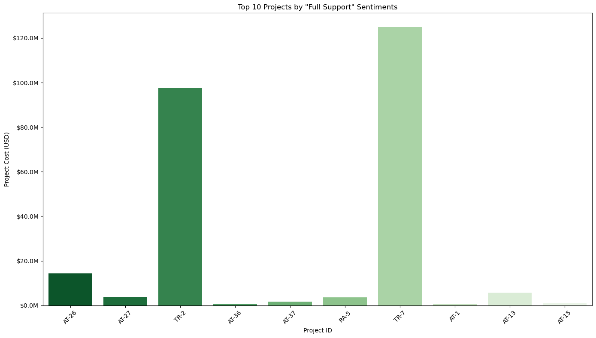

# Sentiment Analysis Project with Zero-Shot Classification

Welcome to my Sentiment Analysis project utilizing Zero-Shot Classification with the BART model. This notebook is dedicated to building a sophisticated approach to identify and classify the sentiment of public comments without explicit training data for each category. Zero-shot classification enables the model to understand sentiment context through transfer learning and natural language understanding, making it highly versatile and powerful for analyzing texts from diverse sources.

## Objective:
The main objective of this project is to leverage the BART model for zero-shot sentiment analysis, enabling the accurate categorization of sentiments in public comments. This method is particularly valuable as it does not require a labeled dataset for every sentiment category, which can be resource-intensive to obtain. By applying this technique, I aim to gain insightful and actionable understandings from public opinions, enhancing decision-making processes in various domains.

## Dataset:
For this project, I will analyze a collection of public comments. These texts will vary in content and sentiment, providing a robust foundation for demonstrating the efficacy of zero-shot classification with BART. As the model requires no specific training on this dataset, we can directly apply it to classify sentiments as positive, negative, or neutral.

## Approach:
My approach to developing this sentiment analysis model includes the following steps:
1. **Data Collection**: Compile a diverse set of public comments for analysis.
2. **Model Selection**: Utilize the BART model, which is pre-trained on a large corpus of text and is adept at understanding and generating human-like text.
3. **Zero-Shot Classification**: Apply the zero-shot learning capabilities of the BART model to classify the sentiment of each comment without explicit sentiment labels.
4. **Analysis and Interpretation**: Evaluate the results to understand public sentiment on various topics or issues.
5. **Insights Application**: Use the gleaned insights to inform decision-making processes, policy formulation, or customer service enhancements.

## Tools and Libraries:
I will use Python as my programming language, supported by libraries such as Transformers by Hugging Face for accessing the BART model, pandas for data manipulation, and Matplotlib and Seaborn for data visualization. This combination of tools will enable efficient data handling and effective sentiment analysis.

Let's dive into the world of zero-shot sentiment analysis with BART and uncover the sentiments hidden within public comments!

<table border="1" class="dataframe">
  <thead>
    <tr style="text-align: right;">
      <th></th>
      <th>Project ID</th>
      <th>Project Cost</th>
      <th>Project Description</th>
      <th>Comments</th>
    </tr>
  </thead>
  <tbody>
    <tr>
      <th>0</th>
      <td>AT-1</td>
      <td>632347.0</td>
      <td>Chesterfield Fall Line Trail: Segment 2B - MM ...</td>
      <td>GET IT DONE!</td>
    </tr>
    <tr>
      <th>1</th>
      <td>AT-1</td>
      <td>632347.0</td>
      <td>Chesterfield Fall Line Trail: Segment 2B - MM ...</td>
      <td>Very excited about this project!</td>
    </tr>
    <tr>
      <th>2</th>
      <td>AT-1</td>
      <td>632347.0</td>
      <td>Chesterfield Fall Line Trail: Segment 2B - MM ...</td>
      <td>Why isn't the Fall Line Trail all the way to P...</td>
    </tr>
    <tr>
      <th>3</th>
      <td>AT-1</td>
      <td>632347.0</td>
      <td>Chesterfield Fall Line Trail: Segment 2B - MM ...</td>
      <td>Consider adding funds for branching feeder tra...</td>
    </tr>
    <tr>
      <th>4</th>
      <td>AT-1</td>
      <td>632347.0</td>
      <td>Chesterfield Fall Line Trail: Segment 2B - MM ...</td>
      <td>Let's do this!</td>
    </tr>
  </tbody>
</table>

    'C:\\Users\\rsingh\\OneDrive - PlanRVA\\Documents\\2_Projects\\Extras\\Sentiment-Analysis_NLP\\Sentiment-Analysis_NLP\\Scripts'

    C:\Users\rsingh\AppData\Local\Temp\ipykernel_44500\2223360056.py:37: SettingWithCopyWarning: 
    A value is trying to be set on a copy of a slice from a DataFrame.
    Try using .loc[row_indexer,col_indexer] = value instead
    
    See the caveats in the documentation: https://pandas.pydata.org/pandas-docs/stable/user_guide/indexing.html#returning-a-view-versus-a-copy
      df['Predicted Label'] = ""  # Add a new column for the predicted labels
    C:\Users\rsingh\AppData\Local\Temp\ipykernel_44500\2223360056.py:38: SettingWithCopyWarning: 
    A value is trying to be set on a copy of a slice from a DataFrame.
    Try using .loc[row_indexer,col_indexer] = value instead
    
    See the caveats in the documentation: https://pandas.pydata.org/pandas-docs/stable/user_guide/indexing.html#returning-a-view-versus-a-copy
      df['Score'] = 0.0
    

    Processed Sentence: 1/766
    Processed Sentence: 2/766
    Processed Sentence: 3/766
    Processed Sentence: 4/766
    Processed Sentence: 5/766
    Processed Sentence: 6/766
    Processed Sentence: 7/766
    Processed Sentence: 8/766
    Processed Sentence: 9/766
    Processed Sentence: 10/766
    Processed Sentence: 11/766
    Processed Sentence: 12/766
    Processed Sentence: 13/766
    Processed Sentence: 14/766
    Processed Sentence: 15/766
    Processed Sentence: 16/766
    Processed Sentence: 17/766
    Processed Sentence: 18/766
    Processed Sentence: 19/766
    Processed Sentence: 20/766
    Processed Sentence: 21/766
    Processed Sentence: 22/766
    Processed Sentence: 23/766
    Processed Sentence: 24/766
    Processed Sentence: 25/766
    Processed Sentence: 26/766
    Processed Sentence: 27/766
    Processed Sentence: 28/766
    Processed Sentence: 29/766
    Processed Sentence: 30/766
    Processed Sentence: 31/766
    Processed Sentence: 32/766
    Processed Sentence: 33/766
    Processed Sentence: 34/766
    Processed Sentence: 35/766
    Processed Sentence: 36/766
    Processed Sentence: 37/766
    Processed Sentence: 38/766
    Processed Sentence: 39/766
    Processed Sentence: 40/766
    Processed Sentence: 41/766
    Processed Sentence: 42/766
    Processed Sentence: 43/766
    Processed Sentence: 44/766
    Processed Sentence: 45/766
    Processed Sentence: 46/766
    Processed Sentence: 47/766
    Processed Sentence: 48/766
    Processed Sentence: 49/766
    Processed Sentence: 50/766
    Processed Sentence: 51/766
    Processed Sentence: 52/766
    Processed Sentence: 53/766
    Processed Sentence: 54/766
    Processed Sentence: 55/766
    Processed Sentence: 56/766
    Processed Sentence: 57/766
    Processed Sentence: 58/766
    Processed Sentence: 59/766
    Processed Sentence: 60/766
    Processed Sentence: 61/766
    Processed Sentence: 62/766
    Processed Sentence: 63/766
    Processed Sentence: 64/766
    Processed Sentence: 65/766
    Processed Sentence: 66/766
    Processed Sentence: 67/766
    Processed Sentence: 68/766
    Processed Sentence: 69/766
    Processed Sentence: 70/766
    Processed Sentence: 71/766
    Processed Sentence: 72/766
    Processed Sentence: 73/766
    Processed Sentence: 74/766
    Processed Sentence: 75/766
    Processed Sentence: 76/766
    Processed Sentence: 77/766
    Processed Sentence: 78/766
    Processed Sentence: 79/766
    Processed Sentence: 80/766
    Processed Sentence: 81/766
    Processed Sentence: 82/766
    Processed Sentence: 83/766
    Processed Sentence: 84/766
    Processed Sentence: 85/766
    Processed Sentence: 86/766
    Processed Sentence: 87/766
    Processed Sentence: 88/766
    Processed Sentence: 89/766
    Processed Sentence: 90/766
    Processed Sentence: 91/766
    Processed Sentence: 92/766
    Processed Sentence: 93/766
    Processed Sentence: 94/766
    Processed Sentence: 95/766
    Processed Sentence: 96/766
    Processed Sentence: 97/766
    Processed Sentence: 98/766
    Processed Sentence: 99/766
    Processed Sentence: 100/766
    Processed Sentence: 101/766
    Processed Sentence: 102/766
    Processed Sentence: 103/766
    Processed Sentence: 104/766
    Processed Sentence: 105/766
    Processed Sentence: 106/766
    Processed Sentence: 107/766
    Processed Sentence: 108/766
    Processed Sentence: 109/766
    Processed Sentence: 110/766
    Processed Sentence: 111/766
    Processed Sentence: 112/766
    Processed Sentence: 113/766
    Processed Sentence: 114/766
    Processed Sentence: 115/766
    Processed Sentence: 116/766
    Processed Sentence: 117/766
    Processed Sentence: 118/766
    Processed Sentence: 119/766
    Processed Sentence: 120/766
    Processed Sentence: 121/766
    Processed Sentence: 122/766
    Processed Sentence: 123/766
    Processed Sentence: 124/766
    Processed Sentence: 125/766
    Processed Sentence: 126/766
    Processed Sentence: 127/766
    Processed Sentence: 128/766
    Processed Sentence: 129/766
    Processed Sentence: 130/766
    Processed Sentence: 131/766
    Processed Sentence: 132/766
    Processed Sentence: 133/766
    Processed Sentence: 134/766
    Processed Sentence: 135/766
    Processed Sentence: 136/766
    Processed Sentence: 137/766
    Processed Sentence: 138/766
    Processed Sentence: 139/766
    Processed Sentence: 140/766
    Processed Sentence: 141/766
    Processed Sentence: 142/766
    Processed Sentence: 143/766
    Processed Sentence: 144/766
    Processed Sentence: 145/766
    Processed Sentence: 146/766
    Processed Sentence: 147/766
    Processed Sentence: 148/766
    Processed Sentence: 149/766
    Processed Sentence: 150/766
    Processed Sentence: 151/766
    Processed Sentence: 152/766
    Processed Sentence: 153/766
    Processed Sentence: 154/766
    Processed Sentence: 155/766
    Processed Sentence: 156/766
    Processed Sentence: 157/766
    Processed Sentence: 158/766
    Processed Sentence: 159/766
    Processed Sentence: 160/766
    Processed Sentence: 161/766
    Processed Sentence: 162/766
    Processed Sentence: 163/766
    Processed Sentence: 164/766
    Processed Sentence: 165/766
    Processed Sentence: 166/766
    Processed Sentence: 167/766
    Processed Sentence: 168/766
    Processed Sentence: 169/766
    Processed Sentence: 170/766
    Processed Sentence: 171/766
    Processed Sentence: 172/766
    Processed Sentence: 173/766
    Processed Sentence: 174/766
    Processed Sentence: 175/766
    Processed Sentence: 176/766
    Processed Sentence: 177/766
    Processed Sentence: 178/766
    Processed Sentence: 179/766
    Processed Sentence: 180/766
    Processed Sentence: 181/766
    Processed Sentence: 182/766
    Processed Sentence: 183/766
    Processed Sentence: 184/766
    Processed Sentence: 185/766
    Processed Sentence: 186/766
    Processed Sentence: 187/766
    Processed Sentence: 188/766
    Processed Sentence: 189/766
    Processed Sentence: 190/766
    Processed Sentence: 191/766
    Processed Sentence: 192/766
    Processed Sentence: 193/766
    Processed Sentence: 194/766
    Processed Sentence: 195/766
    Processed Sentence: 196/766
    Processed Sentence: 197/766
    Processed Sentence: 198/766
    Processed Sentence: 199/766
    Processed Sentence: 200/766
    Processed Sentence: 201/766
    Processed Sentence: 202/766
    Processed Sentence: 203/766
    Processed Sentence: 204/766
    Processed Sentence: 205/766
    Processed Sentence: 206/766
    Processed Sentence: 207/766
    Processed Sentence: 208/766
    Processed Sentence: 209/766
    Processed Sentence: 210/766
    Processed Sentence: 211/766
    Processed Sentence: 212/766
    Processed Sentence: 213/766
    Processed Sentence: 214/766
    Processed Sentence: 215/766
    Processed Sentence: 216/766
    Processed Sentence: 217/766
    Processed Sentence: 218/766
    Processed Sentence: 219/766
    Processed Sentence: 220/766
    Processed Sentence: 221/766
    Processed Sentence: 222/766
    Processed Sentence: 223/766
    Processed Sentence: 224/766
    Processed Sentence: 225/766
    Processed Sentence: 226/766
    Processed Sentence: 227/766
    Processed Sentence: 228/766
    Processed Sentence: 229/766
    Processed Sentence: 230/766
    Processed Sentence: 231/766
    Processed Sentence: 232/766
    Processed Sentence: 233/766
    Processed Sentence: 234/766
    Processed Sentence: 235/766
    Processed Sentence: 236/766
    Processed Sentence: 237/766
    Processed Sentence: 238/766
    Processed Sentence: 239/766
    Processed Sentence: 240/766
    Processed Sentence: 241/766
    Processed Sentence: 242/766
    Processed Sentence: 243/766
    Processed Sentence: 244/766
    Processed Sentence: 245/766
    Processed Sentence: 246/766
    Processed Sentence: 247/766
    Processed Sentence: 248/766
    Processed Sentence: 249/766
    Processed Sentence: 250/766
    Processed Sentence: 251/766
    Processed Sentence: 252/766
    Processed Sentence: 253/766
    Processed Sentence: 254/766
    Processed Sentence: 255/766
    Processed Sentence: 256/766
    Processed Sentence: 257/766
    Processed Sentence: 258/766
    Processed Sentence: 259/766
    Processed Sentence: 260/766
    Processed Sentence: 261/766
    Processed Sentence: 262/766
    Processed Sentence: 263/766
    Processed Sentence: 264/766
    Processed Sentence: 265/766
    Processed Sentence: 266/766
    Processed Sentence: 267/766
    Processed Sentence: 268/766
    Processed Sentence: 269/766
    Processed Sentence: 270/766
    Processed Sentence: 271/766
    Processed Sentence: 272/766
    Processed Sentence: 273/766
    Processed Sentence: 274/766
    Processed Sentence: 275/766
    Processed Sentence: 276/766
    Processed Sentence: 277/766
    Processed Sentence: 278/766
    Processed Sentence: 279/766
    Processed Sentence: 280/766
    Processed Sentence: 281/766
    Processed Sentence: 282/766
    Processed Sentence: 283/766
    Processed Sentence: 284/766
    Processed Sentence: 285/766
    Processed Sentence: 286/766
    Processed Sentence: 287/766
    Processed Sentence: 288/766
    Processed Sentence: 289/766
    Processed Sentence: 290/766
    Processed Sentence: 291/766
    Processed Sentence: 292/766
    Processed Sentence: 293/766
    Processed Sentence: 294/766
    Processed Sentence: 295/766
    Processed Sentence: 296/766
    Processed Sentence: 297/766
    Processed Sentence: 298/766
    Processed Sentence: 299/766
    Processed Sentence: 300/766
    Processed Sentence: 301/766
    Processed Sentence: 302/766
    Processed Sentence: 303/766
    Processed Sentence: 304/766
    Processed Sentence: 305/766
    Processed Sentence: 306/766
    Processed Sentence: 307/766
    Processed Sentence: 308/766
    Processed Sentence: 309/766
    Processed Sentence: 310/766
    Processed Sentence: 311/766
    Processed Sentence: 312/766
    Processed Sentence: 313/766
    Processed Sentence: 314/766
    Processed Sentence: 315/766
    Error processing review at index 315: You must include at least one label and at least one sequence.
    Processed Sentence: 316/766
    Processed Sentence: 317/766
    Processed Sentence: 318/766
    Processed Sentence: 319/766
    Processed Sentence: 320/766
    Processed Sentence: 321/766
    Processed Sentence: 322/766
    Processed Sentence: 323/766
    Processed Sentence: 324/766
    Processed Sentence: 325/766
    Processed Sentence: 326/766
    Processed Sentence: 327/766
    Processed Sentence: 328/766
    Processed Sentence: 329/766
    Processed Sentence: 330/766
    Processed Sentence: 331/766
    Processed Sentence: 332/766
    Processed Sentence: 333/766
    Processed Sentence: 334/766
    Processed Sentence: 335/766
    Processed Sentence: 336/766
    Processed Sentence: 337/766
    Processed Sentence: 338/766
    Processed Sentence: 339/766
    Processed Sentence: 340/766
    Processed Sentence: 341/766
    Processed Sentence: 342/766
    Processed Sentence: 343/766
    Processed Sentence: 344/766
    Processed Sentence: 345/766
    Processed Sentence: 346/766
    Processed Sentence: 347/766
    Processed Sentence: 348/766
    Processed Sentence: 349/766
    Processed Sentence: 350/766
    Processed Sentence: 351/766
    Processed Sentence: 352/766
    Processed Sentence: 353/766
    Processed Sentence: 354/766
    Processed Sentence: 355/766
    Processed Sentence: 356/766
    Processed Sentence: 357/766
    Processed Sentence: 358/766
    Processed Sentence: 359/766
    Processed Sentence: 360/766
    Processed Sentence: 361/766
    Processed Sentence: 362/766
    Processed Sentence: 363/766
    Processed Sentence: 364/766
    Processed Sentence: 365/766
    Processed Sentence: 366/766
    Processed Sentence: 367/766
    Processed Sentence: 368/766
    Processed Sentence: 369/766
    Processed Sentence: 370/766
    Processed Sentence: 371/766
    Processed Sentence: 372/766
    Processed Sentence: 373/766
    Processed Sentence: 374/766
    Processed Sentence: 375/766
    Processed Sentence: 376/766
    Processed Sentence: 377/766
    Processed Sentence: 378/766
    Processed Sentence: 379/766
    Processed Sentence: 380/766
    Processed Sentence: 381/766
    Processed Sentence: 382/766
    Processed Sentence: 383/766
    Processed Sentence: 384/766
    Processed Sentence: 385/766
    Processed Sentence: 386/766
    Processed Sentence: 387/766
    Processed Sentence: 388/766
    Processed Sentence: 389/766
    Processed Sentence: 390/766
    Processed Sentence: 391/766
    Processed Sentence: 392/766
    Processed Sentence: 393/766
    Processed Sentence: 394/766
    Processed Sentence: 395/766
    Processed Sentence: 396/766
    Processed Sentence: 397/766
    Processed Sentence: 398/766
    Processed Sentence: 399/766
    Processed Sentence: 400/766
    Processed Sentence: 401/766
    Processed Sentence: 402/766
    Processed Sentence: 403/766
    Processed Sentence: 404/766
    Processed Sentence: 405/766
    Processed Sentence: 406/766
    Processed Sentence: 407/766
    Processed Sentence: 408/766
    Processed Sentence: 409/766
    Processed Sentence: 410/766
    Processed Sentence: 411/766
    Processed Sentence: 412/766
    Processed Sentence: 413/766
    Processed Sentence: 414/766
    Processed Sentence: 415/766
    Processed Sentence: 416/766
    Processed Sentence: 417/766
    Processed Sentence: 418/766
    Processed Sentence: 419/766
    Processed Sentence: 420/766
    Processed Sentence: 421/766
    Processed Sentence: 422/766
    Processed Sentence: 423/766
    Processed Sentence: 424/766
    Processed Sentence: 425/766
    Processed Sentence: 426/766
    Processed Sentence: 427/766
    Processed Sentence: 428/766
    Processed Sentence: 429/766
    Processed Sentence: 430/766
    Processed Sentence: 431/766
    Processed Sentence: 432/766
    Processed Sentence: 433/766
    Processed Sentence: 434/766
    Processed Sentence: 435/766
    Processed Sentence: 436/766
    Processed Sentence: 437/766
    Processed Sentence: 438/766
    Processed Sentence: 439/766
    Processed Sentence: 440/766
    Processed Sentence: 441/766
    Processed Sentence: 442/766
    Processed Sentence: 443/766
    Processed Sentence: 444/766
    Processed Sentence: 445/766
    Processed Sentence: 446/766
    Processed Sentence: 447/766
    Processed Sentence: 448/766
    Processed Sentence: 449/766
    Processed Sentence: 450/766
    Processed Sentence: 451/766
    Processed Sentence: 452/766
    Processed Sentence: 453/766
    Processed Sentence: 454/766
    Processed Sentence: 455/766
    Processed Sentence: 456/766
    Processed Sentence: 457/766
    Processed Sentence: 458/766
    Processed Sentence: 459/766
    Processed Sentence: 460/766
    Processed Sentence: 461/766
    Processed Sentence: 462/766
    Error processing review at index 462: You must include at least one label and at least one sequence.
    Processed Sentence: 463/766
    Processed Sentence: 464/766
    Processed Sentence: 465/766
    Processed Sentence: 466/766
    Processed Sentence: 467/766
    Processed Sentence: 468/766
    Processed Sentence: 469/766
    Processed Sentence: 470/766
    Processed Sentence: 471/766
    Processed Sentence: 472/766
    Processed Sentence: 473/766
    Processed Sentence: 474/766
    Processed Sentence: 475/766
    Processed Sentence: 476/766
    Processed Sentence: 477/766
    Processed Sentence: 478/766
    Processed Sentence: 479/766
    Processed Sentence: 480/766
    Processed Sentence: 481/766
    Processed Sentence: 482/766
    Processed Sentence: 483/766
    Processed Sentence: 484/766
    Processed Sentence: 485/766
    Processed Sentence: 486/766
    Processed Sentence: 487/766
    Processed Sentence: 488/766
    Processed Sentence: 489/766
    Processed Sentence: 490/766
    Processed Sentence: 491/766
    Processed Sentence: 492/766
    Processed Sentence: 493/766
    Processed Sentence: 494/766
    Processed Sentence: 495/766
    Processed Sentence: 496/766
    Processed Sentence: 497/766
    Processed Sentence: 498/766
    Processed Sentence: 499/766
    Processed Sentence: 500/766
    Processed Sentence: 501/766
    Processed Sentence: 502/766
    Processed Sentence: 503/766
    Processed Sentence: 504/766
    Processed Sentence: 505/766
    Processed Sentence: 506/766
    Processed Sentence: 507/766
    Processed Sentence: 508/766
    Processed Sentence: 509/766
    Processed Sentence: 510/766
    Processed Sentence: 511/766
    Processed Sentence: 512/766
    Processed Sentence: 513/766
    Processed Sentence: 514/766
    Processed Sentence: 515/766
    Processed Sentence: 516/766
    Processed Sentence: 517/766
    Processed Sentence: 518/766
    Processed Sentence: 519/766
    Processed Sentence: 520/766
    Processed Sentence: 521/766
    Processed Sentence: 522/766
    Processed Sentence: 523/766
    Processed Sentence: 524/766
    Processed Sentence: 525/766
    Processed Sentence: 526/766
    Processed Sentence: 527/766
    Processed Sentence: 528/766
    Processed Sentence: 529/766
    Processed Sentence: 530/766
    Processed Sentence: 531/766
    Processed Sentence: 532/766
    Processed Sentence: 533/766
    Processed Sentence: 534/766
    Processed Sentence: 535/766
    Processed Sentence: 536/766
    Processed Sentence: 537/766
    Processed Sentence: 538/766
    Processed Sentence: 539/766
    Processed Sentence: 540/766
    Processed Sentence: 541/766
    Processed Sentence: 542/766
    Processed Sentence: 543/766
    Processed Sentence: 544/766
    Processed Sentence: 545/766
    Processed Sentence: 546/766
    Processed Sentence: 547/766
    Processed Sentence: 548/766
    Processed Sentence: 549/766
    Processed Sentence: 550/766
    Processed Sentence: 551/766
    Processed Sentence: 552/766
    Processed Sentence: 553/766
    Processed Sentence: 554/766
    Processed Sentence: 555/766
    Processed Sentence: 556/766
    Processed Sentence: 557/766
    Processed Sentence: 558/766
    Processed Sentence: 559/766
    Processed Sentence: 560/766
    Processed Sentence: 561/766
    Processed Sentence: 562/766
    Processed Sentence: 563/766
    Processed Sentence: 564/766
    Processed Sentence: 565/766
    Processed Sentence: 566/766
    Processed Sentence: 567/766
    Processed Sentence: 568/766
    Processed Sentence: 569/766
    Processed Sentence: 570/766
    Processed Sentence: 571/766
    Processed Sentence: 572/766
    Processed Sentence: 573/766
    Processed Sentence: 574/766
    Processed Sentence: 575/766
    Processed Sentence: 576/766
    Processed Sentence: 577/766
    Processed Sentence: 578/766
    Processed Sentence: 579/766
    Processed Sentence: 580/766
    Processed Sentence: 581/766
    Processed Sentence: 582/766
    Processed Sentence: 583/766
    Processed Sentence: 584/766
    Processed Sentence: 585/766
    Processed Sentence: 586/766
    Processed Sentence: 587/766
    Processed Sentence: 588/766
    Processed Sentence: 589/766
    Processed Sentence: 590/766
    Processed Sentence: 591/766
    Processed Sentence: 592/766
    Processed Sentence: 593/766
    Processed Sentence: 594/766
    Error processing review at index 594: You must include at least one label and at least one sequence.
    Processed Sentence: 595/766
    Processed Sentence: 596/766
    Processed Sentence: 597/766
    Processed Sentence: 598/766
    Processed Sentence: 599/766
    Processed Sentence: 600/766
    Processed Sentence: 601/766
    Processed Sentence: 602/766
    Processed Sentence: 603/766
    Processed Sentence: 604/766
    Processed Sentence: 605/766
    Processed Sentence: 606/766
    Processed Sentence: 607/766
    Processed Sentence: 608/766
    Processed Sentence: 609/766
    Processed Sentence: 610/766
    Processed Sentence: 611/766
    Processed Sentence: 612/766
    Processed Sentence: 613/766
    Processed Sentence: 614/766
    Processed Sentence: 615/766
    Processed Sentence: 616/766
    Processed Sentence: 617/766
    Processed Sentence: 618/766
    Processed Sentence: 619/766
    Processed Sentence: 620/766
    Processed Sentence: 621/766
    Processed Sentence: 622/766
    Processed Sentence: 623/766
    Processed Sentence: 624/766
    Processed Sentence: 625/766
    Processed Sentence: 626/766
    Processed Sentence: 627/766
    Processed Sentence: 628/766
    Processed Sentence: 629/766
    Processed Sentence: 630/766
    Processed Sentence: 631/766
    Processed Sentence: 632/766
    Processed Sentence: 633/766
    Processed Sentence: 634/766
    Processed Sentence: 635/766
    Processed Sentence: 636/766
    Processed Sentence: 637/766
    Processed Sentence: 638/766
    Processed Sentence: 639/766
    Processed Sentence: 640/766
    Processed Sentence: 641/766
    Processed Sentence: 642/766
    Processed Sentence: 643/766
    Processed Sentence: 644/766
    Processed Sentence: 645/766
    Processed Sentence: 646/766
    Processed Sentence: 647/766
    Processed Sentence: 648/766
    Processed Sentence: 649/766
    Processed Sentence: 650/766
    Processed Sentence: 651/766
    Processed Sentence: 652/766
    Processed Sentence: 653/766
    Processed Sentence: 654/766
    Processed Sentence: 655/766
    Processed Sentence: 656/766
    Processed Sentence: 657/766
    Processed Sentence: 658/766
    Processed Sentence: 659/766
    Processed Sentence: 660/766
    Processed Sentence: 661/766
    Processed Sentence: 662/766
    Processed Sentence: 663/766
    Processed Sentence: 664/766
    Processed Sentence: 665/766
    Processed Sentence: 666/766
    Processed Sentence: 667/766
    Processed Sentence: 668/766
    Processed Sentence: 669/766
    Processed Sentence: 670/766
    Processed Sentence: 671/766
    Processed Sentence: 672/766
    Processed Sentence: 673/766
    Processed Sentence: 674/766
    Processed Sentence: 675/766
    Processed Sentence: 676/766
    Processed Sentence: 677/766
    Processed Sentence: 678/766
    Processed Sentence: 679/766
    Processed Sentence: 680/766
    Processed Sentence: 681/766
    Processed Sentence: 682/766
    Processed Sentence: 683/766
    Processed Sentence: 684/766
    Processed Sentence: 685/766
    Processed Sentence: 686/766
    Processed Sentence: 687/766
    Processed Sentence: 688/766
    Processed Sentence: 689/766
    Processed Sentence: 690/766
    Processed Sentence: 691/766
    Processed Sentence: 692/766
    Processed Sentence: 693/766
    Processed Sentence: 694/766
    Processed Sentence: 695/766
    Processed Sentence: 696/766
    Processed Sentence: 697/766
    Processed Sentence: 698/766
    Processed Sentence: 699/766
    Processed Sentence: 700/766
    Processed Sentence: 701/766
    Processed Sentence: 702/766
    Processed Sentence: 703/766
    Processed Sentence: 704/766
    Processed Sentence: 705/766
    Processed Sentence: 706/766
    Processed Sentence: 707/766
    Processed Sentence: 708/766
    Processed Sentence: 709/766
    Processed Sentence: 710/766
    Processed Sentence: 711/766
    Processed Sentence: 712/766
    Processed Sentence: 713/766
    Processed Sentence: 714/766
    Processed Sentence: 715/766
    Processed Sentence: 716/766
    Processed Sentence: 717/766
    Processed Sentence: 718/766
    Processed Sentence: 719/766
    Processed Sentence: 720/766
    Processed Sentence: 721/766
    Processed Sentence: 722/766
    Processed Sentence: 723/766
    Processed Sentence: 724/766
    Processed Sentence: 725/766
    Processed Sentence: 726/766
    Processed Sentence: 727/766
    Processed Sentence: 728/766
    Processed Sentence: 729/766
    Processed Sentence: 730/766
    Processed Sentence: 731/766
    Processed Sentence: 732/766
    Processed Sentence: 733/766
    Processed Sentence: 734/766
    Processed Sentence: 735/766
    Processed Sentence: 736/766
    Processed Sentence: 737/766
    Processed Sentence: 738/766
    Processed Sentence: 739/766
    Processed Sentence: 740/766
    Processed Sentence: 741/766
    Processed Sentence: 742/766
    Processed Sentence: 743/766
    Processed Sentence: 744/766
    Processed Sentence: 745/766
    Processed Sentence: 746/766
    Processed Sentence: 747/766
    Processed Sentence: 748/766
    Processed Sentence: 749/766
    Processed Sentence: 750/766
    Processed Sentence: 751/766
    Processed Sentence: 752/766
    Processed Sentence: 753/766
    Processed Sentence: 754/766
    Processed Sentence: 755/766
    Processed Sentence: 756/766
    Processed Sentence: 757/766
    Processed Sentence: 758/766
    Processed Sentence: 759/766
    Processed Sentence: 760/766
    Processed Sentence: 761/766
    Processed Sentence: 762/766
    Processed Sentence: 763/766
    Processed Sentence: 764/766
    Processed Sentence: 765/766
    Processed Sentence: 766/766
    

<table border="1" class="dataframe">
  <thead>
    <tr style="text-align: right;">
      <th></th>
      <th>Comments</th>
      <th>Predicted Label</th>
      <th>Score</th>
    </tr>
  </thead>
  <tbody>
    <tr>
      <th>0</th>
      <td>GET IT DONE!</td>
      <td>Support but Skeptical</td>
      <td>0.585024</td>
    </tr>
    <tr>
      <th>1</th>
      <td>Very excited about this project!</td>
      <td>Full Support</td>
      <td>0.703242</td>
    </tr>
    <tr>
      <th>2</th>
      <td>Why isn't the Fall Line Trail all the way to P...</td>
      <td>Support but Skeptical</td>
      <td>0.826517</td>
    </tr>
    <tr>
      <th>3</th>
      <td>Consider adding funds for branching feeder tra...</td>
      <td>Support but Skeptical</td>
      <td>0.751945</td>
    </tr>
    <tr>
      <th>4</th>
      <td>Let's do this!</td>
      <td>Full Support</td>
      <td>0.519945</td>
    </tr>
    <tr>
      <th>5</th>
      <td>The idea of a multi use trail from Ashland to ...</td>
      <td>Support but Skeptical</td>
      <td>0.565559</td>
    </tr>
    <tr>
      <th>6</th>
      <td>Fund the Fall Line Trail!  This will be an awe...</td>
      <td>Full Support</td>
      <td>0.595767</td>
    </tr>
    <tr>
      <th>7</th>
      <td>Building this section of the trail would not o...</td>
      <td>Support but Skeptical</td>
      <td>0.720340</td>
    </tr>
    <tr>
      <th>8</th>
      <td>This project will be so beneficial in connecti...</td>
      <td>Full Support</td>
      <td>0.805021</td>
    </tr>
    <tr>
      <th>9</th>
      <td>Extremely useful addition to the bike/ped netw...</td>
      <td>Full Support</td>
      <td>0.662852</td>
    </tr>
    <tr>
      <th>10</th>
      <td>Please do this!!!</td>
      <td>Support but Skeptical</td>
      <td>0.659726</td>
    </tr>
    <tr>
      <th>11</th>
      <td>Helpful, but the lanes on the bridge need bett...</td>
      <td>Support but Skeptical</td>
      <td>0.947791</td>
    </tr>
    <tr>
      <th>12</th>
      <td>This would be extremely helpful for daily walk...</td>
      <td>Full Support</td>
      <td>0.723590</td>
    </tr>
    <tr>
      <th>13</th>
      <td>I am for all efforts to improve bike/walk safe...</td>
      <td>Support but Skeptical</td>
      <td>0.703053</td>
    </tr>
    <tr>
      <th>14</th>
      <td>The city needs more dedicated bike lanes like ...</td>
      <td>Support but Skeptical</td>
      <td>0.768607</td>
    </tr>
    <tr>
      <th>15</th>
      <td>This sounds great! More bike infrastructure th...</td>
      <td>Full Support</td>
      <td>0.761922</td>
    </tr>
    <tr>
      <th>16</th>
      <td>We need more separated/ off road bike faciliti...</td>
      <td>Support but Skeptical</td>
      <td>0.755196</td>
    </tr>
    <tr>
      <th>17</th>
      <td>would appreciate if someone would add a bike/p...</td>
      <td>Support but Skeptical</td>
      <td>0.756993</td>
    </tr>
    <tr>
      <th>18</th>
      <td>This trail will be great to connect to Bryan P...</td>
      <td>Support but Skeptical</td>
      <td>0.962677</td>
    </tr>
    <tr>
      <th>19</th>
      <td>Great idea!</td>
      <td>Full Support</td>
      <td>0.772707</td>
    </tr>
    <tr>
      <th>20</th>
      <td>Excellent.  Adding cycling trails separated fr...</td>
      <td>Full Support</td>
      <td>0.950849</td>
    </tr>
    <tr>
      <th>21</th>
      <td>Bike/ped access to Bryan Park would be a fanta...</td>
      <td>Full Support</td>
      <td>0.714517</td>
    </tr>
    <tr>
      <th>22</th>
      <td>People drive their cars at excessive speeds on...</td>
      <td>Support but Skeptical</td>
      <td>0.875338</td>
    </tr>
    <tr>
      <th>23</th>
      <td>How will this connect to the next section of t...</td>
      <td>Full Support</td>
      <td>0.519723</td>
    </tr>
    <tr>
      <th>24</th>
      <td>Build this before any road widening and ensure...</td>
      <td>Support but Skeptical</td>
      <td>0.644593</td>
    </tr>
    <tr>
      <th>25</th>
      <td>Excellent.  Adding cycling trails separated fr...</td>
      <td>Full Support</td>
      <td>0.950849</td>
    </tr>
    <tr>
      <th>26</th>
      <td>The Richmond Region is far behind other areas ...</td>
      <td>Support but Skeptical</td>
      <td>0.904246</td>
    </tr>
    <tr>
      <th>27</th>
      <td>This would be a great addition to Richmond if ...</td>
      <td>Full Support</td>
      <td>0.531282</td>
    </tr>
    <tr>
      <th>28</th>
      <td>Yes!!!!!!!!</td>
      <td>Full Support</td>
      <td>0.657641</td>
    </tr>
    <tr>
      <th>29</th>
      <td>Fantastic!  Build the bike ped network!  Orbit...</td>
      <td>Full Support</td>
      <td>0.760499</td>
    </tr>
  </tbody>
</table>

<table border="1" class="dataframe">
  <thead>
    <tr style="text-align: right;">
      <th></th>
      <th>Project ID</th>
      <th>Project Cost</th>
      <th>Project Description</th>
      <th>Comments</th>
      <th>Predicted Label</th>
      <th>Score</th>
    </tr>
  </thead>
  <tbody>
    <tr>
      <th>0</th>
      <td>AT-1</td>
      <td>632347.0</td>
      <td>Chesterfield Fall Line Trail: Segment 2B - MM 4.0 to MM 9.4 (Only Portion Within RRTPO)</td>
      <td>GET IT DONE!</td>
      <td>Support but Skeptical</td>
      <td>0.585024</td>
    </tr>
    <tr>
      <th>1</th>
      <td>AT-1</td>
      <td>632347.0</td>
      <td>Chesterfield Fall Line Trail: Segment 2B - MM 4.0 to MM 9.4 (Only Portion Within RRTPO)</td>
      <td>Very excited about this project!</td>
      <td>Full Support</td>
      <td>0.703242</td>
    </tr>
    <tr>
      <th>2</th>
      <td>AT-1</td>
      <td>632347.0</td>
      <td>Chesterfield Fall Line Trail: Segment 2B - MM 4.0 to MM 9.4 (Only Portion Within RRTPO)</td>
      <td>Why isn't the Fall Line Trail all the way to Petersburg?  The bridge over the Appomattox River connecting VSU and the trail to Petersburg is critical.</td>
      <td>Support but Skeptical</td>
      <td>0.826517</td>
    </tr>
    <tr>
      <th>3</th>
      <td>AT-1</td>
      <td>632347.0</td>
      <td>Chesterfield Fall Line Trail: Segment 2B - MM 4.0 to MM 9.4 (Only Portion Within RRTPO)</td>
      <td>Consider adding funds for branching feeder trails to parks and schools.</td>
      <td>Support but Skeptical</td>
      <td>0.751945</td>
    </tr>
    <tr>
      <th>4</th>
      <td>AT-1</td>
      <td>632347.0</td>
      <td>Chesterfield Fall Line Trail: Segment 2B - MM 4.0 to MM 9.4 (Only Portion Within RRTPO)</td>
      <td>Let's do this!</td>
      <td>Full Support</td>
      <td>0.519945</td>
    </tr>
    <tr>
      <th>5</th>
      <td>AT-1</td>
      <td>632347.0</td>
      <td>Chesterfield Fall Line Trail: Segment 2B - MM 4.0 to MM 9.4 (Only Portion Within RRTPO)</td>
      <td>The idea of a multi use trail from Ashland to Petersburg would be a great addition to the region. The capital trail has been highly successful and having another long distance trail will continue to bring folks to the area and use it.</td>
      <td>Support but Skeptical</td>
      <td>0.565559</td>
    </tr>
    <tr>
      <th>6</th>
      <td>AT-13</td>
      <td>5722345.0</td>
      <td>Richmond Fall Line Trail: Segment 4C - MM 21.8 to MM 23.9</td>
      <td>Fund the Fall Line Trail!  This will be an awesome addition to our community!!  It will attract tourists and benefit residents, too.</td>
      <td>Full Support</td>
      <td>0.595767</td>
    </tr>
    <tr>
      <th>7</th>
      <td>AT-13</td>
      <td>5722345.0</td>
      <td>Richmond Fall Line Trail: Segment 4C - MM 21.8 to MM 23.9</td>
      <td>Building this section of the trail would not only provide safer recreational opportunities, it would also provide a safer commute for the many people I see biking on/near Commerce despite the heavy truck traffic.</td>
      <td>Support but Skeptical</td>
      <td>0.720340</td>
    </tr>
    <tr>
      <th>8</th>
      <td>AT-13</td>
      <td>5722345.0</td>
      <td>Richmond Fall Line Trail: Segment 4C - MM 21.8 to MM 23.9</td>
      <td>This project will be so beneficial in connecting the Oak Grove-Bellmeade community to resources and recreation. I look forward to riding this from Northside to Bellemeade Park with my family.</td>
      <td>Full Support</td>
      <td>0.805021</td>
    </tr>
    <tr>
      <th>9</th>
      <td>AT-14</td>
      <td>601708.0</td>
      <td>Richmond Fall Line Trail: Segment 4D - MM 23.9 to MM</td>
      <td>Extremely useful addition to the bike/ped network.</td>
      <td>Full Support</td>
      <td>0.662852</td>
    </tr>
    <tr>
      <th>10</th>
      <td>AT-14</td>
      <td>601708.0</td>
      <td>Richmond Fall Line Trail: Segment 4D - MM 23.9 to MM</td>
      <td>Please do this!!!</td>
      <td>Support but Skeptical</td>
      <td>0.659726</td>
    </tr>
    <tr>
      <th>11</th>
      <td>AT-14</td>
      <td>601709.0</td>
      <td>Richmond Fall Line Trail: Segment 4D - MM 23.9 to MM</td>
      <td>Helpful, but the lanes on the bridge need better protection from the high speed vehicles it shares space with</td>
      <td>Support but Skeptical</td>
      <td>0.947791</td>
    </tr>
    <tr>
      <th>12</th>
      <td>AT-15</td>
      <td>1077074.0</td>
      <td>Richmond Fall Line Trail: Segment 5B - MM 25.6 to MM 26.6</td>
      <td>This would be extremely helpful for daily walk/bike commuters like myself, and improve non- driving access to Brown's Island. It would be even better to extend the route into the northern part of Jackson Ward, across 64-95.</td>
      <td>Full Support</td>
      <td>0.723590</td>
    </tr>
    <tr>
      <th>13</th>
      <td>AT-15</td>
      <td>1077074.0</td>
      <td>Richmond Fall Line Trail: Segment 5B - MM 25.6 to MM 26.6</td>
      <td>I am for all efforts to improve bike/walk safety and enthusiastic about the Fall/Line effort. Glad to see the projected paths.</td>
      <td>Support but Skeptical</td>
      <td>0.703053</td>
    </tr>
    <tr>
      <th>14</th>
      <td>AT-15</td>
      <td>1077074.0</td>
      <td>Richmond Fall Line Trail: Segment 5B - MM 25.6 to MM 26.6</td>
      <td>The city needs more dedicated bike lanes like the ones on Franklin to get north and south. Especially to hook up to the Cap trail.</td>
      <td>Support but Skeptical</td>
      <td>0.768607</td>
    </tr>
    <tr>
      <th>15</th>
      <td>AT-15</td>
      <td>1077074.0</td>
      <td>Richmond Fall Line Trail: Segment 5B - MM 25.6 to MM 26.6</td>
      <td>This sounds great! More bike infrastructure throughout the city.</td>
      <td>Full Support</td>
      <td>0.761922</td>
    </tr>
    <tr>
      <th>16</th>
      <td>AT-15</td>
      <td>1077074.0</td>
      <td>Richmond Fall Line Trail: Segment 5B - MM 25.6 to MM 26.6</td>
      <td>We need more separated/ off road bike facilities like this i the City.  Get it done!</td>
      <td>Support but Skeptical</td>
      <td>0.755196</td>
    </tr>
    <tr>
      <th>17</th>
      <td>AT-16</td>
      <td>3144408.0</td>
      <td>Richmond Fall Line Trail: Segment 5C - MM 26.6 to MM 27.6</td>
      <td>would appreciate if someone would add a bike/ped route along Mitchell Street and Mitchell paper street alignment connecting Brook Rd/Chamberlayne to the Cannon Creek Trail</td>
      <td>Support but Skeptical</td>
      <td>0.756993</td>
    </tr>
    <tr>
      <th>18</th>
      <td>AT-17</td>
      <td>1433866.0</td>
      <td>Richmond Fall Line Trail: Segment 5D - MM 27.6 to MM 28.5</td>
      <td>This trail will be great to connect to Bryan Park and the broader region. I have concerns that the selected route will only further invest in already well-maintained, wealthier neighborhoods (existing shaded medians, wide sidewalks, etc.) rather than through neighborhoods with insufficient pedestrian infrastructure</td>
      <td>Support but Skeptical</td>
      <td>0.962677</td>
    </tr>
    <tr>
      <th>19</th>
      <td>AT-17</td>
      <td>1433866.0</td>
      <td>Richmond Fall Line Trail: Segment 5D - MM 27.6 to MM 28.5</td>
      <td>Great idea!</td>
      <td>Full Support</td>
      <td>0.772707</td>
    </tr>
    <tr>
      <th>20</th>
      <td>AT-17</td>
      <td>1433866.0</td>
      <td>Richmond Fall Line Trail: Segment 5D - MM 27.6 to MM 28.5</td>
      <td>Excellent.  Adding cycling trails separated from the street is safe and we will see a return on the investment.</td>
      <td>Full Support</td>
      <td>0.950849</td>
    </tr>
    <tr>
      <th>21</th>
      <td>AT-18</td>
      <td>3270066.0</td>
      <td>Richmond Fall Line Trail: Segment 6A - MM 28.5 to MM 30.5</td>
      <td>Bike/ped access to Bryan Park would be a fantastic improvement to life in Richmond.</td>
      <td>Full Support</td>
      <td>0.714517</td>
    </tr>
    <tr>
      <th>22</th>
      <td>AT-18</td>
      <td>3270066.0</td>
      <td>Richmond Fall Line Trail: Segment 6A - MM 28.5 to MM 30.5</td>
      <td>People drive their cars at excessive speeds on Brookland Parkway. We need these bike lanes protected, and the space needs for cars needs to be reimagined to encourage safe speeds. City streets should not have speed limits higher than 25 MPH, but especially on those with bike lanes. Active transportation and high speeds are a dangerous/deadly combination. I cannot wait to have safe, protected space to ride here.</td>
      <td>Support but Skeptical</td>
      <td>0.875338</td>
    </tr>
    <tr>
      <th>23</th>
      <td>AT-20</td>
      <td>800000.0</td>
      <td>Henrico Fall Line Trail Phase 1: Park Street crossing at Lakeside</td>
      <td>How will this connect to the next section of the Fall Line trail at Lakeside Recreation Center?</td>
      <td>Full Support</td>
      <td>0.519723</td>
    </tr>
    <tr>
      <th>24</th>
      <td>AT-24</td>
      <td>26006629.0</td>
      <td>Henrico Fall Line Trail Phase 7: Longdale</td>
      <td>Build this before any road widening and ensure that all widening projects which intersect include bike facilities as feeder trails.</td>
      <td>Support but Skeptical</td>
      <td>0.644593</td>
    </tr>
    <tr>
      <th>25</th>
      <td>AT-24</td>
      <td>26006629.0</td>
      <td>Henrico Fall Line Trail Phase 7: Longdale</td>
      <td>Excellent.  Adding cycling trails separated from the street is safe and we will see a return on the investment.</td>
      <td>Full Support</td>
      <td>0.950849</td>
    </tr>
    <tr>
      <th>26</th>
      <td>AT-24</td>
      <td>26006629.0</td>
      <td>Henrico Fall Line Trail Phase 7: Longdale</td>
      <td>The Richmond Region is far behind other areas (like Northern Virginia) when it comes to non- motorized transportation.  Projects like this make our transportation system safer, promote healthy lifestyles and attract jobs.  Let's get this done!</td>
      <td>Support but Skeptical</td>
      <td>0.904246</td>
    </tr>
    <tr>
      <th>27</th>
      <td>AT-26</td>
      <td>14303410.0</td>
      <td>Multi-use trail on the CSX right-of-way in Southside Richmond</td>
      <td>This would be a great addition to Richmond if publicized! I think a lot of people would enjoy this trail, especially from the south side neighborhoods.</td>
      <td>Full Support</td>
      <td>0.531282</td>
    </tr>
    <tr>
      <th>28</th>
      <td>AT-26</td>
      <td>14303410.0</td>
      <td>Multi-use trail on the CSX right-of-way in Southside Richmond</td>
      <td>Yes!!!!!!!!</td>
      <td>Full Support</td>
      <td>0.657641</td>
    </tr>
    <tr>
      <th>29</th>
      <td>AT-26</td>
      <td>14303410.0</td>
      <td>Multi-use trail on the CSX right-of-way in Southside Richmond</td>
      <td>Fantastic!  Build the bike ped network!  Orbital routes like this help connect more places. Build now!</td>
      <td>Full Support</td>
      <td>0.760499</td>
    </tr>
    <tr>
      <th>30</th>
      <td>AT-26</td>
      <td>14303410.0</td>
      <td>Multi-use trail on the CSX right-of-way in Southside Richmond</td>
      <td>This would be fantastic!!!   More safe off-road biking paths are needed.</td>
      <td>Support but Skeptical</td>
      <td>0.874523</td>
    </tr>
    <tr>
      <th>31</th>
      <td>AT-26</td>
      <td>14303410.0</td>
      <td>Multi-use trail on the CSX right-of-way in Southside Richmond</td>
      <td>This sounds wonderful. Do this!</td>
      <td>Full Support</td>
      <td>0.501864</td>
    </tr>
    <tr>
      <th>32</th>
      <td>AT-26</td>
      <td>14303410.0</td>
      <td>Multi-use trail on the CSX right-of-way in Southside Richmond</td>
      <td>Great addition to alternate means of transportation in the City - providing access to the Fall Line Trail.</td>
      <td>Full Support</td>
      <td>0.793599</td>
    </tr>
    <tr>
      <th>33</th>
      <td>AT-26</td>
      <td>14303410.0</td>
      <td>Multi-use trail on the CSX right-of-way in Southside Richmond</td>
      <td>This is going to be a great way to connect community members to resources and recreation in a part of the city that currently lacks safe bike/ped infrastructure.</td>
      <td>Full Support</td>
      <td>0.622717</td>
    </tr>
    <tr>
      <th>34</th>
      <td>AT-26</td>
      <td>14303410.0</td>
      <td>Multi-use trail on the CSX right-of-way in Southside Richmond</td>
      <td>The City has been talking about this for a decade.  It serves citizens of Southside as well as patients at McGuire's VA Center.  Let's get this done!</td>
      <td>Support but Skeptical</td>
      <td>0.657502</td>
    </tr>
    <tr>
      <th>35</th>
      <td>AT-26</td>
      <td>14303410.0</td>
      <td>Multi-use trail on the CSX right-of-way in Southside Richmond</td>
      <td>Perfect! Do it!</td>
      <td>Full Support</td>
      <td>0.837535</td>
    </tr>
    <tr>
      <th>36</th>
      <td>AT-26</td>
      <td>14303410.0</td>
      <td>Multi-use trail on the CSX right-of-way in Southside Richmond</td>
      <td>Please do this!</td>
      <td>Support but Skeptical</td>
      <td>0.659726</td>
    </tr>
    <tr>
      <th>37</th>
      <td>AT-27</td>
      <td>3758546.0</td>
      <td>Separated, paved, multi-use paths through the East End of Richmond along Gillies Creek.</td>
      <td>This is a great proposal!</td>
      <td>Full Support</td>
      <td>0.626780</td>
    </tr>
    <tr>
      <th>38</th>
      <td>AT-27</td>
      <td>3758546.0</td>
      <td>Separated, paved, multi-use paths through the East End of Richmond along Gillies Creek.</td>
      <td>100%!!! Keep feeder trails like this coming.  Reduce the need to drive downtown just to get on a bike or walk the cap2cap trail.</td>
      <td>Support but Skeptical</td>
      <td>0.680946</td>
    </tr>
    <tr>
      <th>39</th>
      <td>AT-27</td>
      <td>3758546.0</td>
      <td>Separated, paved, multi-use paths through the East End of Richmond along Gillies Creek.</td>
      <td>Strongly in favor of this fantastic project!</td>
      <td>Full Support</td>
      <td>0.792471</td>
    </tr>
    <tr>
      <th>40</th>
      <td>AT-27</td>
      <td>3758546.0</td>
      <td>Separated, paved, multi-use paths through the East End of Richmond along Gillies Creek.</td>
      <td>Excellent.  Adding cycling trails separated from the street is safe and we will see a return on the investment.</td>
      <td>Full Support</td>
      <td>0.950849</td>
    </tr>
    <tr>
      <th>41</th>
      <td>AT-27</td>
      <td>3758546.0</td>
      <td>Separated, paved, multi-use paths through the East End of Richmond along Gillies Creek.</td>
      <td>This project would connect community members, safely, to schools, resources, and recreation, and I am in full support.</td>
      <td>Full Support</td>
      <td>0.961998</td>
    </tr>
    <tr>
      <th>42</th>
      <td>AT-27</td>
      <td>3758546.0</td>
      <td>Separated, paved, multi-use paths through the East End of Richmond along Gillies Creek.</td>
      <td>This is a great opportunity to expand the network of bike and pedestrian facilities with the Capital Trail acting as the spine.  Clearly, the Capital Trail has been a HUGE success for the community and facilities like this only make it better!</td>
      <td>Full Support</td>
      <td>0.699392</td>
    </tr>
    <tr>
      <th>43</th>
      <td>AT-27</td>
      <td>3758546.0</td>
      <td>Separated, paved, multi-use paths through the East End of Richmond along Gillies Creek.</td>
      <td>support bike/ped paths along this corridor</td>
      <td>Full Support</td>
      <td>0.760932</td>
    </tr>
    <tr>
      <th>44</th>
      <td>AT-28</td>
      <td>1164000.0</td>
      <td>Trail through West Creek area of Goochland County</td>
      <td>Great trail opportunity here but it would be better if coupled with the Tuckahoe Creek Park on the Henrico side. Henrico is unlikely to ever approve a vehicular connection from Ridgefield to Tuckahe Creek Parkway but bike/ped crossings in that area (Coach Rd), closer to GreenGate to the North, and at Patterson to the South would make this a true regional trail -- not just a locality specific out and back on both sides of the creek.</td>
      <td>Support but Skeptical</td>
      <td>0.940789</td>
    </tr>
    <tr>
      <th>45</th>
      <td>AT-28</td>
      <td>1164000.0</td>
      <td>Trail through West Creek area of Goochland County</td>
      <td>Park trails are nice, but this isn't transit unless it connects people to destinations like work, food or other neighborhoods.  How can this be connected to a larger network?</td>
      <td>Support but Skeptical</td>
      <td>0.920347</td>
    </tr>
    <tr>
      <th>46</th>
      <td>AT-28</td>
      <td>1164000.0</td>
      <td>Trail through West Creek area of Goochland County</td>
      <td>Western Henrico and Goochland are woefully deficient of safe bike and pedestrian facilities. Why do I need to drive to Varina to ride my bike?</td>
      <td>Support but Skeptical</td>
      <td>0.806514</td>
    </tr>
    <tr>
      <th>47</th>
      <td>AT-28</td>
      <td>1164000.0</td>
      <td>Trail through West Creek area of Goochland County</td>
      <td>Henrico desperately needs facilities for folks to safely bike.  This is a start but we need a network connecting places.</td>
      <td>Support but Skeptical</td>
      <td>0.795776</td>
    </tr>
    <tr>
      <th>48</th>
      <td>AT-30</td>
      <td>9000000.0</td>
      <td>Separated Bike Facility on Cox Road from US-250 to end of Cox Road</td>
      <td>The more buffered bike lanes, the better!</td>
      <td>Support but Skeptical</td>
      <td>0.745468</td>
    </tr>
    <tr>
      <th>49</th>
      <td>AT-30</td>
      <td>9000000.0</td>
      <td>Separated Bike Facility on Cox Road from US-250 to end of Cox Road</td>
      <td>The more bike lanes, the better! Make sure they tie in safely to bike/ped facilities on Broad St.</td>
      <td>Support but Skeptical</td>
      <td>0.818844</td>
    </tr>
  </tbody>
</table>

    0.7750862663315108

<table border="1" class="dataframe">
  <thead>
    <tr style="text-align: right;">
      <th></th>
      <th>Project ID</th>
      <th>Project Cost</th>
      <th>Project Description</th>
      <th>Comments</th>
      <th>Predicted Label</th>
      <th>Score</th>
    </tr>
  </thead>
  <tbody>
    <tr>
      <th>0</th>
      <td>AT-1</td>
      <td>632347.0</td>
      <td>Chesterfield Fall Line Trail: Segment 2B - MM 4.0 to MM 9.4 (Only Portion Within RRTPO)</td>
      <td>GET IT DONE!</td>
      <td>Support but Skeptical</td>
      <td>0.585024</td>
    </tr>
    <tr>
      <th>1</th>
      <td>AT-1</td>
      <td>632347.0</td>
      <td>Chesterfield Fall Line Trail: Segment 2B - MM 4.0 to MM 9.4 (Only Portion Within RRTPO)</td>
      <td>Very excited about this project!</td>
      <td>Full Support</td>
      <td>0.703242</td>
    </tr>
    <tr>
      <th>2</th>
      <td>AT-1</td>
      <td>632347.0</td>
      <td>Chesterfield Fall Line Trail: Segment 2B - MM 4.0 to MM 9.4 (Only Portion Within RRTPO)</td>
      <td>Why isn't the Fall Line Trail all the way to Petersburg?  The bridge over the Appomattox River connecting VSU and the trail to Petersburg is critical.</td>
      <td>Support but Skeptical</td>
      <td>0.826517</td>
    </tr>
    <tr>
      <th>3</th>
      <td>AT-1</td>
      <td>632347.0</td>
      <td>Chesterfield Fall Line Trail: Segment 2B - MM 4.0 to MM 9.4 (Only Portion Within RRTPO)</td>
      <td>Consider adding funds for branching feeder trails to parks and schools.</td>
      <td>Support but Skeptical</td>
      <td>0.751945</td>
    </tr>
    <tr>
      <th>4</th>
      <td>AT-1</td>
      <td>632347.0</td>
      <td>Chesterfield Fall Line Trail: Segment 2B - MM 4.0 to MM 9.4 (Only Portion Within RRTPO)</td>
      <td>Let's do this!</td>
      <td>Full Support</td>
      <td>0.519945</td>
    </tr>
    <tr>
      <th>5</th>
      <td>AT-1</td>
      <td>632347.0</td>
      <td>Chesterfield Fall Line Trail: Segment 2B - MM 4.0 to MM 9.4 (Only Portion Within RRTPO)</td>
      <td>The idea of a multi use trail from Ashland to Petersburg would be a great addition to the region. The capital trail has been highly successful and having another long distance trail will continue to bring folks to the area and use it.</td>
      <td>Support but Skeptical</td>
      <td>0.565559</td>
    </tr>
    <tr>
      <th>6</th>
      <td>AT-13</td>
      <td>5722345.0</td>
      <td>Richmond Fall Line Trail: Segment 4C - MM 21.8 to MM 23.9</td>
      <td>Fund the Fall Line Trail!  This will be an awesome addition to our community!!  It will attract tourists and benefit residents, too.</td>
      <td>Full Support</td>
      <td>0.595767</td>
    </tr>
    <tr>
      <th>7</th>
      <td>AT-13</td>
      <td>5722345.0</td>
      <td>Richmond Fall Line Trail: Segment 4C - MM 21.8 to MM 23.9</td>
      <td>Building this section of the trail would not only provide safer recreational opportunities, it would also provide a safer commute for the many people I see biking on/near Commerce despite the heavy truck traffic.</td>
      <td>Support but Skeptical</td>
      <td>0.720340</td>
    </tr>
    <tr>
      <th>8</th>
      <td>AT-13</td>
      <td>5722345.0</td>
      <td>Richmond Fall Line Trail: Segment 4C - MM 21.8 to MM 23.9</td>
      <td>This project will be so beneficial in connecting the Oak Grove-Bellmeade community to resources and recreation. I look forward to riding this from Northside to Bellemeade Park with my family.</td>
      <td>Full Support</td>
      <td>0.805021</td>
    </tr>
    <tr>
      <th>9</th>
      <td>AT-14</td>
      <td>601708.0</td>
      <td>Richmond Fall Line Trail: Segment 4D - MM 23.9 to MM</td>
      <td>Extremely useful addition to the bike/ped network.</td>
      <td>Full Support</td>
      <td>0.662852</td>
    </tr>
    <tr>
      <th>10</th>
      <td>AT-14</td>
      <td>601708.0</td>
      <td>Richmond Fall Line Trail: Segment 4D - MM 23.9 to MM</td>
      <td>Please do this!!!</td>
      <td>Support but Skeptical</td>
      <td>0.659726</td>
    </tr>
    <tr>
      <th>11</th>
      <td>AT-14</td>
      <td>601709.0</td>
      <td>Richmond Fall Line Trail: Segment 4D - MM 23.9 to MM</td>
      <td>Helpful, but the lanes on the bridge need better protection from the high speed vehicles it shares space with</td>
      <td>Support but Skeptical</td>
      <td>0.947791</td>
    </tr>
    <tr>
      <th>12</th>
      <td>AT-15</td>
      <td>1077074.0</td>
      <td>Richmond Fall Line Trail: Segment 5B - MM 25.6 to MM 26.6</td>
      <td>This would be extremely helpful for daily walk/bike commuters like myself, and improve non- driving access to Brown's Island. It would be even better to extend the route into the northern part of Jackson Ward, across 64-95.</td>
      <td>Full Support</td>
      <td>0.723590</td>
    </tr>
    <tr>
      <th>13</th>
      <td>AT-15</td>
      <td>1077074.0</td>
      <td>Richmond Fall Line Trail: Segment 5B - MM 25.6 to MM 26.6</td>
      <td>I am for all efforts to improve bike/walk safety and enthusiastic about the Fall/Line effort. Glad to see the projected paths.</td>
      <td>Support but Skeptical</td>
      <td>0.703053</td>
    </tr>
    <tr>
      <th>14</th>
      <td>AT-15</td>
      <td>1077074.0</td>
      <td>Richmond Fall Line Trail: Segment 5B - MM 25.6 to MM 26.6</td>
      <td>The city needs more dedicated bike lanes like the ones on Franklin to get north and south. Especially to hook up to the Cap trail.</td>
      <td>Support but Skeptical</td>
      <td>0.768607</td>
    </tr>
    <tr>
      <th>15</th>
      <td>AT-15</td>
      <td>1077074.0</td>
      <td>Richmond Fall Line Trail: Segment 5B - MM 25.6 to MM 26.6</td>
      <td>This sounds great! More bike infrastructure throughout the city.</td>
      <td>Full Support</td>
      <td>0.761922</td>
    </tr>
    <tr>
      <th>16</th>
      <td>AT-15</td>
      <td>1077074.0</td>
      <td>Richmond Fall Line Trail: Segment 5B - MM 25.6 to MM 26.6</td>
      <td>We need more separated/ off road bike facilities like this i the City.  Get it done!</td>
      <td>Support but Skeptical</td>
      <td>0.755196</td>
    </tr>
    <tr>
      <th>17</th>
      <td>AT-16</td>
      <td>3144408.0</td>
      <td>Richmond Fall Line Trail: Segment 5C - MM 26.6 to MM 27.6</td>
      <td>would appreciate if someone would add a bike/ped route along Mitchell Street and Mitchell paper street alignment connecting Brook Rd/Chamberlayne to the Cannon Creek Trail</td>
      <td>Support but Skeptical</td>
      <td>0.756993</td>
    </tr>
    <tr>
      <th>18</th>
      <td>AT-17</td>
      <td>1433866.0</td>
      <td>Richmond Fall Line Trail: Segment 5D - MM 27.6 to MM 28.5</td>
      <td>This trail will be great to connect to Bryan Park and the broader region. I have concerns that the selected route will only further invest in already well-maintained, wealthier neighborhoods (existing shaded medians, wide sidewalks, etc.) rather than through neighborhoods with insufficient pedestrian infrastructure</td>
      <td>Support but Skeptical</td>
      <td>0.962677</td>
    </tr>
    <tr>
      <th>19</th>
      <td>AT-17</td>
      <td>1433866.0</td>
      <td>Richmond Fall Line Trail: Segment 5D - MM 27.6 to MM 28.5</td>
      <td>Great idea!</td>
      <td>Full Support</td>
      <td>0.772707</td>
    </tr>
    <tr>
      <th>20</th>
      <td>AT-17</td>
      <td>1433866.0</td>
      <td>Richmond Fall Line Trail: Segment 5D - MM 27.6 to MM 28.5</td>
      <td>Excellent.  Adding cycling trails separated from the street is safe and we will see a return on the investment.</td>
      <td>Full Support</td>
      <td>0.950849</td>
    </tr>
    <tr>
      <th>21</th>
      <td>AT-18</td>
      <td>3270066.0</td>
      <td>Richmond Fall Line Trail: Segment 6A - MM 28.5 to MM 30.5</td>
      <td>Bike/ped access to Bryan Park would be a fantastic improvement to life in Richmond.</td>
      <td>Full Support</td>
      <td>0.714517</td>
    </tr>
    <tr>
      <th>22</th>
      <td>AT-18</td>
      <td>3270066.0</td>
      <td>Richmond Fall Line Trail: Segment 6A - MM 28.5 to MM 30.5</td>
      <td>People drive their cars at excessive speeds on Brookland Parkway. We need these bike lanes protected, and the space needs for cars needs to be reimagined to encourage safe speeds. City streets should not have speed limits higher than 25 MPH, but especially on those with bike lanes. Active transportation and high speeds are a dangerous/deadly combination. I cannot wait to have safe, protected space to ride here.</td>
      <td>Support but Skeptical</td>
      <td>0.875338</td>
    </tr>
    <tr>
      <th>23</th>
      <td>AT-20</td>
      <td>800000.0</td>
      <td>Henrico Fall Line Trail Phase 1: Park Street crossing at Lakeside</td>
      <td>How will this connect to the next section of the Fall Line trail at Lakeside Recreation Center?</td>
      <td>Full Support</td>
      <td>0.519723</td>
    </tr>
    <tr>
      <th>24</th>
      <td>AT-24</td>
      <td>26006629.0</td>
      <td>Henrico Fall Line Trail Phase 7: Longdale</td>
      <td>Build this before any road widening and ensure that all widening projects which intersect include bike facilities as feeder trails.</td>
      <td>Support but Skeptical</td>
      <td>0.644593</td>
    </tr>
    <tr>
      <th>25</th>
      <td>AT-24</td>
      <td>26006629.0</td>
      <td>Henrico Fall Line Trail Phase 7: Longdale</td>
      <td>Excellent.  Adding cycling trails separated from the street is safe and we will see a return on the investment.</td>
      <td>Full Support</td>
      <td>0.950849</td>
    </tr>
    <tr>
      <th>26</th>
      <td>AT-24</td>
      <td>26006629.0</td>
      <td>Henrico Fall Line Trail Phase 7: Longdale</td>
      <td>The Richmond Region is far behind other areas (like Northern Virginia) when it comes to non- motorized transportation.  Projects like this make our transportation system safer, promote healthy lifestyles and attract jobs.  Let's get this done!</td>
      <td>Support but Skeptical</td>
      <td>0.904246</td>
    </tr>
    <tr>
      <th>27</th>
      <td>AT-26</td>
      <td>14303410.0</td>
      <td>Multi-use trail on the CSX right-of-way in Southside Richmond</td>
      <td>This would be a great addition to Richmond if publicized! I think a lot of people would enjoy this trail, especially from the south side neighborhoods.</td>
      <td>Full Support</td>
      <td>0.531282</td>
    </tr>
    <tr>
      <th>28</th>
      <td>AT-26</td>
      <td>14303410.0</td>
      <td>Multi-use trail on the CSX right-of-way in Southside Richmond</td>
      <td>Yes!!!!!!!!</td>
      <td>Full Support</td>
      <td>0.657641</td>
    </tr>
    <tr>
      <th>29</th>
      <td>AT-26</td>
      <td>14303410.0</td>
      <td>Multi-use trail on the CSX right-of-way in Southside Richmond</td>
      <td>Fantastic!  Build the bike ped network!  Orbital routes like this help connect more places. Build now!</td>
      <td>Full Support</td>
      <td>0.760499</td>
    </tr>
    <tr>
      <th>30</th>
      <td>AT-26</td>
      <td>14303410.0</td>
      <td>Multi-use trail on the CSX right-of-way in Southside Richmond</td>
      <td>This would be fantastic!!!   More safe off-road biking paths are needed.</td>
      <td>Support but Skeptical</td>
      <td>0.874523</td>
    </tr>
    <tr>
      <th>31</th>
      <td>AT-26</td>
      <td>14303410.0</td>
      <td>Multi-use trail on the CSX right-of-way in Southside Richmond</td>
      <td>This sounds wonderful. Do this!</td>
      <td>Full Support</td>
      <td>0.501864</td>
    </tr>
    <tr>
      <th>32</th>
      <td>AT-26</td>
      <td>14303410.0</td>
      <td>Multi-use trail on the CSX right-of-way in Southside Richmond</td>
      <td>Great addition to alternate means of transportation in the City - providing access to the Fall Line Trail.</td>
      <td>Full Support</td>
      <td>0.793599</td>
    </tr>
    <tr>
      <th>33</th>
      <td>AT-26</td>
      <td>14303410.0</td>
      <td>Multi-use trail on the CSX right-of-way in Southside Richmond</td>
      <td>This is going to be a great way to connect community members to resources and recreation in a part of the city that currently lacks safe bike/ped infrastructure.</td>
      <td>Full Support</td>
      <td>0.622717</td>
    </tr>
    <tr>
      <th>34</th>
      <td>AT-26</td>
      <td>14303410.0</td>
      <td>Multi-use trail on the CSX right-of-way in Southside Richmond</td>
      <td>The City has been talking about this for a decade.  It serves citizens of Southside as well as patients at McGuire's VA Center.  Let's get this done!</td>
      <td>Support but Skeptical</td>
      <td>0.657502</td>
    </tr>
    <tr>
      <th>35</th>
      <td>AT-26</td>
      <td>14303410.0</td>
      <td>Multi-use trail on the CSX right-of-way in Southside Richmond</td>
      <td>Perfect! Do it!</td>
      <td>Full Support</td>
      <td>0.837535</td>
    </tr>
    <tr>
      <th>36</th>
      <td>AT-26</td>
      <td>14303410.0</td>
      <td>Multi-use trail on the CSX right-of-way in Southside Richmond</td>
      <td>Please do this!</td>
      <td>Support but Skeptical</td>
      <td>0.659726</td>
    </tr>
    <tr>
      <th>37</th>
      <td>AT-27</td>
      <td>3758546.0</td>
      <td>Separated, paved, multi-use paths through the East End of Richmond along Gillies Creek.</td>
      <td>This is a great proposal!</td>
      <td>Full Support</td>
      <td>0.626780</td>
    </tr>
    <tr>
      <th>38</th>
      <td>AT-27</td>
      <td>3758546.0</td>
      <td>Separated, paved, multi-use paths through the East End of Richmond along Gillies Creek.</td>
      <td>100%!!! Keep feeder trails like this coming.  Reduce the need to drive downtown just to get on a bike or walk the cap2cap trail.</td>
      <td>Support but Skeptical</td>
      <td>0.680946</td>
    </tr>
    <tr>
      <th>39</th>
      <td>AT-27</td>
      <td>3758546.0</td>
      <td>Separated, paved, multi-use paths through the East End of Richmond along Gillies Creek.</td>
      <td>Strongly in favor of this fantastic project!</td>
      <td>Full Support</td>
      <td>0.792471</td>
    </tr>
    <tr>
      <th>40</th>
      <td>AT-27</td>
      <td>3758546.0</td>
      <td>Separated, paved, multi-use paths through the East End of Richmond along Gillies Creek.</td>
      <td>Excellent.  Adding cycling trails separated from the street is safe and we will see a return on the investment.</td>
      <td>Full Support</td>
      <td>0.950849</td>
    </tr>
    <tr>
      <th>41</th>
      <td>AT-27</td>
      <td>3758546.0</td>
      <td>Separated, paved, multi-use paths through the East End of Richmond along Gillies Creek.</td>
      <td>This project would connect community members, safely, to schools, resources, and recreation, and I am in full support.</td>
      <td>Full Support</td>
      <td>0.961998</td>
    </tr>
    <tr>
      <th>42</th>
      <td>AT-27</td>
      <td>3758546.0</td>
      <td>Separated, paved, multi-use paths through the East End of Richmond along Gillies Creek.</td>
      <td>This is a great opportunity to expand the network of bike and pedestrian facilities with the Capital Trail acting as the spine.  Clearly, the Capital Trail has been a HUGE success for the community and facilities like this only make it better!</td>
      <td>Full Support</td>
      <td>0.699392</td>
    </tr>
    <tr>
      <th>43</th>
      <td>AT-27</td>
      <td>3758546.0</td>
      <td>Separated, paved, multi-use paths through the East End of Richmond along Gillies Creek.</td>
      <td>support bike/ped paths along this corridor</td>
      <td>Full Support</td>
      <td>0.760932</td>
    </tr>
    <tr>
      <th>44</th>
      <td>AT-28</td>
      <td>1164000.0</td>
      <td>Trail through West Creek area of Goochland County</td>
      <td>Great trail opportunity here but it would be better if coupled with the Tuckahoe Creek Park on the Henrico side. Henrico is unlikely to ever approve a vehicular connection from Ridgefield to Tuckahe Creek Parkway but bike/ped crossings in that area (Coach Rd), closer to GreenGate to the North, and at Patterson to the South would make this a true regional trail -- not just a locality specific out and back on both sides of the creek.</td>
      <td>Support but Skeptical</td>
      <td>0.940789</td>
    </tr>
    <tr>
      <th>45</th>
      <td>AT-28</td>
      <td>1164000.0</td>
      <td>Trail through West Creek area of Goochland County</td>
      <td>Park trails are nice, but this isn't transit unless it connects people to destinations like work, food or other neighborhoods.  How can this be connected to a larger network?</td>
      <td>Support but Skeptical</td>
      <td>0.920347</td>
    </tr>
    <tr>
      <th>46</th>
      <td>AT-28</td>
      <td>1164000.0</td>
      <td>Trail through West Creek area of Goochland County</td>
      <td>Western Henrico and Goochland are woefully deficient of safe bike and pedestrian facilities. Why do I need to drive to Varina to ride my bike?</td>
      <td>Support but Skeptical</td>
      <td>0.806514</td>
    </tr>
    <tr>
      <th>47</th>
      <td>AT-28</td>
      <td>1164000.0</td>
      <td>Trail through West Creek area of Goochland County</td>
      <td>Henrico desperately needs facilities for folks to safely bike.  This is a start but we need a network connecting places.</td>
      <td>Support but Skeptical</td>
      <td>0.795776</td>
    </tr>
    <tr>
      <th>48</th>
      <td>AT-30</td>
      <td>9000000.0</td>
      <td>Separated Bike Facility on Cox Road from US-250 to end of Cox Road</td>
      <td>The more buffered bike lanes, the better!</td>
      <td>Support but Skeptical</td>
      <td>0.745468</td>
    </tr>
    <tr>
      <th>49</th>
      <td>AT-30</td>
      <td>9000000.0</td>
      <td>Separated Bike Facility on Cox Road from US-250 to end of Cox Road</td>
      <td>The more bike lanes, the better! Make sure they tie in safely to bike/ped facilities on Broad St.</td>
      <td>Support but Skeptical</td>
      <td>0.818844</td>
    </tr>
    <tr>
      <th>50</th>
      <td>AT-30</td>
      <td>9000000.0</td>
      <td>Separated Bike Facility on Cox Road from US-250 to end of Cox Road</td>
      <td>Please use real physical barriers like metal bollards, planters or curbs.  No plastic tubes or paint</td>
      <td>Support but Skeptical</td>
      <td>0.693620</td>
    </tr>
    <tr>
      <th>51</th>
      <td>AT-31</td>
      <td>4000000.0</td>
      <td>Nuckols Rd Multiuse Trail from Springfield Rd to Francistown Rd</td>
      <td>This trail needs to be extended to enable effective cycling to Innsbrook from the local area. Bicycle traffic needs to be protected along Nuckols road to Cox Road at a minimum. To the east, bicycle infrastructure needs to be extended to meet Bike Route 1 and the Fall Line trail.</td>
      <td>Support but Skeptical</td>
      <td>0.852520</td>
    </tr>
    <tr>
      <th>52</th>
      <td>AT-32</td>
      <td>4600000.0</td>
      <td>Ashcake Road Bike and Pedestrian Improvements - Spur Trail</td>
      <td>There is a lot of foot traffic here.  Good project</td>
      <td>Full Support</td>
      <td>0.593549</td>
    </tr>
    <tr>
      <th>53</th>
      <td>AT-32</td>
      <td>4600000.0</td>
      <td>Ashcake Road Bike and Pedestrian Improvements - Spur Trail</td>
      <td>Make sure it has Ada ramps</td>
      <td>Full Support</td>
      <td>0.558056</td>
    </tr>
    <tr>
      <th>54</th>
      <td>AT-32</td>
      <td>4600000.0</td>
      <td>Ashcake Road Bike and Pedestrian Improvements - Spur Trail</td>
      <td>This section of Ashcake Rd needs sidewalks and protected bicycle lanes. Sharrows (shared lane markings) are dangerous and give a false sense of safety for people on bicycles.</td>
      <td>Support but Skeptical</td>
      <td>0.910389</td>
    </tr>
    <tr>
      <th>55</th>
      <td>AT-34</td>
      <td>16800000.0</td>
      <td>Connection between Charles City and New Kent courthouses (spur from Virginia Capital Trail)</td>
      <td>I love this idea!</td>
      <td>Full Support</td>
      <td>0.642702</td>
    </tr>
    <tr>
      <th>56</th>
      <td>AT-34</td>
      <td>16800000.0</td>
      <td>Connection between Charles City and New Kent courthouses (spur from Virginia Capital Trail)</td>
      <td>More recreation trails would be awesome!</td>
      <td>Support but Skeptical</td>
      <td>0.639728</td>
    </tr>
    <tr>
      <th>57</th>
      <td>AT-34</td>
      <td>16800000.0</td>
      <td>Connection between Charles City and New Kent courthouses (spur from Virginia Capital Trail)</td>
      <td>Super cool! What a great project.</td>
      <td>Full Support</td>
      <td>0.602053</td>
    </tr>
    <tr>
      <th>58</th>
      <td>AT-34</td>
      <td>16800000.0</td>
      <td>Connection between Charles City and New Kent courthouses (spur from Virginia Capital Trail)</td>
      <td>Good project.  We've been talking about this for ten years.  Let's get this built!</td>
      <td>Support but Skeptical</td>
      <td>0.642564</td>
    </tr>
    <tr>
      <th>59</th>
      <td>AT-35</td>
      <td>NaN</td>
      <td>Sadler Road Connector: Shared Use Path from Dominion Blvd to Sadler Place.</td>
      <td>This largely serves culdesac neighborhoods with few significant connections. Recommend improving road network here as well by connecting culdesacs and infill development.</td>
      <td>Support but Skeptical</td>
      <td>0.638060</td>
    </tr>
    <tr>
      <th>60</th>
      <td>AT-35</td>
      <td>NaN</td>
      <td>Sadler Road Connector: Shared Use Path from Dominion Blvd to Sadler Place.</td>
      <td>Trails like this need to form a network. Ensure that it connects as a feeder to a larger trail.</td>
      <td>Support but Skeptical</td>
      <td>0.616620</td>
    </tr>
    <tr>
      <th>61</th>
      <td>AT-36</td>
      <td>700000.0</td>
      <td>Combination of shared-use path on Hospital Street and two-way cycletrack along Oliver Hill Way to connect to the cycletrack being designed as part of the Shockoe Streets Improvement Project with a terminus at Balding Street</td>
      <td>Yes! Thank you!</td>
      <td>Full Support</td>
      <td>0.749278</td>
    </tr>
    <tr>
      <th>62</th>
      <td>AT-36</td>
      <td>700000.0</td>
      <td>Combination of shared-use path on Hospital Street and two-way cycletrack along Oliver Hill Way to connect to the cycletrack being designed as part of the Shockoe Streets Improvement Project with a terminus at Balding Street</td>
      <td>Great project! Could be even more useful if connects to Richmond-Henrico Tnpk via Valley Rd. Beautiful investment in turnpike, but narrow Valley Road makes it difficult to safely use.</td>
      <td>Support but Skeptical</td>
      <td>0.802734</td>
    </tr>
    <tr>
      <th>63</th>
      <td>AT-36</td>
      <td>700000.0</td>
      <td>Combination of shared-use path on Hospital Street and two-way cycletrack along Oliver Hill Way to connect to the cycletrack being designed as part of the Shockoe Streets Improvement Project with a terminus at Balding Street</td>
      <td>Yes!  More bike connections, consider adding an east west connection via a ramp to the viaduct.</td>
      <td>Full Support</td>
      <td>0.550470</td>
    </tr>
    <tr>
      <th>64</th>
      <td>AT-36</td>
      <td>700000.0</td>
      <td>Combination of shared-use path on Hospital Street and two-way cycletrack along Oliver Hill Way to connect to the cycletrack being designed as part of the Shockoe Streets Improvement Project with a terminus at Balding Street</td>
      <td>Increases connectivity for cyclists = a win!</td>
      <td>Full Support</td>
      <td>0.611903</td>
    </tr>
    <tr>
      <th>65</th>
      <td>AT-36</td>
      <td>700000.0</td>
      <td>Combination of shared-use path on Hospital Street and two-way cycletrack along Oliver Hill Way to connect to the cycletrack being designed as part of the Shockoe Streets Improvement Project with a terminus at Balding Street</td>
      <td>Excellent.  Adding cycling trails separated from the street is safe and we will see a return on the investment.</td>
      <td>Full Support</td>
      <td>0.950849</td>
    </tr>
    <tr>
      <th>66</th>
      <td>AT-36</td>
      <td>700000.0</td>
      <td>Combination of shared-use path on Hospital Street and two-way cycletrack along Oliver Hill Way to connect to the cycletrack being designed as part of the Shockoe Streets Improvement Project with a terminus at Balding Street</td>
      <td>We take the Cannon Creek Greenway from Northside to the East End regularly, and this connector would make our entire family feel safer on this stretch. Currently, people drive at excessive speeds, and park in bike lanes, and with my 2 small kids on our bike, it's terrifying.</td>
      <td>Support but Skeptical</td>
      <td>0.723616</td>
    </tr>
    <tr>
      <th>67</th>
      <td>AT-36</td>
      <td>700000.0</td>
      <td>Combination of shared-use path on Hospital Street and two-way cycletrack along Oliver Hill Way to connect to the cycletrack being designed as part of the Shockoe Streets Improvement Project with a terminus at Balding Street</td>
      <td>Yes!</td>
      <td>Full Support</td>
      <td>0.657641</td>
    </tr>
    <tr>
      <th>68</th>
      <td>AT-36</td>
      <td>700000.0</td>
      <td>Combination of shared-use path on Hospital Street and two-way cycletrack along Oliver Hill Way to connect to the cycletrack being designed as part of the Shockoe Streets Improvement Project with a terminus at Balding Street</td>
      <td>Needs connection to the trail on the Richmond Henrico Turnpike! Otherwise great project!</td>
      <td>Support but Skeptical</td>
      <td>0.954279</td>
    </tr>
    <tr>
      <th>69</th>
      <td>AT-36</td>
      <td>700000.0</td>
      <td>Combination of shared-use path on Hospital Street and two-way cycletrack along Oliver Hill Way to connect to the cycletrack being designed as part of the Shockoe Streets Improvement Project with a terminus at Balding Street</td>
      <td>Perhaps find ways to integrate to sites of african-american historical importance, like the burial ground a block away.</td>
      <td>Support but Skeptical</td>
      <td>0.831572</td>
    </tr>
    <tr>
      <th>70</th>
      <td>AT-37</td>
      <td>1600000.0</td>
      <td>Shared Use Path (eventually connecting Stratton Park to Pocahontas State Park)</td>
      <td>This should provide access across 150 and connect to Iron Bridge or Belmont.</td>
      <td>Full Support</td>
      <td>0.636485</td>
    </tr>
    <tr>
      <th>71</th>
      <td>AT-37</td>
      <td>1600000.0</td>
      <td>Shared Use Path (eventually connecting Stratton Park to Pocahontas State Park)</td>
      <td>Great project to connect Chesterfield and the City of Richmond.  Would be great to see it extended in both directions.</td>
      <td>Full Support</td>
      <td>0.654299</td>
    </tr>
    <tr>
      <th>72</th>
      <td>AT-37</td>
      <td>1600000.0</td>
      <td>Shared Use Path (eventually connecting Stratton Park to Pocahontas State Park)</td>
      <td>Great project!</td>
      <td>Full Support</td>
      <td>0.607102</td>
    </tr>
    <tr>
      <th>73</th>
      <td>AT-8</td>
      <td>1579069.0</td>
      <td>Chesterfield Fall Line Trail: Segment 3D - MM 16.8 to MM 17.7</td>
      <td>Bike/ped connections across highways are extremely important for undoing the damage.</td>
      <td>Full Support</td>
      <td>0.568452</td>
    </tr>
    <tr>
      <th>74</th>
      <td>BR-10</td>
      <td>24000000.0</td>
      <td>Bridge - Replacement/Rehabilitation on US-360 at James River South Div</td>
      <td>This bridge always has a lot of people walking and biking along it to try to get to work, enjoy the fresh air, or walk the Slave Trail. Unfortunately, you're forced to compete for a narrow slip of sidewalk with each other and the folks who are fishing from the bridge. A redesign should provide more space for non-motorized travel, especially since cars/trucks have the option of using the I-95 bridge or high-speed Manchester Bridge (which has lots of excess capacity even after the recent slight road diet).</td>
      <td>Support but Skeptical</td>
      <td>0.854154</td>
    </tr>
    <tr>
      <th>75</th>
      <td>BR-11</td>
      <td>3965009.0</td>
      <td>Bridge - Replacement/Rehabilitation on US-250 at CSX Abandoned Spur Line</td>
      <td>Many, many people have to walk over this enormous highway every day, since they park or live in the Bottom and work Downtown. Fixing it would be a huge benefit to everyone.</td>
      <td>Support but Skeptical</td>
      <td>0.652724</td>
    </tr>
    <tr>
      <th>76</th>
      <td>BR-11</td>
      <td>3965009.0</td>
      <td>Bridge - Replacement/Rehabilitation on US-250 at CSX Abandoned Spur Line</td>
      <td>This is a needed improvement!</td>
      <td>Support but Skeptical</td>
      <td>0.818325</td>
    </tr>
    <tr>
      <th>77</th>
      <td>BR-11</td>
      <td>3965009.0</td>
      <td>Bridge - Replacement/Rehabilitation on US-250 at CSX Abandoned Spur Line</td>
      <td>Ensure areas of african-american history are not just protected, but honored; bring in key voices to ensure the project does not disrupt or destroy any portions of areas like Lumpkins jail site or the burial ground.  Limit interference with the public's ability to visit these sites during construction.</td>
      <td>Support but Skeptical</td>
      <td>0.866374</td>
    </tr>
    <tr>
      <th>78</th>
      <td>BR-12</td>
      <td>16000000.0</td>
      <td>Bridge - Replacement/Rehabilitation on US-360 at James River North Div</td>
      <td>Reallocate pavement to other modes, better bike connections to Manchester are desperately needed.</td>
      <td>Support but Skeptical</td>
      <td>0.609783</td>
    </tr>
    <tr>
      <th>79</th>
      <td>BR-12</td>
      <td>16000000.0</td>
      <td>Bridge - Replacement/Rehabilitation on US-360 at James River North Div</td>
      <td>Make Mayo Bridge 3 car lanes with a reversible center lane for rush hour traffic. Turn the easternmost lane of Mayo Bridge into a bike lane. Add better connections for cyclists between this new Mayo Bridge bike lane and Capital Trail by adding a bike lane on Dock St. - Capital trail and Canal Walk are difficult for cyclists to navigate (flood wall doors) and are often too congested with pedestrians to safely cycle.</td>
      <td>Support but Skeptical</td>
      <td>0.936202</td>
    </tr>
    <tr>
      <th>80</th>
      <td>BR-12</td>
      <td>16000000.0</td>
      <td>Bridge - Replacement/Rehabilitation on US-360 at James River North Div</td>
      <td>This bridge doesn't need to be 4 lanes. Replaced, yes, but also needs to accommodate active transportation users and transit. The backups on this road at rush hour can largely be solved, and traffic made safer for all road users, if stop signs are placed in both directions on Dock St at 17th and 21st at minimum.</td>
      <td>Support but Skeptical</td>
      <td>0.920935</td>
    </tr>
    <tr>
      <th>81</th>
      <td>BR-15</td>
      <td>10838991.0</td>
      <td>Bridge - Replacement/Rehabilitation on I-64 at I-95</td>
      <td>This should be part of knitting Jackson Ward back together by providing excellent bike/ped connections across the highway.</td>
      <td>Support but Skeptical</td>
      <td>0.662011</td>
    </tr>
    <tr>
      <th>82</th>
      <td>BR-16</td>
      <td>14000000.0</td>
      <td>Bridge - Replacement/Rehabilitation on VA-161 at CSX Railway</td>
      <td>In rebuilding this bridge, please ensure ample sidewalks, bike lanes, and pedestrian scale street scaping.  This is one of the few bridges over the railroad tracks and the most highly used corridor by non car traffic.</td>
      <td>Support but Skeptical</td>
      <td>0.909766</td>
    </tr>
    <tr>
      <th>83</th>
      <td>BR-5</td>
      <td>NaN</td>
      <td>Bridge - Replacement/Rehabilitation on Parham Road crossing CSX Railway</td>
      <td>Repair bridges and roads before building any new roads.  Add capacity for bike and ped</td>
      <td>Support but Skeptical</td>
      <td>0.554142</td>
    </tr>
    <tr>
      <th>84</th>
      <td>BR-8</td>
      <td>13673125.0</td>
      <td>Bridge - Replacement/Rehabilitation on US-250 at I-95</td>
      <td>Reconnect Downtown to Shockoe Bottom with high-quality pedestrian accommodations here!</td>
      <td>Support but Skeptical</td>
      <td>0.658141</td>
    </tr>
    <tr>
      <th>85</th>
      <td>BR-8</td>
      <td>13673125.0</td>
      <td>Bridge - Replacement/Rehabilitation on US-250 at I-95</td>
      <td>Ensure areas of african-american history are not just protected, but honored; bring in key voices to ensure the project does not disrupt or destroy any portions of areas like Lumpkins jail site or the burial ground.  Limit interference with the public's ability to visit these sites during construction.</td>
      <td>Support but Skeptical</td>
      <td>0.866374</td>
    </tr>
    <tr>
      <th>86</th>
      <td>HW-10</td>
      <td>26000000.0</td>
      <td>Charles City Rd Widening: Widening with added capacity between Williamsburg Rd and Eastport Blvd</td>
      <td>No road widening for cars.  Bike and ped only.  Build transit instead.</td>
      <td>Support but Skeptical</td>
      <td>0.788095</td>
    </tr>
    <tr>
      <th>87</th>
      <td>HW-10</td>
      <td>26000000.0</td>
      <td>Charles City Rd Widening: Widening with added capacity between Williamsburg Rd and Eastport Blvd</td>
      <td>No widening of roads for cars.  We do not need more sprawl in the east end.</td>
      <td>Support but Skeptical</td>
      <td>0.781061</td>
    </tr>
    <tr>
      <th>88</th>
      <td>HW-10</td>
      <td>26000000.0</td>
      <td>Charles City Rd Widening: Widening with added capacity between Williamsburg Rd and Eastport Blvd</td>
      <td>Absolutely not necessary or desired</td>
      <td>Full Support</td>
      <td>0.716696</td>
    </tr>
    <tr>
      <th>89</th>
      <td>HW-10</td>
      <td>26000000.0</td>
      <td>Charles City Rd Widening: Widening with added capacity between Williamsburg Rd and Eastport Blvd</td>
      <td>Stop the widening of roads for cars. Continue in the trend with the Captial Trail. Invest in bike and pedestrian means of transportation. There is zero need to widen these roads.</td>
      <td>Strictly Against</td>
      <td>0.553683</td>
    </tr>
    <tr>
      <th>90</th>
      <td>HW-10</td>
      <td>26000000.0</td>
      <td>Charles City Rd Widening: Widening with added capacity between Williamsburg Rd and Eastport Blvd</td>
      <td>In disbelief that there are so many widening projects in part of the county where the Capital Trail has been completed and also now continues to gain popularity in the Richmond community each year. The lack of need for the widening of these roads is indisputable. Varina is beautiful for the open fields and winding country roads. Why would we take away from the investment of the Capital Trail with the expansion plans for Route 5? Wouldn't money be better spent on the Eastern Henrico School System? Millions of dollars invested should have a better return if spent on the community itself.</td>
      <td>Support but Skeptical</td>
      <td>0.975168</td>
    </tr>
    <tr>
      <th>91</th>
      <td>HW-101</td>
      <td>18829345.0</td>
      <td>Construction of a new 1,500 ft., two-lane divided road segment to reconnect existing segments of Three Chopt Rd under VA- 288 (underpass)</td>
      <td>Very important project! The underpass should include bike/ped accommodation to facilitate walkable connections in the future.</td>
      <td>Full Support</td>
      <td>0.551619</td>
    </tr>
    <tr>
      <th>92</th>
      <td>HW-101</td>
      <td>18829345.0</td>
      <td>Construction of a new 1,500 ft., two-lane divided road segment to reconnect existing segments of Three Chopt Rd under VA- 288 (underpass)</td>
      <td>Fully support.  Should plan to eventually widen Three Chopt from Broad street to 288 to Route 623. Is there a light at Broad and Three Chopt to turn east and west. If not need it for safety and future growth</td>
      <td>Full Support</td>
      <td>0.993208</td>
    </tr>
    <tr>
      <th>93</th>
      <td>HW-101</td>
      <td>18829345.0</td>
      <td>Construction of a new 1,500 ft., two-lane divided road segment to reconnect existing segments of Three Chopt Rd under VA- 288 (underpass)</td>
      <td>Plan to extend Three Chopt should include connection to a controlled intersection at Broad Street</td>
      <td>Support but Skeptical</td>
      <td>0.505646</td>
    </tr>
    <tr>
      <th>94</th>
      <td>HW-102</td>
      <td>35000000.0</td>
      <td>Three Chopt Rd Widening: Widening with added capacity and pedestrian accommodations between Gaskins Rd and N Parham Rd Widening would make this residential area more dangerous, but sidewalks would really help - people just walk on the grass now.</td>
      <td>Widening would make this residential area more dangerous, but sidewalks would really help - \npeople just walk on the grass now.</td>
      <td>Support but Skeptical</td>
      <td>0.831117</td>
    </tr>
    <tr>
      <th>95</th>
      <td>HW-106</td>
      <td>45000000.0</td>
      <td>Intersection Improvement: Construction of Innovative Intersection: Median u-turns all approaches (US-1 &amp; West Hundred Rd)</td>
      <td>This intersection was just redone this year and the slip lanes are even more dangerous to pedestrians.  Route 1 needs brt and local bus routes before more car investment</td>
      <td>Support but Skeptical</td>
      <td>0.848556</td>
    </tr>
    <tr>
      <th>96</th>
      <td>HW-106</td>
      <td>45000000.0</td>
      <td>Intersection Improvement: Construction of Innovative Intersection: Median u-turns all approaches (US-1 &amp; West Hundred Rd)</td>
      <td>Make this intersection more pedestrian friendly.  No need to redo for cars.</td>
      <td>Support but Skeptical</td>
      <td>0.879001</td>
    </tr>
    <tr>
      <th>97</th>
      <td>HW-11</td>
      <td>15000000.0</td>
      <td>Charles City Rd Widening: Widening with added capacity between Laburnum Ave and Monahan Rd</td>
      <td>I am very disappointed by how many widening projects are here. NO roads should be widened unless it's to reallocate right of way to bus lanes, bike lanes, and multi-use paths. Adding lanes does not add capacity!</td>
      <td>Support but Skeptical</td>
      <td>0.771361</td>
    </tr>
    <tr>
      <th>98</th>
      <td>HW-11</td>
      <td>15000000.0</td>
      <td>Charles City Rd Widening: Widening with added capacity between Laburnum Ave and Monahan Rd</td>
      <td>Widening for bikes &amp; pedestrian accommodations is good, widening for capacity is a never- ending cycle, which I oppose.</td>
      <td>Strictly Against</td>
      <td>0.805731</td>
    </tr>
    <tr>
      <th>99</th>
      <td>HW-11</td>
      <td>15000000.0</td>
      <td>Charles City Rd Widening: Widening with added capacity between Laburnum Ave and Monahan Rd</td>
      <td>PLEASE DO NOT WIDEN THIS ROAD! THERE IS NO VIABLE REASON TO DO THIS. TRAFFIC FLOWS WELL AND THERE'S PLENTY OF ROOM.</td>
      <td>Support but Skeptical</td>
      <td>0.672310</td>
    </tr>
    <tr>
      <th>100</th>
      <td>HW-11</td>
      <td>15000000.0</td>
      <td>Charles City Rd Widening: Widening with added capacity between Laburnum Ave and Monahan Rd</td>
      <td>In disbelief that there are so many widening projects in part of the county where the Capital Trail has been completed and also now continues to gain popularity in the Richmond community each year. The lack of need for the widening of these roads is indisputable. Varina is beautiful for the open fields and winding country roads. Why would we take away from the investment of the Capital Trail with the expansion plans for Route 5? Wouldn't money be better spent on the Eastern Henrico School System? Millions of dollars invested should have a better return if spent on the community itself.</td>
      <td>Support but Skeptical</td>
      <td>0.975168</td>
    </tr>
    <tr>
      <th>101</th>
      <td>HW-11</td>
      <td>15000000.0</td>
      <td>Charles City Rd Widening: Widening with added capacity between Laburnum Ave and Monahan Rd</td>
      <td>There is absolutely no reason to widen this road!</td>
      <td>Full Support</td>
      <td>0.868562</td>
    </tr>
    <tr>
      <th>102</th>
      <td>HW-11</td>
      <td>15000000.0</td>
      <td>Charles City Rd Widening: Widening with added capacity between Laburnum Ave and Monahan Rd</td>
      <td>Unnecessary! Don't widen this road for car transit! Stop the continuous need for development.</td>
      <td>Strictly Against</td>
      <td>0.692021</td>
    </tr>
    <tr>
      <th>103</th>
      <td>HW-11</td>
      <td>15000000.0</td>
      <td>Charles City Rd Widening: Widening with added capacity between Laburnum Ave and Monahan Rd</td>
      <td>This road was just repaved, redone, looks great. It does not need to be widened into four lanes. Insanity.</td>
      <td>Support but Skeptical</td>
      <td>0.935924</td>
    </tr>
    <tr>
      <th>104</th>
      <td>HW-110</td>
      <td>29000000.0</td>
      <td>US-33 Widening: Widening with added capacity (2.4 mi) between Winns Church Rd and Ashland Rd</td>
      <td>No road widening unless it is for bike bed</td>
      <td>Support but Skeptical</td>
      <td>0.815347</td>
    </tr>
    <tr>
      <th>105</th>
      <td>HW-110</td>
      <td>29000000.0</td>
      <td>US-33 Widening: Widening with added capacity (2.4 mi) between Winns Church Rd and Ashland Rd</td>
      <td>Widening for bikes &amp; pedestrian accommodations is good, widening for capacity is a never- ending cycle, which I oppose.</td>
      <td>Strictly Against</td>
      <td>0.805731</td>
    </tr>
    <tr>
      <th>106</th>
      <td>HW-111</td>
      <td>42400000.0</td>
      <td>US-360 Widening: Widening with added capacity between E. of Cosby Rd and Magnolia Green Pkwy</td>
      <td>This money could be far better spent on the many projects not found in the "widen, extend, or \nrealign" category</td>
      <td>Support but Skeptical</td>
      <td>0.687360</td>
    </tr>
    <tr>
      <th>107</th>
      <td>HW-113</td>
      <td>50000000.0</td>
      <td>US-360 Widening: Widening with added capacity (2.35 mi) between Sujen Ct and Walnut Grove Rd</td>
      <td>Fund transit, not lanes!</td>
      <td>Support but Skeptical</td>
      <td>0.675731</td>
    </tr>
    <tr>
      <th>108</th>
      <td>HW-113</td>
      <td>50000000.0</td>
      <td>US-360 Widening: Widening with added capacity (2.35 mi) between Sujen Ct and Walnut Grove Rd</td>
      <td>This is highly unnecessary and much too costly. 360 is already a three lane road. The traffic issues caused here will not be solved by using a disgusting amount of tax dollars to add a lane. Transit is far more important than lane additions.</td>
      <td>Strictly Against</td>
      <td>0.595748</td>
    </tr>
    <tr>
      <th>109</th>
      <td>HW-114</td>
      <td>136500000.0</td>
      <td>New Interchange: Construction of a Grade Separated Diverging Diamond Interchange(US-360 &amp; Commonwealth Center Pkwy)</td>
      <td>I hope bike/improvements are included - scary to see how many cross this intersection on foot</td>
      <td>Support but Skeptical</td>
      <td>0.960960</td>
    </tr>
    <tr>
      <th>110</th>
      <td>HW-115</td>
      <td>53800000.0</td>
      <td>Intersection Improvement: Construction of US-360 Superstreet at Winterpock Road, Spring Run Road, Chital Drive, Deer Run Road, and Harbor Pointe Parkway (US-360 &amp; Various)</td>
      <td>This is also a much needed improvement to help with traffic flow.</td>
      <td>Full Support</td>
      <td>0.494362</td>
    </tr>
    <tr>
      <th>111</th>
      <td>HW-115</td>
      <td>53800000.0</td>
      <td>Intersection Improvement: Construction of US-360 Superstreet at Winterpock Road, Spring Run Road, Chital Drive, Deer Run Road, and Harbor Pointe Parkway (US-360 &amp; Various)</td>
      <td>Add bus services to cut down on car traffic</td>
      <td>Full Support</td>
      <td>0.509159</td>
    </tr>
    <tr>
      <th>112</th>
      <td>HW-116</td>
      <td>33000000.0</td>
      <td>US-60 Widening: Widening with added capacity between Page Rd and Watkins Center Pkwy</td>
      <td>No widening unless for Ped and bike. Fund the brt first.</td>
      <td>Support but Skeptical</td>
      <td>0.812167</td>
    </tr>
    <tr>
      <th>113</th>
      <td>HW-116</td>
      <td>33000000.0</td>
      <td>US-60 Widening: Widening with added capacity between Page Rd and Watkins Center Pkwy</td>
      <td>This is unnecessary based on the amount of traffic on this part of route 60 and it is cost prohibitive.</td>
      <td>Strictly Against</td>
      <td>0.694278</td>
    </tr>
    <tr>
      <th>114</th>
      <td>HW-116</td>
      <td>33000000.0</td>
      <td>US-60 Widening: Widening with added capacity between Page Rd and Watkins Center Pkwy</td>
      <td>This widening is unnecessary. It is a waste of money!</td>
      <td>Support but Skeptical</td>
      <td>0.637368</td>
    </tr>
    <tr>
      <th>115</th>
      <td>HW-117</td>
      <td>65000000.0</td>
      <td>US-60 Widening: Widening with added capacity between Elko Rd and New Kent Co Line</td>
      <td>Widening this section of US-60 so the whole thing is 4 lanes is the only project in the east end that makes any sense.</td>
      <td>Full Support</td>
      <td>0.629573</td>
    </tr>
    <tr>
      <th>116</th>
      <td>HW-118</td>
      <td>40000000.0</td>
      <td>US-60 Widening: Widen bridge over Belt Blvd and extend deceleration and acceleration lanes over CSX between Division Street and CSX RR</td>
      <td>Say no to new lanes.</td>
      <td>Support but Skeptical</td>
      <td>0.680433</td>
    </tr>
    <tr>
      <th>117</th>
      <td>HW-118</td>
      <td>40000000.0</td>
      <td>US-60 Widening: Widen bridge over Belt Blvd and extend deceleration and acceleration lanes over CSX between Division Street and CSX RR</td>
      <td>The focus of the plan should allow for pedestrian and bike traffic. 2 lanes for cars is fine. They need sidewalks to continue on both sides of Rt 60 for the apartments. Crosswalks with warning lights are needed at both ends of the high school.</td>
      <td>Support but Skeptical</td>
      <td>0.904008</td>
    </tr>
    <tr>
      <th>118</th>
      <td>HW-118</td>
      <td>40000000.0</td>
      <td>US-60 Widening: Widen bridge over Belt Blvd and extend deceleration and acceleration lanes over CSX between Division Street and CSX RR</td>
      <td>Absolutely no more width for cars.  Reduce car capacity!  Increase transit with BRT first.  Add safe ped and bike infrastructure .  Cars are not growth we want.</td>
      <td>Support but Skeptical</td>
      <td>0.651617</td>
    </tr>
    <tr>
      <th>119</th>
      <td>HW-121</td>
      <td>55000000.0</td>
      <td>VA-10 Widening: Widening with added capacity between Jessup Rd and VA- 288</td>
      <td>No capacity should be added, only multimodal features.</td>
      <td>Full Support</td>
      <td>0.617406</td>
    </tr>
    <tr>
      <th>120</th>
      <td>HW-121</td>
      <td>55000000.0</td>
      <td>VA-10 Widening: Widening with added capacity between Jessup Rd and VA- 288</td>
      <td>Route 10 doesn't need more car lanes throughout this stretch. If anything, the current bike lanes need to be lifted above curb level as the actual travel speeds in this section regularly exceed the 55 MPH limit. With further highest density development along this corridor, pedestrian infrastructure needs to be complete as well - sidewalks are few and far between in this stretch. A sidewalk connected to nothing else along a high speed road serves little purpose.</td>
      <td>Support but Skeptical</td>
      <td>0.817305</td>
    </tr>
    <tr>
      <th>121</th>
      <td>HW-121</td>
      <td>55000000.0</td>
      <td>VA-10 Widening: Widening with added capacity between Jessup Rd and VA- 288</td>
      <td>No road widening unless for bike / ped.  Route 10 needs high frequency bus routes to downtown</td>
      <td>Support but Skeptical</td>
      <td>0.909702</td>
    </tr>
    <tr>
      <th>122</th>
      <td>HW-121</td>
      <td>55000000.0</td>
      <td>VA-10 Widening: Widening with added capacity between Jessup Rd and VA- 288</td>
      <td>Widening for pedestrians accommodations is good, widening for capacity is a never-ending cycle, which I oppose.</td>
      <td>Strictly Against</td>
      <td>0.796275</td>
    </tr>
    <tr>
      <th>123</th>
      <td>HW-124</td>
      <td>5000000.0</td>
      <td>Interchange Modification at VA-150 &amp; Dalebrook Dr: Elimination of On and Off-Ramps</td>
      <td>If some of the adjacent interchange proposals happen, such as the DDI, removing these ramps is a great idea.</td>
      <td>Full Support</td>
      <td>0.619642</td>
    </tr>
    <tr>
      <th>124</th>
      <td>HW-125</td>
      <td>5000000.0</td>
      <td>Interchange Modification at VA-150 &amp; Dalebrook Dr: Elimination of On and Off-Ramps</td>
      <td>Removal of this interchange would worse public safety response times.</td>
      <td>Support but Skeptical</td>
      <td>0.811678</td>
    </tr>
    <tr>
      <th>125</th>
      <td>HW-127</td>
      <td>30000000.0</td>
      <td>Interchange Modification at VA-150 &amp; N. Huguenot Rd: Construction of a Full Cloverleaf Interchange without traffic signals</td>
      <td>Funding alternative modes to help people cross this interchange without a car would go a long way towards improving current and future congestion.</td>
      <td>Support but Skeptical</td>
      <td>0.691421</td>
    </tr>
    <tr>
      <th>126</th>
      <td>HW-127</td>
      <td>30000000.0</td>
      <td>Interchange Modification at VA-150 &amp; N. Huguenot Rd: Construction of a Full Cloverleaf Interchange without traffic signals</td>
      <td>Surprised to see this project - as others have stated, haven't experienced many issues here and I travel this at peak hours</td>
      <td>Support but Skeptical</td>
      <td>0.940998</td>
    </tr>
    <tr>
      <th>127</th>
      <td>HW-127</td>
      <td>30000000.0</td>
      <td>Interchange Modification at VA-150 &amp; N. Huguenot Rd: Construction of a Full Cloverleaf Interchange without traffic signals</td>
      <td>This interchange works very well as is, even during peak hours. Change not needed</td>
      <td>Full Support</td>
      <td>0.548302</td>
    </tr>
    <tr>
      <th>128</th>
      <td>HW-127</td>
      <td>30000000.0</td>
      <td>Interchange Modification at VA-150 &amp; N. Huguenot Rd: Construction of a Full Cloverleaf Interchange without traffic signals</td>
      <td>No need to build suburban highway infrastructure in the city.  Only ped and bike  safety improvements.</td>
      <td>Support but Skeptical</td>
      <td>0.811850</td>
    </tr>
    <tr>
      <th>129</th>
      <td>HW-129</td>
      <td>5000000.0</td>
      <td>Interchange Modification at VA-150 &amp; Strathmore Rd: Elimination of On and Off-Ramps</td>
      <td>Eliminating ramps is a great idea!</td>
      <td>Full Support</td>
      <td>0.640849</td>
    </tr>
    <tr>
      <th>130</th>
      <td>HW-129</td>
      <td>5000000.0</td>
      <td>Interchange Modification at VA-150 &amp; Strathmore Rd: Elimination of On and Off-Ramps</td>
      <td>Removal of this interchange would worse public safety response times.</td>
      <td>Support but Skeptical</td>
      <td>0.811678</td>
    </tr>
    <tr>
      <th>131</th>
      <td>HW-132</td>
      <td>34093206.0</td>
      <td>Interchange Modification at VA-150 &amp; US-60: Construction of a Partial Cloverleaf Interchange with contraflow left turns</td>
      <td>This interchange only needs pedestrian accommodation.  No need to rebuild for cars</td>
      <td>Support but Skeptical</td>
      <td>0.877933</td>
    </tr>
    <tr>
      <th>132</th>
      <td>HW-133</td>
      <td>33000000.0</td>
      <td>Interchange Modification VA-150 &amp; VA-10: Interchange improvements (mainline, ramps, merge, diverge, weave, etc.)</td>
      <td>I hope bike/ped considerations are included in this project.  Not easy, but needed</td>
      <td>Support but Skeptical</td>
      <td>0.814120</td>
    </tr>
    <tr>
      <th>133</th>
      <td>HW-134</td>
      <td>42700000.0</td>
      <td>VA-288 Widening: Widening with added capacity between VA-76 (Powhite Pkwy) and US-360</td>
      <td>This money could be far better spent on the many projects not found in the "widen, extend, or realign" category</td>
      <td>Support but Skeptical</td>
      <td>0.687360</td>
    </tr>
    <tr>
      <th>134</th>
      <td>HW-137</td>
      <td>20925000.0</td>
      <td>Construction of a Hard Shoulder Running Auxiliary Lane</td>
      <td>No aux lanes.</td>
      <td>Support but Skeptical</td>
      <td>0.761975</td>
    </tr>
    <tr>
      <th>135</th>
      <td>HW-139</td>
      <td>9500000.0</td>
      <td>Interchange Modification at VA-288 &amp; Chester Rd: Interchange improvements (mainline, ramps, merge, diverge, weave, etc.)</td>
      <td>This interchange is relatively young.  Prioritize ped and bike safety at other interchanges first.</td>
      <td>Support but Skeptical</td>
      <td>0.689731</td>
    </tr>
    <tr>
      <th>136</th>
      <td>HW-140</td>
      <td>25000000.0</td>
      <td>Interchange Modification at VA-288 &amp; Courthouse Rd.: improvement of WB 288 to NB Courthouse off ramp, extention of decel lane and addition of dual right turns</td>
      <td>This interchange is relatively young.  Prioritize ped and bike safety at other interchanges first.</td>
      <td>Support but Skeptical</td>
      <td>0.689731</td>
    </tr>
    <tr>
      <th>137</th>
      <td>HW-142</td>
      <td>4900000.0</td>
      <td>Interchange Modification at VA-288 &amp; US-250: Construction of a dual NB right-turn lanes at the SB VA- 288 ramp intersection and widening the northbound VA- 288 off-ramp to two lanes</td>
      <td>Support</td>
      <td>Full Support</td>
      <td>0.682110</td>
    </tr>
    <tr>
      <th>138</th>
      <td>HW-146</td>
      <td>51100000.0</td>
      <td>Interchange Modification at VA-288 &amp; US-360: 1) Construction of Route 288 NB Flyover Ramp (1 lane) widening to 2 lanes at partial Diverging Diamond Interchange (DDI), 2) Reconstruction of SB on-ramp, 3) Realignment and widening of SB off-ramp to 2 lanes before DDI, 4) Roundabouts: Bailey Bridge Connector at Commonwealth Centre Connector (2 lane), Commonwealth Centre Connector at Commonwealth Centre Parkway (1 lane) , 5) Cul-de-sac Commonwealth Centre Parkway</td>
      <td>Much congestion - any improvements would be welcome</td>
      <td>Support but Skeptical</td>
      <td>0.571041</td>
    </tr>
    <tr>
      <th>139</th>
      <td>HW-146</td>
      <td>51100000.0</td>
      <td>Interchange Modification at VA-288 &amp; US-360: 1) Construction of Route 288 NB Flyover Ramp (1 lane) widening to 2 lanes at partial Diverging Diamond Interchange (DDI), 2) Reconstruction of SB on-ramp, 3) Realignment and widening of SB off-ramp to 2 lanes before DDI, 4) Roundabouts: Bailey Bridge Connector at Commonwealth Centre Connector (2 lane), Commonwealth Centre Connector at Commonwealth Centre Parkway (1 lane) , 5) Cul-de-sac Commonwealth Centre Parkway</td>
      <td>This interchange is relatively young.  Prioritize ped and bike safety at other interchanges first.</td>
      <td>Support but Skeptical</td>
      <td>0.689731</td>
    </tr>
    <tr>
      <th>140</th>
      <td>HW-148</td>
      <td>43700000.0</td>
      <td>Interchange Modification at VA-288 &amp; US-360: Construction of SB VA-288 CD Road (2 lanes)</td>
      <td>This interchange is relatively young.  Prioritize ped and bike safety at other interchanges first.</td>
      <td>Support but Skeptical</td>
      <td>0.689731</td>
    </tr>
    <tr>
      <th>141</th>
      <td>HW-149</td>
      <td>20000000.0</td>
      <td>Interchange Modification at VA-288 &amp; US-60: Interchange improvements (mainline, ramps, merge, diverge, weave, etc.)</td>
      <td>This interchange is relatively young.  Prioritize ped and bike safety at other interchanges first.</td>
      <td>Support but Skeptical</td>
      <td>0.689731</td>
    </tr>
    <tr>
      <th>142</th>
      <td>HW-150</td>
      <td>5520000.0</td>
      <td>VA-54 Widening: Widening with added capacity between Frances Rd and East Corporate Limits</td>
      <td>No widening projects until brt is completed</td>
      <td>Full Support</td>
      <td>0.531779</td>
    </tr>
    <tr>
      <th>143</th>
      <td>HW-150</td>
      <td>5520000.0</td>
      <td>VA-54 Widening: Widening with added capacity between Frances Rd and East Corporate Limits</td>
      <td>My family owns a house on VA-54 just east of this proposed road widening. I don't understand the need for this project (the road is fine as-is) and I worry that widening it would encourage cars to go even faster. People sometimes walk along the shoulders, and cars going faster increases the risk of someone being killed.</td>
      <td>Support but Skeptical</td>
      <td>0.900730</td>
    </tr>
    <tr>
      <th>144</th>
      <td>HW-150</td>
      <td>5520000.0</td>
      <td>VA-54 Widening: Widening with added capacity between Frances Rd and East Corporate Limits</td>
      <td>This stretch of road is unsafe as it is. The speed limit probably won't change. Anything to reduce accidents in this area would be helpful.</td>
      <td>Support but Skeptical</td>
      <td>0.963287</td>
    </tr>
    <tr>
      <th>145</th>
      <td>HW-150</td>
      <td>5520000.0</td>
      <td>VA-54 Widening: Widening with added capacity between Frances Rd and East Corporate Limits</td>
      <td>What a terrible spot to end the widened road.  That intersection is tough enough as is.  No need to make this wider and encourage more speeding.  How many deaths have happened in this stretch?  We don't need wider roads here, we need traffic lights.</td>
      <td>Support but Skeptical</td>
      <td>0.594832</td>
    </tr>
    <tr>
      <th>146</th>
      <td>HW-150</td>
      <td>5520000.0</td>
      <td>VA-54 Widening: Widening with added capacity between Frances Rd and East Corporate Limits</td>
      <td>There are many issues to be addressed with the community regarding future development that may occur in this area.  Hanover and Ashland are updating their comprehensive plan within the year and no projects that widen, expand or replace the interchange should be done until the comprehensive plan process is complete.</td>
      <td>Support but Skeptical</td>
      <td>0.736333</td>
    </tr>
    <tr>
      <th>147</th>
      <td>HW-151</td>
      <td>86390500.0</td>
      <td>VA-6 Widening: Widening with added capacity between Maidens Rd and Hermitage Rd</td>
      <td>This money should be used to provide non-car alternatives to this route.</td>
      <td>Support but Skeptical</td>
      <td>0.769201</td>
    </tr>
    <tr>
      <th>148</th>
      <td>HW-151</td>
      <td>86390500.0</td>
      <td>VA-6 Widening: Widening with added capacity between Maidens Rd and Hermitage Rd</td>
      <td>I oppose this widening for accommodating car capacity. This needs to be widened to accommodate bike/ped road users.</td>
      <td>Strictly Against</td>
      <td>0.915209</td>
    </tr>
    <tr>
      <th>149</th>
      <td>HW-151</td>
      <td>86390500.0</td>
      <td>VA-6 Widening: Widening with added capacity between Maidens Rd and Hermitage Rd</td>
      <td>I am opposed The county comprehensive plan does not allow dense residential development west of 288. There will not be significant population and traffic counts to justify this expenditure</td>
      <td>Strictly Against</td>
      <td>0.758954</td>
    </tr>
    <tr>
      <th>150</th>
      <td>HW-151</td>
      <td>86390500.0</td>
      <td>VA-6 Widening: Widening with added capacity between Maidens Rd and Hermitage Rd</td>
      <td>This is unnecessary based on the traffic usage on this road and it is cost prohibitive.</td>
      <td>Strictly Against</td>
      <td>0.588989</td>
    </tr>
    <tr>
      <th>151</th>
      <td>HW-151</td>
      <td>86390500.0</td>
      <td>VA-6 Widening: Widening with added capacity between Maidens Rd and Hermitage Rd</td>
      <td>I don't approve of this expansion. We are trying to preserve the rural nature and feel of this scenic byway.  We live along this route and you will be encroaching on our property which fronts  Rt.6!</td>
      <td>Strictly Against</td>
      <td>0.661955</td>
    </tr>
    <tr>
      <th>152</th>
      <td>HW-151</td>
      <td>86390500.0</td>
      <td>VA-6 Widening: Widening with added capacity between Maidens Rd and Hermitage Rd</td>
      <td>I am opposed to widening Route 6 for vehicular traffic.  I'm supportive of adding a shared use path for bike/ped use.</td>
      <td>Support but Skeptical</td>
      <td>0.701545</td>
    </tr>
    <tr>
      <th>153</th>
      <td>HW-152</td>
      <td>30000000.0</td>
      <td>New Interchange: Construction of a Grade- Separated Diverging Diamond Interchange(VA-76 &amp; Charter Colony Pkwy)</td>
      <td>Grade separation is never good for a community.</td>
      <td>Strictly Against</td>
      <td>0.808988</td>
    </tr>
    <tr>
      <th>154</th>
      <td>HW-153</td>
      <td>23184612.0</td>
      <td>Interchange Modification at VA-76 &amp; VA-150: Construction of a choice lane at NB VA- 150 off loop ramp diverge. Widening of NB VA-76 express lane to 3 lanes to VA- 150 interchange</td>
      <td>Adding lanes doesn't seem like the best approach here.</td>
      <td>Support but Skeptical</td>
      <td>0.605422</td>
    </tr>
    <tr>
      <th>155</th>
      <td>HW-155</td>
      <td>154300000.0</td>
      <td>VA-76 (Powhite Pkwy) Extension: Construction of a new At-Grade 4-lane road between Charter Colony Pkwy and Little Tomahawk Creek</td>
      <td>This money could be far better spent on the many projects not found in the "widen, extend, or realign" category</td>
      <td>Support but Skeptical</td>
      <td>0.687360</td>
    </tr>
    <tr>
      <th>156</th>
      <td>HW-155</td>
      <td>154300000.0</td>
      <td>VA-76 (Powhite Pkwy) Extension: Construction of a new At-Grade 4-lane road between Charter Colony Pkwy and Little Tomahawk Creek</td>
      <td>No new roads.  This area needs car alternatives.  Consider bike trails and bus routes.</td>
      <td>Support but Skeptical</td>
      <td>0.859262</td>
    </tr>
    <tr>
      <th>157</th>
      <td>HW-156</td>
      <td>40800000.0</td>
      <td>VA-76 (Powhite Pkwy) Extension: Construction of a new At-Grade 4-lane road between Little Tomahawk Creek and Otterdale Road</td>
      <td>I hate to see the western portion of Chesterfield grown even more due to this road</td>
      <td>Strictly Against</td>
      <td>0.931719</td>
    </tr>
    <tr>
      <th>158</th>
      <td>HW-156</td>
      <td>40800000.0</td>
      <td>VA-76 (Powhite Pkwy) Extension: Construction of a new At-Grade 4-lane road between Little Tomahawk Creek and Otterdale Road</td>
      <td>Widening for bikes &amp; pedestrians accommodations is good, widening for capacity is a never- ending cycle, which I oppose.</td>
      <td>Strictly Against</td>
      <td>0.869299</td>
    </tr>
    <tr>
      <th>159</th>
      <td>HW-157</td>
      <td>66200000.0</td>
      <td>VA-76 (Powhite Pkwy) Extension: Construction of a new At-Grade 4-lane road between Otterdale Road and Genito Road</td>
      <td>This money could be far better spent on the many projects not found in the "widen, extend, or realign" category</td>
      <td>Support but Skeptical</td>
      <td>0.687360</td>
    </tr>
    <tr>
      <th>160</th>
      <td>HW-157</td>
      <td>66200000.0</td>
      <td>VA-76 (Powhite Pkwy) Extension: Construction of a new At-Grade 4-lane road between Otterdale Road and Genito Road</td>
      <td>Excited for this entire portion for 76 to 360 to happen!</td>
      <td>Full Support</td>
      <td>0.942252</td>
    </tr>
    <tr>
      <th>161</th>
      <td>HW-158</td>
      <td>109400000.0</td>
      <td>VA-76 (Powhite Pkwy) Extension: Construction of a new At-Grade 4-lane road between Genito Road and Duval Road This</td>
      <td>money could be far better spent on the many projects not found in the "widen, extend, or realign" category</td>
      <td>Support but Skeptical</td>
      <td>0.687360</td>
    </tr>
    <tr>
      <th>162</th>
      <td>HW-158</td>
      <td>109400000.0</td>
      <td>VA-76 (Powhite Pkwy) Extension: Construction of a new At-Grade 4-lane road between Genito Road and Duval Road This</td>
      <td>connector needs to happen to help with the congestion at 288 &amp; 360</td>
      <td>Support but Skeptical</td>
      <td>0.728094</td>
    </tr>
    <tr>
      <th>163</th>
      <td>HW-159</td>
      <td>66800000.0</td>
      <td>VA-76 (Powhite Pkwy) Extension: Construction of a new At-Grade 4-lane road between Duval Road and US-360 This</td>
      <td>money could be far better spent on the many projects not found in the "widen, extend, or realign" category</td>
      <td>Support but Skeptical</td>
      <td>0.687360</td>
    </tr>
    <tr>
      <th>164</th>
      <td>HW-159</td>
      <td>66800000.0</td>
      <td>VA-76 (Powhite Pkwy) Extension: Construction of a new At-Grade 4-lane road between Duval Road and US-360 This</td>
      <td>is exciting and will offer MUCH needed relief from 288 &amp; 360.</td>
      <td>Full Support</td>
      <td>0.692048</td>
    </tr>
    <tr>
      <th>165</th>
      <td>HW-160</td>
      <td>60000000.0</td>
      <td>New Interchange: Construction of a New Interchange(VA-895 &amp; Wilton Rd)</td>
      <td>No new interchanges!</td>
      <td>Support but Skeptical</td>
      <td>0.629747</td>
    </tr>
    <tr>
      <th>166</th>
      <td>HW-160</td>
      <td>60000000.0</td>
      <td>New Interchange: Construction of a New Interchange(VA-895 &amp; Wilton Rd)</td>
      <td>This is not needed and it will be a burden on the community.  There is an interchange very close, and the low volume of cars doesn't warrant another.  Why pay $60,000,000 to serve traffic on the toll road everyone avoids?  We shouldn't route traffic down a small residential street unless absolutely necessary-- and it's not.</td>
      <td>Support but Skeptical</td>
      <td>0.738014</td>
    </tr>
    <tr>
      <th>167</th>
      <td>HW-161</td>
      <td>30000000.0</td>
      <td>Walmsley Blvd Widening: Widening with added capacity between Broad Rock Blvd and US-1</td>
      <td>No widening is needed here unless it's ONLY to add bike/ped accommodations.</td>
      <td>Support but Skeptical</td>
      <td>0.917882</td>
    </tr>
    <tr>
      <th>168</th>
      <td>HW-161</td>
      <td>30000000.0</td>
      <td>Walmsley Blvd Widening: Widening with added capacity between Broad Rock Blvd and US-1</td>
      <td>This road doesn't get nearly enough traffic to justify widening. It needs transit and high quality protected bike lanes</td>
      <td>Support but Skeptical</td>
      <td>0.928435</td>
    </tr>
    <tr>
      <th>169</th>
      <td>HW-162</td>
      <td>52300000.0</td>
      <td>Walmsley Blvd Extension: Construction of a new 2-lane road between US-1 and Commerce Road.</td>
      <td>No widening is needed here unless it's ONLY to add bike/ped accommodations.</td>
      <td>Support but Skeptical</td>
      <td>0.917882</td>
    </tr>
    <tr>
      <th>170</th>
      <td>HW-165</td>
      <td>45000000.0</td>
      <td>Woodman Rd Widening: Widening with added capacity and pedestrian accommodations between Mountain Rd and Hungary Rd</td>
      <td>Add pedestrian only.</td>
      <td>Support but Skeptical</td>
      <td>0.956979</td>
    </tr>
    <tr>
      <th>171</th>
      <td>HW-165</td>
      <td>45000000.0</td>
      <td>Woodman Rd Widening: Widening with added capacity and pedestrian accommodations between Mountain Rd and Hungary Rd</td>
      <td>Widening for bikes &amp; pedestrian accommodations is good, widening for capacity is a never- ending cycle, which I oppose.</td>
      <td>Strictly Against</td>
      <td>0.805731</td>
    </tr>
    <tr>
      <th>172</th>
      <td>HW-166</td>
      <td>12500000.0</td>
      <td>Woodside Ln Extension: Construction of a new 2-lane road (1.1 mi) between Jamestown Rd and Hickory Hill Rd</td>
      <td>No new roads.  Repair the ones we have first</td>
      <td>Support but Skeptical</td>
      <td>0.726096</td>
    </tr>
    <tr>
      <th>173</th>
      <td>HW-166</td>
      <td>12500000.0</td>
      <td>Woodside Ln Extension: Construction of a new 2-lane road (1.1 mi) between Jamestown Rd and Hickory Hill Rd</td>
      <td>Ah...one of my old Jeep trails is getting paved. Probably a game changer for anyone who lives off Hickory Hill Rd.</td>
      <td>Support but Skeptical</td>
      <td>0.619187</td>
    </tr>
    <tr>
      <th>174</th>
      <td>HW-166</td>
      <td>12500000.0</td>
      <td>Woodside Ln Extension: Construction of a new 2-lane road (1.1 mi) between Jamestown Rd and Hickory Hill Rd</td>
      <td>This will cause an increase in traffic on Woodside lane, which already needs the speed limit increased from 25mph</td>
      <td>Support but Skeptical</td>
      <td>0.779925</td>
    </tr>
    <tr>
      <th>175</th>
      <td>HW-166</td>
      <td>12500000.0</td>
      <td>Woodside Ln Extension: Construction of a new 2-lane road (1.1 mi) between Jamestown Rd and Hickory Hill Rd</td>
      <td>What is the purpose of this? Woodside Lane, Jamestown Road, and Hickory Hill Road are extremely low-traffic. Why provide an alternate route to Rt. 1 that plows through an existing park and down a 25 MPH residential street? Seems like a big waste of taxpayer money...probably one of those "shovel-ready" projects that we can waste trillions on in "infrastructure" spending that's really just corrupt pork.</td>
      <td>Support but Skeptical</td>
      <td>0.803128</td>
    </tr>
    <tr>
      <th>176</th>
      <td>HW-166</td>
      <td>12500000.0</td>
      <td>Woodside Ln Extension: Construction of a new 2-lane road (1.1 mi) between Jamestown Rd and Hickory Hill Rd</td>
      <td>It would be a shame to have this road cut through the park and trail system at Washington Lacy Park. This is also close to several subdivisions and has a 25 mph zone.</td>
      <td>Support but Skeptical</td>
      <td>0.496819</td>
    </tr>
    <tr>
      <th>177</th>
      <td>HW-166</td>
      <td>12500000.0</td>
      <td>Woodside Ln Extension: Construction of a new 2-lane road (1.1 mi) between Jamestown Rd and Hickory Hill Rd</td>
      <td>We don't need an industrial park or extra roads this close to our subdivision!!  Place the w cross road closer to where Lowe's Distribution is going and let people cut over to Hickory Hill that way or stay on 54.</td>
      <td>Support but Skeptical</td>
      <td>0.637060</td>
    </tr>
    <tr>
      <th>178</th>
      <td>HW-168</td>
      <td>9700000.0</td>
      <td>Intersection Improvement: Reconfiguration from a stop controlled “T” intersection to a roundabout (Lewistown Rd &amp; Ashcake Rd)</td>
      <td>Roundabouts are a great way to improve safety!</td>
      <td>Support but Skeptical</td>
      <td>0.535637</td>
    </tr>
    <tr>
      <th>179</th>
      <td>HW-169</td>
      <td>7500000.0</td>
      <td>Intersection Improvement: Reconfiguration of a 2-way stop controlled intersection to a roundabout (Sliding Hill Rd &amp; Ashcake Rd)</td>
      <td>Converting roundabouts to intersections is great for safety in the surrounding roads.</td>
      <td>Full Support</td>
      <td>0.804473</td>
    </tr>
    <tr>
      <th>180</th>
      <td>HW-169</td>
      <td>7500000.0</td>
      <td>Intersection Improvement: Reconfiguration of a 2-way stop controlled intersection to a roundabout (Sliding Hill Rd &amp; Ashcake Rd)</td>
      <td>I fear that in making this intersection easier to negotiate, it will encourage more tractor trailer drivers to use Ashcake and Sliding Hill Roads - both of which are incredibly ill-suited for that type of traffic.</td>
      <td>Support but Skeptical</td>
      <td>0.858919</td>
    </tr>
    <tr>
      <th>181</th>
      <td>HW-170</td>
      <td>36300000.0</td>
      <td>US-1 Widening: Widening with added capacity between Ashcake Rd and Sourthern Town Limits</td>
      <td>Much needed, agree that bicycle accommodations are in order</td>
      <td>Support but Skeptical</td>
      <td>0.513628</td>
    </tr>
    <tr>
      <th>182</th>
      <td>HW-170</td>
      <td>36300000.0</td>
      <td>US-1 Widening: Widening with added capacity between Ashcake Rd and Sourthern Town Limits</td>
      <td>No road widening for cars.</td>
      <td>Support but Skeptical</td>
      <td>0.522511</td>
    </tr>
    <tr>
      <th>183</th>
      <td>HW-170</td>
      <td>36300000.0</td>
      <td>US-1 Widening: Widening with added capacity between Ashcake Rd and Sourthern Town Limits</td>
      <td>Adding extra lanes for vehicles will not alleviate traffic. Rt 1 is wide enough. Rt 1 urgently needs sidewalks and protected bicycle lanes that connect to protected bicycle lanes further south. No new car lanes.</td>
      <td>Support but Skeptical</td>
      <td>0.913301</td>
    </tr>
    <tr>
      <th>184</th>
      <td>HW-170</td>
      <td>36300000.0</td>
      <td>US-1 Widening: Widening with added capacity between Ashcake Rd and Sourthern Town Limits</td>
      <td>This should include turn lanes for Maple St, Dow Gil Rd, and businesses. I'm guessing no additional travel lanes. This will definitely make things safer.</td>
      <td>Support but Skeptical</td>
      <td>0.783816</td>
    </tr>
    <tr>
      <th>185</th>
      <td>HW-172</td>
      <td>35600000.0</td>
      <td>Carolina Ave Widening: Widening with added capacity and bike/ped facilities between Richmond Henrico Tpk and Laburnum Ave</td>
      <td>No widening is needed here unless it's ONLY to add bike/ped accommodations.</td>
      <td>Support but Skeptical</td>
      <td>0.917882</td>
    </tr>
    <tr>
      <th>186</th>
      <td>HW-172</td>
      <td>35600000.0</td>
      <td>Carolina Ave Widening: Widening with added capacity and bike/ped facilities between Richmond Henrico Tpk and Laburnum Ave</td>
      <td>Yes, we ride this route often and it is somewhat dicey between the parking and the traffic. Improvement is needed for safe bike/walk.</td>
      <td>Support but Skeptical</td>
      <td>0.684387</td>
    </tr>
    <tr>
      <th>187</th>
      <td>HW-172</td>
      <td>35600000.0</td>
      <td>Carolina Ave Widening: Widening with added capacity and bike/ped facilities between Richmond Henrico Tpk and Laburnum Ave</td>
      <td>Widening for bikes &amp; pedestrian accommodations is good, widening for capacity is a never- ending cycle, which I oppose.</td>
      <td>Strictly Against</td>
      <td>0.805731</td>
    </tr>
    <tr>
      <th>188</th>
      <td>HW-175</td>
      <td>26000000.0</td>
      <td>Masonic Ln/Brittles Ln Widening: Widening with added capacity and bike/ped facilities between Nine Mile Rd and Williamsburg Rd</td>
      <td>I fully support widening here, but only for bike/ped facilities. Cars do not need more road, our most vulnerable road users do.</td>
      <td>Full Support</td>
      <td>0.938150</td>
    </tr>
    <tr>
      <th>189</th>
      <td>HW-175</td>
      <td>26000000.0</td>
      <td>Masonic Ln/Brittles Ln Widening: Widening with added capacity and bike/ped facilities between Nine Mile Rd and Williamsburg Rd</td>
      <td>Support widening for bike/ped ONLY - not to add car lanes.</td>
      <td>Support but Skeptical</td>
      <td>0.663120</td>
    </tr>
    <tr>
      <th>190</th>
      <td>HW-175</td>
      <td>26000000.0</td>
      <td>Masonic Ln/Brittles Ln Widening: Widening with added capacity and bike/ped facilities between Nine Mile Rd and Williamsburg Rd</td>
      <td>Only for bicycle or pedestrian needs</td>
      <td>Support but Skeptical</td>
      <td>0.827422</td>
    </tr>
    <tr>
      <th>191</th>
      <td>HW-175</td>
      <td>26000000.0</td>
      <td>Masonic Ln/Brittles Ln Widening: Widening with added capacity and bike/ped facilities between Nine Mile Rd and Williamsburg Rd</td>
      <td>Narrow the part of the road that will be used for cars. Widening only for more bike/walk.</td>
      <td>Support but Skeptical</td>
      <td>0.774155</td>
    </tr>
    <tr>
      <th>192</th>
      <td>HW-175</td>
      <td>26000000.0</td>
      <td>Masonic Ln/Brittles Ln Widening: Widening with added capacity and bike/ped facilities between Nine Mile Rd and Williamsburg Rd</td>
      <td>Widening this area for bike and foot traffic would be amazing. There is no need for space for cars.</td>
      <td>Support but Skeptical</td>
      <td>0.909305</td>
    </tr>
    <tr>
      <th>193</th>
      <td>HW-176</td>
      <td>25000000.0</td>
      <td>Midview Rd Widening: Widening with added capacity and bike/ped facilities between New Market Rd and Darbytown Rd</td>
      <td>I am very disappointed by how many widening projects are here. NO roads should be widened unless it's to reallocate right of way to bus lanes, bike lanes, and multi-use paths. Adding lanes does not add capacity!</td>
      <td>Support but Skeptical</td>
      <td>0.771361</td>
    </tr>
    <tr>
      <th>194</th>
      <td>HW-176</td>
      <td>25000000.0</td>
      <td>Midview Rd Widening: Widening with added capacity and bike/ped facilities between New Market Rd and Darbytown Rd</td>
      <td>I am against this.  We do not need to destroy this area with more development.</td>
      <td>Strictly Against</td>
      <td>0.477167</td>
    </tr>
    <tr>
      <th>195</th>
      <td>HW-176</td>
      <td>25000000.0</td>
      <td>Midview Rd Widening: Widening with added capacity and bike/ped facilities between New Market Rd and Darbytown Rd</td>
      <td>Keep varina country! No widening route 5</td>
      <td>Support but Skeptical</td>
      <td>0.580164</td>
    </tr>
    <tr>
      <th>196</th>
      <td>HW-176</td>
      <td>25000000.0</td>
      <td>Midview Rd Widening: Widening with added capacity and bike/ped facilities between New Market Rd and Darbytown Rd</td>
      <td>In disbelief that there are so many widening projects in part of the county where the Capital Trail has been completed and also now continues to gain popularity in the Richmond community each year. The lack of need for the widening of these roads is indisputable. Varina is beautiful for the open fields and winding country roads. Why would we take away from the investment of the Capital Trail with the expansion plans for Route 5? Wouldn't money be better spent on the Eastern Henrico School System? Millions of dollars invested should have a better return if spent on the community itself.</td>
      <td>Support but Skeptical</td>
      <td>0.975168</td>
    </tr>
    <tr>
      <th>197</th>
      <td>HW-176</td>
      <td>25000000.0</td>
      <td>Midview Rd Widening: Widening with added capacity and bike/ped facilities between New Market Rd and Darbytown Rd</td>
      <td>There is no need to widen this road. Do not destroy more of this area with development for traffic that is not present. This is infuriating. Strongly opposed.</td>
      <td>Strictly Against</td>
      <td>0.991302</td>
    </tr>
    <tr>
      <th>198</th>
      <td>HW-177</td>
      <td>52000000.0</td>
      <td>New Market Rd (VA-5) Widening: Widening with added capacity and bike/ped facilities between Laburnum Ave and New Osborne Tpk</td>
      <td>I am very disappointed by how many widening projects are here. NO roads should be widened unless it's to reallocate right of way to bus lanes, bike lanes, and multi-use paths. Adding lanes does not add capacity!</td>
      <td>Support but Skeptical</td>
      <td>0.771361</td>
    </tr>
    <tr>
      <th>199</th>
      <td>HW-177</td>
      <td>52000000.0</td>
      <td>New Market Rd (VA-5) Widening: Widening with added capacity and bike/ped facilities between Laburnum Ave and New Osborne Tpk</td>
      <td>Totally opposed to widening Route 5. It is not needed &amp; will only lead to sprawling development which is not what Varina is or wants to become. It is a unique rural area that needs to grow in a responsible way that keeps the character of the area.</td>
      <td>Strictly Against</td>
      <td>0.949602</td>
    </tr>
    <tr>
      <th>200</th>
      <td>HW-177</td>
      <td>52000000.0</td>
      <td>New Market Rd (VA-5) Widening: Widening with added capacity and bike/ped facilities between Laburnum Ave and New Osborne Tpk</td>
      <td>Nope. Again, not needed. Where did you all get the idea that this is needed? I know you all want to sprawl this way. Again, turnaround and look west. Stop wasting money on projects that are not needed -_-</td>
      <td>Support but Skeptical</td>
      <td>0.779006</td>
    </tr>
    <tr>
      <th>201</th>
      <td>HW-177</td>
      <td>52000000.0</td>
      <td>New Market Rd (VA-5) Widening: Widening with added capacity and bike/ped facilities between Laburnum Ave and New Osborne Tpk</td>
      <td>No. This will only cause more problems.  We already have bike and ped facilities.  Everything will bottleneck at the city.</td>
      <td>Support but Skeptical</td>
      <td>0.771586</td>
    </tr>
    <tr>
      <th>202</th>
      <td>HW-177</td>
      <td>52000000.0</td>
      <td>New Market Rd (VA-5) Widening: Widening with added capacity and bike/ped facilities between Laburnum Ave and New Osborne Tpk</td>
      <td>I'm opposed to this plan without further explanation from its concept.</td>
      <td>Strictly Against</td>
      <td>0.881883</td>
    </tr>
    <tr>
      <th>203</th>
      <td>HW-177</td>
      <td>52000000.0</td>
      <td>New Market Rd (VA-5) Widening: Widening with added capacity and bike/ped facilities between Laburnum Ave and New Osborne Tpk</td>
      <td>No, and again NO.  We already have an amazing Capital Trail. What we don't want is 4 lanes that run straight into a bottleneck in the city. When are we going to get away from designing our lives around cars. This historic route needs to be preserved. It is an asset to the community. This is the gateway to 50 miles of history to Williamsburg. Please change your thinking from one that conveniences developers to one that enhances our way of life.</td>
      <td>Support but Skeptical</td>
      <td>0.795711</td>
    </tr>
    <tr>
      <th>204</th>
      <td>HW-177</td>
      <td>52000000.0</td>
      <td>New Market Rd (VA-5) Widening: Widening with added capacity and bike/ped facilities between Laburnum Ave and New Osborne Tpk</td>
      <td>Please extend the comment period. These changes need extensive input from the community</td>
      <td>Support but Skeptical</td>
      <td>0.817384</td>
    </tr>
    <tr>
      <th>205</th>
      <td>HW-177</td>
      <td>52000000.0</td>
      <td>New Market Rd (VA-5) Widening: Widening with added capacity and bike/ped facilities between Laburnum Ave and New Osborne Tpk</td>
      <td>We already have the capital trail for bikes and pedestrians. We do NOT need Route five to be widened!</td>
      <td>Support but Skeptical</td>
      <td>0.803221</td>
    </tr>
    <tr>
      <th>206</th>
      <td>HW-177</td>
      <td>52000000.0</td>
      <td>New Market Rd (VA-5) Widening: Widening with added capacity and bike/ped facilities between Laburnum Ave and New Osborne Tpk</td>
      <td>I have concerns when it comes to the widening of New Market Road from Laburnum Ave. to New Osborne Turnpike. Aside from the farmland that would be acquired from families to expand the road ridding this area of its natural beauty. There are multiple man-made structures on both sides of the road. How will people residing in these residences be impacted by the widening of the road? Due to safety regulations, they will have to sell their house and property to the county for a devalued price and move somewhere else. Not only lowering property values but driving longtime residents away from their community. I understand that people are looking to expand the number of people living on this side of Henrico but there needs to be a better conversation about it with more community input.</td>
      <td>Support but Skeptical</td>
      <td>0.848370</td>
    </tr>
    <tr>
      <th>207</th>
      <td>HW-177</td>
      <td>52000000.0</td>
      <td>New Market Rd (VA-5) Widening: Widening with added capacity and bike/ped facilities between Laburnum Ave and New Osborne Tpk</td>
      <td>This road DOES NOT NEED TO BE WIDENED</td>
      <td>Support but Skeptical</td>
      <td>0.847134</td>
    </tr>
    <tr>
      <th>208</th>
      <td>HW-177</td>
      <td>52000000.0</td>
      <td>New Market Rd (VA-5) Widening: Widening with added capacity and bike/ped facilities between Laburnum Ave and New Osborne Tpk</td>
      <td>No need to widen ! Leave the countryside alone!  We already lost part of our land with the Capital Trail!</td>
      <td>Support but Skeptical</td>
      <td>0.729074</td>
    </tr>
    <tr>
      <th>209</th>
      <td>HW-177</td>
      <td>52000000.0</td>
      <td>New Market Rd (VA-5) Widening: Widening with added capacity and bike/ped facilities between Laburnum Ave and New Osborne Tpk</td>
      <td>LEAVE IT ALONE - THE MK</td>
      <td>Support but Skeptical</td>
      <td>0.690028</td>
    </tr>
    <tr>
      <th>210</th>
      <td>HW-177</td>
      <td>52000000.0</td>
      <td>New Market Rd (VA-5) Widening: Widening with added capacity and bike/ped facilities between Laburnum Ave and New Osborne Tpk</td>
      <td>Please do not widen this road!!!!!! Preserve the historical rural beauty in this space and don't turn this area into an environmental issue!!!!</td>
      <td>Support but Skeptical</td>
      <td>0.896043</td>
    </tr>
    <tr>
      <th>211</th>
      <td>HW-177</td>
      <td>52000000.0</td>
      <td>New Market Rd (VA-5) Widening: Widening with added capacity and bike/ped facilities between Laburnum Ave and New Osborne Tpk</td>
      <td>Please do not widen this road. Strongly opposed. Spending any money to widen these roads is a waste and unwanted by community members.</td>
      <td>Strictly Against</td>
      <td>0.807668</td>
    </tr>
    <tr>
      <th>212</th>
      <td>HW-177</td>
      <td>52000000.0</td>
      <td>New Market Rd (VA-5) Widening: Widening with added capacity and bike/ped facilities between Laburnum Ave and New Osborne Tpk</td>
      <td>Strongly strongly strongly against these roads being widened.</td>
      <td>Full Support</td>
      <td>0.784997</td>
    </tr>
    <tr>
      <th>213</th>
      <td>HW-177</td>
      <td>52000000.0</td>
      <td>New Market Rd (VA-5) Widening: Widening with added capacity and bike/ped facilities between Laburnum Ave and New Osborne Tpk</td>
      <td>In disbelief that there are so many widening projects in part of the county where the Capital Trail has been completed and also now continues to gain popularity in the Richmond community each year. The lack of need for the widening of these roads is indisputable. Varina is beautiful for the open fields and winding country roads. Why would we take away from the investment of the Capital Trail with the expansion plans for Route 5 and other areas of the county where it's unnecessary? Wouldn't money be better spent on the Eastern Henrico School System? Millions of dollars invested should have a better return if spent on the community itself.</td>
      <td>Support but Skeptical</td>
      <td>0.954404</td>
    </tr>
    <tr>
      <th>214</th>
      <td>HW-177</td>
      <td>52000000.0</td>
      <td>New Market Rd (VA-5) Widening: Widening with added capacity and bike/ped facilities between Laburnum Ave and New Osborne Tpk</td>
      <td>This road was just repaved, redone, looks great. It does not need to be widened into four lanes. Insanity. That will significantly take away from the Capital Trail aesthetics.</td>
      <td>Support but Skeptical</td>
      <td>0.921749</td>
    </tr>
    <tr>
      <th>215</th>
      <td>HW-178</td>
      <td>20000000.0</td>
      <td>Old Osborne Turnpike (VA-5) Widening: Widening with added capacity and bike/ped facilities between Richmond City Limits and New Osborne Tpk</td>
      <td>I am very disappointed by how many widening projects are here. NO roads should be widened unless it's to reallocate right of way to bus lanes, bike lanes, and multi-use paths. Adding lanes does not add capacity!</td>
      <td>Support but Skeptical</td>
      <td>0.771361</td>
    </tr>
    <tr>
      <th>216</th>
      <td>HW-178</td>
      <td>20000000.0</td>
      <td>Old Osborne Turnpike (VA-5) Widening: Widening with added capacity and bike/ped facilities between Richmond City Limits and New Osborne Tpk</td>
      <td>I am against the widening of VA-5. As a person who frequently uses the Capital Trail along this stretch (the existing wide bike and pedestrian facility) widening does not make any sense given what I have perceived is the lower volume of traffic along this route. The property owners have also made a lot of effort to protect the farm land and existing green space, Widening will only start a process of over development in the area.</td>
      <td>Full Support</td>
      <td>0.520505</td>
    </tr>
    <tr>
      <th>217</th>
      <td>HW-178</td>
      <td>20000000.0</td>
      <td>Old Osborne Turnpike (VA-5) Widening: Widening with added capacity and bike/ped facilities between Richmond City Limits and New Osborne Tpk</td>
      <td>I am against this  It will only increase the bottle neck at the city limits.  Keep Varina Green.</td>
      <td>Support but Skeptical</td>
      <td>0.761883</td>
    </tr>
    <tr>
      <th>218</th>
      <td>HW-178</td>
      <td>20000000.0</td>
      <td>Old Osborne Turnpike (VA-5) Widening: Widening with added capacity and bike/ped facilities between Richmond City Limits and New Osborne Tpk</td>
      <td>I can't believe this is even being considered. Again. This entrance into the city is constrained by the river on one side and Churchill on the other.  There is no way to absorb 4 lanes of traffic onto small city streets with out bottlenecks or destroying the character of the city.  Also we already have a wonderful bike and pedestrian facility called the Capital Trail which is much used and beloved. Widen that if you need to. There's plenty of room off road for that.</td>
      <td>Support but Skeptical</td>
      <td>0.728218</td>
    </tr>
    <tr>
      <th>219</th>
      <td>HW-178</td>
      <td>20000000.0</td>
      <td>Old Osborne Turnpike (VA-5) Widening: Widening with added capacity and bike/ped facilities between Richmond City Limits and New Osborne Tpk</td>
      <td>Please leave this area alone. No need to widen the road. The bike trail is such a success.  It is stated that there will be added capacity bike/ped facilities.  Was that added just to gain support? We're not stupid  Just an FYI, private businesses who pay taxes are currently developing/expanding ways to meet those needs.  Why ruin it by adding more cars to the area. I'm very disappointed that this is being considered.</td>
      <td>Support but Skeptical</td>
      <td>0.905564</td>
    </tr>
    <tr>
      <th>220</th>
      <td>HW-178</td>
      <td>20000000.0</td>
      <td>Old Osborne Turnpike (VA-5) Widening: Widening with added capacity and bike/ped facilities between Richmond City Limits and New Osborne Tpk</td>
      <td>I have concerns when it comes to the widening of New Market Road from the Richmond City limits to New Osborne Turnpike. My main concern here is how widening the road would work. Along this stretch of Route 5 there is little to no extra room on the side of the road. If you were to leave the City of Richmond, heading eastward towards Williamsburg. You would first be caught driving between Rockets Landing and the CSX train terminal. I am unaware of how this portion of the Route would be able to be expanded as each property is privately owned and would cost millions to expand if acquiring the CSX property is the only possible way. After you pass this section you are surrounded by multiple gas reserves and then drive up the side of Marion Hill. Again my same concerns are how would this portion be widening when there are no feasible ways of doing so. Unless removing a portion of the bike trail to bringing in dirt to flatten that portion of the Hill is the only option.</td>
      <td>Support but Skeptical</td>
      <td>0.879977</td>
    </tr>
    <tr>
      <th>221</th>
      <td>HW-178</td>
      <td>20000000.0</td>
      <td>Old Osborne Turnpike (VA-5) Widening: Widening with added capacity and bike/ped facilities between Richmond City Limits and New Osborne Tpk</td>
      <td>I am opposed to widening Route 5 for vehicular traffic. I am supportive of sidewalk improvements, but please protect the Virginia Capital Trail.</td>
      <td>Strictly Against</td>
      <td>0.645766</td>
    </tr>
    <tr>
      <th>222</th>
      <td>HW-178</td>
      <td>20000000.0</td>
      <td>Old Osborne Turnpike (VA-5) Widening: Widening with added capacity and bike/ped facilities between Richmond City Limits and New Osborne Tpk</td>
      <td>Increase the bike/ped facilities but leave the road as is. Road widening has consistently shown to cause induced demand and, rather than solve any perceived issues, will create new ones. You can't pave your way out of traffic congestion.</td>
      <td>Support but Skeptical</td>
      <td>0.938120</td>
    </tr>
    <tr>
      <th>223</th>
      <td>HW-178</td>
      <td>20000000.0</td>
      <td>Old Osborne Turnpike (VA-5) Widening: Widening with added capacity and bike/ped facilities between Richmond City Limits and New Osborne Tpk</td>
      <td>In disbelief that there are so many widening projects in part of the county where the Capital Trail has been completed and also now continues to gain popularity in the Richmond community each year. The lack of need for the widening of these roads is indisputable. Varina is beautiful for the open fields and winding country roads. Why would we take away from the investment of the Capital Trail with the expansion plans for Route 5? Wouldn't money be better spent on the Eastern Henrico School System? Millions of dollars invested should have a better return if spent on the community itself.</td>
      <td>Support but Skeptical</td>
      <td>0.975168</td>
    </tr>
    <tr>
      <th>224</th>
      <td>HW-178</td>
      <td>20000000.0</td>
      <td>Old Osborne Turnpike (VA-5) Widening: Widening with added capacity and bike/ped facilities between Richmond City Limits and New Osborne Tpk</td>
      <td>This road was just repaved, redone, looks great. It does not need to be widened into four lanes. Insanity. That will significantly take away from the Capital Trail aesthetics.</td>
      <td>Support but Skeptical</td>
      <td>0.921749</td>
    </tr>
    <tr>
      <th>225</th>
      <td>HW-179</td>
      <td>42000000.0</td>
      <td>Pemberton Rd Widening: Widening with added capacity and bike/ped facilities between Quioccasin Rd and US-250</td>
      <td>No widening for cars, bike and ped only.</td>
      <td>Support but Skeptical</td>
      <td>0.579214</td>
    </tr>
    <tr>
      <th>226</th>
      <td>HW-179</td>
      <td>42000000.0</td>
      <td>Pemberton Rd Widening: Widening with added capacity and bike/ped facilities between Quioccasin Rd and US-250</td>
      <td>Widening for bike &amp; pedestrians accommodations is good, widening for capacity is a never- ending cycle, which I oppose.</td>
      <td>Strictly Against</td>
      <td>0.873196</td>
    </tr>
    <tr>
      <th>227</th>
      <td>HW-180</td>
      <td>30000000.0</td>
      <td>Richmond Henrico Tpk Widening: Widening with added capacity and bike/ped facilities between Hanover County Line and Railroad Crossing</td>
      <td>No widening is needed here unless it's ONLY to add bike/ped accommodations.</td>
      <td>Support but Skeptical</td>
      <td>0.917882</td>
    </tr>
    <tr>
      <th>228</th>
      <td>HW-180</td>
      <td>30000000.0</td>
      <td>Richmond Henrico Tpk Widening: Widening with added capacity and bike/ped facilities between Hanover County Line and Railroad Crossing</td>
      <td>Yes, widen to accommodate safe bike/walk!!</td>
      <td>Full Support</td>
      <td>0.746108</td>
    </tr>
    <tr>
      <th>229</th>
      <td>HW-180</td>
      <td>30000000.0</td>
      <td>Richmond Henrico Tpk Widening: Widening with added capacity and bike/ped facilities between Hanover County Line and Railroad Crossing</td>
      <td>Please only widen to accommodate a more complete street, to accommodate our most vulnerable road users. If you widen for cars, you'll perpetuate the cycle of needing to continue o accommodate more cars.</td>
      <td>Support but Skeptical</td>
      <td>0.875414</td>
    </tr>
    <tr>
      <th>230</th>
      <td>HW-180</td>
      <td>30000000.0</td>
      <td>Richmond Henrico Tpk Widening: Widening with added capacity and bike/ped facilities between Hanover County Line and Railroad Crossing</td>
      <td>Desperate need for bike and pedestrian accommodations.</td>
      <td>Support but Skeptical</td>
      <td>0.813600</td>
    </tr>
    <tr>
      <th>231</th>
      <td>HW-19</td>
      <td>26000000.0</td>
      <td>Creighton Rd Widening: Widening with added capacity and bike/ped facilities between Cedar Fork Rd and Hanover County Line</td>
      <td>I am very disappointed by how many widening projects are here. NO roads should be widened unless it's to reallocate right of way to bus lanes, bike lanes, and multi-use paths. Adding lanes does not add capacity!</td>
      <td>Support but Skeptical</td>
      <td>0.771361</td>
    </tr>
    <tr>
      <th>232</th>
      <td>HW-2</td>
      <td>23954000.0</td>
      <td>Ashland Rd Widening: Widening with added capacity between Broad Street Rd and I-64</td>
      <td>Need a light at Route 623 and Three Chopt Road to be able to safely turn right or left onto Route 623 Also need a turn lane at route 623 and Three Chopt Are there plans to widen Three Chopt road between 623 and Route 288?   Are there plans to reconnect Three Chopt and Broad street. If not strongly recommend</td>
      <td>Support but Skeptical</td>
      <td>0.495687</td>
    </tr>
    <tr>
      <th>233</th>
      <td>HW-2</td>
      <td>23954000.0</td>
      <td>Ashland Rd Widening: Widening with added capacity between Broad Street Rd and I-64</td>
      <td>A controlled intersection with turn lanes is needed at Three Chopt</td>
      <td>Support but Skeptical</td>
      <td>0.790839</td>
    </tr>
    <tr>
      <th>234</th>
      <td>HW-2</td>
      <td>23954000.0</td>
      <td>Ashland Rd Widening: Widening with added capacity between Broad Street Rd and I-64</td>
      <td>Improvements to Three Chopt will be needed for increased capacity (widening)</td>
      <td>Support but Skeptical</td>
      <td>0.799469</td>
    </tr>
    <tr>
      <th>235</th>
      <td>HW-20</td>
      <td>18000000.0</td>
      <td>Darbytown Rd Widening: Widening with added capacity and pedestrian accommodations between S Laburnum Ave and Doran Rd</td>
      <td>So what's wrong with Darbytown in this location. There's 24' of pavement. It certainly can't be widened to 4 lanes. What would happen at the RR tracks? And on into the city.</td>
      <td>Support but Skeptical</td>
      <td>0.915621</td>
    </tr>
    <tr>
      <th>236</th>
      <td>HW-21</td>
      <td>7000000.0</td>
      <td>Darbytown Rd Widening: Widening with added capacity and pedestrian accommodations between Majestic Way and New Market Village Ln</td>
      <td>I am very disappointed by how many widening projects are here. NO roads should be widened unless it's to reallocate right of way to bus lanes, bike lanes, and multi-use paths. Adding lanes does not add capacity!</td>
      <td>Support but Skeptical</td>
      <td>0.771361</td>
    </tr>
    <tr>
      <th>237</th>
      <td>HW-21</td>
      <td>7000000.0</td>
      <td>Darbytown Rd Widening: Widening with added capacity and pedestrian accommodations between Majestic Way and New Market Village Ln</td>
      <td>In disbelief that there are so many widening projects in part of the county where the Capital Trail has been completed and also now continues to gain popularity in the Richmond community each year. The lack of need for the widening of these roads is indisputable. Varina is beautiful for the open fields and winding country roads. Why would we take away from the investment of the Capital Trail with the expansion plans for Route 5? Wouldn't money be better spent on the Eastern Henrico School System? Millions of dollars invested should have a better return if spent on the community itself.</td>
      <td>Support but Skeptical</td>
      <td>0.975168</td>
    </tr>
    <tr>
      <th>238</th>
      <td>HW-22</td>
      <td>65000000.0</td>
      <td>Darbytown Rd Widening: Widening with added capacity and pedestrian accommodations between Richmond City Line and Laburnum Ave</td>
      <td>I am very disappointed by how many widening projects are here. NO roads should be widened unless it's to reallocate right of way to bus lanes, bike lanes, and multi-use paths. Adding lanes does not add capacity!</td>
      <td>Support but Skeptical</td>
      <td>0.771361</td>
    </tr>
    <tr>
      <th>239</th>
      <td>HW-22</td>
      <td>65000000.0</td>
      <td>Darbytown Rd Widening: Widening with added capacity and pedestrian accommodations between Richmond City Line and Laburnum Ave</td>
      <td>Widening this road will help nothing and I am against it.  There is not ability to widened any roads in the city from the east end and widening the county roads will only lead to increasing bottle necks in the city.  We do not want this area turned into an asphalt and concrete jungle.</td>
      <td>Support but Skeptical</td>
      <td>0.898282</td>
    </tr>
    <tr>
      <th>240</th>
      <td>HW-22</td>
      <td>65000000.0</td>
      <td>Darbytown Rd Widening: Widening with added capacity and pedestrian accommodations between Richmond City Line and Laburnum Ave</td>
      <td>In disbelief that there are so many widening projects in part of the county where the Capital Trail has been completed and also now continues to gain popularity in the Richmond community each year. The lack of need for the widening of these roads is indisputable. Varina is beautiful for the open fields and winding country roads. Why would we take away from the investment of the Capital Trail with the expansion plans for Route 5? Wouldn't money be better spent on the Eastern Henrico School System? Millions of dollars invested should have a better return if spent on the community itself.</td>
      <td>Support but Skeptical</td>
      <td>0.975168</td>
    </tr>
    <tr>
      <th>241</th>
      <td>HW-22</td>
      <td>65000000.0</td>
      <td>Darbytown Rd Widening: Widening with added capacity and pedestrian accommodations between Richmond City Line and Laburnum Ave</td>
      <td>Only expansion should be for pedestrian and bike traffic. There is no need to widen the roads further for cars.</td>
      <td>Support but Skeptical</td>
      <td>0.874598</td>
    </tr>
    <tr>
      <th>242</th>
      <td>HW-23</td>
      <td>61400000.0</td>
      <td>East-West Freeway: Construction of new 2 lane road betweeen US-1 at Ruffin Mill and Branders Bridge Rd</td>
      <td>Only if adding bike lanes to connect to fall line trail</td>
      <td>Support but Skeptical</td>
      <td>0.630885</td>
    </tr>
    <tr>
      <th>243</th>
      <td>HW-23</td>
      <td>61400000.0</td>
      <td>East-West Freeway: Construction of new 2 lane road betweeen US-1 at Ruffin Mill and Branders Bridge Rd</td>
      <td>I thought this freeway was voted down by the residents during the protesting of the Matoaca Mega Site in 2018 ...?</td>
      <td>Support but Skeptical</td>
      <td>0.690019</td>
    </tr>
    <tr>
      <th>244</th>
      <td>HW-25</td>
      <td>12000000.0</td>
      <td>Forest Hill Ave Widening: Widening with added capacity and bike lanes between W 47th St and Semmes Ave</td>
      <td>This is a totally unnecessary project.</td>
      <td>Strictly Against</td>
      <td>0.844001</td>
    </tr>
    <tr>
      <th>245</th>
      <td>HW-25</td>
      <td>12000000.0</td>
      <td>Forest Hill Ave Widening: Widening with added capacity and bike lanes between W 47th St and Semmes Ave</td>
      <td>Forest Hill avenue through lower density areas does not need to be widened to induce demand away from limited access highways. If anything, lanes west of the Jahnke/Forest Hill intersection need to go on a road diet to one each direction and a center turn lane with probably buffered bike lanes to connect with the new lanes going up west of Powhite/Forest Hill.</td>
      <td>Support but Skeptical</td>
      <td>0.855144</td>
    </tr>
    <tr>
      <th>246</th>
      <td>HW-25</td>
      <td>12000000.0</td>
      <td>Forest Hill Ave Widening: Widening with added capacity and bike lanes between W 47th St and Semmes Ave</td>
      <td>No widening of this for added car traffic. Consider using funds to create protected bike lanes and regulated intersections to allow safe pedestrian and cyclist traffic to flow and to access FH Park. Agree with previous comments that Forest Hill Ave. West of WHBlvd is in greater need of attention (i.e., 1 lane each direction) than this segment of FH Ave. NO MORE CAR-CENTRIC PROJECTS.</td>
      <td>Support but Skeptical</td>
      <td>0.909424</td>
    </tr>
    <tr>
      <th>247</th>
      <td>HW-25</td>
      <td>12000000.0</td>
      <td>Forest Hill Ave Widening: Widening with added capacity and bike lanes between W 47th St and Semmes Ave</td>
      <td>If anything this road should be narrowed rather than widened. Currently cars frequently exceed the 30 MPH speed limit and this street is very difficult to cross as a pedestrian. If the road capacity is increased there should be frequent pedestrian hybrid beacons to ensure that the street can be crossed safely and traffic calming measures should be added to ensure that the street is pleasant to walk along.</td>
      <td>Support but Skeptical</td>
      <td>0.901049</td>
    </tr>
    <tr>
      <th>248</th>
      <td>HW-25</td>
      <td>12000000.0</td>
      <td>Forest Hill Ave Widening: Widening with added capacity and bike lanes between W 47th St and Semmes Ave</td>
      <td>We need safe pedestrian crossing zones and protected bike lanes--NOT additional lanes for cars to fly through this area at dangerous speeds. This is an unnecessary and wasteful use of funds and should be redirected for more appropriate changes. We've been trying to address speeding and unsafe crossing here for years. THAT should be the priority.</td>
      <td>Support but Skeptical</td>
      <td>0.729104</td>
    </tr>
    <tr>
      <th>249</th>
      <td>HW-25</td>
      <td>12000000.0</td>
      <td>Forest Hill Ave Widening: Widening with added capacity and bike lanes between W 47th St and Semmes Ave</td>
      <td>This project is an poor use of funding, especially given the only marginal benefits this would return long term for the multi-year impact to the entirety of the forest hill neighborhood and visitors of forest hill park. This is especially my viewpoint as the duration of the project and impacts from the Powhite overpass to the Old Westham/Hathaway Rd. intersection. I strongly advise that funds are re-attributed to other projects that better direct traffic away from the community connector road that is forest hill ave. and instead build a safer/more efficient intersection at both or either of Dundee Ave. and W Roanoke St. to better direct traffic to Midlothian Turnpike - a road in which is intended to be a main thoroughfare through this part of the city. The 47th street to Semmes Ave. section of the roadway is rarely ever a choke point and it rather stems from the inefficient timing and placement of the W Roanoke street intersection. I highly doubt traffic loads justify the use of funds.</td>
      <td>Support but Skeptical</td>
      <td>0.835666</td>
    </tr>
    <tr>
      <th>250</th>
      <td>HW-25</td>
      <td>12000000.0</td>
      <td>Forest Hill Ave Widening: Widening with added capacity and bike lanes between W 47th St and Semmes Ave</td>
      <td>Definitely do not see the benefit here. This is not a traffic choke point; there are already bike lanes; and if anything traffic should be encouraged to slow down, not speed up.</td>
      <td>Full Support</td>
      <td>0.944007</td>
    </tr>
    <tr>
      <th>251</th>
      <td>HW-25</td>
      <td>12000000.0</td>
      <td>Forest Hill Ave Widening: Widening with added capacity and bike lanes between W 47th St and Semmes Ave</td>
      <td>We need to discourage excessive traffic here, not encourage it. F-H Ave and Semmes are already over-travelled by high-speed commuters who should use Powhite Pkwy to get downtown.</td>
      <td>Support but Skeptical</td>
      <td>0.799738</td>
    </tr>
    <tr>
      <th>252</th>
      <td>HW-25</td>
      <td>12000000.0</td>
      <td>Forest Hill Ave Widening: Widening with added capacity and bike lanes between W 47th St and Semmes Ave</td>
      <td>This is a terrible idea. It is so hard to cross here as is. This is a neighborhood, not a highway. There is constant speeding on this road. Adding passing lanes will just make that worse. Spend the money on enforcing the 30mph law, putting in stop signs and crosswalks, widening the sidewalks, nice looking street lamps, underground wiring. Anything that shows care about this street and neighborhood.</td>
      <td>Strictly Against</td>
      <td>0.913577</td>
    </tr>
    <tr>
      <th>253</th>
      <td>HW-25</td>
      <td>12000000.0</td>
      <td>Forest Hill Ave Widening: Widening with added capacity and bike lanes between W 47th St and Semmes Ave</td>
      <td>This is a terrible idea that will cost people their lives!! The speeding cars on  this section of Forest Hill are a huge problem here! There was already a child who got brain damage after being hit by a car on Forest Hill Ave. FOUR LANES would almost certainly result in death. Also, this is a HISTORIC district. You will be destroying our property values and the look of an older neighborhood that's trying it's best to get on its feet. Do you know how hard people work on improving their community around here? Could the city make it any more clear they don't care about the southside?  We may not be The Fan, but just because we have the lower property values, doesn't mean we don't count! FOUR LANES IN A HISTORIC RESIDENTIAL NEIGHBORHOOD will cause a speed way, risking lives of residents and kids and pets, destroying the historic nature of the neighborhood and devastating home values.</td>
      <td>Strictly Against</td>
      <td>0.594029</td>
    </tr>
    <tr>
      <th>254</th>
      <td>HW-25</td>
      <td>12000000.0</td>
      <td>Forest Hill Ave Widening: Widening with added capacity and bike lanes between W 47th St and Semmes Ave</td>
      <td>The traffic travels too fast now on Forest Hill Ave. We have had pedestrians struck. It will make riding the bus harder because crossing the street will be harder and more dangerous. We do not need to cater to the commuters from Powhatan. We need a safer facility for pedestrians, not more asphalt for cars. No, do not build this road through this historic district.</td>
      <td>Support but Skeptical</td>
      <td>0.911182</td>
    </tr>
    <tr>
      <th>255</th>
      <td>HW-25</td>
      <td>12000000.0</td>
      <td>Forest Hill Ave Widening: Widening with added capacity and bike lanes between W 47th St and Semmes Ave</td>
      <td>NO NO NO!!! Traffic is already a major problem for this neighborhood.  The current 2 lanes are the only thing calming it currently.  Please do NOT allow this to proceed.</td>
      <td>Support but Skeptical</td>
      <td>0.857130</td>
    </tr>
    <tr>
      <th>256</th>
      <td>HW-25</td>
      <td>12000000.0</td>
      <td>Forest Hill Ave Widening: Widening with added capacity and bike lanes between W 47th St and Semmes Ave</td>
      <td>Strongly oppose! Completely unnecessary project that would solve nothing. We need to discourage people from using this route. Removing yards and putting peoples homes closer to the road is a safety hazard. This was cause MANY to leave the neighborhood! Do not let this proceed.</td>
      <td>Strictly Against</td>
      <td>0.981731</td>
    </tr>
    <tr>
      <th>257</th>
      <td>HW-25</td>
      <td>12000000.0</td>
      <td>Forest Hill Ave Widening: Widening with added capacity and bike lanes between W 47th St and Semmes Ave</td>
      <td>Horrible idea. Drivers already speed down this section of Forest hill and this would just make that worse. Traffic flow is fine the way it is now. This would ruin one of Richmond's historic neighborhoods.</td>
      <td>Strictly Against</td>
      <td>0.892562</td>
    </tr>
    <tr>
      <th>258</th>
      <td>HW-25</td>
      <td>12000000.0</td>
      <td>Forest Hill Ave Widening: Widening with added capacity and bike lanes between W 47th St and Semmes Ave</td>
      <td>How is this even a possibility in a historic neighborhood?! NO. We don't need additional lanes for cars! Redirect cars to hull street/powhite, not a neighborhood! Waste of money.</td>
      <td>Support but Skeptical</td>
      <td>0.836052</td>
    </tr>
    <tr>
      <th>259</th>
      <td>HW-25</td>
      <td>12000000.0</td>
      <td>Forest Hill Ave Widening: Widening with added capacity and bike lanes between W 47th St and Semmes Ave</td>
      <td>I OPPOSE this project 100%! This is a historic district/neighborhood, not a busy thoroughfare. Traffic is already insane with speeding and accidents. Widening this area would make it an even more dangerous area! No, no, no!</td>
      <td>Strictly Against</td>
      <td>0.950750</td>
    </tr>
    <tr>
      <th>260</th>
      <td>HW-25</td>
      <td>12000000.0</td>
      <td>Forest Hill Ave Widening: Widening with added capacity and bike lanes between W 47th St and Semmes Ave</td>
      <td>The added capacity for parking and full two way bike lanes fits into the current plan and administration guidance to move to non car based travel.   I approve of added bike and parking capacity only but not added car traffic as this is already a high risk for pedestrian crossings.</td>
      <td>Full Support</td>
      <td>0.545977</td>
    </tr>
    <tr>
      <th>261</th>
      <td>HW-25</td>
      <td>12000000.0</td>
      <td>Forest Hill Ave Widening: Widening with added capacity and bike lanes between W 47th St and Semmes Ave</td>
      <td>This section of road was part of my daily commute before COVID.  It does get terribly congested, especially in the mornings, but I think that much of this can be attributed to poor traffic management at the school.  I can't count the number of times that the light at Semmes turns green and I am immediately stopped by the crossing guard.  If the crossing guard gave priority to car traffic on Semmes and Forest Hill during green lights, then this project can probably be pushed off for a while.  This is anecdotal, I know, but I find traffic runs very smoothly on months when school is out of session.</td>
      <td>Support but Skeptical</td>
      <td>0.860963</td>
    </tr>
    <tr>
      <th>262</th>
      <td>HW-25</td>
      <td>12000000.0</td>
      <td>Forest Hill Ave Widening: Widening with added capacity and bike lanes between W 47th St and Semmes Ave</td>
      <td>Please do not widen this road! This is a historic neighborhood! This stretch of roadway already has speeding problems.  More lanes will increase speed and encourage additional commuters to take this route.  There was a significant injury on this road not long ago when someone was crossing the street. We don't need faster traffic! We would also lose huge trees and parkland which is in stark contrast to goals of RVAGREEN 2050.</td>
      <td>Support but Skeptical</td>
      <td>0.970168</td>
    </tr>
    <tr>
      <th>263</th>
      <td>HW-25</td>
      <td>12000000.0</td>
      <td>Forest Hill Ave Widening: Widening with added capacity and bike lanes between W 47th St and Semmes Ave</td>
      <td>Cars already barrel through along Semmes and Forest Hill avenues making it dangerous for pedestrians and people on bikes. Widening that section would make the situation worse. That money should be used on measures to discourage speeding instead.</td>
      <td>Support but Skeptical</td>
      <td>0.797491</td>
    </tr>
    <tr>
      <th>264</th>
      <td>HW-25</td>
      <td>12000000.0</td>
      <td>Forest Hill Ave Widening: Widening with added capacity and bike lanes between W 47th St and Semmes Ave</td>
      <td>Speeding is a huge issue and concern on Forest Hill Ave. The road is poorly monitored for speeding, making crossing the street dangerous during higher traffic times - even at the crosswalk lights. Widening the road would not help this issue and deter pedestrians even more from walking the neighborhood.</td>
      <td>Support but Skeptical</td>
      <td>0.816325</td>
    </tr>
    <tr>
      <th>265</th>
      <td>HW-25</td>
      <td>12000000.0</td>
      <td>Forest Hill Ave Widening: Widening with added capacity and bike lanes between W 47th St and Semmes Ave</td>
      <td>Nooooo! Horrible idea, will only cause more traffic and more speeding along here! This is a terrible idea and proposal, I do not support it at ALL. Resident of W 43rd St.</td>
      <td>Strictly Against</td>
      <td>0.624316</td>
    </tr>
    <tr>
      <th>266</th>
      <td>HW-25</td>
      <td>12000000.0</td>
      <td>Forest Hill Ave Widening: Widening with added capacity and bike lanes between W 47th St and Semmes Ave</td>
      <td>The beauty of this historic district is the walkability. The traffic and speeding on Forest Hill Ave has been an unchecked issue for years. This street is already difficult for pedestrians to get across. Adding in two extra lanes will make it near impossible. This will likely encourage speeding as well. No extra capacity is needed! Let's work with what we already have.</td>
      <td>Support but Skeptical</td>
      <td>0.959527</td>
    </tr>
    <tr>
      <th>267</th>
      <td>HW-25</td>
      <td>12000000.0</td>
      <td>Forest Hill Ave Widening: Widening with added capacity and bike lanes between W 47th St and Semmes Ave</td>
      <td>Bad idea - this will harm residences and businesses alike while construction is ongoing. We don't need this after the past year of pandemic and recession and after the seemingly 3 years of "improvements" to the western end of Forest Hill Avenue. Is this to facilitate traffic flow to the proposed Stratford Hills casino (another bad idea)?</td>
      <td>Strictly Against</td>
      <td>0.850945</td>
    </tr>
    <tr>
      <th>268</th>
      <td>HW-25</td>
      <td>12000000.0</td>
      <td>Forest Hill Ave Widening: Widening with added capacity and bike lanes between W 47th St and Semmes Ave</td>
      <td>Commuters already speed too much on this part of forest hill.  We need speed bumps and more stop lights instead of widening.  Or maybe make powhite free so they all use it</td>
      <td>Support but Skeptical</td>
      <td>0.881011</td>
    </tr>
    <tr>
      <th>269</th>
      <td>HW-25</td>
      <td>12000000.0</td>
      <td>Forest Hill Ave Widening: Widening with added capacity and bike lanes between W 47th St and Semmes Ave</td>
      <td>There are already bike lanes along both sides of Forest Hill Avenue here, and this is a residential street with absolutely no need for increase in vehicle traffic. There are easily- accessible bridges at either end of this stretch of road, and limited-access highways that can easily handle any additional traffic that needs to get from west to east.</td>
      <td>Support but Skeptical</td>
      <td>0.606298</td>
    </tr>
    <tr>
      <th>270</th>
      <td>HW-25</td>
      <td>12000000.0</td>
      <td>Forest Hill Ave Widening: Widening with added capacity and bike lanes between W 47th St and Semmes Ave</td>
      <td>Having worked in economic development for the past 10 years and worked on several transportation plans, I would say that this is a bad idea.  Widening lanes are transportation engineers answer for everything and many times it fails to have the desired outcome. What often happens is a phenomena known as 'induced demand' where the widening actually induces more people to travel the roads and eventually the larger roads end up just as busy and backed up as the previously unwidened roads.  Especially in an area that is walkable, and has a sense of place and community, widening this road would diminish the sense of community and walkability and turn the area into more of a thoroughfare.  This type of road widening plan comes from antiquated urban planning principles and is not in line with the latest trends in community placemaking.  There are other traffic calming measures that could be put in place, and that $12M could go along way to enhancing the community instead of depleting it.</td>
      <td>Support but Skeptical</td>
      <td>0.681045</td>
    </tr>
    <tr>
      <th>271</th>
      <td>HW-25</td>
      <td>12000000.0</td>
      <td>Forest Hill Ave Widening: Widening with added capacity and bike lanes between W 47th St and Semmes Ave</td>
      <td>$12MM to widen .9 miles of road? I cannot think of a worse way to spend the city's money. Especially when this project inevitably goes over budget. This stretch of road is incredibly dangerous as is, as I have seen first hand multiple pedestrians struck by vehicles in cross walks. If the goal is to improve flow of traffic, I think any commuter who uses this road would take the current state over having to deal with years of backups from construction - again, all for 0.9 miles of road. There are many better ways this money can be spent - traffic lights, speed enforcement (absolutely terrible for a highly residential area with a park), speed bumps, etc. Making this 4 lanes will just cause chaos, more injuries, and ruin the beautiful neighborhood we have.</td>
      <td>Support but Skeptical</td>
      <td>0.577471</td>
    </tr>
    <tr>
      <th>272</th>
      <td>HW-25</td>
      <td>12000000.0</td>
      <td>Forest Hill Ave Widening: Widening with added capacity and bike lanes between W 47th St and Semmes Ave</td>
      <td>There are already bike lanes here. Widening the road will encourage even more crazy drivers to use it. Let's keep the road small and narrow and safe. Use the $12m elsewhere to add bike lanes where they are needed.</td>
      <td>Support but Skeptical</td>
      <td>0.863796</td>
    </tr>
    <tr>
      <th>273</th>
      <td>HW-25</td>
      <td>12000000.0</td>
      <td>Forest Hill Ave Widening: Widening with added capacity and bike lanes between W 47th St and Semmes Ave</td>
      <td>Whoever proposed this has no concept of the dangerous speeding that already goes on here. I saw a kid get their legs turned into jello when they were run over at a cross walk - this will only happen more if turned into a four lane highway. Is this worth reducing travel time by 15 seconds?</td>
      <td>Support but Skeptical</td>
      <td>0.710673</td>
    </tr>
    <tr>
      <th>274</th>
      <td>HW-25</td>
      <td>12000000.0</td>
      <td>Forest Hill Ave Widening: Widening with added capacity and bike lanes between W 47th St and Semmes Ave</td>
      <td>I can't believe this is being proposed given the proximity of so many homes and buildings to the currently existing road. To add two more lanes, you truly would be ripping up peoples front porches!!! No, no, no, no, no. If this proposal ever gets any traction, the City of Richmond can expect a lawsuit from the community in no time.</td>
      <td>Strictly Against</td>
      <td>0.655708</td>
    </tr>
    <tr>
      <th>275</th>
      <td>HW-25</td>
      <td>12000000.0</td>
      <td>Forest Hill Ave Widening: Widening with added capacity and bike lanes between W 47th St and Semmes Ave</td>
      <td>This section of Forest Hill Avenue runs through the Forest Hill neighborhood, designated as a national historic district.  This proposal would have a negative impact on this historic and beautiful neighborhood.  The neighborhood was one of Richmond's early "Street Car suburbs." It seems a sad irony to destroy this neighborhood to advantage those in today's automobile suburbs at a time when the age of the automobile is ending. There are two churches on this stretch.  One of them houses a school and the other an early- childhood learning facility.  There is a high volume of pedestrian traffic, and crossing Forest Hill Avenue is already very difficult for residents of the surrounding neighborhoods.  Although the speed limit was recently reduced to 30 miles an hour, and two crossing lights have been installed (one at 41st and one at 43rd) crossing remains a hazard, as drivers ignore the lights and travel well above the speed limit. I strongly oppose this project.</td>
      <td>Strictly Against</td>
      <td>0.818851</td>
    </tr>
    <tr>
      <th>276</th>
      <td>HW-25</td>
      <td>12000000.0</td>
      <td>Forest Hill Ave Widening: Widening with added capacity and bike lanes between W 47th St and Semmes Ave</td>
      <td>Why in heavens name is this stretch of road being widened?  There are many other areas with MUCH worse congestion.  This project will  just create a big bottleneck at Roanoke Street.  It makes no sense. This $12 million could be put to much better use elsewhere. I strongly oppose this project.</td>
      <td>Strictly Against</td>
      <td>0.961334</td>
    </tr>
    <tr>
      <th>277</th>
      <td>HW-25</td>
      <td>12000000.0</td>
      <td>Forest Hill Ave Widening: Widening with added capacity and bike lanes between W 47th St and Semmes Ave</td>
      <td>I disagree with this proposal. People already drive way too fast down forest hill, and pedestrian crossing is already difficult with two lanes. Current bike lanes are adequate, and we need to be more concerned with pedestrian and neighbor interests than those of vehicle drivers commuting through the area. Moving to four lanes would only increase speeding down forest hill, which is not safe for desired by residents.</td>
      <td>Strictly Against</td>
      <td>0.737399</td>
    </tr>
    <tr>
      <th>278</th>
      <td>HW-25</td>
      <td>12000000.0</td>
      <td>Forest Hill Ave Widening: Widening with added capacity and bike lanes between W 47th St and Semmes Ave</td>
      <td>This is unnecessary and undesirable project in a beloved historic and park focused pocket of Richmond where the citizens enjoy WALKING the wonderful sidewalks and peeking at the grand old homes on FH. To increase traffic lanes is inviting increased pedestrian accidents, creating a less family friendly environment and destroying the natural park feel of this area. The people who live here do not want this - please keep the $ for better projects like paving the streets. Thank you for listening to the tax paying citizens.</td>
      <td>Support but Skeptical</td>
      <td>0.616177</td>
    </tr>
    <tr>
      <th>279</th>
      <td>HW-25</td>
      <td>12000000.0</td>
      <td>Forest Hill Ave Widening: Widening with added capacity and bike lanes between W 47th St and Semmes Ave</td>
      <td>This would ruin the neighborhood.  As it is this area feels like one big caring community.  You feel connected to each side of Forest Hill.  This would drive a stake between neighbors on each side and create a dangerous border for each. I drive this road daily and once a week I find someone that is easily traveling 60+ mph and weaving into opposing traffic lanes.  This proposal may help some in the short term with congestion but it would cause even more problems with increased traffic, speeding and injuries in the future.  Why does anyone feel like this is a good idea? We should be putting speed tables on Forest Hill and encouraging commuters to use the highway or Midlothian Turnpike instead.  I also travel along Cary St/River Rd often and it is just as heavily congested at times and I see no plan to widen it.</td>
      <td>Support but Skeptical</td>
      <td>0.602469</td>
    </tr>
    <tr>
      <th>280</th>
      <td>HW-25</td>
      <td>12000000.0</td>
      <td>Forest Hill Ave Widening: Widening with added capacity and bike lanes between W 47th St and Semmes Ave</td>
      <td>Terrible idea. I live 2 blocks off the intersection of Semmes and Forest Hills so this does not IMMEDIATELY affect me. Still a terrible Idea.  We do not need YEARS of construction and destruction to help some during rush hour.  There are numerous alternatives to downtown  for the bulk of the traffic. Do not destroy the beautiful nature of this neighborhood.  It always pleases me to get to this portion of the road as I get close to home.  It doesn't need to look like another downtown city street.  I find the traffic a bit much sometimes as well but one improvement would be to better coordinate the lights at Roanoke and Semmes so the traffic moves seamlessly. I know, the city finds that almost impossible to do. And while I'm at it, stop with the traffic circles.  I have some near me that are literally 5 feet across. Really? Also, stop giving up 100's of parking spaces and a lane of traffic for the same 20 bicyclists use in Richmond (Franklin St.).</td>
      <td>Strictly Against</td>
      <td>0.688488</td>
    </tr>
    <tr>
      <th>281</th>
      <td>HW-25</td>
      <td>12000000.0</td>
      <td>Forest Hill Ave Widening: Widening with added capacity and bike lanes between W 47th St and Semmes Ave</td>
      <td>This project would directly and negatively impact some of Richmond's most beloved surrounding historic neighborhoods and park areas. Increased traffic flow and associated issues would be a major concern in this family friendly area. Bigger is not always better. Please protect one of this old city's most charming communities.</td>
      <td>Support but Skeptical</td>
      <td>0.733285</td>
    </tr>
    <tr>
      <th>282</th>
      <td>HW-25</td>
      <td>12000000.0</td>
      <td>Forest Hill Ave Widening: Widening with added capacity and bike lanes between W 47th St and Semmes Ave</td>
      <td>Please do not do this, it is unnecessary and will ruin a historical neighborhood. We have already been dealing with the widening closer to Stratford Hills for YEARS, which was also a waste of money.</td>
      <td>Support but Skeptical</td>
      <td>0.505749</td>
    </tr>
    <tr>
      <th>283</th>
      <td>HW-25</td>
      <td>12000000.0</td>
      <td>Forest Hill Ave Widening: Widening with added capacity and bike lanes between W 47th St and Semmes Ave</td>
      <td>NO! An unnecessary waste of money. I live within this area and will be directly and negatively impacted. The widening of the road between Powhite and Stratford Hills has been monumentally frustrating for years and this will be even worse. Re-allocate this money to school improvements if you want to do something helpful to the community.</td>
      <td>Strictly Against</td>
      <td>0.558830</td>
    </tr>
    <tr>
      <th>284</th>
      <td>HW-25</td>
      <td>12000000.0</td>
      <td>Forest Hill Ave Widening: Widening with added capacity and bike lanes between W 47th St and Semmes Ave</td>
      <td>This is a monumentally destructive proposal, as well as wasteful of resources. It will adversely affect home values; destroy Forest Hill Park; destroy a thriving local business (Crossroads Coffee &amp; Ice Cream) and apartments; and pollute Reedy Creek.</td>
      <td>Strictly Against</td>
      <td>0.622717</td>
    </tr>
    <tr>
      <th>285</th>
      <td>HW-25</td>
      <td>12000000.0</td>
      <td>Forest Hill Ave Widening: Widening with added capacity and bike lanes between W 47th St and Semmes Ave</td>
      <td>I am strongly opposed to this project. It is incredibly unwelcome in this neighborhood. This cannot possibly be safe for the pedestrian and bike traffic and will make the road even more prone to dangerous speeding. I am shocked that this is being proposed adjacent to the kid- and dog-friendly park and in the middle of a Historic neighborhood. NO THANK YOU!</td>
      <td>Strictly Against</td>
      <td>0.988769</td>
    </tr>
    <tr>
      <th>286</th>
      <td>HW-25</td>
      <td>12000000.0</td>
      <td>Forest Hill Ave Widening: Widening with added capacity and bike lanes between W 47th St and Semmes Ave</td>
      <td>This stretch of road is a raceway as it is. The only thing slowing cars down is the change from 4 lanes to 2 lanes at 47th street. Because of the dangerous drivers in the area, the speed limit was just recently reduced to 30 mph and  pedestrian crossing was put in after a young child was hit in front of Good Shepherd Episcopal School. This is a terrible idea and I'm strongly opposed!</td>
      <td>Strictly Against</td>
      <td>0.990537</td>
    </tr>
    <tr>
      <th>287</th>
      <td>HW-25</td>
      <td>12000000.0</td>
      <td>Forest Hill Ave Widening: Widening with added capacity and bike lanes between W 47th St and Semmes Ave</td>
      <td>DO NOT ALLOW THIS TO HAPPEN! This will not be beneficial to the surrounding community. Please find an alternative way to enhance traffic flow for commuters. This will disrupt the historic preservation and community atmosphere that currently exists.</td>
      <td>Support but Skeptical</td>
      <td>0.944282</td>
    </tr>
    <tr>
      <th>288</th>
      <td>HW-25</td>
      <td>12000000.0</td>
      <td>Forest Hill Ave Widening: Widening with added capacity and bike lanes between W 47th St and Semmes Ave</td>
      <td>This project is a waste of money. None of what is proposed is necessary to that stretch of road. Bike lanes already exist. There are no traffic bottlenecks that coordinating traffic lights wouldn't fix. Even so, traffic is slow ONLY for a few minutes during rush hour, made so by people who should be using Powhite Parkway, and who drive on FH as if it were Powhite. This is a historic district with beautiful trees that would be destroyed and beautiful homes whose property value would plummet.  You already have destroyed everything in your path during the Stratford Hills project (where, btw, electrical wires were to be buried but instead you added MORE poles straight down the middle of the road - HIDEOUS).  This is not a project supported by the neighborhood. The people who live here day in/ day out, matter most. Please respect that. With a city that either is so underfunded or so badly mismanages our tax dollars, put this money to much better use, like schools, ofr maintaining the roads</td>
      <td>Support but Skeptical</td>
      <td>0.684162</td>
    </tr>
    <tr>
      <th>289</th>
      <td>HW-25</td>
      <td>12000000.0</td>
      <td>Forest Hill Ave Widening: Widening with added capacity and bike lanes between W 47th St and Semmes Ave</td>
      <td>$12M!? Please tell me this is a nightmare. Widening a street does nothing for traffic. It will only draw more people and we'll be in the same situation with $12M less to show for it. Fill the potholes, manage our existing infrastructure, and please don't waste this money tearing down trees in a historic neighborhood in Richmond.</td>
      <td>Support but Skeptical</td>
      <td>0.816809</td>
    </tr>
    <tr>
      <th>290</th>
      <td>HW-25</td>
      <td>12000000.0</td>
      <td>Forest Hill Ave Widening: Widening with added capacity and bike lanes between W 47th St and Semmes Ave</td>
      <td>Also, I drive on this stretch of road all the time and I've never had issues with traffic that would warrant this.</td>
      <td>Support but Skeptical</td>
      <td>0.778564</td>
    </tr>
    <tr>
      <th>291</th>
      <td>HW-25</td>
      <td>12000000.0</td>
      <td>Forest Hill Ave Widening: Widening with added capacity and bike lanes between W 47th St and Semmes Ave</td>
      <td>The many comments accurately describe many reason why this is a terrible idea. There are plenty of places to ride bikes that are not adjacent to this very busy road. Riverside drive comes to mind in this stretch. Forest Hill is a terrible road for bikes and these projects only make the area harder to navigate for cars and people. Terrible waste of money and if you want to see a complete mess, you need only see what is being built on the FH stretch from Willow Oaks to the Food Lion. All that money and effort to make it even more dangerous to turn on or off FH, and the poles in the middle will likely cause many accidents and deaths. What a mess. Learn from it and don't do this project.</td>
      <td>Strictly Against</td>
      <td>0.509021</td>
    </tr>
    <tr>
      <th>292</th>
      <td>HW-25</td>
      <td>12000000.0</td>
      <td>Forest Hill Ave Widening: Widening with added capacity and bike lanes between W 47th St and Semmes Ave</td>
      <td>This is a terrible idea. The road does not need to be widened. It needs a reduced speed rate and speed bumps. This is a residential area with many people's homes and apartments  on Forest Hill Avenue. Many pedestrians use this area and need to cross forest hill avenue on a regular basis One little boy was already almost killed crossing at a crosswalk. Widening the road and adding more lanes will just encourage more speeding and cut through traffic.  We should not widen this road. We need more crosswalks.</td>
      <td>Strictly Against</td>
      <td>0.764894</td>
    </tr>
    <tr>
      <th>293</th>
      <td>HW-25</td>
      <td>12000000.0</td>
      <td>Forest Hill Ave Widening: Widening with added capacity and bike lanes between W 47th St and Semmes Ave</td>
      <td>This road should not be widened to 4 lanes.  The traffic speeding down Forest Hill should be discouraged, not encouraged!  This is a Historic District and should not become another 4 lane highway.  I live at the other end of Forest Hill Ave. and I have lived through 12 years of construction, eminent domain and life disruption.  For what??  For more asphalt, more cars, more pollution, more noise and little gain.  $ 12 million dollars could do so much good in this community...parks, schools, homeless.... oh... I see... you have to do something to grab Federal $$ and so you use "widening a road" as a good excuse.   Do NOT let this happen!</td>
      <td>Support but Skeptical</td>
      <td>0.728291</td>
    </tr>
    <tr>
      <th>294</th>
      <td>HW-25</td>
      <td>12000000.0</td>
      <td>Forest Hill Ave Widening: Widening with added capacity and bike lanes between W 47th St and Semmes Ave</td>
      <td>This is my neighborhood and I regularly run or walk across this road to access Forest Hill Park. This is already harrowing as it is due to the high speeds that people drive through our neighborhood. A two lane road here would limit our access to the park, and make uglier one of the most beautiful parts of Richmond. I am strongly opposed to this initiative.</td>
      <td>Strictly Against</td>
      <td>0.941378</td>
    </tr>
    <tr>
      <th>295</th>
      <td>HW-25</td>
      <td>12000000.0</td>
      <td>Forest Hill Ave Widening: Widening with added capacity and bike lanes between W 47th St and Semmes Ave</td>
      <td>Opposed to this proposal - widening the roadway is not necessary nor will it benefit the area.</td>
      <td>Strictly Against</td>
      <td>0.921671</td>
    </tr>
    <tr>
      <th>296</th>
      <td>HW-25</td>
      <td>12000000.0</td>
      <td>Forest Hill Ave Widening: Widening with added capacity and bike lanes between W 47th St and Semmes Ave</td>
      <td>$12,000,000!!!!! For what? Who is asking for this? Why don't we invest this &amp;12,000,000 in fixing the myriad of problems with RPS</td>
      <td>Support but Skeptical</td>
      <td>0.581127</td>
    </tr>
    <tr>
      <th>297</th>
      <td>HW-25</td>
      <td>12000000.0</td>
      <td>Forest Hill Ave Widening: Widening with added capacity and bike lanes between W 47th St and Semmes Ave</td>
      <td>This would definitely hurt the area.  You are looking at ruining the beauty of the neighborhood.  Crossroads is a local hangout!  People walk there, ride bikes there, and sit out on the patio.  Access would be a problem, too. Begin at PHSSA, the classes sometimes use the bridge to walk to the park.  The bridge would have to be widened for the bike lanes.  What about traffic during this construction.  Land would be taken from the park?  It is a historic place.  The apartments could loose their off the street parking.  The landscaping in front of the house on Forest Hill would be ruined.  The 5-6 minutes extra it takes to travel that section of Forest Hill during morning and afternoon rush hour is not worth the change. I AM TOTALLY AGAINST IT!</td>
      <td>Support but Skeptical</td>
      <td>0.631004</td>
    </tr>
    <tr>
      <th>298</th>
      <td>HW-25</td>
      <td>12000000.0</td>
      <td>Forest Hill Ave Widening: Widening with added capacity and bike lanes between W 47th St and Semmes Ave</td>
      <td>We live off Semmes.  Since the city will not add a stop light between 34th and and 26th and Semmes, the only other thing that marginally helps traffic volume and speed on Semmes is the two lane section of Forest Hill and the traffic light at Roanoke.  Making Forest Hill four lanes between 47th and Semmes with nothing more will turn Semmes into a no speed limit autobahn.  Further, it will destroy the appearance of Forest Hill Park and be a nightmare for people who reside on Forest Hill.</td>
      <td>Support but Skeptical</td>
      <td>0.966923</td>
    </tr>
    <tr>
      <th>299</th>
      <td>HW-25</td>
      <td>12000000.0</td>
      <td>Forest Hill Ave Widening: Widening with added capacity and bike lanes between W 47th St and Semmes Ave</td>
      <td>The reasons this proposal is ludicrous are legion. Above all, this is a neighborhood in the truest sense of the word. It is a rewcognized, historical district. Most of these homes have been here since the '40s, a good number for 100 years or longer. Residents routinely cross FH Ave., some pushing strollers, some with pets. This stretch of FHA is home to two churches, a elementary school and a rehabilitation center. Entering and exiting FH Park would become a problem. No one living within the city of Richmond would see an improvement in their quality of life or travel from this project. For whose benefit would a historic neighborhood be sacrificed? We built an entire expressway to move folks who live west of Richmond into downtown. Leave Forest Hill Avenue a neighborhood street and the historic neighborhood intact.</td>
      <td>Support but Skeptical</td>
      <td>0.553398</td>
    </tr>
    <tr>
      <th>300</th>
      <td>HW-25</td>
      <td>12000000.0</td>
      <td>Forest Hill Ave Widening: Widening with added capacity and bike lanes between W 47th St and Semmes Ave</td>
      <td>If the widening is just to accommodate bike lanes great! If you want to accommodate 2 more lanes of vehicle traffic it's not a great idea. Speeding is already a problem in the area and additional traffic lanes will only worsen the problem</td>
      <td>Support but Skeptical</td>
      <td>0.926553</td>
    </tr>
    <tr>
      <th>301</th>
      <td>HW-25</td>
      <td>12000000.0</td>
      <td>Forest Hill Ave Widening: Widening with added capacity and bike lanes between W 47th St and Semmes Ave</td>
      <td>Is the city of Richmond PRETENDING that numerous pedestrians have not been injured while crossing this road as is? Adding TWO MORE LANES will out the residents, especially children, who live in this area at risk. Drivers are speeding enough as is and already distracted enough. I urge the city of Richmond to think of a different project that will not negatively affect it's citizens ie investing in RPS, improving current infrastructure, etc</td>
      <td>Support but Skeptical</td>
      <td>0.944862</td>
    </tr>
    <tr>
      <th>302</th>
      <td>HW-25</td>
      <td>12000000.0</td>
      <td>Forest Hill Ave Widening: Widening with added capacity and bike lanes between W 47th St and Semmes Ave</td>
      <td>No, no, NO!!!!! Leave that section of Forest Hill alone! The stupidity of this proposal is making me withdraw my previous support for the Casino by Chippenham. NO</td>
      <td>Support but Skeptical</td>
      <td>0.654736</td>
    </tr>
    <tr>
      <th>303</th>
      <td>HW-25</td>
      <td>12000000.0</td>
      <td>Forest Hill Ave Widening: Widening with added capacity and bike lanes between W 47th St and Semmes Ave</td>
      <td>I do not support this project. As someone who lives on Semmes and witnessed the high speeds, numerous accidents, and have almost been hit crossing the street, I feel that this would only increase speed and redirect more traffic from powhite. This money could be better spent installing lights, pedestrian crosswalks, traffic calming measures.</td>
      <td>Support but Skeptical</td>
      <td>0.963151</td>
    </tr>
    <tr>
      <th>304</th>
      <td>HW-25</td>
      <td>12000000.0</td>
      <td>Forest Hill Ave Widening: Widening with added capacity and bike lanes between W 47th St and Semmes Ave</td>
      <td>Strongly opposed. Spend the money on traffic calming instead. Widening would create another Semmes Ave. racetrack, negatively affecting the park and Forest Hill neighborhood.</td>
      <td>Strictly Against</td>
      <td>0.980146</td>
    </tr>
    <tr>
      <th>305</th>
      <td>HW-25</td>
      <td>12000000.0</td>
      <td>Forest Hill Ave Widening: Widening with added capacity and bike lanes between W 47th St and Semmes Ave</td>
      <td>No please no. As a 10 year resident of a house sitting on 4300 block of Forest Hill Ave please do not widen the road. We need to put more speed maintenance measures in place because it's used as a raceway right now. Getting across FHA is dangerous to pedestrians and there have been people hit in pedestrian crosswalks because commuters don't see this as a neighborhood—they see it as a cut through. The noise and road pollution is already a constant battle that will only be further exacerbated if there were 2 more lanes. No please no. I don't want to lose any of my property to this effort and I don't want my neighbors sitting on FHA to lose property either.</td>
      <td>Support but Skeptical</td>
      <td>0.872126</td>
    </tr>
    <tr>
      <th>306</th>
      <td>HW-25</td>
      <td>12000000.0</td>
      <td>Forest Hill Ave Widening: Widening with added capacity and bike lanes between W 47th St and Semmes Ave</td>
      <td>I live in this neighborhood and this would completely change it. What about the historic homes on Forest Hill in this stretch? Keep the bike lanes and make them safer by all means, but making this a highway is a terrible idea. There are plenty of ways to get downtown  if people are too impatient they should take one of the existing highways and not destroy a historic area. It is hard enough now to safely cross to get to the park with my children and almost impossible on Semmes. I guess we would slide into the almost impossible group if I am still here with my grandchildren in 2045.</td>
      <td>Support but Skeptical</td>
      <td>0.856681</td>
    </tr>
    <tr>
      <th>307</th>
      <td>HW-25</td>
      <td>12000000.0</td>
      <td>Forest Hill Ave Widening: Widening with added capacity and bike lanes between W 47th St and Semmes Ave</td>
      <td>As a home owner in the neighborhood, I really disagree with this project. The current speed on forest hill ave already feels too fast and the “protected†crosswalks are ignored 9/10 . This is an area that is rich with walkers, bikers, families, and dog walkers.  In the true spirit of the Richmond lifestyle let's make this area safer for outdoor activity and the neighbors living in the area. A widened road will attract more commuters using the road as a way through the city and make the area more congested.</td>
      <td>Support but Skeptical</td>
      <td>0.865405</td>
    </tr>
    <tr>
      <th>308</th>
      <td>HW-25</td>
      <td>12000000.0</td>
      <td>Forest Hill Ave Widening: Widening with added capacity and bike lanes between W 47th St and Semmes Ave</td>
      <td>We beg you not to do this. This neighborhood does NOT want more traffic! Forest hill ave is already a dangerous road and does not need more traffic making it even worse. We also do not want construction going on for the next 3-5 years like it has been closer to Stratford hills! What a mess that area continues to be. And all those poor houses lost land and I very much assume their property values went down drastically. What a horrible horrible thing the city has done.</td>
      <td>Support but Skeptical</td>
      <td>0.815671</td>
    </tr>
    <tr>
      <th>309</th>
      <td>HW-25</td>
      <td>12000000.0</td>
      <td>Forest Hill Ave Widening: Widening with added capacity and bike lanes between W 47th St and Semmes Ave</td>
      <td>This is just absolutely insane of an idea. Clearly the city does not care at all about the residents of forest hill with this proposal. So sad and disheartening. This neighborhood is full of families and by widening the already dangerous forest hill ave will only put more people and children in jeopardy of injury. We are STRONGLY OPPOSED to this proposal. The money should be used for more stop lights, traffic circles, speed bumps, etc to make forest hill safer! Not to widen and make it more dangerous!</td>
      <td>Strictly Against</td>
      <td>0.963195</td>
    </tr>
    <tr>
      <th>310</th>
      <td>HW-25</td>
      <td>12000000.0</td>
      <td>Forest Hill Ave Widening: Widening with added capacity and bike lanes between W 47th St and Semmes Ave</td>
      <td>I'm the city is trying to cover up this wildly dangerous idea with the idea of a new bike lane. There are already bike lanes on forest hill ave. Why not use the money to make the EXISTING bike lanes safer! I witnessed a 70 year old gentleman get HIT BY A CAR on forest hill ave in front of my house and the hitter sped off. Making this 4 lane road in a neighborhood  is so irresponsible I can't even believe the city is considering it. Thanks for caring about your residents</td>
      <td>Support but Skeptical</td>
      <td>0.716060</td>
    </tr>
    <tr>
      <th>311</th>
      <td>HW-25</td>
      <td>12000000.0</td>
      <td>Forest Hill Ave Widening: Widening with added capacity and bike lanes between W 47th St and Semmes Ave</td>
      <td>Stoney - we beg you not to let this happen. Forest hill ave is one of the most dangerous neighborhood roads I've ever seen (besides from Cherokee!). The money should be spent on projects like traffic circles or speed humps to slow the cars down! It's not like there are ever bad backups on forest hill anyways. This is totally unnecessary and the constituents of this district DO NOT want it nor need it.</td>
      <td>Support but Skeptical</td>
      <td>0.921851</td>
    </tr>
    <tr>
      <th>312</th>
      <td>HW-25</td>
      <td>12000000.0</td>
      <td>Forest Hill Ave Widening: Widening with added capacity and bike lanes between W 47th St and Semmes Ave</td>
      <td>Are you people out of your goddamn minds?!? Horrible idea horrible idea! Such a dangerous road already. Can't wait to see more asshole drivers flying up and down forest hill nearly killing people</td>
      <td>Strictly Against</td>
      <td>0.728198</td>
    </tr>
    <tr>
      <th>313</th>
      <td>HW-25</td>
      <td>12000000.0</td>
      <td>Forest Hill Ave Widening: Widening with added capacity and bike lanes between W 47th St and Semmes Ave</td>
      <td>Forest Hill is an Historic Neighborhood registered on the National Registry.  Any proposed material change to the street plan would necessitate jumping through many, many hoops. Due to the historic designation, federal money cannot be used toward the $12,000,000 cost. In addition, widening the avenue would adversely affect property values and quality of life of the residents.</td>
      <td>Support but Skeptical</td>
      <td>0.801680</td>
    </tr>
    <tr>
      <th>314</th>
      <td>HW-25</td>
      <td>12000000.0</td>
      <td>Forest Hill Ave Widening: Widening with added capacity and bike lanes between W 47th St and Semmes Ave</td>
      <td>This is a BANANAS idea! Very very dangerous road. DO NOT widen</td>
      <td>Support but Skeptical</td>
      <td>0.544617</td>
    </tr>
    <tr>
      <th>315</th>
      <td>HW-25</td>
      <td>12000000.0</td>
      <td>Forest Hill Ave Widening: Widening with added capacity and bike lanes between W 47th St and Semmes Ave</td>
      <td>No no no no no no no</td>
      <td>Classification Error</td>
      <td>0.000000</td>
    </tr>
    <tr>
      <th>316</th>
      <td>HW-25</td>
      <td>12000000.0</td>
      <td>Forest Hill Ave Widening: Widening with added capacity and bike lanes between W 47th St and Semmes Ave</td>
      <td>I live on FHA and witness accidents caused from speeding regularly! We've even witnessed a biker hit and run. Adding more lanes is a horrible idea and will exasperate the problems that already exist. The money should be used to make the road safer.</td>
      <td>Strictly Against</td>
      <td>0.686481</td>
    </tr>
    <tr>
      <th>317</th>
      <td>HW-25</td>
      <td>12000000.0</td>
      <td>Forest Hill Ave Widening: Widening with added capacity and bike lanes between W 47th St and Semmes Ave</td>
      <td>Do not widen for cars!  Create safe lanes for bike and ped.  Only invest in Reduced speeds for cars.</td>
      <td>Support but Skeptical</td>
      <td>0.495577</td>
    </tr>
    <tr>
      <th>318</th>
      <td>HW-25</td>
      <td>12000000.0</td>
      <td>Forest Hill Ave Widening: Widening with added capacity and bike lanes between W 47th St and Semmes Ave</td>
      <td>My wife and I live on Forest Hill Avenue in the area of proposed road widening. I STRONGLY OPPOSE widening this section of Forest Hill Avenue. (1) Many houses, like mine, on this section of Forest Hill are already close to the street, and taking much of our front yard would leave our house uncomfortably close to the street, which will have even more traffic. The impact on home owners of reducing our already small front yards would be even more negative than the impacts on those homeowners further west on the section of Forest Hill where street widening is still ongoing. (2) While traffic increases at rush hour, this is not a real problem. Widening Forest Hill might be expected to reduce commute time by perhaps 5 minutes, not a substantial benefit to the city and resulting in significant harm to the home owners (and voters) who would be negatively affected.</td>
      <td>Strictly Against</td>
      <td>0.909960</td>
    </tr>
    <tr>
      <th>319</th>
      <td>HW-25</td>
      <td>12000000.0</td>
      <td>Forest Hill Ave Widening: Widening with added capacity and bike lanes between W 47th St and Semmes Ave</td>
      <td>(3) Considering the many genuine needs of city residents (e.g. school infrastructure and educational quality, economic development for jobs, reform of public services, eradication of invasive ivy damaging trees in James River Park), the $12,000,000 that would be required for this unnecessary street widening could be much better spent. (4) Reducing the space between our front door and the street would reduce the value of our home. (5) This is an historically significant neighborhood (our home was built in 1893), and an increasingly busy four-lane street running through it would negatively impact its character. (6) The removal of mature trees would be another significant cost of this proposed widening of Forest Hill Ave. In our block alone, a giant pine, a beautiful mature Tulip Poplar, and mature spruce would all likely be taken down.</td>
      <td>Support but Skeptical</td>
      <td>0.948497</td>
    </tr>
    <tr>
      <th>320</th>
      <td>HW-25</td>
      <td>12000000.0</td>
      <td>Forest Hill Ave Widening: Widening with added capacity and bike lanes between W 47th St and Semmes Ave</td>
      <td>This stretch of road has a normal amount of busy traffic during morning and evening commutes. It is fine at other times. The speeding problems are due to lack of enforcement, and also folks using all of Forest Hill Ave as a cut thru from other areas. Adding 2 more lanes turns this neighborhood into a race way. A single protected bikelane could be put on One Side of the road without having to widen the existing road and cut into folk's historic properties. I'm not anti-bike but I see I don't see the bike lanes in Semmes used very often.We have been enduring the interminable Forest Hill Road expansion west of Powhite for nearly 10 years. Basic infrastructure needs like Storm Drainage, Pothole repair and Road Repaving should take priority for projects in this neighborhood. Our roads are in terrible shape and have been neglected for years.</td>
      <td>Support but Skeptical</td>
      <td>0.819825</td>
    </tr>
    <tr>
      <th>321</th>
      <td>HW-25</td>
      <td>12000000.0</td>
      <td>Forest Hill Ave Widening: Widening with added capacity and bike lanes between W 47th St and Semmes Ave</td>
      <td>1.Remove the bus stop at Roanoke and forest hill. 2. Widening an hourglass Doesnt dictate the speed off passing sand. You must find a way to eliminate minute sections of congestion. 3. This is why city planning exists. It helps to regulate populations with respect to size and infrastructure. Quickly eliminate the ongoing overpopulation creating apartment complexes.</td>
      <td>Support but Skeptical</td>
      <td>0.844076</td>
    </tr>
    <tr>
      <th>322</th>
      <td>HW-25</td>
      <td>12000000.0</td>
      <td>Forest Hill Ave Widening: Widening with added capacity and bike lanes between W 47th St and Semmes Ave</td>
      <td>As a resident in Woodland Heights who frequently travels this stretch of road at all times of the day and night, I do not see a need to destroy land on either side of the existing roadway for such a long stretch. There is never a delay of more than a few minutes and there are already bike lanes. Consider making the sidewalks along the Reedy Creek bridge safer for pedestrians without widening the rest of the road</td>
      <td>Support but Skeptical</td>
      <td>0.909232</td>
    </tr>
    <tr>
      <th>323</th>
      <td>HW-25</td>
      <td>12000000.0</td>
      <td>Forest Hill Ave Widening: Widening with added capacity and bike lanes between W 47th St and Semmes Ave</td>
      <td>This is a terrible idea. There is already too much speeding and as a pedestrian and cyclist is dangerous to cross the Forest Hill. We need to slow traffic here, not speed it up.</td>
      <td>Strictly Against</td>
      <td>0.945028</td>
    </tr>
    <tr>
      <th>324</th>
      <td>HW-25</td>
      <td>12000000.0</td>
      <td>Forest Hill Ave Widening: Widening with added capacity and bike lanes between W 47th St and Semmes Ave</td>
      <td>Strongly opposed to this.</td>
      <td>Strictly Against</td>
      <td>0.980238</td>
    </tr>
    <tr>
      <th>325</th>
      <td>HW-25</td>
      <td>12000000.0</td>
      <td>Forest Hill Ave Widening: Widening with added capacity and bike lanes between W 47th St and Semmes Ave</td>
      <td>Strongly opposed to increasing car traffic lanes. Open to improving bike lane infrastructure.</td>
      <td>Strictly Against</td>
      <td>0.921946</td>
    </tr>
    <tr>
      <th>326</th>
      <td>HW-25</td>
      <td>12000000.0</td>
      <td>Forest Hill Ave Widening: Widening with added capacity and bike lanes between W 47th St and Semmes Ave</td>
      <td>I strongly oppose this project. This section of Forest Hill has a number of historic properties and is part of an urban neighborhood center. There is already a high volume of speeding traffic on the roadway as well as existing bike lanes, making it difficult to leave the neighborhood as well as cross streets in and out of the park area. The area would be better served by a road diet - using traffic calming such as wider curb cuts, traffic circles and lights to slow traffic coming off the FH exit of 195. The majority of traffic is seeking to elude tolls on 195 going downtown from outer suburbs - why should we privilege them while hurting residents and reducing property values in an older residential neighborhood?</td>
      <td>Strictly Against</td>
      <td>0.976836</td>
    </tr>
    <tr>
      <th>327</th>
      <td>HW-25</td>
      <td>12000000.0</td>
      <td>Forest Hill Ave Widening: Widening with added capacity and bike lanes between W 47th St and Semmes Ave</td>
      <td>Strongly opposed to this idea! My house sits close enough to the street now that I refuse to let my kids play in the front yard. This would take probably 1/2 of the yard I have and would lose all the trees in front.</td>
      <td>Strictly Against</td>
      <td>0.987327</td>
    </tr>
    <tr>
      <th>328</th>
      <td>HW-25</td>
      <td>12000000.0</td>
      <td>Forest Hill Ave Widening: Widening with added capacity and bike lanes between W 47th St and Semmes Ave</td>
      <td>I oppose this project, which would damage the character of an historic neighborhood for very little benefit (the road is only busy during short rush hour periods).   I would much rather see improvements that slow traffic through this area, to make it safer for pedestrians and bicyclists. Remove the I195 tolls if you want to improve neighborhood traffic in Richmond (it's criminal how empty that highway generally is).</td>
      <td>Strictly Against</td>
      <td>0.549527</td>
    </tr>
    <tr>
      <th>329</th>
      <td>HW-25</td>
      <td>12000000.0</td>
      <td>Forest Hill Ave Widening: Widening with added capacity and bike lanes between W 47th St and Semmes Ave</td>
      <td>Have the City leaders and planners completely lost their minds!!!  First the Bally's proposal, now this?!!  Why the hostility against South Richmonders from Manchester all the way to Bon Air?!!  Are they determined to crater property values and cause residents to flee?!!  STOP THIS IDEA NOW</td>
      <td>Strictly Against</td>
      <td>0.664108</td>
    </tr>
    <tr>
      <th>330</th>
      <td>HW-25</td>
      <td>12000000.0</td>
      <td>Forest Hill Ave Widening: Widening with added capacity and bike lanes between W 47th St and Semmes Ave</td>
      <td>Unbelievably bad idea. Forest hill should not be used or viewed as a major thoroughfare. Midlothian turnpike can be used for that</td>
      <td>Strictly Against</td>
      <td>0.828620</td>
    </tr>
    <tr>
      <th>331</th>
      <td>HW-25</td>
      <td>12000000.0</td>
      <td>Forest Hill Ave Widening: Widening with added capacity and bike lanes between W 47th St and Semmes Ave</td>
      <td>My husband and I live on forest hill ave and are very opposed to this proposal. We bought on FHA to live in the gorgeous neighborhood close to nature and the river. A NEIGHBORHOOD - not a highway! We will unfortunately definitely sell and most likely not get our full value for the house due to this road widening. We beg the city not to do this. Leave the south side alone!!! We want small businesses and neighborhood vibes not 4 lane highways and casinos!! Get that through your heads!!!</td>
      <td>Strictly Against</td>
      <td>0.770702</td>
    </tr>
    <tr>
      <th>332</th>
      <td>HW-25</td>
      <td>12000000.0</td>
      <td>Forest Hill Ave Widening: Widening with added capacity and bike lanes between W 47th St and Semmes Ave</td>
      <td>Horrible horrible horrible idea</td>
      <td>Strictly Against</td>
      <td>0.880814</td>
    </tr>
    <tr>
      <th>333</th>
      <td>HW-25</td>
      <td>12000000.0</td>
      <td>Forest Hill Ave Widening: Widening with added capacity and bike lanes between W 47th St and Semmes Ave</td>
      <td>Midlothian turnpike is there for a reason! There is absolutely no reason to destroy our neighborhood for this</td>
      <td>Strictly Against</td>
      <td>0.862120</td>
    </tr>
    <tr>
      <th>334</th>
      <td>HW-25</td>
      <td>12000000.0</td>
      <td>Forest Hill Ave Widening: Widening with added capacity and bike lanes between W 47th St and Semmes Ave</td>
      <td>Forest Hill is a neighborhood, not a highway to make it easier for Chesterfield County residents to get downtown.  I have lived on the corner of FH and 42nd St. for 42 years.  We deal with speeding traffic and drivers that ignore pedestrian crossings.  Widening FH will only make this worse. I strongly oppose this proposal.</td>
      <td>Strictly Against</td>
      <td>0.871787</td>
    </tr>
    <tr>
      <th>335</th>
      <td>HW-25</td>
      <td>12000000.0</td>
      <td>Forest Hill Ave Widening: Widening with added capacity and bike lanes between W 47th St and Semmes Ave</td>
      <td>This project seems unnecessary, and I believe that $12M is better spent elsewhere. The proposed widening aligns almost exactly with the east/west boundaries of the designated historical district. This project would be in derogation of the filing, which notes, "the roads conform to the natural landscape features, creating a scenic environ." Further, it states, "throughout the neighborhood, large trees, landscape strips, and mature foundation plantings around most of the houses contribute to a park-like and well-established feeling." Widening of Forest Hill Ave would jeopardize both aspects of the historical designation, as many front yards and trees would be destroyed. The scenic views on Forest Hill would convert to a wide swath of asphalt, with an undesirable loss of character and beauty. Speeding is already a problem on this stretch of Forest Hill; widening to 4 lanes will exacerbate the situation.  Additionally, there are already bike lanes in this stretch.  Please do not do this!</td>
      <td>Support but Skeptical</td>
      <td>0.713423</td>
    </tr>
    <tr>
      <th>336</th>
      <td>HW-25</td>
      <td>12000000.0</td>
      <td>Forest Hill Ave Widening: Widening with added capacity and bike lanes between W 47th St and Semmes Ave</td>
      <td>Terrible idea. This would cause more problems with speeding through a residential area.</td>
      <td>Strictly Against</td>
      <td>0.725369</td>
    </tr>
    <tr>
      <th>337</th>
      <td>HW-25</td>
      <td>12000000.0</td>
      <td>Forest Hill Ave Widening: Widening with added capacity and bike lanes between W 47th St and Semmes Ave</td>
      <td>Wrong, wrong ,wrong.....need cheap speed bumps instead.</td>
      <td>Strictly Against</td>
      <td>0.860145</td>
    </tr>
    <tr>
      <th>338</th>
      <td>HW-25</td>
      <td>12000000.0</td>
      <td>Forest Hill Ave Widening: Widening with added capacity and bike lanes between W 47th St and Semmes Ave</td>
      <td>Absolutely not! All it will do is create more speeders thru a neighborhood street. Get rid off tolls on roads and bridges and it will reduce traffic thru neighborhoods.</td>
      <td>Support but Skeptical</td>
      <td>0.772019</td>
    </tr>
    <tr>
      <th>339</th>
      <td>HW-25</td>
      <td>12000000.0</td>
      <td>Forest Hill Ave Widening: Widening with added capacity and bike lanes between W 47th St and Semmes Ave</td>
      <td>I strongly OPPOSE this project. It will destroy the character of the many neighborhoods in the area, reduce safety for all involved, and degrade biking/walking value. Who wants to bike or walk along an even busier road? Don't destroy what is currently an asset. This city already has too many regrets around catering to cars -- don't let this be another one, please.</td>
      <td>Strictly Against</td>
      <td>0.956980</td>
    </tr>
    <tr>
      <th>340</th>
      <td>HW-25</td>
      <td>12000000.0</td>
      <td>Forest Hill Ave Widening: Widening with added capacity and bike lanes between W 47th St and Semmes Ave</td>
      <td>Please consider to widen only the bridge nears cross roads cafe To improve bike &amp; pedestrian safety. Also increase police presence to check for speeding.</td>
      <td>Support but Skeptical</td>
      <td>0.734486</td>
    </tr>
    <tr>
      <th>341</th>
      <td>HW-25</td>
      <td>12000000.0</td>
      <td>Forest Hill Ave Widening: Widening with added capacity and bike lanes between W 47th St and Semmes Ave</td>
      <td>OPPOSE OPPOSE OPPOSE</td>
      <td>Strictly Against</td>
      <td>0.970651</td>
    </tr>
    <tr>
      <th>342</th>
      <td>HW-25</td>
      <td>12000000.0</td>
      <td>Forest Hill Ave Widening: Widening with added capacity and bike lanes between W 47th St and Semmes Ave</td>
      <td>How about we use this money to invest in speeding cameras and ticket people who go above the speed limit in this historic neighborhood?</td>
      <td>Support but Skeptical</td>
      <td>0.777248</td>
    </tr>
    <tr>
      <th>343</th>
      <td>HW-25</td>
      <td>12000000.0</td>
      <td>Forest Hill Ave Widening: Widening with added capacity and bike lanes between W 47th St and Semmes Ave</td>
      <td>This will only create issues! Not solve any. DO NOT DO THIS!</td>
      <td>Support but Skeptical</td>
      <td>0.629538</td>
    </tr>
    <tr>
      <th>344</th>
      <td>HW-25</td>
      <td>12000000.0</td>
      <td>Forest Hill Ave Widening: Widening with added capacity and bike lanes between W 47th St and Semmes Ave</td>
      <td>No one who lives here wants this! It will benefit the county people who are too cheap to pay tolls to work in the city. ABSOLUTELY NOT!</td>
      <td>Full Support</td>
      <td>0.563222</td>
    </tr>
    <tr>
      <th>345</th>
      <td>HW-25</td>
      <td>12000000.0</td>
      <td>Forest Hill Ave Widening: Widening with added capacity and bike lanes between W 47th St and Semmes Ave</td>
      <td>I have lived in the historic district on Forest Hill Avenue for the past 5 years. Besides changing the character of this beautiful neighborhood significantly, widening the roadway here to include more lanes will turn what is already becoming a dangerous speedway into a super speedway. We can't even cross the street here now without risking our lives, and the speeding at night is even worse. This money is far better spent in finding an alternative route for commuters and slowing drivers down on the existing road with the addition of traffic lights, speed bumps, whatever it takes. Thank you for your consideration.</td>
      <td>Support but Skeptical</td>
      <td>0.895707</td>
    </tr>
    <tr>
      <th>346</th>
      <td>HW-25</td>
      <td>12000000.0</td>
      <td>Forest Hill Ave Widening: Widening with added capacity and bike lanes between W 47th St and Semmes Ave</td>
      <td>Horrible idea! This is a gorgeous historic neighborhood and widening FHA will only decrease home values on that street and make it more dangerous for pedestrians! Midlothian turnpike is what is used for high volume traffic NOT our neighborhood road. PLEASE DO NOT DO THIS!!</td>
      <td>Strictly Against</td>
      <td>0.868386</td>
    </tr>
    <tr>
      <th>347</th>
      <td>HW-25</td>
      <td>12000000.0</td>
      <td>Forest Hill Ave Widening: Widening with added capacity and bike lanes between W 47th St and Semmes Ave</td>
      <td>Horrible idea. Waste of money. Strongly oppose this proposal.</td>
      <td>Strictly Against</td>
      <td>0.987827</td>
    </tr>
    <tr>
      <th>348</th>
      <td>HW-25</td>
      <td>12000000.0</td>
      <td>Forest Hill Ave Widening: Widening with added capacity and bike lanes between W 47th St and Semmes Ave</td>
      <td>This is a misguided plan.  The result will be increased traffic accidents caused by speeding motorists while home owners attempt to turn onto our neighborhood side streets.  Crossing the street in this residential neighborhood will become even more hazardous.  This is an unnecessary expenditure and poorly thought out plan.</td>
      <td>Support but Skeptical</td>
      <td>0.668011</td>
    </tr>
    <tr>
      <th>349</th>
      <td>HW-25</td>
      <td>12000000.0</td>
      <td>Forest Hill Ave Widening: Widening with added capacity and bike lanes between W 47th St and Semmes Ave</td>
      <td>I strongly oppose the widening of any more of Forest Hill Ave. This will ruin a historic district, take down mature trees and it is unnecessary. I have commuted on Forest Hill Ave. my entire life and it gets a normal amount of congestion during rush hour, but nothing that would warrant this project. As a life-long Richmond resident, I have always found this district to be aesthetically pleasing and psychologically uplifting to drive through. On the other hand, driving down roads like Broad St. and Midlothian Tnpk., cause a great deal of psychological stress. People who choose to live in Southside, are there because they do not want to live in a high traffic, commercialized environment. This is why they pay the elevated taxes that they do, to the city. And now, the city decides they can simply come in and ruin the property value, which is likely these families' primary investment. We will not stand for it.</td>
      <td>Strictly Against</td>
      <td>0.951579</td>
    </tr>
    <tr>
      <th>350</th>
      <td>HW-25</td>
      <td>12000000.0</td>
      <td>Forest Hill Ave Widening: Widening with added capacity and bike lanes between W 47th St and Semmes Ave</td>
      <td>Strongly oppose widening Forest Hill Ave due to safety while crossing the street and when doing left-turns into the existing neighborhoods. It's a neighborhood community with a public park we can all enjoy. Why don't you run a highway through Windsor Farms instead?</td>
      <td>Strictly Against</td>
      <td>0.967089</td>
    </tr>
    <tr>
      <th>351</th>
      <td>HW-25</td>
      <td>12000000.0</td>
      <td>Forest Hill Ave Widening: Widening with added capacity and bike lanes between W 47th St and Semmes Ave</td>
      <td>Please just consider making curbs on the bike lanes with posts outlining them instead of widening the road. Midlothian turnpike is what is used for heavier traffic. The neighborhood would lose integrity by widening the roads in this historic neighborhood</td>
      <td>Support but Skeptical</td>
      <td>0.956843</td>
    </tr>
    <tr>
      <th>352</th>
      <td>HW-25</td>
      <td>12000000.0</td>
      <td>Forest Hill Ave Widening: Widening with added capacity and bike lanes between W 47th St and Semmes Ave</td>
      <td>Do it. Get that historically white neighborhood NIMBY BS out of here. That is the only strech of the road that's small and the rest of it is already is 4 lanes. Widen it enough for buses to get through so that it can be a genuine AVENUE that it already is for the growing city. Strongly for this with heavy emphasis on bus travel and bike lanes as primary focus.</td>
      <td>Support but Skeptical</td>
      <td>0.565899</td>
    </tr>
    <tr>
      <th>353</th>
      <td>HW-25</td>
      <td>12000000.0</td>
      <td>Forest Hill Ave Widening: Widening with added capacity and bike lanes between W 47th St and Semmes Ave</td>
      <td>I oppose of the project. Speeding is a huge issue for this stretch of forest hill avenue even with crosswalks. There are regularly accidents along this road due to speeding and this will worsen with 4 lanes of traffic. It will also deter walkers and runners making it more difficult to cross 4 lanes of traffic.</td>
      <td>Strictly Against</td>
      <td>0.962041</td>
    </tr>
    <tr>
      <th>354</th>
      <td>HW-25</td>
      <td>12000000.0</td>
      <td>Forest Hill Ave Widening: Widening with added capacity and bike lanes between W 47th St and Semmes Ave</td>
      <td>I strongly oppose widening Forest Hill Avenue.  Where are the two other lanes to go?  Has someone actually measured the current frontage?  If sidewalks are to remain, they would have to be placed through my front porch. There are two times during a business day when traffic is “heavy†- morning and evening commutes.   The real problem is badly timed stop lights at Roanoke and Seemes and school crossing issues - adding two additional lanes will not solve the true problem. Besides eight hours of light "congestion", the other 160 hours of the week traffic moves along very nicely, in fact, to nicely - like 45-50 miles per hour in a 35 mph zone.  How about some speed bumps? Does the cost include property value losses?  This plan has obviously not been thought out. Our neighborhood is prepared to engage in legal actions and recourse including compensation for property value losses. This plan is insane, stupid, misguided, and horrible.</td>
      <td>Strictly Against</td>
      <td>0.979521</td>
    </tr>
    <tr>
      <th>355</th>
      <td>HW-25</td>
      <td>12000000.0</td>
      <td>Forest Hill Ave Widening: Widening with added capacity and bike lanes between W 47th St and Semmes Ave</td>
      <td>I oppose this plan.  It will only increase the amount of traffic from those who use this area as a cut through from downtown to the county in order to avoid tolls.  There are already issues for pedestrians attempting to cross the street with only 2 lanes and there are already bike lanes. Also the homes and apartments along this stretch are set very close to the street. This area is not meant to be a 4 lane highway to support commuters! This money would be better spent to repair the existing roads and sidewalks in the neighborhood which are in horrible condition. This plan makes absolutely no sense.</td>
      <td>Strictly Against</td>
      <td>0.868677</td>
    </tr>
    <tr>
      <th>356</th>
      <td>HW-25</td>
      <td>12000000.0</td>
      <td>Forest Hill Ave Widening: Widening with added capacity and bike lanes between W 47th St and Semmes Ave</td>
      <td>Horrible waste of resources. Bigger roads do not promote safety nor improve travel times. Just stop. Do not proceed with this project.</td>
      <td>Strictly Against</td>
      <td>0.507041</td>
    </tr>
    <tr>
      <th>357</th>
      <td>HW-25</td>
      <td>12000000.0</td>
      <td>Forest Hill Ave Widening: Widening with added capacity and bike lanes between W 47th St and Semmes Ave</td>
      <td>I strongly oppose this plan. It will increase the amount of traffic and speed on the road. I have not seen other measures to address the issues; is widening the road the only answer? There have to be other solutions; have they been explored?</td>
      <td>Strictly Against</td>
      <td>0.983170</td>
    </tr>
    <tr>
      <th>358</th>
      <td>HW-25</td>
      <td>12000000.0</td>
      <td>Forest Hill Ave Widening: Widening with added capacity and bike lanes between W 47th St and Semmes Ave</td>
      <td>As a Westover Hills Resident who uses this road to commute to work, I strongly support this project!</td>
      <td>Full Support</td>
      <td>0.925031</td>
    </tr>
    <tr>
      <th>359</th>
      <td>HW-25</td>
      <td>12000000.0</td>
      <td>Forest Hill Ave Widening: Widening with added capacity and bike lanes between W 47th St and Semmes Ave</td>
      <td>I vigilantly oppose this plan.  Expanding forest hill avenue will diminish the historic nature of the neighborhood and increase traffic concerns.  The pedestrian walkways already struggle with speeding cars unattended to the lighted crosswalks, I shudder to think of the amount of traffic accidents by increasing to a four lane. This is a residential neighborhood section of forest hill not meant for commercial traffic.</td>
      <td>Strictly Against</td>
      <td>0.980291</td>
    </tr>
    <tr>
      <th>360</th>
      <td>HW-25</td>
      <td>12000000.0</td>
      <td>Forest Hill Ave Widening: Widening with added capacity and bike lanes between W 47th St and Semmes Ave</td>
      <td>Additional bicycle lane facilities would be great to have, but there is no need for additional vehicular lanes. As our region develops better bike and transit connectivity, the need for car travel is only going to do down - don't oversize this street now and make us regret it for decades to come.</td>
      <td>Support but Skeptical</td>
      <td>0.920456</td>
    </tr>
    <tr>
      <th>361</th>
      <td>HW-25</td>
      <td>12000000.0</td>
      <td>Forest Hill Ave Widening: Widening with added capacity and bike lanes between W 47th St and Semmes Ave</td>
      <td>Widening Forest Hill Ave. would directly counter the safety efforts and concerns that our community has been fighting to address for years. This project will create more risk for dangerous driving and place Patrick Henry Elementary School and Forest Hill Park in the middle of it.</td>
      <td>Support but Skeptical</td>
      <td>0.783196</td>
    </tr>
    <tr>
      <th>362</th>
      <td>HW-25</td>
      <td>12000000.0</td>
      <td>Forest Hill Ave Widening: Widening with added capacity and bike lanes between W 47th St and Semmes Ave</td>
      <td>I write to strongly oppose the widening of Forest Hill Avenue. It is NOT the responsibility of the City of Richmond, nor its residents, to provide smooth commuting times to suburban residents! Current trends predict more and more people moving into the City and away from the suburbs -- so widening the road would be short sighted. This movement into the city coupled with predictions that many workers will continue to work from home offices for decades after the pandemic make the proposed changes unnecessary! Enlarging this road would be detrimental to one of the City's most livable and historic neighborhoods -- which has the best forest canopy of all the City's neighborhoods. The loss of mature trees and increase of road surface would increase area temperatures and result in loss of native birds and additional wildlife. Finally, the projected cost of $12,000,000 would be better spent on improving REGIONAL mass transit options.</td>
      <td>Strictly Against</td>
      <td>0.866834</td>
    </tr>
    <tr>
      <th>363</th>
      <td>HW-25</td>
      <td>12000000.0</td>
      <td>Forest Hill Ave Widening: Widening with added capacity and bike lanes between W 47th St and Semmes Ave</td>
      <td>Awful idea. This is a residential area and all this will do is increase the speed of cars going down forest hill ave. I don't want our green neighbor to become a traffic funnel with speeding cars. We have walkers, joggers, bikers, kids, dogs and cats on our avenue. Making it four lanes will create so much danger for everyone who lives there just so Chesterfield folks can get to work 3 minutes faster. It is a historic neighborhood and known for its green space, not its pavement. Horrible idea. Horrible. Horrible. Horrible.</td>
      <td>Strictly Against</td>
      <td>0.844230</td>
    </tr>
    <tr>
      <th>364</th>
      <td>HW-25</td>
      <td>12000000.0</td>
      <td>Forest Hill Ave Widening: Widening with added capacity and bike lanes between W 47th St and Semmes Ave</td>
      <td>Strongly oppose widening Forest Hill Avenue from W 47th to Semmes Ave. The cost along is prohibitive. Spend the money maintaining existing infrastructure. Many roads in the city are in disrepair.</td>
      <td>Strictly Against</td>
      <td>0.971294</td>
    </tr>
    <tr>
      <th>365</th>
      <td>HW-25</td>
      <td>12000000.0</td>
      <td>Forest Hill Ave Widening: Widening with added capacity and bike lanes between W 47th St and Semmes Ave</td>
      <td>I vehemently oppose this project. This is a family neighborhood, lots of kids, bikes, and pets. Measures to slow and reduce traffic would make much more sense than ones that would bring more. Why not narrow the existing street instead to improve bike and pedestrian infrastructure? More traffic, inevitably the result of more traffic lanes, would bring additional danger, noise, and heightened environmental impact. As others have noted, there are also ridiculously deep potholes in these neighborhoods that just never get fixed; please spend funds improving the community's quality of life rather than detracting from it.</td>
      <td>Strictly Against</td>
      <td>0.926291</td>
    </tr>
    <tr>
      <th>366</th>
      <td>HW-25</td>
      <td>12000000.0</td>
      <td>Forest Hill Ave Widening: Widening with added capacity and bike lanes between W 47th St and Semmes Ave</td>
      <td>The city and community have been working for decades to keep speeding down and making it safer for pedestrians to cross the street. This plan would make the speeding issue worse, much like on Semmes Ave as well as making it more dangerous to cross the street. There is not a current problem with traffic on this stretch (pre pandemic or during the pandemic) so widening does nothing but make existing problems worse and not solve any. Additional this plan would also require taking away parkland for additional road width. To the planner that brain stormed this idea just an FYI....there are already bike lanes on this stretch of FHA. Please do not move this proposed project any further into the process.</td>
      <td>Support but Skeptical</td>
      <td>0.818042</td>
    </tr>
    <tr>
      <th>367</th>
      <td>HW-25</td>
      <td>12000000.0</td>
      <td>Forest Hill Ave Widening: Widening with added capacity and bike lanes between W 47th St and Semmes Ave</td>
      <td>Project HW-25 is a badly conceived idea. Widening Forest Hill Ave from 47 St to Semmes completely disregards the character of the neighborhood approaching Forest Hill Park from the west.  This is a historic area and the project will markedly damage its historic value, and the value and metropolitan ambience of the homes and streetscape.  There are already 2 bike lanes the length of this project, with heavy pedestrian traffic - babies in carriages and dogwalkers and runners - nearly always present. Adding/widening lanes presents a threat to the citizens who enjoy the area by siphoning even more traffic from larger capacity roadways. Even now, speeding is a chronic problem which will only get worse by adding to the road capacity of Forest Hill Ave.  This is a project that will severely diminish the quality of life along the corridor while providing no genuine benefit to the City aside from making commuters' drives marginally easier - and the commuters have numerous other route options.</td>
      <td>Support but Skeptical</td>
      <td>0.612338</td>
    </tr>
    <tr>
      <th>368</th>
      <td>HW-25</td>
      <td>12000000.0</td>
      <td>Forest Hill Ave Widening: Widening with added capacity and bike lanes between W 47th St and Semmes Ave</td>
      <td>First, widening the road is a “solution†that would be worse than the problem. During the morning and evening commute, things can get backed up. This is a temporary annoyance that lasts for an hour or so, on weekdays. During much of the rest of the day/night, this BIGGEST PROBLEM is excessive speed. We see cars speeding at really really dangerous speeds, (there is a group that drag races motorcycles at 4am), and cars that are routinely unable (or unwilling) to stop at pedestrian crosswalks. I've seen speeding cars ride up on the sidewalk to avoid rear-ending someone. I've had a speeding car hop the sidewalk and nearly take out my infant son in a stroller, because they were going way way way too fast wit make a turn. If you ask anyone in the neighborhood, the biggest problem is speed, NOT congestion. The only thing keeping this street from being a highway IS the fact that a driver obeying the speed limit can slow the careless drivers behind them. If we have multiple lanes, this just bri</td>
      <td>Support but Skeptical</td>
      <td>0.878049</td>
    </tr>
    <tr>
      <th>369</th>
      <td>HW-25</td>
      <td>12000000.0</td>
      <td>Forest Hill Ave Widening: Widening with added capacity and bike lanes between W 47th St and Semmes Ave</td>
      <td>Assuming the goal is traffic abatement, this proposal will benefit only people who live outside the Forest Hill neighborhood and do real harm to individual property values and to the Forest Hill community. Completing this project would render the neighborhood nothing more than a transportation route connecting parts of South Richmond and Chesterfield County to downtown. Projects such as the Powhite Parkway and Downtown Expressway have already ruined neighborhoods and diplaced residents. A less expensive,  less disruptive solution is to suggest that motorists who are burdened by traffic congestion durng rush hour consider leaving their homes 10-15 minutes earlier .</td>
      <td>Support but Skeptical</td>
      <td>0.889081</td>
    </tr>
    <tr>
      <th>370</th>
      <td>HW-25</td>
      <td>12000000.0</td>
      <td>Forest Hill Ave Widening: Widening with added capacity and bike lanes between W 47th St and Semmes Ave</td>
      <td>Dogs, deer, cats, kids, and adults who live in our residential Forest Hill neighborhood have been hit and severely injured and/or killed by cars speeding on this stretch of Forest Hill Avenue. The proposal to double the vehicular lanes to further fatten the spine of our neighborhood will result in more cars, more speeding, more pedestrian injuries and deaths, and more of what "traffic data" shows and less of what Forest Hill residents want. Forest Hill Avenue should have protected bike lanes; covered bus stops; pedestrian crosswalks with flashing lights at 47th, 46th, 45th, Taylor Ave, 42nd (43rd and 41st already have them); roundabouts or speed tables at each aforementioned intersection, and should remain no more than two-lanes to discourage traffic. We want fewer vehicles in our neighborhood and not more.</td>
      <td>Support but Skeptical</td>
      <td>0.845888</td>
    </tr>
    <tr>
      <th>371</th>
      <td>HW-25</td>
      <td>12000000.0</td>
      <td>Forest Hill Ave Widening: Widening with added capacity and bike lanes between W 47th St and Semmes Ave</td>
      <td>This would be tragic for the neighborhoods along Forest Hill Avenue.  The City needs to protect the neighborhoods and restrict traffic, not encourage more.  There are a number of alternative routes utilizing expressways and other high density/high speed access to the City. Forest Hill Avenue runs through several old and historic districts that deserve the protection of the City.  This household votes NO on this proposal.  We have enough close calls, dead pets and damaged properties with the accidents on the existing road.</td>
      <td>Support but Skeptical</td>
      <td>0.811738</td>
    </tr>
    <tr>
      <th>372</th>
      <td>HW-25</td>
      <td>12000000.0</td>
      <td>Forest Hill Ave Widening: Widening with added capacity and bike lanes between W 47th St and Semmes Ave</td>
      <td>While I support better-protected bike lanes and pedestrian crossings, I absolutely oppose adding more asphalt for cars.  I live on the southern side of Forest Hill and crossing that busy avenue to enjoy the park is already a calculated risk.  I worry that the additional volume and speed of cars (we all know that drivers accelerate on wider roadways) will, for all practical purposes, cut us off from the park and river. It feels that our wonderful, historic neighborhood is being sacrificed for suburbanites that don't want to pay the expressway tolls.</td>
      <td>Support but Skeptical</td>
      <td>0.609242</td>
    </tr>
    <tr>
      <th>373</th>
      <td>HW-25</td>
      <td>12000000.0</td>
      <td>Forest Hill Ave Widening: Widening with added capacity and bike lanes between W 47th St and Semmes Ave</td>
      <td>Terrible idea. $12M would be better spent on mass transit than this.</td>
      <td>Strictly Against</td>
      <td>0.849227</td>
    </tr>
    <tr>
      <th>374</th>
      <td>HW-25</td>
      <td>12000000.0</td>
      <td>Forest Hill Ave Widening: Widening with added capacity and bike lanes between W 47th St and Semmes Ave</td>
      <td>The transportation benefits associated with this project are marginal at best and its impacts on the quality of life in the affected communities are clearly detrimental, However, perhaps the most questionable aspect of the proposal is the estimated $12 million price tag. Widening the r-o-w to accommodate four full lanes plus bike lanes and sidewalks would necessitate significant takings, probably along both sides of the existing roadway. There are approximately 50 single-family homes, plus apartments and institutional parcels that would be affected along the proposed route. In addition, the existing Reedy Creek bridge can only accommodate 3 travel lanes at best. Replacing that facility would cost more than the projected cost for the entire project. Utility relocation would be another challenging and expensive aspect of construction. The current Powhite to Hathaway project on FHA (now ten years past design approval) should serve as a cautionary tale on how not to do road improvements.</td>
      <td>Support but Skeptical</td>
      <td>0.880713</td>
    </tr>
    <tr>
      <th>375</th>
      <td>HW-25</td>
      <td>12000000.0</td>
      <td>Forest Hill Ave Widening: Widening with added capacity and bike lanes between W 47th St and Semmes Ave</td>
      <td>I live in the neighborhood (2 blocks south of Forest Hill and Roanoke) and I strongly oppose this project, for all the reasons cited below, mainly that it will INCREASE speeding and traffic. It's mainly for benefit of commuters who don't live in the neighborhood or even the city – they can use Powhite or Midlothian Tpke. More traffic/higher speeds will increase accidents. Believe me, I know: While I live on a fairly quiet street, it's used as a through street to Westover Hills Blvd. and people speed on it all the time. In 3 years, I've seen five accidents, including four cars totaled (including my own), so speeding has real-life impact (no pun intended). It's a miracle no people or pets have been hurt. Not to mention what this Forest Hill project would do to the homeowners' yards who live along that stretch. Use the $$ for mass transit and/or more traffic calming / traffic cops. (I'm not opposed to roundabouts, btw.) Thank you. Judy Arginteanu</td>
      <td>Strictly Against</td>
      <td>0.955856</td>
    </tr>
    <tr>
      <th>376</th>
      <td>HW-25</td>
      <td>12000000.0</td>
      <td>Forest Hill Ave Widening: Widening with added capacity and bike lanes between W 47th St and Semmes Ave</td>
      <td>I strongly oppose the widening of Forest Hill Ave.  I recommend a study to assess whether or not suburban commuters would access downtown via Powhite Parkway / I195 if tolls were suspended rather than racing down FHA.  Another alternative is to evaluate the cost effectiveness to construct an automotive tunnel employing the Boring Company's technology. Connect2045 needs to be forward thinking and not stuck in dated approaches to transportation needs. Thank you, Alex Marten</td>
      <td>Strictly Against</td>
      <td>0.779037</td>
    </tr>
    <tr>
      <th>377</th>
      <td>HW-25</td>
      <td>12000000.0</td>
      <td>Forest Hill Ave Widening: Widening with added capacity and bike lanes between W 47th St and Semmes Ave</td>
      <td>Absolutely do NOT add lanes or widen Foredt Hill Avenue!!!!  Am vehemently opposed! I have lived here over 60 years - this oriented will destroy the neighborhood.</td>
      <td>Strictly Against</td>
      <td>0.939749</td>
    </tr>
    <tr>
      <th>378</th>
      <td>HW-25</td>
      <td>12000000.0</td>
      <td>Forest Hill Ave Widening: Widening with added capacity and bike lanes between W 47th St and Semmes Ave</td>
      <td>I moved to Forest Hill 12 years ago because it had charm - an historic area that developed as a respite from the bustle of city. There are mature trees, beautiful homes, and the sounds of train whistles. It's a place to slow down and to appreciate the beauty around us. I strongly oppose the widening of Forest Hill Avenue between 47th Street and Semmes Avenue. It will harm the residents as well as ruin what is left of the charm here. It will cause property values to plummet. What problem is sought to be remedied?  There is, at most, heavier traffic during normal rush hours that might result in a minutes longer commute than during other times of the day. Widening the road will encourage more people to cut through the neighborhood. Soon there will be the same slowdowns during rush hour but with more cars.  Aren't there actual problems that need focus? The money could be better used to serve the residents here through other projects. Don't turn Forest Hill Avenue into a thruway.</td>
      <td>Strictly Against</td>
      <td>0.922397</td>
    </tr>
    <tr>
      <th>379</th>
      <td>HW-25</td>
      <td>12000000.0</td>
      <td>Forest Hill Ave Widening: Widening with added capacity and bike lanes between W 47th St and Semmes Ave</td>
      <td>I strongly oppose project HW-25. I have lived right on Forest Hill close to the park for over 23 years and have loved seeing the progress of our Park, restaurants and Historic Homes.  West Over Elementary and Patrick Henry are both a major part of the uplift in the neighborhood. DaVinci's will be disrupted by losing their parking for their business.  The safety of children, animals and pedestrians would be at stake.  The lovely yards and historic trees  would be gone and what for ... quicker commutes and louder noise . The money could be spent for much more needed use -  The is a very lovely place to live in the city and if this happens home values will deeply decline and the city will continue to lose residents.  Stop the expansion PLEASE . WE love our neighborhood, safety and our homes.</td>
      <td>Strictly Against</td>
      <td>0.944452</td>
    </tr>
    <tr>
      <th>380</th>
      <td>HW-25</td>
      <td>12000000.0</td>
      <td>Forest Hill Ave Widening: Widening with added capacity and bike lanes between W 47th St and Semmes Ave</td>
      <td>I live three blocks south of Forest Hill Ave and I strongly oppose this project, for all the reasons stated by my neighbors. I encourage the development of protected bike lanes and increased pedestrian safety for walking along this stretch of the road, and crossing the street at any point. Widening the road would threaten the mass, the access, and use of Forest Hill Park, as well as increase car traffic in an already traffic-congested region. Please divert the dollars elsewhere to more critical projects.</td>
      <td>Strictly Against</td>
      <td>0.848757</td>
    </tr>
    <tr>
      <th>381</th>
      <td>HW-25</td>
      <td>12000000.0</td>
      <td>Forest Hill Ave Widening: Widening with added capacity and bike lanes between W 47th St and Semmes Ave</td>
      <td>I strongly oppose this project. I have lived one block off Forest Hill at W43rd St. since 1986.  It will increase traffic and pollution on Forest Hill Ave.; destroy the front yards of many homes on both sides of the street and is an out of date solution to heavy commuter  traffic.  We should be looking at mass transit improvements.  Lower the tolls on the expressway and funnel Chesterfield traffic to downtown on the DOWNTOWN EXPRESSWAY instead of polluting this beautiful neighborhood .  As it is I have to drive 1 block to attend my church because trying to walk across endangers my life. Vehicles do not stop at the crosswalks.</td>
      <td>Strictly Against</td>
      <td>0.989579</td>
    </tr>
    <tr>
      <th>382</th>
      <td>HW-25</td>
      <td>12000000.0</td>
      <td>Forest Hill Ave Widening: Widening with added capacity and bike lanes between W 47th St and Semmes Ave</td>
      <td>Please leave poor Forest Hill Alone! We've had to deal with the widening south of that area for years and years, it's destroyed property value and added traffic to a residential neighborhood, and this is a historic district. I am Strongly opposed to this, as are all my neighbors that live just off Forest Hill Road. The neighborhood to fight this tooth and nail!</td>
      <td>Strictly Against</td>
      <td>0.696633</td>
    </tr>
    <tr>
      <th>383</th>
      <td>HW-25</td>
      <td>12000000.0</td>
      <td>Forest Hill Ave Widening: Widening with added capacity and bike lanes between W 47th St and Semmes Ave</td>
      <td>No.  Just no.  Do not increase traffic capacity in this residential area.  People drive as if it is a highway already.  It is dangerous.  Bike lanes already exist along with blinking cross walks (that drivers ignore!)  Do not destroy the trees and Forest Hill Park area to bring even more unsafe road conditions to the area!  A hard NO on this project ftom me!  Honestly, what are city leaders thinking?  Stop ruining the neighborhood!  Restrict and police traffic on forst hill and semmes ave to protect residents who live there!</td>
      <td>Support but Skeptical</td>
      <td>0.905485</td>
    </tr>
    <tr>
      <th>384</th>
      <td>HW-25</td>
      <td>12000000.0</td>
      <td>Forest Hill Ave Widening: Widening with added capacity and bike lanes between W 47th St and Semmes Ave</td>
      <td>This proposed project is unnecessary and counterproductive. Adequate bicycle lanes exist already for most of this distance (it would be very helpful to extend the bike lanes from 41st St. to the east side of Patrick Henry School). Traffic does not warrant a four-lane road.  The morning and afternoon congestion is minor and short-lived, and could be addressed by better coordination of the lights at Roanoke St. and Semmes/Dundee.  As others have noted, this proposal would transform a heavily-used, pedestrian-friendly park area into a dangerous highway corridor.  Please, please, please drop this ill-conceived proposal now!</td>
      <td>Support but Skeptical</td>
      <td>0.519313</td>
    </tr>
    <tr>
      <th>385</th>
      <td>HW-25</td>
      <td>12000000.0</td>
      <td>Forest Hill Ave Widening: Widening with added capacity and bike lanes between W 47th St and Semmes Ave</td>
      <td>As a resident of the Forest Hill neighborhood I am strongly against this project. There is no return on investment, making this project a waste of time and money.</td>
      <td>Support but Skeptical</td>
      <td>0.577608</td>
    </tr>
    <tr>
      <th>386</th>
      <td>HW-25</td>
      <td>12000000.0</td>
      <td>Forest Hill Ave Widening: Widening with added capacity and bike lanes between W 47th St and Semmes Ave</td>
      <td>Please do not destroy this historic neighborhood by widening the road. I've lived here for many years and traffic is in no way a real issue. This stretch is already dangerous enough due to speeders and other poor driving. The only thing we need is another stop light. $12M spent to widen here is a total waste of money. Spend it on making the park nicer.</td>
      <td>Support but Skeptical</td>
      <td>0.529370</td>
    </tr>
    <tr>
      <th>387</th>
      <td>HW-25</td>
      <td>12000000.0</td>
      <td>Forest Hill Ave Widening: Widening with added capacity and bike lanes between W 47th St and Semmes Ave</td>
      <td>With our horrible schools &amp; other infrastructure issues, 12mil sounds like a poor use of our tax dollars. In addition, it will ruin one of the nicer historic neighborhoods in the city, kill mature trees, ruin property values, and be an inconvenience to 100's of families in the area. If the project is anything like the widening of Forest Hill, west of the Powhite, it's destined to be an ugly mess for a couple of years. We think about leaving the city often, but we love our Forest Hill Terrace neighborhood, use of the park, and small town feel of the southside. This might just cause us to move. And if we don't move, I will NEVER vote for anyone who supports this project, EVER AGAIN.</td>
      <td>Support but Skeptical</td>
      <td>0.910617</td>
    </tr>
    <tr>
      <th>388</th>
      <td>HW-25</td>
      <td>12000000.0</td>
      <td>Forest Hill Ave Widening: Widening with added capacity and bike lanes between W 47th St and Semmes Ave</td>
      <td>As a resident of Forest Hill I am very much against this project. It will ruin the character of this neighborhood with minimum benefit.</td>
      <td>Support but Skeptical</td>
      <td>0.629539</td>
    </tr>
    <tr>
      <th>389</th>
      <td>HW-25</td>
      <td>12000000.0</td>
      <td>Forest Hill Ave Widening: Widening with added capacity and bike lanes between W 47th St and Semmes Ave</td>
      <td>Where are comments made here going?  Is this the best place to comment on this terrible idea?  Would like to know who came up with this idea and why.  I have lived happily right off of Forest Hill near the park for over 45 years, our first house when we were young and now we are seniors.  We live right off the area mentioned for widening.  It is one of the wonderful city neighbors and it is divided by Forest Hill and Semmes.  Rather than widening Forest Hill, I would prefer changing Semmes in a way similar to what has recently been done in Malvern, going from 4 traffic lanes to 2 with bike lanes and turn lanes.  We don't want our neighborhood used as a thoroughfare for those trying to get downtown.  They need to be using the toll roads.  Someone needs to look into reducing or eliminating the tolls.  We already have people speeding through our neighborhood and we don't want to support them going even faster. Terrible idea.</td>
      <td>Support but Skeptical</td>
      <td>0.777952</td>
    </tr>
    <tr>
      <th>390</th>
      <td>HW-25</td>
      <td>12000000.0</td>
      <td>Forest Hill Ave Widening: Widening with added capacity and bike lanes between W 47th St and Semmes Ave</td>
      <td>I don't want this. I'm a resident. It will ruin the feel of the neighborhood.</td>
      <td>Support but Skeptical</td>
      <td>0.499618</td>
    </tr>
    <tr>
      <th>391</th>
      <td>HW-25</td>
      <td>12000000.0</td>
      <td>Forest Hill Ave Widening: Widening with added capacity and bike lanes between W 47th St and Semmes Ave</td>
      <td>Not in favor of this. This will encourage additional traffic volume in a residential zone, and ruin the appeal of the area.  The city should find ways to divert commuter traffic to already established thruways. I live a few houses off of Forest Hill Avenue, and feel especially bad for the property owners directly on it.</td>
      <td>Support but Skeptical</td>
      <td>0.856172</td>
    </tr>
    <tr>
      <th>392</th>
      <td>HW-25</td>
      <td>12000000.0</td>
      <td>Forest Hill Ave Widening: Widening with added capacity and bike lanes between W 47th St and Semmes Ave</td>
      <td>I agree this will encourage additional traffic volume in a residential zone, and will require appropriating precious real estate from this historic residential ares, as well as churches and businesses.  Drivers already routinely ignore pedestrian crosswalk lights - I cannot imagine how difficult it would be to cross four lanes safely.  The city should find ways to divert commuter traffic to already established thruways and devote any expansions to bike lanes ONLY.  Certainly not a terribly effective use of $12 million!</td>
      <td>Support but Skeptical</td>
      <td>0.920967</td>
    </tr>
    <tr>
      <th>393</th>
      <td>HW-25</td>
      <td>12000000.0</td>
      <td>Forest Hill Ave Widening: Widening with added capacity and bike lanes between W 47th St and Semmes Ave</td>
      <td>I oppose this project adding cars, pollution and impermeable pavement: 1) Our neighborhood has asked for speed bumps, circles and protected bike lanes. And we've asked for *less cars*. To 'bucket' two opposing solutions together almost as a one-or-known, is unfair and may come across manipulative. What's up, RVA? 2) While you think *the space* exists, it doesn't. If you respect your people rebuilding RVA, this road is not a 4-laner. I'd argue how might it be *a one way*. This unique, quaint section should be realized now for its value. Like Church Hill, it's historic. 3) I believe it's worth considering Westover Ave, Hull St, Midlo Ave and other Semmes connection points with existing infrastructure to better use millions of $. What gives? 4) Community design. Forest Hill Terrace and residents north of Midlothian are a part of the Forest Hill neighborhood, too. We rely on equitable access to walk and bike to urban parks, farmers market, churches and schools safely.</td>
      <td>Strictly Against</td>
      <td>0.527221</td>
    </tr>
    <tr>
      <th>394</th>
      <td>HW-25</td>
      <td>12000000.0</td>
      <td>Forest Hill Ave Widening: Widening with added capacity and bike lanes between W 47th St and Semmes Ave</td>
      <td>I think that the idea of making Forest Hill Avenue to Semmes Avenue is perhaps the WORST idea that I have ever heard. I have lived on W 45th Street for 16 years and in the neighborhood for a total of 20 years. I have never actually experienced traffic, and I'm not too sure why we should spend $12 million dollars on this project. What about the beauty of the neighborhood streets? Trees that were planted with tax dollars--so, they're just supposed to be uprooted and removed for some perceived idea of a better flow of traffic? Take away a part of people's yards to make room for traffic? Certainly, there could be a better use of taxpayer dollars to other projects that could make a beneficial change. Education, for one.</td>
      <td>Strictly Against</td>
      <td>0.684139</td>
    </tr>
    <tr>
      <th>395</th>
      <td>HW-25</td>
      <td>12000000.0</td>
      <td>Forest Hill Ave Widening: Widening with added capacity and bike lanes between W 47th St and Semmes Ave</td>
      <td>As a resident of W. 47th Street, I strongly oppose this idea. Forest Hill Avenue does NOT need to be widened. Traffic counts don't warrant it. We need to slow traffic, not add more cars going faster. It seems like every time a road project is completed in this area, it is a waste of money and effort. The "traffic calming circles" are a joke. People still speed down W. 47th; the circle closest to my house has been damaged by speeders at least twice. How about you spend that $12 million where it's needed, rather than wasting it on marring a beautiful stretch of road through a designated HISTORIC area?</td>
      <td>Strictly Against</td>
      <td>0.907267</td>
    </tr>
    <tr>
      <th>396</th>
      <td>HW-25</td>
      <td>12000000.0</td>
      <td>Forest Hill Ave Widening: Widening with added capacity and bike lanes between W 47th St and Semmes Ave</td>
      <td>Widening Forest Hill is a very very bad idea. I wonder if this is being done to facilitate traffic to the “ proposed “ casino site in Stratford Hills. Another very very bad idea.</td>
      <td>Strictly Against</td>
      <td>0.751368</td>
    </tr>
    <tr>
      <th>397</th>
      <td>HW-25</td>
      <td>12000000.0</td>
      <td>Forest Hill Ave Widening: Widening with added capacity and bike lanes between W 47th St and Semmes Ave</td>
      <td>I am writing to express my strong dissent to this project. I can see no benefit, and and the environmental and human costs would be significant.</td>
      <td>Strictly Against</td>
      <td>0.817026</td>
    </tr>
    <tr>
      <th>398</th>
      <td>HW-25</td>
      <td>12000000.0</td>
      <td>Forest Hill Ave Widening: Widening with added capacity and bike lanes between W 47th St and Semmes Ave</td>
      <td>This section does not need to be widened. Traffic flows fine — in fact, cars frequently speed through this section of the road. Widening will make crossing more dangerous for pedestrians.</td>
      <td>Support but Skeptical</td>
      <td>0.875881</td>
    </tr>
    <tr>
      <th>399</th>
      <td>HW-25</td>
      <td>12000000.0</td>
      <td>Forest Hill Ave Widening: Widening with added capacity and bike lanes between W 47th St and Semmes Ave</td>
      <td>There's little, if any, traffic back up in this section. The traffic congestion happens at the intersection w North Roanoke and ONLY for the 1/8 mile where there's only one lane over the creek not two lanes as the rest of the highway.  Traffic speed is already an issue. Learning from international cities we would make the road narrower, not wider to slow traffic and allow bike lanes.</td>
      <td>Support but Skeptical</td>
      <td>0.921327</td>
    </tr>
    <tr>
      <th>400</th>
      <td>HW-25</td>
      <td>12000000.0</td>
      <td>Forest Hill Ave Widening: Widening with added capacity and bike lanes between W 47th St and Semmes Ave</td>
      <td>This will be harmful to side street residents trying to get out of neighborhood. This is not needed.</td>
      <td>Support but Skeptical</td>
      <td>0.642848</td>
    </tr>
    <tr>
      <th>401</th>
      <td>HW-25</td>
      <td>12000000.0</td>
      <td>Forest Hill Ave Widening: Widening with added capacity and bike lanes between W 47th St and Semmes Ave</td>
      <td>There are much better ways to spend that money. Widening Forest Hill Ave will not only diminish the character of this area but it is just unnecessary and would likely cause many more problems than what it would solve. Listen to the people! We do not want this.</td>
      <td>Support but Skeptical</td>
      <td>0.897238</td>
    </tr>
    <tr>
      <th>402</th>
      <td>HW-25</td>
      <td>12000000.0</td>
      <td>Forest Hill Ave Widening: Widening with added capacity and bike lanes between W 47th St and Semmes Ave</td>
      <td>I strongly oppose the widening of Forest Hill Ave.  it is a residential street in a Historic District. Adding more lanes only adds more cars, traffic, congestion and accidents. A 4 lane Forest Hill Avenue will make it nearly impossible for pedestrians and bikers to cross (read: families and their children).  This is a poorly developed plan with little to no community outreach; hence the overwhelmingly opposition.</td>
      <td>Strictly Against</td>
      <td>0.974144</td>
    </tr>
    <tr>
      <th>403</th>
      <td>HW-25</td>
      <td>12000000.0</td>
      <td>Forest Hill Ave Widening: Widening with added capacity and bike lanes between W 47th St and Semmes Ave</td>
      <td>I am opposed to the widening of Forest Hill Ave. It will make Forest Hill a mega high traffic commuter highway and ruin the historic beauty of the neighborhood and make the Forest Hill area less safe and less desirable, therefore hurting property values as well. It would cause more traffic congestion, not alleviate it because it would encourage more people to use it as a commuter route. The city and VDOT proposed changes to Forest Hill Ave would turn the road into a highway with cars traveling at higher speeds making it less safe. I am a Forest Hill Park resident and I strongly oppose this project.</td>
      <td>Strictly Against</td>
      <td>0.963909</td>
    </tr>
    <tr>
      <th>404</th>
      <td>HW-25</td>
      <td>12000000.0</td>
      <td>Forest Hill Ave Widening: Widening with added capacity and bike lanes between W 47th St and Semmes Ave</td>
      <td>Please no. It will harm the charm of the neighborhood for a project that is not needed. I am a resident of the neighborhood and do not want this!</td>
      <td>Support but Skeptical</td>
      <td>0.495100</td>
    </tr>
    <tr>
      <th>405</th>
      <td>HW-25</td>
      <td>12000000.0</td>
      <td>Forest Hill Ave Widening: Widening with added capacity and bike lanes between W 47th St and Semmes Ave</td>
      <td>PUT THE MONEY TO OUR SCHOOLS!!! Is the city just trying to destroy this neighborhood?! The schools in this area are not good and everyone knows that - that's the one reason people move away. Give the children the money so they can grow up with more brains than the people who want to widen this road. Absolutely absurd. The mayor “promised†to give back to low income communities but then won't give to the schools that need it. What an ass</td>
      <td>Support but Skeptical</td>
      <td>0.808945</td>
    </tr>
    <tr>
      <th>406</th>
      <td>HW-25</td>
      <td>12000000.0</td>
      <td>Forest Hill Ave Widening: Widening with added capacity and bike lanes between W 47th St and Semmes Ave</td>
      <td>Traffic flow in this section of Forest Hill Ave is only a problem for 3 hours every weekday during morning and evening rush hour. There are already bike lanes that see relatively little use. It is not necessary to destroy property values and the charm of an historic district for a faster commute. Property values have continued to rise in this neighborhood because people want to live here for the charm, the quiet, the convenient location, and proximity to Forest Hill Park and the James River. Drivers don't honor the 30mph speed limit or the pedestrian crossing lights as it is now. What will it be like at 4 lanes? Oh, wait...most of the time there probably won't be any more traffic there is currently! What a waste of money and a disregard for the quality of life for this community. I totally oppose this project.</td>
      <td>Strictly Against</td>
      <td>0.931884</td>
    </tr>
    <tr>
      <th>407</th>
      <td>HW-25</td>
      <td>12000000.0</td>
      <td>Forest Hill Ave Widening: Widening with added capacity and bike lanes between W 47th St and Semmes Ave</td>
      <td>I understand the mayor just blindly throws shit at the wall and sees what sticks. But this shit ain't sticking!!! HORRIBLE. Will never vote for Stoney again if this proposal goes thru.</td>
      <td>Support but Skeptical</td>
      <td>0.593946</td>
    </tr>
    <tr>
      <th>408</th>
      <td>HW-25</td>
      <td>12000000.0</td>
      <td>Forest Hill Ave Widening: Widening with added capacity and bike lanes between W 47th St and Semmes Ave</td>
      <td>A big NO from this 14 year resident of Woodland Heights. This project would irreparably harm this community and (rare RVA gem) Forest Hill Park. It also encourages higher speeds - already a huge problem here - and more traffic. It would be a travesty for this project to get approval. It'd be wiser to put that money into local schools so that more families would want to live in the city instead of just commuting through our historic neighborhoods to get back to their homes in the counties.</td>
      <td>Support but Skeptical</td>
      <td>0.682477</td>
    </tr>
    <tr>
      <th>409</th>
      <td>HW-25</td>
      <td>12000000.0</td>
      <td>Forest Hill Ave Widening: Widening with added capacity and bike lanes between W 47th St and Semmes Ave</td>
      <td>Give the money to our schools if you care about your community</td>
      <td>Support but Skeptical</td>
      <td>0.523051</td>
    </tr>
    <tr>
      <th>410</th>
      <td>HW-25</td>
      <td>12000000.0</td>
      <td>Forest Hill Ave Widening: Widening with added capacity and bike lanes between W 47th St and Semmes Ave</td>
      <td>I strongly oppose this. Like many have said before this comment, this will encourage increased speeds and harm the slower pace and charm of the neighborhood. I don't think anyone enjoys a busier road especially one that does not have an obvious need to be widened. Ultimately, this would have pedestrians and cyclists interacting with faster and certainly more dangerous traffic. Semmes is already bad enough and this seems like it would be similar to what Semmes is now. I'm a a Southside resident and home owner.</td>
      <td>Strictly Against</td>
      <td>0.985837</td>
    </tr>
    <tr>
      <th>411</th>
      <td>HW-25</td>
      <td>12000000.0</td>
      <td>Forest Hill Ave Widening: Widening with added capacity and bike lanes between W 47th St and Semmes Ave</td>
      <td>There is no reasonable need for widening Forest Hill Avenue.  If anything, it needs to be narrowed to slow traffic down, perhaps with some of those curb bump outs like those installed further down on Bainbridge.  Encourage and protect pedestrian traffic instead - walking to the schools, the churches, the restaurants and businesses, and THE HUGELY POPULAR PARK within this stretch.  The lights installed at 41st and 43rd get ignored by most drivers, as most are speeding anyway.  Also, please consider doing away with the tolls on the Downtown Expressway.  It was built for this very purpose, and more commuters would use it if they didn't have to pay tolls and slow down to do so.  Certainly $12,000,000 could be better spent elsewhere, like maintaining the roads we already have.</td>
      <td>Support but Skeptical</td>
      <td>0.930639</td>
    </tr>
    <tr>
      <th>412</th>
      <td>HW-25</td>
      <td>12000000.0</td>
      <td>Forest Hill Ave Widening: Widening with added capacity and bike lanes between W 47th St and Semmes Ave</td>
      <td>The city should focus on slowing traffic down throughout the city, not speeding it up. Drivers regularly speed on this road, adding additional lanes will only increase the speed which vehicles travel and exponentially increase danger for pedestrians bikers. There are already bike lanes in place, that justification for the spend is fake on it's face. As a regular user of the Forest Hill bike lanes I'd like to keep the existing bike lanes with slower drivers rather than have new ones with drives going 50+mph beside me. Fast driving kills bikers, I don't care about improved bike lanes. Please do not waste money on this, please save lives and slow traffic down. Children cross this road to use the park and crossing 4 lanes is exceedingly dangerous because a car in one lane stopping does not mean the adjacent lane will stop. Please do not do this, you're going to kill people.</td>
      <td>Support but Skeptical</td>
      <td>0.927249</td>
    </tr>
    <tr>
      <th>413</th>
      <td>HW-25</td>
      <td>12000000.0</td>
      <td>Forest Hill Ave Widening: Widening with added capacity and bike lanes between W 47th St and Semmes Ave</td>
      <td>Widening Forest Hill Avenue would destroy any sense of safety for neighbors, visitors, and drivers. I'm always relieved when merging from the two lanes either from Semmes or further up Forest Hill, where cars whip in and out of lanes, trying to get one spot ahead while running cyclists and pedestrians off bike lanes and crosswalks, to the one lane at 30mph from Semmes to W 47th Street. With the current bike lanes and lighted crosswalks, drivers are mostly respectful of speed and are able to keep a close eye on cyclists and pedestrians, widening this stretch would completely destroy any amount of safety. As others have mentioned, removing the toll restriction on the Downtown Expressway would migrate a lot of this traffic away from Forest Hill, minimizing the environmental impact of cars on our community. It would simply be idiotic to proceed with this project.</td>
      <td>Support but Skeptical</td>
      <td>0.630800</td>
    </tr>
    <tr>
      <th>414</th>
      <td>HW-25</td>
      <td>12000000.0</td>
      <td>Forest Hill Ave Widening: Widening with added capacity and bike lanes between W 47th St and Semmes Ave</td>
      <td>Save and improves lives by 1.) Slowing traffic down 2.) Improving public transport 3.) removing the tolls, which are nothing but a regressive tax on the city's working class.</td>
      <td>Support but Skeptical</td>
      <td>0.743796</td>
    </tr>
    <tr>
      <th>415</th>
      <td>HW-25</td>
      <td>12000000.0</td>
      <td>Forest Hill Ave Widening: Widening with added capacity and bike lanes between W 47th St and Semmes Ave</td>
      <td>Any elected official who supports this project is betraying their constituents!</td>
      <td>Support but Skeptical</td>
      <td>0.586477</td>
    </tr>
    <tr>
      <th>416</th>
      <td>HW-25</td>
      <td>12000000.0</td>
      <td>Forest Hill Ave Widening: Widening with added capacity and bike lanes between W 47th St and Semmes Ave</td>
      <td>As a resident, I join the overwhelming other voices who do NOT support this proposal.  I shake my head and feel awful for the Gravel Hill residents every time I drive through the road widening project a bit further west on Forest Hill Ave which has dragged on for years and caused chaos and congestion in that area.  I am a few blocks off of Forest Hill and can hear the ridiculous loud engines of cars driving too fast many times daily.  We need solutions to slow traffic down in this area.</td>
      <td>Support but Skeptical</td>
      <td>0.969677</td>
    </tr>
    <tr>
      <th>417</th>
      <td>HW-25</td>
      <td>12000000.0</td>
      <td>Forest Hill Ave Widening: Widening with added capacity and bike lanes between W 47th St and Semmes Ave</td>
      <td>This is a very bad and unnecessary idea/project. The section of Forest Hill Avenue from Westover Hills Blvd to Semmes Ave is a lovely, historically important part of Richmond. There is no neighborhood in Richmond that is lovelier, more scenic, or more precious to its residents. Would such a project be accepted in Bellevue? In the West End? I think not...Southside continues to be treated like unwanted stepsister in this city.  Arguments that this is about safety are specious. If the City cared about safety in this area, there would be more traffic lights at street crossings; there would be speed reduction efforts; there would be more serious police presence. Widening Forest Hill Avenue will just be a lure for more traffic, at higher speeds, and be extremely unsafe for pedestrians and bicyclists (why create bike lanes on some streets and then make others a death trap?). Efforts should be made to REDUCE commuter traffic on this largely residential avenue. Stop. Just STOP.</td>
      <td>Support but Skeptical</td>
      <td>0.673816</td>
    </tr>
    <tr>
      <th>418</th>
      <td>HW-25</td>
      <td>12000000.0</td>
      <td>Forest Hill Ave Widening: Widening with added capacity and bike lanes between W 47th St and Semmes Ave</td>
      <td>I do not support this project. Would completely change the look and feel of this area.</td>
      <td>Full Support</td>
      <td>0.490292</td>
    </tr>
    <tr>
      <th>419</th>
      <td>HW-25</td>
      <td>12000000.0</td>
      <td>Forest Hill Ave Widening: Widening with added capacity and bike lanes between W 47th St and Semmes Ave</td>
      <td>I do not support this project for a few important reasons. 1) It is unnecessary. There is very slight traffic at this area that never increases the drive by more than 1 minute. Construction will definitely impede traffic for the long course that it will take. Additionally, adding lanes will cause more flow through this street and will eventually cause actual traffic problems that currently do not exist. 2) This is a historic neighborhood and park. Adding lanes will take away from both of these incredibly important aspects of the neighborhood. It will physically take away from the park and the historic properties to create something that the people of the area do not want nor need. It will create more flow to the area, requiring more upkeep for the park and make it a less pedestrian friendly place to go. 3) The cost involved could be far better used in a multitude of ways including the re-pavement of roads in the area or better upkeep of sidewalks and bike lanes.</td>
      <td>Support but Skeptical</td>
      <td>0.610916</td>
    </tr>
    <tr>
      <th>420</th>
      <td>HW-25</td>
      <td>12000000.0</td>
      <td>Forest Hill Ave Widening: Widening with added capacity and bike lanes between W 47th St and Semmes Ave</td>
      <td>As a resident of the Forest Hill neighborhood I do not support this project as I fear the harm would be irreparable. While bike lanes would be nice, widening to four lanes here is an unnecessary and even harmful use of resources.  There are so many reasons not to widen such as significantly smaller front yards, loss of decades old trees, reduced home values and damaged character in an historically significant area and dangerous street crossing situations to name a few. The only potential upside I can possibly think of would be a very slight increase in commute time, if at all.  The traffic on this stretch moves pretty well and the only problematic situation is trying to make a left hand turn during rush hour.  That situation would only be made worse with four lanes. There are much more options for commuter thoroughfares. Please use this money elsewhere for a project that is truly needed and desired.</td>
      <td>Support but Skeptical</td>
      <td>0.924467</td>
    </tr>
    <tr>
      <th>421</th>
      <td>HW-25</td>
      <td>12000000.0</td>
      <td>Forest Hill Ave Widening: Widening with added capacity and bike lanes between W 47th St and Semmes Ave</td>
      <td>This is a dreadful idea. Forest Hill is a neighborhood, not a cut-through for those in the county who wish to avoid the toll roads. Why not do something to encourage commuters to use the highways that were built for them, instead of wasting money blighting a beautiful neighborhood? Make it harder, not easier, for them to use neighborhood roads. Do not widen Forest Hil!</td>
      <td>Strictly Against</td>
      <td>0.685020</td>
    </tr>
    <tr>
      <th>422</th>
      <td>HW-25</td>
      <td>12000000.0</td>
      <td>Forest Hill Ave Widening: Widening with added capacity and bike lanes between W 47th St and Semmes Ave</td>
      <td>I am in support of additional bike lanes, though widening the road to four traffic lanes would be awful for the community.</td>
      <td>Support but Skeptical</td>
      <td>0.980878</td>
    </tr>
    <tr>
      <th>423</th>
      <td>HW-25</td>
      <td>12000000.0</td>
      <td>Forest Hill Ave Widening: Widening with added capacity and bike lanes between W 47th St and Semmes Ave</td>
      <td>Widening FHA will significantly destroy the character of the area and turn the neighborhood into a dangerous thoroughfare.</td>
      <td>Support but Skeptical</td>
      <td>0.658917</td>
    </tr>
    <tr>
      <th>424</th>
      <td>HW-25</td>
      <td>12000000.0</td>
      <td>Forest Hill Ave Widening: Widening with added capacity and bike lanes between W 47th St and Semmes Ave</td>
      <td>A parallel multiuser path for bikes would be a welcome addition, but 4 lanes of traffic will only encourage more speeding just like further west on FHA. Bad solution.</td>
      <td>Support but Skeptical</td>
      <td>0.969840</td>
    </tr>
    <tr>
      <th>425</th>
      <td>HW-25</td>
      <td>12000000.0</td>
      <td>Forest Hill Ave Widening: Widening with added capacity and bike lanes between W 47th St and Semmes Ave</td>
      <td>Please reconsider this project.  I will only encourage more speeding on Forest Hill Avenue.  The project on Forest Hill that is now being done further west has been a nightmare to navigate.</td>
      <td>Support but Skeptical</td>
      <td>0.924256</td>
    </tr>
    <tr>
      <th>426</th>
      <td>HW-25</td>
      <td>12000000.0</td>
      <td>Forest Hill Ave Widening: Widening with added capacity and bike lanes between W 47th St and Semmes Ave</td>
      <td>Please think of another way to get people to Manchester. The damage this would do to the local community is hard to understake. Why not consider rerouting traffic to Midlothian Turnpike which already has four lanes built out? People already treat forest hill like a highway and this will make things even worse.</td>
      <td>Support but Skeptical</td>
      <td>0.938938</td>
    </tr>
    <tr>
      <th>427</th>
      <td>HW-25</td>
      <td>12000000.0</td>
      <td>Forest Hill Ave Widening: Widening with added capacity and bike lanes between W 47th St and Semmes Ave</td>
      <td>Whatever special interest group in Manchester that is sponsoring this project cannot outweigh the desires of the community</td>
      <td>Support but Skeptical</td>
      <td>0.623963</td>
    </tr>
    <tr>
      <th>428</th>
      <td>HW-25</td>
      <td>12000000.0</td>
      <td>Forest Hill Ave Widening: Widening with added capacity and bike lanes between W 47th St and Semmes Ave</td>
      <td>Completely unnecessary and costly. An absolute waste of tax dollars that could go to RPS. Midlothian turnpike is not far to get to Manchester. On its worst day, traffic is not even close to being bad enough to justify this.</td>
      <td>Strictly Against</td>
      <td>0.752839</td>
    </tr>
    <tr>
      <th>429</th>
      <td>HW-25</td>
      <td>12000000.0</td>
      <td>Forest Hill Ave Widening: Widening with added capacity and bike lanes between W 47th St and Semmes Ave</td>
      <td>I am very opposed to the proposed expenditure of $12,000,000 to widen Forest Hill Avenue. The costs to those who live on and near that section of Forest Hill Avenue are immeasurable. Safety is already a grave concern there, evidenced by the number of serious accidents occurring, often causing pedestrian and motor vehicle occupant injury. The inevitable reduction in the value and appearances of many homes impacts the city as a whole, as well as that neighborhood. Instead of using those funds on an expansion that will cause even more accidents, and have a deleterious impact on property values, spend it on removing tolls from some of the local city roads. People speed along Forest Hill Avenue, as well as Semmes Avenue during their daily comments, unaware of the impacts on local residents. If they could use the Downtown Expressway without charge, or if the Boulevard Bridge were free, some travel would be redirected, thus lessening the negative and damaging impacts.</td>
      <td>Strictly Against</td>
      <td>0.963285</td>
    </tr>
    <tr>
      <th>430</th>
      <td>HW-25</td>
      <td>12000000.0</td>
      <td>Forest Hill Ave Widening: Widening with added capacity and bike lanes between W 47th St and Semmes Ave</td>
      <td>Please don't widen this stretch of Forest Hill Avenue.</td>
      <td>Strictly Against</td>
      <td>0.595958</td>
    </tr>
    <tr>
      <th>431</th>
      <td>HW-25</td>
      <td>12000000.0</td>
      <td>Forest Hill Ave Widening: Widening with added capacity and bike lanes between W 47th St and Semmes Ave</td>
      <td>I am most definitely opposed to widening this section!</td>
      <td>Strictly Against</td>
      <td>0.977404</td>
    </tr>
    <tr>
      <th>432</th>
      <td>HW-25</td>
      <td>12000000.0</td>
      <td>Forest Hill Ave Widening: Widening with added capacity and bike lanes between W 47th St and Semmes Ave</td>
      <td>I am a 25 year resident of the neighborhood and am adamantly opposed to the idea of this project. The neighborhood is a city treasure, and running more traffic at a higher volume right through the heart of it would be disastrous!  Pedestrians have already been seriously injured on the stretch. There are close by corridors with plenty of capacity to channel traffic safely through the area. Corridors which were designed for that purpose. Midlothian Turnpike, the Downtown expressway. We do not need another major artery dissecting a historical neighborhood and jewel city park so folks can shave 2 minutes off their  commute to the counties.</td>
      <td>Strictly Against</td>
      <td>0.943227</td>
    </tr>
    <tr>
      <th>433</th>
      <td>HW-25</td>
      <td>12000000.0</td>
      <td>Forest Hill Ave Widening: Widening with added capacity and bike lanes between W 47th St and Semmes Ave</td>
      <td>I am a 33 year-old homeowner and resident of this neighborhood. There is already dangerous traffic behavior along this corridor that additional lanes would exacerbate due to increased volume and the psychological impacts on drivers who presume two lanes = highway speeds. Any widening of the road should be exclusively dedicated to protecting/widening the bicycle infrastructure. Additional signage (no passing in bike lane, speed limit, and yield to pedestrians) and blinking crosswalks would also be beneficial. Please allocate these funds to improving the current roadway and foot/bicycle traffic infrastructure.</td>
      <td>Support but Skeptical</td>
      <td>0.966943</td>
    </tr>
    <tr>
      <th>434</th>
      <td>HW-25</td>
      <td>12000000.0</td>
      <td>Forest Hill Ave Widening: Widening with added capacity and bike lanes between W 47th St and Semmes Ave</td>
      <td>It is going to bottleneck at the Crossroads anyway so what is the point to trying to widen it. Just take out the bike lanes and add a middle turn lane and you can save your money.  It is a huge waste of money when we can't even afford to fix and repave our residential roads.  We haven't had a repave in our area for MANY years 15++.  except for cedar rd.</td>
      <td>Support but Skeptical</td>
      <td>0.952508</td>
    </tr>
    <tr>
      <th>435</th>
      <td>HW-25</td>
      <td>12000000.0</td>
      <td>Forest Hill Ave Widening: Widening with added capacity and bike lanes between W 47th St and Semmes Ave</td>
      <td>This is a horrible plan, without justification. The PROBLEM along this stretch of F.H. Ave is NOT that the road is too narrow; the problem is that vehicles' SPEED along this stretch causes grave danger to children and families who live in this neighborhood near Forest Hill Park. If anything, REDUCE the speed limit; add more paint/color to bike lane; and take any other measures to encourage commuters to use the downtown expressway/powhite. Widening this section of Forest Hill would be DANGEROUS to residents who need to cross the street to/from the park, churches, and the grade school located in this neighborhood.</td>
      <td>Strictly Against</td>
      <td>0.802081</td>
    </tr>
    <tr>
      <th>436</th>
      <td>HW-25</td>
      <td>12000000.0</td>
      <td>Forest Hill Ave Widening: Widening with added capacity and bike lanes between W 47th St and Semmes Ave</td>
      <td>As a 15-year resident and twice homeowner, I wholeheartedly oppose the proposed widening of this stretch of Forest Hill Ave. For me personally, it has nothing to do with property values, but rather in human values—and the overall safety of neighborhood residents. If $12,000,000 of taxpayer money is burning a hole in your pocket, I'm certain we taxpayers could offer better uses, such as improved maintenance to existing roads, upgrading public utilities, or, dare I say, helping schools and businesses that have been impacted over the past year. Just my 2- cents—which is far less than 12-million bucks, and so why you'll probably ignore it.</td>
      <td>Strictly Against</td>
      <td>0.870509</td>
    </tr>
    <tr>
      <th>437</th>
      <td>HW-25</td>
      <td>12000000.0</td>
      <td>Forest Hill Ave Widening: Widening with added capacity and bike lanes between W 47th St and Semmes Ave</td>
      <td>I am highly against this project. There is already so much speeding on forest hill and semmes, which this project would just increase! In addition, 12 million dollars is much better spent elsewhere</td>
      <td>Support but Skeptical</td>
      <td>0.858957</td>
    </tr>
    <tr>
      <th>438</th>
      <td>HW-25</td>
      <td>12000000.0</td>
      <td>Forest Hill Ave Widening: Widening with added capacity and bike lanes between W 47th St and Semmes Ave</td>
      <td>No thanks!</td>
      <td>Full Support</td>
      <td>0.642641</td>
    </tr>
    <tr>
      <th>439</th>
      <td>HW-25</td>
      <td>12000000.0</td>
      <td>Forest Hill Ave Widening: Widening with added capacity and bike lanes between W 47th St and Semmes Ave</td>
      <td>As a resident who travels this stretch daily, there is little to be gained from widening this stretch and much damage to the historic neighborhood to be incurred. There are other routes to downtown. Highly against the plan.</td>
      <td>Support but Skeptical</td>
      <td>0.880460</td>
    </tr>
    <tr>
      <th>440</th>
      <td>HW-25</td>
      <td>12000000.0</td>
      <td>Forest Hill Ave Widening: Widening with added capacity and bike lanes between W 47th St and Semmes Ave</td>
      <td>I don't think the amount of current traffic necessitates expanding to four lanes. I work downtown and did that commute from 48th St. before the pandemic without issue. This part of FH is the prettiest—it's quaint and charming, and this expansion would really hurt the character. Please do not do this project.</td>
      <td>Support but Skeptical</td>
      <td>0.661698</td>
    </tr>
    <tr>
      <th>441</th>
      <td>HW-25</td>
      <td>12000000.0</td>
      <td>Forest Hill Ave Widening: Widening with added capacity and bike lanes between W 47th St and Semmes Ave</td>
      <td>Terrible idea and waste of funds that could be used for numerous other projects that would actually be helpful. People already travel way too fast down Forest hill Ave and widening would just encourage speeding. Additionally, widening would encourage more people from out of the area to travel the road only increasing traffic issues. This is not a commuter road and is a local road to help local people get into the city. Funds should be used to remove the toll on the toll road in order to encourage people who do not live locally to actually use commuter roads.</td>
      <td>Strictly Against</td>
      <td>0.509401</td>
    </tr>
    <tr>
      <th>442</th>
      <td>HW-25</td>
      <td>12000000.0</td>
      <td>Forest Hill Ave Widening: Widening with added capacity and bike lanes between W 47th St and Semmes Ave</td>
      <td>Please please please STOP! No lane expansion. We already have bike lanes. Speeding is an issue already. Why increase lanes so folks can treat forest hill Ave like a speedway. Neighbors and businesses would lose part of their yards/property and home values would decrease. Safety is an issue for walkers who try to cross the streets now. Four lanes would be terrible.</td>
      <td>Strictly Against</td>
      <td>0.670638</td>
    </tr>
    <tr>
      <th>443</th>
      <td>HW-25</td>
      <td>12000000.0</td>
      <td>Forest Hill Ave Widening: Widening with added capacity and bike lanes between W 47th St and Semmes Ave</td>
      <td>Don't widen Forest Hill Ave. Use the money to pave out neighborhood roads. I've lived on Sylvan Rd for over 15 years and it has not been paved. Come on Richmond!</td>
      <td>Support but Skeptical</td>
      <td>0.600489</td>
    </tr>
    <tr>
      <th>444</th>
      <td>HW-25</td>
      <td>12000000.0</td>
      <td>Forest Hill Ave Widening: Widening with added capacity and bike lanes between W 47th St and Semmes Ave</td>
      <td>This is a terrible idea and should not be approved. FH Ave was never intended to be a thoroughfare and cuts through the heart of a walking-friendly neighborhood. I object. 16yr resident of FH; 22+ yr RVA transplant; working mom of WHES kids. Do not do this to our neighborhood, please. Give $12M to improving our school facilities and system.</td>
      <td>Support but Skeptical</td>
      <td>0.773734</td>
    </tr>
    <tr>
      <th>445</th>
      <td>HW-25</td>
      <td>12000000.0</td>
      <td>Forest Hill Ave Widening: Widening with added capacity and bike lanes between W 47th St and Semmes Ave</td>
      <td>This little stretch of road would destroy a neighborhood  if it was widened. Cars have alternate major routes that include Powhite Parkway and Midlothian Turnpike. Please make it easier for traffic to choose those routes. Bike routes can be improved without widening this section of Forest Hill.  Possibilities include building a separate bicycle bridge over Reedy Creek to improve safety at  that choke point.</td>
      <td>Support but Skeptical</td>
      <td>0.889285</td>
    </tr>
    <tr>
      <th>446</th>
      <td>HW-25</td>
      <td>12000000.0</td>
      <td>Forest Hill Ave Widening: Widening with added capacity and bike lanes between W 47th St and Semmes Ave</td>
      <td>Under NO Circumstances should this EVER go through.   Forest Hill Avenue along this small stretch is charming and uniquely Richmond...you can't find it anywhere else.  DON"T TOUCH IT. Let me guess... the traffic engineer applied for a Federal Grant and got $12 million, and now wants to take a slice out of Forest Hill Park.  Am I right?  Surely the money is not coming from a City Budget - has to be State and Federal. No thanks!</td>
      <td>Support but Skeptical</td>
      <td>0.640724</td>
    </tr>
    <tr>
      <th>447</th>
      <td>HW-25</td>
      <td>12000000.0</td>
      <td>Forest Hill Ave Widening: Widening with added capacity and bike lanes between W 47th St and Semmes Ave</td>
      <td>This is a horrible idea, Semmes Ave. is already a speed way and we don't need to add capacity to our neighborhood.  If anything, install round abouts along Forrest Hill and Semmes to slow idiots down.</td>
      <td>Strictly Against</td>
      <td>0.924015</td>
    </tr>
    <tr>
      <th>448</th>
      <td>HW-25</td>
      <td>12000000.0</td>
      <td>Forest Hill Ave Widening: Widening with added capacity and bike lanes between W 47th St and Semmes Ave</td>
      <td>There will be protest sit -ins and lie-ins on Forest Hill Avenue to block traffic if this $12 million boondoggle is approved.  WE CARE in this neighborhood.  You picked the wrong stretch of road. WHAT ARE THE TRAFFIC ENGINEERS NOT TELLING US?  What are they planning to do to Forest Hill Park? YOU TOUCH OUR PARK -  THERE WILL BE A COLLECTIVE ROAR!</td>
      <td>Support but Skeptical</td>
      <td>0.494419</td>
    </tr>
    <tr>
      <th>449</th>
      <td>HW-25</td>
      <td>12000000.0</td>
      <td>Forest Hill Ave Widening: Widening with added capacity and bike lanes between W 47th St and Semmes Ave</td>
      <td>Nothing good can come of this proposal. Forest Hill Avenue and its associated neighborhood is one of Richmond's most historically significant roads. Please do not alter it!</td>
      <td>Strictly Against</td>
      <td>0.607690</td>
    </tr>
    <tr>
      <th>450</th>
      <td>HW-25</td>
      <td>12000000.0</td>
      <td>Forest Hill Ave Widening: Widening with added capacity and bike lanes between W 47th St and Semmes Ave</td>
      <td>I am not in favor of this proposal.  Traffic needs to be discouraged from coming down Forest Hill to get to downtown or work.  I would suggest lowering tolls on the Powhite Parkway to further encourage people to take that route.</td>
      <td>Full Support</td>
      <td>0.499262</td>
    </tr>
    <tr>
      <th>451</th>
      <td>HW-25</td>
      <td>12000000.0</td>
      <td>Forest Hill Ave Widening: Widening with added capacity and bike lanes between W 47th St and Semmes Ave</td>
      <td>No to the Forest Hill Project.  Why on earth would anyone want that?  It's a beautiful section of road.  Houses, yard and Forest Hill Park.  No one in their right mind would change anything about the park.  $12 million 'Federal Grant'!!!  Use it somewhere else where it's needed.  This project is no needed or wanted.  It is not an improvement.  Does not improve the area.  In fact it would detract from the neighborhood.  Look at what they did in Stratford HIlls.  Another $14 million plus of tax payer money thrown away.  NO! NO! No! to widening Forest Hill Avenue</td>
      <td>Support but Skeptical</td>
      <td>0.632033</td>
    </tr>
    <tr>
      <th>452</th>
      <td>HW-25</td>
      <td>12000000.0</td>
      <td>Forest Hill Ave Widening: Widening with added capacity and bike lanes between W 47th St and Semmes Ave</td>
      <td>In the 65 years I have lived in thus area I have witnessed the traffic become increasingly dense. More lanes will increase the difficulty in crossing the street and for vehicles to enter the flow of traffic.  We already have bike lanes.  We have been named a historical area, and on a master plan have been named a most pleasing entry into the city.  A widening plan would mean cutting down beautiful old trees, cutting into yards of historical homes and churches, a K through 7 school and an. all day nursery center.  Parents using these facilities already have difficulty  driving in and our of Forest Hill Ave.  Please use the money on a project the city needs and its citizens want.</td>
      <td>Support but Skeptical</td>
      <td>0.904809</td>
    </tr>
    <tr>
      <th>453</th>
      <td>HW-25</td>
      <td>12000000.0</td>
      <td>Forest Hill Ave Widening: Widening with added capacity and bike lanes between W 47th St and Semmes Ave</td>
      <td>NO!!!  We do not want FHA widened. Please don't ruin the charm of this historic area and the peaceful setting of the park.</td>
      <td>Support but Skeptical</td>
      <td>0.799680</td>
    </tr>
    <tr>
      <th>454</th>
      <td>HW-25</td>
      <td>12000000.0</td>
      <td>Forest Hill Ave Widening: Widening with added capacity and bike lanes between W 47th St and Semmes Ave</td>
      <td>I oppose this project, which would irreparably  damage a beautiful historic district - and for no good reason.  There are plenty of other routes to downtown.  Leaving neighborhoods intact is also a gift to the city, especially when there are alternatives.</td>
      <td>Strictly Against</td>
      <td>0.913265</td>
    </tr>
    <tr>
      <th>455</th>
      <td>HW-25</td>
      <td>12000000.0</td>
      <td>Forest Hill Ave Widening: Widening with added capacity and bike lanes between W 47th St and Semmes Ave</td>
      <td>I live near here and don't think this needs to be widened, nor do we want it to be! The area would lose character and our be an unnecessary expense for the city as there isn't enough traffic through this area to warrant the change, especially with the Saturday markets gone! Please preserve the character of our wonderful part of the city!</td>
      <td>Support but Skeptical</td>
      <td>0.919583</td>
    </tr>
    <tr>
      <th>456</th>
      <td>HW-25</td>
      <td>12000000.0</td>
      <td>Forest Hill Ave Widening: Widening with added capacity and bike lanes between W 47th St and Semmes Ave</td>
      <td>Project HW-25 would not benefit the Forest Hill neighborhood.  Only the people coming from the county into the city for work would get to work a few minutes earlier - maybe.  Based on the performance of the road project through Stratford HIlls/Gravel Hills on Forest Hill, this proposed project would also take much longer to complete, not be completed as promised (no buried utility lines), nor be on budget.  Twelve million dollars definitely could be used to improve the roads in the neighborhood, which are in deplorable condition.  Also, it would be really nice if sidewalks were installed - a lot of streets lack this feature.  My husband and I have lived in Westover HIlls for 38 years.  We are adamantly opposed to widening Forest Hill Ave. This household will NOT vote for any politician who backs this proposal.  I cannot understand how anybody could think this idea was a good proposal.  Leave our neighborhood as it is - lovely.</td>
      <td>Support but Skeptical</td>
      <td>0.844260</td>
    </tr>
    <tr>
      <th>457</th>
      <td>HW-25</td>
      <td>12000000.0</td>
      <td>Forest Hill Ave Widening: Widening with added capacity and bike lanes between W 47th St and Semmes Ave</td>
      <td>Please do not do this. It would be a disaster it would take away the charm from the forest hill area. Please find another way.</td>
      <td>Support but Skeptical</td>
      <td>0.874478</td>
    </tr>
    <tr>
      <th>458</th>
      <td>HW-25</td>
      <td>12000000.0</td>
      <td>Forest Hill Ave Widening: Widening with added capacity and bike lanes between W 47th St and Semmes Ave</td>
      <td>No we don't want the lanes widened here. It is already very difficult and dangerous for pedestrians and cars alike to cross the street with two lanes. Four lanes would make it nearly impossible. It also is not needed, there are never traffic jams so there is no need for four lanes. I would prefer pedestrian crosswalks of which there are almost none. I don't see a reason for four lanes of traffic.</td>
      <td>Strictly Against</td>
      <td>0.608179</td>
    </tr>
    <tr>
      <th>459</th>
      <td>HW-25</td>
      <td>12000000.0</td>
      <td>Forest Hill Ave Widening: Widening with added capacity and bike lanes between W 47th St and Semmes Ave</td>
      <td>We are adamantly opposed to this project.  Our family has lived in Westover Hills since 1979 and has always appreciated the historic character and the pedestrian-friendly amenities of the neighborhoods around Forest Hill Avenue and Forest Hill Park.  Widening Forest Hill Avenue from 47th Street to Semmes Avenue to promote more and faster commuter traffic is a terrible idea and a waste of money.  Fix the potholes and repair our sidewalks instead.  Make this a livable city for all of the young families moving in!</td>
      <td>Strictly Against</td>
      <td>0.801611</td>
    </tr>
    <tr>
      <th>460</th>
      <td>HW-25</td>
      <td>12000000.0</td>
      <td>Forest Hill Ave Widening: Widening with added capacity and bike lanes between W 47th St and Semmes Ave</td>
      <td>I am a resident of this neighborhood and I support the widening of this street for safe commuting and connecting our south side and north side residents.</td>
      <td>Full Support</td>
      <td>0.758122</td>
    </tr>
    <tr>
      <th>461</th>
      <td>HW-25</td>
      <td>12000000.0</td>
      <td>Forest Hill Ave Widening: Widening with added capacity and bike lanes between W 47th St and Semmes Ave</td>
      <td>I'm a woodland heights resident and I fully support this project! it will ease traffic congestion and allow for more bike use of the street. Hopefully allow for more public transit in this area too. One thing I would say is I hope you all will consider adding additional signals at crosswalks along Semmes so that it is safer for pedestrians to cross the street, and other speed deterrants like speed bumps. Thank you!</td>
      <td>Full Support</td>
      <td>0.970391</td>
    </tr>
    <tr>
      <th>462</th>
      <td>HW-25</td>
      <td>12000000.0</td>
      <td>Forest Hill Ave Widening: Widening with added capacity and bike lanes between W 47th St and Semmes Ave</td>
      <td>NO NO NO</td>
      <td>Classification Error</td>
      <td>0.000000</td>
    </tr>
    <tr>
      <th>463</th>
      <td>HW-25</td>
      <td>12000000.0</td>
      <td>Forest Hill Ave Widening: Widening with added capacity and bike lanes between W 47th St and Semmes Ave</td>
      <td>ADAMANTLY OPPOSED</td>
      <td>Strictly Against</td>
      <td>0.978374</td>
    </tr>
    <tr>
      <th>464</th>
      <td>HW-25</td>
      <td>12000000.0</td>
      <td>Forest Hill Ave Widening: Widening with added capacity and bike lanes between W 47th St and Semmes Ave</td>
      <td>ADAMANTLY OPPOSED. With the expressways and highways that surround Richmond, there's is no need to turn a historical neighborhood into a thru-highway. Can't Richmond citizens keep one sacred thing?</td>
      <td>Strictly Against</td>
      <td>0.917686</td>
    </tr>
    <tr>
      <th>465</th>
      <td>HW-25</td>
      <td>12000000.0</td>
      <td>Forest Hill Ave Widening: Widening with added capacity and bike lanes between W 47th St and Semmes Ave</td>
      <td>In the 65 years I have lived in thus area I have witnessed the traffic become increasingly dense. More lanes will increase the difficulty in crossing the street and for vehicles to enter the flow of traffic. We already have bike lanes. We have been named a historical area, and on a master plan have been named a most pleasing entry into the city. A widening plan would mean cutting down beautiful old trees, cutting into yards of historical homes and churches, a K through 7 school and an. all day nursery center. Parents using these facilities already have difficulty driving in and our of Forest Hill Ave. Please use the money on a project the city needs and its citizens want.</td>
      <td>Support but Skeptical</td>
      <td>0.904809</td>
    </tr>
    <tr>
      <th>466</th>
      <td>HW-25</td>
      <td>12000000.0</td>
      <td>Forest Hill Ave Widening: Widening with added capacity and bike lanes between W 47th St and Semmes Ave</td>
      <td>Sad that the city of Richmond is still considering this DESPITE the outcry from citizens and neighbors. You picked the wrong struck of road to mess with!</td>
      <td>Support but Skeptical</td>
      <td>0.942301</td>
    </tr>
    <tr>
      <th>467</th>
      <td>HW-25</td>
      <td>12000000.0</td>
      <td>Forest Hill Ave Widening: Widening with added capacity and bike lanes between W 47th St and Semmes Ave</td>
      <td>THIS SHOULD NOT HAPPEN! I am 15 years old, who lives right in front of the street. Every year there are accidents because people can't drive right and they speed through. It smells already when I walk the sidewalk, cars don't stop at the crosswalk for me. Widening the street will increase traffic, accidents, and noise. It will take big pieces of land of the park and houses/apartments. There are statistics that show widening roads makes traffic worse. Don't use $12 million for a tiny road, use it for your public transportation to help stop the carcentric America. If you want help prevent accidents in this area put protected bike lanes, cameras at the crosswalks to fine these drivers, and use the Amsterdam style by making raises crosswalks that act as a speed bump. This will tell drivers they're entering a pedestrian area. STOP PROTECTING CARS OVER WALKERS/BIKERS! People don't listen, so make the road were people will have to start paying attention. No passive actions, threaten w/ fines.</td>
      <td>Support but Skeptical</td>
      <td>0.759090</td>
    </tr>
    <tr>
      <th>468</th>
      <td>HW-25</td>
      <td>12000000.0</td>
      <td>Forest Hill Ave Widening: Widening with added capacity and bike lanes between W 47th St and Semmes Ave</td>
      <td>These lanes already have a lot of space in them!</td>
      <td>Support but Skeptical</td>
      <td>0.595531</td>
    </tr>
    <tr>
      <th>469</th>
      <td>HW-25</td>
      <td>12000000.0</td>
      <td>Forest Hill Ave Widening: Widening with added capacity and bike lanes between W 47th St and Semmes Ave</td>
      <td>As Forest Hill residents were are very opposed to widening Forest Hill Ave to Four lanes. This would change the character of the neighborhood, increasing traffic and its speed. It would reduce front yards and decrease home values throughout the neighborhood. Our neighborhood is historically significant and this would be damaged. Crossing the street would be dangerous and difficult. This money would be better spent elsewhere in the city.</td>
      <td>Strictly Against</td>
      <td>0.573585</td>
    </tr>
    <tr>
      <th>470</th>
      <td>HW-25</td>
      <td>12000000.0</td>
      <td>Forest Hill Ave Widening: Widening with added capacity and bike lanes between W 47th St and Semmes Ave</td>
      <td>Adamantly opposed!!</td>
      <td>Strictly Against</td>
      <td>0.978374</td>
    </tr>
    <tr>
      <th>471</th>
      <td>HW-25</td>
      <td>12000000.0</td>
      <td>Forest Hill Ave Widening: Widening with added capacity and bike lanes between W 47th St and Semmes Ave</td>
      <td>There are many valued reasons not to do this! Spend the 12 million elsewhere not damaging our historical neighborhood!</td>
      <td>Support but Skeptical</td>
      <td>0.738455</td>
    </tr>
    <tr>
      <th>472</th>
      <td>HW-25</td>
      <td>12000000.0</td>
      <td>Forest Hill Ave Widening: Widening with added capacity and bike lanes between W 47th St and Semmes Ave</td>
      <td>I am writing to state my extreme opposition to the widening of Forest Hill Ave from 47th Street to Semmes Ave. My husband and I live on FHA on the 4600 block and I can say with extreme confidence this project is a huge mistake. FHA is already an extremely dangerous road on this stretch with no stop signs or traffic lights. Since moving here in June of 2020, we have witnessed 5 car accidents and a pedestrian being struck by a vehicle right out front of our home - absolutely terrifying. The widening of FHA will not slow cars down nor make it safer for bikers and walkers, but will only encourage more traffic and dangerous driving maneuvers. We own a dog and I am already hesitant and scared to walk on FHA with the current large median because of the reckless driving. We will unfortunately be forced to move if this proposal goes through, and as you know, we certainly will not make the amount of money selling that we bought it for with the widening of this street. We want to stay in Forest H</td>
      <td>Strictly Against</td>
      <td>0.958928</td>
    </tr>
    <tr>
      <th>473</th>
      <td>HW-25</td>
      <td>12000000.0</td>
      <td>Forest Hill Ave Widening: Widening with added capacity and bike lanes between W 47th St and Semmes Ave</td>
      <td>this is a historic neighborhood that is known for its laid back feel and close proximity to our amazing natural resources, like the river and hiking trails. The widening of FHA will certainly diminish all of the amazing things that make this neighborhood so special. Midlothian Turnpike is in extreme close proximity and can be used for heavier traffic. We, the citizens of Forest Hills, beg you to not go through with this proposal. Let the beauty of historic Forest Hill live on and do not succumb to the widening of FHA.</td>
      <td>Support but Skeptical</td>
      <td>0.942786</td>
    </tr>
    <tr>
      <th>474</th>
      <td>HW-25</td>
      <td>12000000.0</td>
      <td>Forest Hill Ave Widening: Widening with added capacity and bike lanes between W 47th St and Semmes Ave</td>
      <td>How is the city overlooking how horrible Richmond public schools are and not giving the money to the schools AKA the future! Just another way to push the low income down even further, punish the kids by not making their schools a promising place. Stoney, Kristin Larson - shame on you!!!</td>
      <td>Support but Skeptical</td>
      <td>0.817415</td>
    </tr>
    <tr>
      <th>475</th>
      <td>HW-25</td>
      <td>12000000.0</td>
      <td>Forest Hill Ave Widening: Widening with added capacity and bike lanes between W 47th St and Semmes Ave</td>
      <td>$12 million to the schools!!! How is this even a conversation?! What a waste of money!! Give the money to the children!</td>
      <td>Support but Skeptical</td>
      <td>0.656833</td>
    </tr>
    <tr>
      <th>476</th>
      <td>HW-25</td>
      <td>12000000.0</td>
      <td>Forest Hill Ave Widening: Widening with added capacity and bike lanes between W 47th St and Semmes Ave</td>
      <td>I've already left a comment - however, there is an impression out there that the City has $12 million dollars in its budget to spend - that is, to tear apart this small stretch of historic Richmond street and park, rather than invest it in city schools. The $12 million is a grant from the Federal government - not the City. The city Traffic Engineer applied for the Federal grant, probably over 10 years ago (a guess).  If it is not used for this "transportation" project, then it is off the table. It's not an Educational Federal grant, so it doesn't have anything to do with schools. A terrible, blockhead idea.  Stroll along the blocks that they want to tear up - and you will realize that they will WITHOUT A DOUBT need to  bulldoze a chunk of everyone's beloved Forest Hill Park, from 42nd ST to Roanoke St. That is what they were going to do several years ago when they wanted to put in a roundabout at Roanoke - place the center of the roundabout inside the park - not under the traffic l</td>
      <td>Support but Skeptical</td>
      <td>0.833184</td>
    </tr>
    <tr>
      <th>477</th>
      <td>HW-25</td>
      <td>12000000.0</td>
      <td>Forest Hill Ave Widening: Widening with added capacity and bike lanes between W 47th St and Semmes Ave</td>
      <td>This would cost significant damage to the community, to the historic value, and ecologically.</td>
      <td>Support but Skeptical</td>
      <td>0.748958</td>
    </tr>
    <tr>
      <th>478</th>
      <td>HW-25</td>
      <td>12000000.0</td>
      <td>Forest Hill Ave Widening: Widening with added capacity and bike lanes between W 47th St and Semmes Ave</td>
      <td>NO, we have enough problems with speeding as it is now!!!!</td>
      <td>Support but Skeptical</td>
      <td>0.687413</td>
    </tr>
    <tr>
      <th>479</th>
      <td>HW-25</td>
      <td>12000000.0</td>
      <td>Forest Hill Ave Widening: Widening with added capacity and bike lanes between W 47th St and Semmes Ave</td>
      <td>My household is opposed to the widening of Forest Hill Avenue from 47th Street to Semmes Avenue. Widening roads increases traffic: https://en.wikipedia.org/wiki/Induced_demand https://www.wired.com/2014/06/wuwt-traffic-induced-demand/ Forest Hill Ave traffic is exceeding the road's capacity because drivers use it as a toll-free alternative to 195. It's a much better idea to remove the toll from 195 to incentivize drivers to use that much larger road more often, and to put this cross-town traffic where capacity already exists.</td>
      <td>Strictly Against</td>
      <td>0.638121</td>
    </tr>
    <tr>
      <th>480</th>
      <td>HW-25</td>
      <td>12000000.0</td>
      <td>Forest Hill Ave Widening: Widening with added capacity and bike lanes between W 47th St and Semmes Ave</td>
      <td>This is a terrible idea! Don't spend $12 million to increase traffic, create hazards for pedestrians and bicyclists, and disturb a thriving residential neighborhood. My household is totally against this. We live in Westover Hills and use Forest Hill avenue frequently</td>
      <td>Strictly Against</td>
      <td>0.931071</td>
    </tr>
    <tr>
      <th>481</th>
      <td>HW-25</td>
      <td>12000000.0</td>
      <td>Forest Hill Ave Widening: Widening with added capacity and bike lanes between W 47th St and Semmes Ave</td>
      <td>Bad idea! Don't do it! You'll have to tear up part of Forest Hill Park, which would be terrible!</td>
      <td>Strictly Against</td>
      <td>0.712283</td>
    </tr>
    <tr>
      <th>482</th>
      <td>HW-25</td>
      <td>12000000.0</td>
      <td>Forest Hill Ave Widening: Widening with added capacity and bike lanes between W 47th St and Semmes Ave</td>
      <td>The Amsterdam Plan: This is FOR the people (not cars). Make raised crosswalks that act as speed bumps (will make the driver know that they are in a pedestrian space/area), make continuous sidewalks, protected bike lanes so cars will stop going around other cars. Put a camera up on the crosswalks to stop people and fine them, the City will surely make money from that because we know they are broke. Fix the public transportation so we can get people out of the car and make people have options. Add a tram/streetcar back in the city for historic reasons and commuting and better transportation. And PLEASE stop building cheaply-built expensive apartments when you don't have jobs that can't pay that rent. You are causing overcrowding when you haven't even fixed your big issues like help low income communities that deeply need it.</td>
      <td>Support but Skeptical</td>
      <td>0.893250</td>
    </tr>
    <tr>
      <th>483</th>
      <td>HW-25</td>
      <td>12000000.0</td>
      <td>Forest Hill Ave Widening: Widening with added capacity and bike lanes between W 47th St and Semmes Ave</td>
      <td>This is a terrible idea and a great waste of money. This is a short stretch next to a well used public park. The increase in traffic and probably traffic speed will be a great detriment to the residential neighborhood and park. I live off Semmes and the speeding of 4 lane traffic on Semmes seems impossible to control. Not to mention homes losing front yards and the park losing ground. Totally against it.</td>
      <td>Strictly Against</td>
      <td>0.928611</td>
    </tr>
    <tr>
      <th>484</th>
      <td>HW-25</td>
      <td>12000000.0</td>
      <td>Forest Hill Ave Widening: Widening with added capacity and bike lanes between W 47th St and Semmes Ave</td>
      <td>Please do not widen Forest Hill Avenue. This will do damage to this beautiful, historic neighborhood. Cars are already speeding on the avenue, this will make the road more unsafe for the families that live along the avenue and neighborhood. This household is against the project. Please put this money toward our schools.</td>
      <td>Support but Skeptical</td>
      <td>0.920547</td>
    </tr>
    <tr>
      <th>485</th>
      <td>HW-25</td>
      <td>12000000.0</td>
      <td>Forest Hill Ave Widening: Widening with added capacity and bike lanes between W 47th St and Semmes Ave</td>
      <td>This household is against widening Forest Hill Avenue. Please use this money to help our schools.</td>
      <td>Support but Skeptical</td>
      <td>0.790807</td>
    </tr>
    <tr>
      <th>486</th>
      <td>HW-25</td>
      <td>12000000.0</td>
      <td>Forest Hill Ave Widening: Widening with added capacity and bike lanes between W 47th St and Semmes Ave</td>
      <td>Opposed to this project!  Widening Forest Hill Avenue would turn an already dangerous corridor into a raceway for commuters.  My son and I were nearly hit by a vehicle when he and I were crossing in the crosswalk with lights flashing.  A friend witnessed a hit and run several years ago of a woman and child in a stroller.  And just two years ago a 14 year old boy suffered a severe head injury when he was hit by a car while crossing Forest Hill Ave. Please don't make it any more dangerous to cross this road!</td>
      <td>Strictly Against</td>
      <td>0.918083</td>
    </tr>
    <tr>
      <th>487</th>
      <td>HW-25</td>
      <td>12000000.0</td>
      <td>Forest Hill Ave Widening: Widening with added capacity and bike lanes between W 47th St and Semmes Ave</td>
      <td>I am opposed to the proposed widening of Forest Hill Avenue to four lanes.  The proposed section of Forest Hill Avenue to widen into four lanes is in the middle of the Historic Forest Hill neighborhood. A neighborhood, not a business thoroughfare or commercial highway, but a neighborhood. The widening of this section will increase traffic and speed as well as increasing risk to pedestrians who try to cross safely at pedestrian crossings and cyclists in bike lanes. This widening of the street will also have a negative impact on the arrival and departure of students at Good Shepherd School. Please utilize the monies for this project on road repair and repaving instead of widening a neighborhood Avenue.  Again,  I am greatly opposed to this proposal.</td>
      <td>Strictly Against</td>
      <td>0.972192</td>
    </tr>
    <tr>
      <th>488</th>
      <td>HW-25</td>
      <td>12000000.0</td>
      <td>Forest Hill Ave Widening: Widening with added capacity and bike lanes between W 47th St and Semmes Ave</td>
      <td>I too am opposed to the widening of Forest Hill Ave Road. The historic section of the road that is being considered for widening would greatly diminish the opportunity for drivers to appreciate it fully. The increased traffic would reduce the walkability to and from Forest Hill Park.</td>
      <td>Strictly Against</td>
      <td>0.955954</td>
    </tr>
    <tr>
      <th>489</th>
      <td>HW-25</td>
      <td>12000000.0</td>
      <td>Forest Hill Ave Widening: Widening with added capacity and bike lanes between W 47th St and Semmes Ave</td>
      <td>I live on 42nd St. I vehemently oppose widening this road. This seems like a solutions in search of problems type of project. This is a wonderful designated historic neighborhood that people, even outside of the area, flock to in order to enjoy the sacred, peaceful and natural feel of FH park and JR parks area. This is NOT a four lane street type of area - this is an place for pedestrian enjoyment - one of the FEW left in RVA - the thought of ripping up these beautiful yards on FH and the old trees makes me so sad. Looks at the Stratford Hills stretch - 15 years of construction and now power poles in the median?! Awful! Truly paving paradise and putting up a parking lot...please leave FH alone and give the money to schools, social causes, etc. we do not want or need this! Fix things that are actually broken!</td>
      <td>Strictly Against</td>
      <td>0.812876</td>
    </tr>
    <tr>
      <th>490</th>
      <td>HW-25</td>
      <td>12000000.0</td>
      <td>Forest Hill Ave Widening: Widening with added capacity and bike lanes between W 47th St and Semmes Ave</td>
      <td>A Forest Hill Terrace resident since 2001. It is already difficult to cross Forest Hill Avenue to get to one of our best resources, Forest Hill Park.  Even with two person activated cross-walk lights, MANY people do not stop making getting across the current two lanes very dangerous. This is a neighborhood with a historic designation. As other residents have indicated, we need measures to continue to calm traffic, not entice more people to take this short cut to avoid tolls. Have you considered working with RMTA to reduce tolls or provide a discounted rate for commuters to entice them to use better roads for commuting purposes. Even with the bike lanes, it is dangerous for bikers to travel or individuals who have the audacity to block traffic to make a left-hand turn onto their street. Please find a better way to spend these dollars.</td>
      <td>Support but Skeptical</td>
      <td>0.895245</td>
    </tr>
    <tr>
      <th>491</th>
      <td>HW-25</td>
      <td>12000000.0</td>
      <td>Forest Hill Ave Widening: Widening with added capacity and bike lanes between W 47th St and Semmes Ave</td>
      <td>I mean no harm or disrespect. I feel there's no need for 4 lanes at all on Semmes Ave or Forest Hill Ave. We can't even get the speeding under control. It will be a big mistake. Also property owners shouldn't be happy about it either! There are plenty of POTHOLES ALL OVER THE CITY THAT NEED ATTENTION. Seriously!!!!</td>
      <td>Support but Skeptical</td>
      <td>0.731123</td>
    </tr>
    <tr>
      <th>492</th>
      <td>HW-25</td>
      <td>12000000.0</td>
      <td>Forest Hill Ave Widening: Widening with added capacity and bike lanes between W 47th St and Semmes Ave</td>
      <td>This area is residential. How would the project benefit the neighborhood? NOT. There are worthwhile projects to be sure; this isn't one of them. To spend $12mm on this unneeded project is, in my opinion, a $12mm waste of resources. Sounds like another round-a-bout idea.</td>
      <td>Support but Skeptical</td>
      <td>0.934832</td>
    </tr>
    <tr>
      <th>493</th>
      <td>HW-25</td>
      <td>12000000.0</td>
      <td>Forest Hill Ave Widening: Widening with added capacity and bike lanes between W 47th St and Semmes Ave</td>
      <td>I have lived within two blocks of this stretch of road for nearly all my life and I am strongly opposed to widening the road. To the contrary, I would love to see Forest Hill Ave reduced to two lanes from Jahnke to 47th and for Semmes to be reduced to two lines for its entirety.  This is a residential stretch and commuter traffic should be routed to Powhite Pkwy rather than through our neighborhood. Thank you for removing this proposal from consideration.</td>
      <td>Strictly Against</td>
      <td>0.803904</td>
    </tr>
    <tr>
      <th>494</th>
      <td>HW-25</td>
      <td>12000000.0</td>
      <td>Forest Hill Ave Widening: Widening with added capacity and bike lanes between W 47th St and Semmes Ave</td>
      <td>Include a traffic circle at Roanoke Ave and Forest Hill Ave. This was shelved years ago, but would still be a good application instead of a signal.</td>
      <td>Support but Skeptical</td>
      <td>0.892549</td>
    </tr>
    <tr>
      <th>495</th>
      <td>HW-25</td>
      <td>12000000.0</td>
      <td>Forest Hill Ave Widening: Widening with added capacity and bike lanes between W 47th St and Semmes Ave</td>
      <td>Please don't do this! The road is wide enough and cars already drive too fast. If having bike lanes entails creating a four lane road, then it isn't worth the loss of trees and neighborhood charm. I'd like to see more traffic lights instead. (BTW I live eight blocks from this road.) Routing commuter traffic to the Powhite Pkwy makes sense.</td>
      <td>Support but Skeptical</td>
      <td>0.746059</td>
    </tr>
    <tr>
      <th>496</th>
      <td>HW-25</td>
      <td>12000000.0</td>
      <td>Forest Hill Ave Widening: Widening with added capacity and bike lanes between W 47th St and Semmes Ave</td>
      <td>Here's why we all need to find out what the Traffic Engineer is NOT telling us:  the proposed roundabout at Roanoke and Forest Hill was shelved several years ago because it involved digging out Forest Hill Park at that intersection, filing it with in-fill to raise it up to street level, and locating the center of the roundabout IN THE PARK - NOT UNDER THE TRAFFIC LIGHT, as you would (normally) assume. So that meant cars would careen around the roundabout INSIDE Forest Hill Park.  That is a main reason why 100% of the neighborhood voted NO to the multi-million roundabout several years ago. We all must be vigilant and ask very detailed questions, even seemingly off-the-wall questions, like:  "exactly how much of Forest Hill Park are the Traffic Engineers going to bulldoze and infill with junk soil?" Once it's gone, the peace and beauty of this little stretch of street is gone forever.   All because the the Traffic Engineer sees Forest Hill Avenue as a designated commuter highway.</td>
      <td>Support but Skeptical</td>
      <td>0.884438</td>
    </tr>
    <tr>
      <th>497</th>
      <td>HW-25</td>
      <td>12000000.0</td>
      <td>Forest Hill Ave Widening: Widening with added capacity and bike lanes between W 47th St and Semmes Ave</td>
      <td>I am strongly opposed to the widening of Forest Hill Avenue between 47th Street and Semmes Avenue.  Speeding is already rampant in this area, and the enforcement of speeding laws appears to be nil.  As a GRTC user, I risk my life crossing from the north to south side of Forest Hill Avenue in the afternoon.  Due to lack of enforcement, there is no guarantee that cars will stop at the crosswalk at Forest Hill Avenue and W 43rd Street, and doubling the lanes will only increase the risk. In addition, I am concerned about the destruction of mature trees in the neighborhood and increased traffic noise and air pollution. One of the stated justifications for this project is the addition of bike lanes.  However, there are already bike lanes between 47th Street and West Roanoke Road.  The remainder of the route abuts Forest Hill Park where additional bike lanes could be developed. In a post COVID world, where fewer folks are expected to commute to a downtown office, is this proje</td>
      <td>Strictly Against</td>
      <td>0.891660</td>
    </tr>
    <tr>
      <th>498</th>
      <td>HW-25</td>
      <td>12000000.0</td>
      <td>Forest Hill Ave Widening: Widening with added capacity and bike lanes between W 47th St and Semmes Ave</td>
      <td>As a Forest Hill resident in the City of Richmond, I strongly oppose Project HW-25 for the widening of Forest Hill Avenue.</td>
      <td>Strictly Against</td>
      <td>0.952960</td>
    </tr>
    <tr>
      <th>499</th>
      <td>HW-25</td>
      <td>12000000.0</td>
      <td>Forest Hill Ave Widening: Widening with added capacity and bike lanes between W 47th St and Semmes Ave</td>
      <td>So this is how we're becoming carbon neutral?</td>
      <td>Support but Skeptical</td>
      <td>0.510266</td>
    </tr>
    <tr>
      <th>500</th>
      <td>HW-25</td>
      <td>12000000.0</td>
      <td>Forest Hill Ave Widening: Widening with added capacity and bike lanes between W 47th St and Semmes Ave</td>
      <td>As a resident of this neighborhood for over 20 years, I do NOT want this!!! We do not need for this neighborhood street to be turned into a commuter's raceway. Please NO!!!!</td>
      <td>Support but Skeptical</td>
      <td>0.813630</td>
    </tr>
    <tr>
      <th>501</th>
      <td>HW-25</td>
      <td>12000000.0</td>
      <td>Forest Hill Ave Widening: Widening with added capacity and bike lanes between W 47th St and Semmes Ave</td>
      <td>My family has lived in Forest Hill Terrace for 36 years. Over the years, we have seen the traffic on Forest Hill Avenue increase dramatically. In addition to the fact that the widening of Forest Hill Avenue would greatly disrupt the lives of the people who live on the street, those people who choose to live in this lovely neighborhood and pay their taxes to the city instead of fleeing to the suburbs, I have witnessed dangerous events because of the increased flow of traffic that commuters use as a cut through to downtown. When my son was in middle school, waiting at the school bus stop at Forest Hill Ave and W. 42nd Street with several other children, a car facing east was waiting to turn left onto W. 42nd Street. A commuter behind this car grew impatient and passed on the right, jumping the curb and nearly hitting the waiting children. If they had been standing any closer to the street, they may have been killed. I have seen dozens of people trying to cross Forest Hill Ave at the cros</td>
      <td>Support but Skeptical</td>
      <td>0.852143</td>
    </tr>
    <tr>
      <th>502</th>
      <td>HW-25</td>
      <td>12000000.0</td>
      <td>Forest Hill Ave Widening: Widening with added capacity and bike lanes between W 47th St and Semmes Ave</td>
      <td>(continued) I have seen dozens of people trying to cross Forest Hill Ave at the crosswalks at W. 43rd and W. 41, both before and after the installation of the blinking pedestrian lights, nearly be hit by people speeding or passing turning cars. There was indeed a child hospitalized recently after he was hit by a truck while the light was flashing at W. 43rd.  Just last week, while I was driving east on Forest Hill Avenue, obeying the new 30 mph speed limit, a car passed me on the left over a double yellow line. A week doesn't go by that some sort of dangerous incident is discussed on the neighborhood Facebook page. With drivers already disregarding the rules of the road on Forest Hill Avenue, a street that travels through an active and busy neighborhood, why would the city want to increase the likelihood of tragic occurrences?</td>
      <td>Support but Skeptical</td>
      <td>0.834131</td>
    </tr>
    <tr>
      <th>503</th>
      <td>HW-25</td>
      <td>12000000.0</td>
      <td>Forest Hill Ave Widening: Widening with added capacity and bike lanes between W 47th St and Semmes Ave</td>
      <td>1. The traffic is this area is currently not a problem - although a little too fast for what is a residential neighborhood. Widening will increase speeds and traffic - and take away from the neighborhood-ness of this neighborhood. 2. I am struck that widening is being considered here - but not on River between Chippenham and Munford School, which is also single-lane but actually a notorious bottleneck (that I am often stuck in). This smells to me like having money-to-spend, and not spending it on real needs - for political reasons. Widen the road in the diverse middle-class neighborhood, not where the needs - and the rich people - are. 3. I oppose this project.</td>
      <td>Support but Skeptical</td>
      <td>0.620383</td>
    </tr>
    <tr>
      <th>504</th>
      <td>HW-25</td>
      <td>12000000.0</td>
      <td>Forest Hill Ave Widening: Widening with added capacity and bike lanes between W 47th St and Semmes Ave</td>
      <td>I am opposed to this project. Not sure what this project is attempting to fix. The current traffic pattern is not causing a problem. The widening would diminish the character and charm of this section of Forest Hill Ave for little or no return. If this is only to provide four lanes through this section, then the return does not seem worth the expense and disruption this would cause. Please reconsider this project and use the funds for many other more necessary infrastructure needs in Richmond.</td>
      <td>Strictly Against</td>
      <td>0.929413</td>
    </tr>
    <tr>
      <th>505</th>
      <td>HW-25</td>
      <td>12000000.0</td>
      <td>Forest Hill Ave Widening: Widening with added capacity and bike lanes between W 47th St and Semmes Ave</td>
      <td>Who came up with this idea? We need to slow traffic in this residential area, not widen it to a 4 lane highway. The traffic study done a few years ago is in direct opposition to this proposition. Seriously, where did this idea even come from? Do not cut into this historical neighborhood and park for the cost of 12 million dollars. Again... Why?!? To save 2 minutes on a commute? Not worth it. There are probably 12 million better ways to use this money in Richmond City.</td>
      <td>Strictly Against</td>
      <td>0.974839</td>
    </tr>
    <tr>
      <th>506</th>
      <td>HW-25</td>
      <td>12000000.0</td>
      <td>Forest Hill Ave Widening: Widening with added capacity and bike lanes between W 47th St and Semmes Ave</td>
      <td>As a resident of this area for nearly 50 years, I cannot express strongly enough my objections for this proposal.This will force those of us living on the New Kent side of Forest Hill Ave. to make left turns across two lanes of traffic plus a bike lane. Clearly a safety issue. Further, what an incredible waste of 12 million dollars. The streets in Richmond are in deplorable condition. Drive down our streets and look, really look, at their condition including the numerous patches. Additionally, the gas lines need attention, that is replacement, before the streets are repaved. Finally, we live here because of the character of the neighborhood. Why have a historic district if all that happens is that the city comes through and destroys that character? Scrap this project and use this money for more immediate repair needs.</td>
      <td>Strictly Against</td>
      <td>0.909304</td>
    </tr>
    <tr>
      <th>507</th>
      <td>HW-25</td>
      <td>12000000.0</td>
      <td>Forest Hill Ave Widening: Widening with added capacity and bike lanes between W 47th St and Semmes Ave</td>
      <td>This is an awful plan.  It will destroy the Forest Hill Historic District with no benefit to anyone who lives there.  You destroyed Oregon Hill neighborhoods for the Downtown Expressway, let the Chesterfield commuters use it.  We don't need to destroy one of the last remaining historic south side communities for no benefit to the city, or the people who live, work and PAY TAXES in Forest Hill.</td>
      <td>Strictly Against</td>
      <td>0.684617</td>
    </tr>
    <tr>
      <th>508</th>
      <td>HW-25</td>
      <td>12000000.0</td>
      <td>Forest Hill Ave Widening: Widening with added capacity and bike lanes between W 47th St and Semmes Ave</td>
      <td>As a resident living in the direct path of this proposal, I strongly urge you to reconsider. Our parking lots are directly adjacent to the sidewalk and do not have room to give to widen the roads and taking from the park is destroying a historical property that the entire city enjoys and establishing the precedence that it is okay to do so in future situations. Furthermore, traffic is nowhere near heavy enough to warrant widening this road. If the city is so concerned with Forest Hill then start enforcing the speed limit and regulating the use of pedestrian crosswalks instead of increasing the danger our residents already face.</td>
      <td>Support but Skeptical</td>
      <td>0.645066</td>
    </tr>
    <tr>
      <th>509</th>
      <td>HW-25</td>
      <td>12000000.0</td>
      <td>Forest Hill Ave Widening: Widening with added capacity and bike lanes between W 47th St and Semmes Ave</td>
      <td>Where are comments made here going?  Is this the best place to comment on this terrible idea?  Would like to know who came up with this idea and why.  My husband and I have lived happily right off of Forest Hill near the park for over 45 years, our first house when we were young and now we are seniors.  We live right off the area mentioned for widening.  It is one of the wonderful and historic city neighborhoods and it is divided by Forest Hill and Semmes. Rather than widening Forest Hill, I would suggest changing Semmes in a way similar to what has recently been done in Malvern, going from 4 traffic lanes to 2 with bike lanes and turn lanes.  We don't want our neighborhood used as a thoroughfare for those trying to get downtown.  They need to be using the toll roads.  Someone needs to look into reducing or eliminating the tolls.  We already have people speeding through our neighborhood and we don't want to support them going even faster. Terrible idea.</td>
      <td>Support but Skeptical</td>
      <td>0.766569</td>
    </tr>
    <tr>
      <th>510</th>
      <td>HW-25</td>
      <td>12000000.0</td>
      <td>Forest Hill Ave Widening: Widening with added capacity and bike lanes between W 47th St and Semmes Ave</td>
      <td>At first sight, this appears to be a stupid, ruinously stupid plan. At second and third sight also. There is no perceivable benefit to the neighborhood residents; there is considerable cost to us. (Private property encroachment; threat to the integrity of the park, which is our jewel; threat to pedestrian traffic; disruption of our routine comfort during construction; degradation of our way of of life once it is complete). If there is a benefit to others elsewhere—temporary ease of traffic flow, after an equal period of disruption, until it redoubles?—it cannot possibly be of equal value to what OUR neighborhood will lose. And why do I have to hear about this from a neighbor? Who is trying to sneak this plan through before anyone notices, and why? Civic responsibility, please, city planners!</td>
      <td>Support but Skeptical</td>
      <td>0.945385</td>
    </tr>
    <tr>
      <th>511</th>
      <td>HW-25</td>
      <td>12000000.0</td>
      <td>Forest Hill Ave Widening: Widening with added capacity and bike lanes between W 47th St and Semmes Ave</td>
      <td>Please adhere to a street sign erected on Riverside Drive near the 42nd entrance to the James River Park:  "Scenic Road not a Commuter Route".  In this case it would read "Historic District not a Commuter Route".</td>
      <td>Support but Skeptical</td>
      <td>0.753645</td>
    </tr>
    <tr>
      <th>512</th>
      <td>HW-25</td>
      <td>12000000.0</td>
      <td>Forest Hill Ave Widening: Widening with added capacity and bike lanes between W 47th St and Semmes Ave</td>
      <td>Several years ago, when the then traffic engineer told us at a neighborhood meeting of  his wish to widen a stretch of this same road, adding roundabouts, and taking chunks out of people's front yards and out of Forest Hill Park, he was met with such loud, unanimous, resistance that the plan got shelved. Now here's something similar popping up again. At the time, we made the same arguments as I'm reading below about the threats his plan posed to our neighborhood. His response? "Well, we don't really consider this to be a neighborhood." When we lie down (if necessary) in front of the bulldozers, they may learn better.</td>
      <td>Support but Skeptical</td>
      <td>0.614017</td>
    </tr>
    <tr>
      <th>513</th>
      <td>HW-25</td>
      <td>12000000.0</td>
      <td>Forest Hill Ave Widening: Widening with added capacity and bike lanes between W 47th St and Semmes Ave</td>
      <td>Forest Hill Ave does not need to be widened for easier access to any casino put in or near Richmond. It will destroy the neighborhood for years with heavy construction and absurd traffic, bottlenecking an already very busy road for lord knows how long. This idea is not intended to help cyclists, but help put money in the pockets of those profiting off legalized gambling. DO NOT do this. Those living in and around forest hill will have a terrible time leaving their homes and returning to their homes. They will not be able to easily walk their dogs or visit friends. They will lost the quiet life that the neighborhood offers and is loved by those who live there. Not to mention the farmers market as well, which will be a hellscape of cars and parking issues. Vote this down</td>
      <td>Support but Skeptical</td>
      <td>0.844194</td>
    </tr>
    <tr>
      <th>514</th>
      <td>HW-25</td>
      <td>12000000.0</td>
      <td>Forest Hill Ave Widening: Widening with added capacity and bike lanes between W 47th St and Semmes Ave</td>
      <td>I live on this section of Forest Hill and do not think widening it will bring anything positive to the area.  I would rather see the money go to traffic slowing, pedestrian assistance and protected bike lanes extending to Westover Hills Boulevard or create a mixed use path that connects to the Park system for cyclists and pedestrians to use. It is already difficult to cross this section of FHA and widening it will make this worse.  I would also rather see that the right lane of FHA heading eastbound be changed to a right turn only lane at the FHA and Westover Hills Blvd intersection. Turn the extended lane on the east side of Westover HIlls Blvd into parking and protected bike lanes. The merge lane is often a race/contention area for traffic.</td>
      <td>Support but Skeptical</td>
      <td>0.839530</td>
    </tr>
    <tr>
      <th>515</th>
      <td>HW-25</td>
      <td>12000000.0</td>
      <td>Forest Hill Ave Widening: Widening with added capacity and bike lanes between W 47th St and Semmes Ave</td>
      <td>We live on this stretch of road and would lose a large portion of green space in front of our home.  If this plan goes through we would sell.  I would rather see the money put toward traffic enforcement and pedestrian safety.</td>
      <td>Support but Skeptical</td>
      <td>0.890578</td>
    </tr>
    <tr>
      <th>516</th>
      <td>HW-25</td>
      <td>12000000.0</td>
      <td>Forest Hill Ave Widening: Widening with added capacity and bike lanes between W 47th St and Semmes Ave</td>
      <td>Forest Hill Park is the jewel in the crown for the city's south side. We are preserving it for all children in the future, who will laugh as they sled down the hill in a snowstorm, and picnic with their families. Do you think we are going to let that jewel get smashed to bits by by bulldozers? Because a Traffic Engineer is salivating over a $12 million Federal grant? What is the Traffic Engineer's name? Show yourself!!</td>
      <td>Support but Skeptical</td>
      <td>0.928839</td>
    </tr>
    <tr>
      <th>517</th>
      <td>HW-25</td>
      <td>12000000.0</td>
      <td>Forest Hill Ave Widening: Widening with added capacity and bike lanes between W 47th St and Semmes Ave</td>
      <td>Instead of adding lanes, there should be traffic CALMING efforts initiated. This road is in a RESIDENTIAL neighborhood, with many children AND a school AND inadequate Crosswalks. This stretch of road is scenic, and should remain that way.  The folk that LIVE in the neighborhood would suffer irreparably from expanding the road from 2 to 4 lanes.</td>
      <td>Support but Skeptical</td>
      <td>0.904833</td>
    </tr>
    <tr>
      <th>518</th>
      <td>HW-25</td>
      <td>12000000.0</td>
      <td>Forest Hill Ave Widening: Widening with added capacity and bike lanes between W 47th St and Semmes Ave</td>
      <td>Widening of Forest Hill Avenue will destroy the residential feel of Forest Hill park and create more traffic problems.  Currently, the road can handle the volume of traffic in the area.  There is no reason to widen.</td>
      <td>Support but Skeptical</td>
      <td>0.672991</td>
    </tr>
    <tr>
      <th>519</th>
      <td>HW-25</td>
      <td>12000000.0</td>
      <td>Forest Hill Ave Widening: Widening with added capacity and bike lanes between W 47th St and Semmes Ave</td>
      <td>The speed and volume of traffic on Forest hill ave in this area is already a danger to the residents of the area.  Added lanes will make this worse.  This area is not meant to be a primary throughway!</td>
      <td>Support but Skeptical</td>
      <td>0.696381</td>
    </tr>
    <tr>
      <th>520</th>
      <td>HW-25</td>
      <td>12000000.0</td>
      <td>Forest Hill Ave Widening: Widening with added capacity and bike lanes between W 47th St and Semmes Ave</td>
      <td>Any such plan would be unacceptable, for many reasons: 1.Adding lanes actually will not ease traffic pressure; it will *attract* more vehicular traffic. 2.For pedestrians, crossing this section of Forest Hill Avenue is already difficult.  Crossing four active traffic lanes would will be like taking our lives in our hands.  On 4-lane Semmes Avenue, the average speed is between 45 and 50 mph, regardless of the posted speed limit. 3.  Front yards on Forest Hill are small now and would be turned into mere slivers by this project. 4.  Excavation and construction to widen the bridge across Reedy Creek would damage the ecosystem and fill Forest Hill Pond with silt. 5.  Widening of Forest Hill west of I-195 has taken years and is still ongoing.  The disruption and noise pollution created by the proposed project would create intolerable conditions for months or years. 6.  This project would destroy the character of a neighborhood that now attracts young taxpaying families to Richmond.</td>
      <td>Strictly Against</td>
      <td>0.654068</td>
    </tr>
    <tr>
      <th>521</th>
      <td>HW-25</td>
      <td>12000000.0</td>
      <td>Forest Hill Ave Widening: Widening with added capacity and bike lanes between W 47th St and Semmes Ave</td>
      <td>No thanks. I vehemently object. A few years ago, there were plans to add traffic calming measures near the pedestrian crosswalks at 43rd st and 41st st. To improve safety and slow traffic down. Remember that? Quite a change of direction here with this plan! This is a residential neighborhood. If cars want to use Forest Hill Avenue to access the city, so be it. But let those drivers deal with the current footprint of the road. Midlothian and Hull are already built to handle more traffic. The Powhite, Chippenham and I-195 are great options too. As a cyclist who rides daily, there is no way I am riding in a "bike lane" on a 4 way road as proposed. Save us the charade, that bike lane will do nothing to improve bike infrastructure and make cyclists feel more safe.</td>
      <td>Strictly Against</td>
      <td>0.703239</td>
    </tr>
    <tr>
      <th>522</th>
      <td>HW-25</td>
      <td>12000000.0</td>
      <td>Forest Hill Ave Widening: Widening with added capacity and bike lanes between W 47th St and Semmes Ave</td>
      <td>Against widening of Forest Hill from W 47th to Semmes. Betsy Shires 1207 W 46th Street 23225</td>
      <td>Support but Skeptical</td>
      <td>0.902290</td>
    </tr>
    <tr>
      <th>523</th>
      <td>HW-25</td>
      <td>12000000.0</td>
      <td>Forest Hill Ave Widening: Widening with added capacity and bike lanes between W 47th St and Semmes Ave</td>
      <td>vehemently oppose this project, both as a resident and city tax payer : *12M price tag ivery high for a marginal benefit. *Existing traffic patterns/commute times do not appear to justify need *Alternate, already established and less residential routes already exist via state Highways, Semmes Ave, Hull St and Midlothian Tpke *Semmes/ Dundee Ave corridor seems to be a more appropriate widening option if needed at all. *This Forest Hill Ave corridor has historical significance designation-proposed changes will effect appearance and maturity of the forestry and homes. *The bridge over Reedy creek presents significant cost and widening challenge. *Widening to a four lane road, with increased traffic pattern and inevitable increased speed (legal or not),will add potentially deadly pedestrian crossing/bike lane challenges *irresponsible  without a median or added traffic lights</td>
      <td>Strictly Against</td>
      <td>0.863122</td>
    </tr>
    <tr>
      <th>524</th>
      <td>HW-25</td>
      <td>12000000.0</td>
      <td>Forest Hill Ave Widening: Widening with added capacity and bike lanes between W 47th St and Semmes Ave</td>
      <td>build a traffic circle at Forest Hill Ave &amp; Roanoke, add some speed bumps on FHA like they have on Perry street in front of the Sacred Heart Catholic Church and call it a day.  No need to encourage more traffic on FHA &amp; Semmes.</td>
      <td>Support but Skeptical</td>
      <td>0.841024</td>
    </tr>
    <tr>
      <th>525</th>
      <td>HW-25</td>
      <td>12000000.0</td>
      <td>Forest Hill Ave Widening: Widening with added capacity and bike lanes between W 47th St and Semmes Ave</td>
      <td>This project does not appear to address the main issues associated with this road segment. Per VDOT data, and the state's VTRANS evaluation, the main issues on this stretch are pedestrian safety and minor peak-hour congestion at the traffic lights. These could be addressed through a much more limited scale projects that do not waste taxpayer dollars or harm the character of the neighborhood. Namely: 1. Traffic lights could be added to create safe turning and crossing points and breaks in traffic. 2. Peak-hour congestion heading west to the Roanoke Street could be addressed through a limited lane expansion from that intersection to the light at Semmes. This is also the only section in need of bike lanes. Expanding lanes from 47th to 41st street is unnecessary, and VTRANS rates that section as the lowest priority. 3. To address peak congestion, will need to expand Reedy Creek bridge, which carries 3 vehicle lanes and no bike lanes. The website map has project stopping earlier.</td>
      <td>Support but Skeptical</td>
      <td>0.937929</td>
    </tr>
    <tr>
      <th>526</th>
      <td>HW-25</td>
      <td>12000000.0</td>
      <td>Forest Hill Ave Widening: Widening with added capacity and bike lanes between W 47th St and Semmes Ave</td>
      <td>Adding my voice to those that oppose this proposal.  It will have a negative impact on the community, encourage more through traffic, and do nothing to improve the quality of life for those that live on or near Forest Hill Ave in affected area.  Instead, improve access to and flow on the Powhite Parkway and Downtown Expressway to encourage commuters to use these routes instead of neighborhood streets.</td>
      <td>Strictly Against</td>
      <td>0.818904</td>
    </tr>
    <tr>
      <th>527</th>
      <td>HW-25</td>
      <td>12000000.0</td>
      <td>Forest Hill Ave Widening: Widening with added capacity and bike lanes between W 47th St and Semmes Ave</td>
      <td>I strongly appose this proposal.  Widening this space will lead to more traffic from people who live outside the neighborhood and diminish the visual beauty for residents and visitors.</td>
      <td>Strictly Against</td>
      <td>0.959431</td>
    </tr>
    <tr>
      <th>528</th>
      <td>HW-25</td>
      <td>12000000.0</td>
      <td>Forest Hill Ave Widening: Widening with added capacity and bike lanes between W 47th St and Semmes Ave</td>
      <td>Oppose this project. There is no need to spend Richmond taxpayer dollars on a project which is of little benefit to residents of Richmond. This will also impact pedestrian traffic  in the neighborhood as it will be less safe to cross Forest Hill Avenue. Also, bike lanes on a 4 lane road will be less safe. There is frankly not that much traffic on Forest Hill even during rush hour.</td>
      <td>Strictly Against</td>
      <td>0.940170</td>
    </tr>
    <tr>
      <th>529</th>
      <td>HW-25</td>
      <td>12000000.0</td>
      <td>Forest Hill Ave Widening: Widening with added capacity and bike lanes between W 47th St and Semmes Ave</td>
      <td>Strongly oppose. Why invite more commuter traffic through this residential neighborhood with wider lanes? And why further incentivize skipping the Powhite toll road which was designed to handle county commuters? This path needs more bike/ped incentives and more car-calming measures if anything.</td>
      <td>Strictly Against</td>
      <td>0.977863</td>
    </tr>
    <tr>
      <th>530</th>
      <td>HW-25</td>
      <td>12000000.0</td>
      <td>Forest Hill Ave Widening: Widening with added capacity and bike lanes between W 47th St and Semmes Ave</td>
      <td>This project will destroy an entire neighborhood. I am a resident on W 46th Street and I strongly oppose it. There is absolutely no need whatsoever for more lanes on this stretch of Forest Hill Ave, which is almost never congested at all. Crossing Forest Hill in the crosswalks is already unsafe due to atrocious pedestrian accommodations on the road; it is inconceivable to me that any serious person could think it's a good idea to add more lanes and make crossing even more dangerous. This is an expensive, thoughtless solution in search of a problem. Forest Hill Park is our life, and if this project proceeds, everyone in Forest Hill Terrace will be cut off from it. I am absolutely astounded that anyone thinks this is needed.</td>
      <td>Strictly Against</td>
      <td>0.978596</td>
    </tr>
    <tr>
      <th>531</th>
      <td>HW-25</td>
      <td>12000000.0</td>
      <td>Forest Hill Ave Widening: Widening with added capacity and bike lanes between W 47th St and Semmes Ave</td>
      <td>I oppose the widening of Forest Hill Ave for the following reasons: 1) Concern for pedestrian safety while trying to cross the street as well as making a left hand turn in a vehicle. Adding two lanes will significantly increase the risk when it is already dangerous with just two lanes. 2) Would like to budget the funds to pave neighborhood roads and repair sidewalks. In my 22 years living in the neighborhood, our roads have only been patched. We need full paving of all roads and make our sidewalks safe to use. 3) Use the funds to enhance Forest Hill Park by renovating the bathrooms, repaving the tennis courts and repairing the picnic shelters.</td>
      <td>Strictly Against</td>
      <td>0.594260</td>
    </tr>
    <tr>
      <th>532</th>
      <td>HW-25</td>
      <td>12000000.0</td>
      <td>Forest Hill Ave Widening: Widening with added capacity and bike lanes between W 47th St and Semmes Ave</td>
      <td>Oppose this project. More traffic-calming measures are needed on this stretch of road. Add speed bumps, beef up the bike lanes, slow traffic.</td>
      <td>Strictly Against</td>
      <td>0.873536</td>
    </tr>
    <tr>
      <th>533</th>
      <td>HW-25</td>
      <td>12000000.0</td>
      <td>Forest Hill Ave Widening: Widening with added capacity and bike lanes between W 47th St and Semmes Ave</td>
      <td>I live on 47th St. and I oppose this plan. I am a biker and a walker and I would be happy to see road-calming measures, such as additional traffic lights making it safer to cross Forest Hill Avenue. Slowing down cars makes it safer for bikers and walkers.</td>
      <td>Strictly Against</td>
      <td>0.504867</td>
    </tr>
    <tr>
      <th>534</th>
      <td>HW-25</td>
      <td>12000000.0</td>
      <td>Forest Hill Ave Widening: Widening with added capacity and bike lanes between W 47th St and Semmes Ave</td>
      <td>I live on 47th, and think this is a needless expenditure that will actually make it more dangerous for pedestrians and cyclists. I never  have trouble with making right or left turns onto Forest Hill from my street, and do not want the heightened level of traffic that Forest Hill sees further west in my front yard</td>
      <td>Support but Skeptical</td>
      <td>0.775280</td>
    </tr>
    <tr>
      <th>535</th>
      <td>HW-25</td>
      <td>12000000.0</td>
      <td>Forest Hill Ave Widening: Widening with added capacity and bike lanes between W 47th St and Semmes Ave</td>
      <td>We live on West 45th Street. We are opposed to the widening of Forest Hill Avenue. Traffic is already moving too fast through this residential neighborhood and widening the road will only encourage even faster driving. Left turns onto Forest Hill will become even more dangerous. As many below have said, improved traffic calming and crosswalks are needed to make the neighborhood safer for residents and visitors.</td>
      <td>Strictly Against</td>
      <td>0.658716</td>
    </tr>
    <tr>
      <th>536</th>
      <td>HW-25</td>
      <td>12000000.0</td>
      <td>Forest Hill Ave Widening: Widening with added capacity and bike lanes between W 47th St and Semmes Ave</td>
      <td>My family lives on 41st street in Forest Hill Terrace. What we need are stoplights to slow and break up traffic, not extra lanes to speed it up. The main problem is people crossing the street to get to the park or (in our case) my child crossing to get to school. Crossing Forest Hill on foot, or trying to make a left turn, is very dangerous, especially during rush hour. From what I see in Woodland Heights, adding lanes doesn't seem to break up traffic or make foot crossing/vehicle turning any easier. So this solution doesn't address the problem. It just messes up and divides our neighborhood and takes property away from dozens of city residents.</td>
      <td>Support but Skeptical</td>
      <td>0.951250</td>
    </tr>
    <tr>
      <th>537</th>
      <td>HW-25</td>
      <td>12000000.0</td>
      <td>Forest Hill Ave Widening: Widening with added capacity and bike lanes between W 47th St and Semmes Ave</td>
      <td>I am opposed to the plan to widen Forrest Hill Avenue and add bike lanes.  I am a 36 year resident in Woodland Heights.  I see no reason why defacing my neighbors' property by taking their yards or adding traffic to our area will benefit this area.  There are many valuable citizens who are not in favor of this plan.  I  am one of many residents who have led lives benefiting the city, including working as a RN for over 30 years.  We deserve respect in this area for our contributions, and there are alternatives to making this a commuter route for the county. Thanks.</td>
      <td>Support but Skeptical</td>
      <td>0.593645</td>
    </tr>
    <tr>
      <th>538</th>
      <td>HW-25</td>
      <td>12000000.0</td>
      <td>Forest Hill Ave Widening: Widening with added capacity and bike lanes between W 47th St and Semmes Ave</td>
      <td>There is no need to widen that section of forest Hill Ave. Most homes are already to close to the street. And of course the estimate, per-usual, is much much lower than it will actually cost. The businesses along that route will also be adversely affected during the  construction phase. Most are all ready having a tough time staying afloat. (pandemic) This money would be better spend fixing the damn pot-holes and road needed street repairs. This residential area needs less traffic not more. thx</td>
      <td>Support but Skeptical</td>
      <td>0.882283</td>
    </tr>
    <tr>
      <th>539</th>
      <td>HW-25</td>
      <td>12000000.0</td>
      <td>Forest Hill Ave Widening: Widening with added capacity and bike lanes between W 47th St and Semmes Ave</td>
      <td>We are strongly opposed to this proposal. My family lives at 31st and Forest Hill Ave, and we already feel unsafe walking to the park with our child. The traffic at the intersection of Semmes and Forest Hill Ave is already out of control. With the amount of speeding and volume of traffic, we feel unsafe on the sidewalks near the park as it is. Moreover, we have a serious problem with traffic speeding down our stretch of Forest Hill Ave after Semmes branches off. The speed limit here is 25, but we have seen so many unnecessary high-speed collisions on our street. This is a residential area, and we need speed bumps and 4-way stop signs. Increasing the volume of traffic on Forest Hill Ave near the park would only exacerbate traffic problems in the surrounding neighborhood and make residents less likely to use and enjoy the park. No thanks!</td>
      <td>Strictly Against</td>
      <td>0.989543</td>
    </tr>
    <tr>
      <th>540</th>
      <td>HW-25</td>
      <td>12000000.0</td>
      <td>Forest Hill Ave Widening: Widening with added capacity and bike lanes between W 47th St and Semmes Ave</td>
      <td>It’s hard enough to make a turn onto Forest Hill Avenue currently. I can’t imagine trying to cross Forest Hill Avenue if it was a four-lane highway.</td>
      <td>Support but Skeptical</td>
      <td>0.667596</td>
    </tr>
    <tr>
      <th>541</th>
      <td>HW-25</td>
      <td>12000000.0</td>
      <td>Forest Hill Ave Widening: Widening with added capacity and bike lanes between W 47th St and Semmes Ave</td>
      <td>I am unequivocally opposed to the proposal to widen Forest Hill Avenue to four lanes plus bike lanes.  Forest Hill neighborhood is a state-designated historic district and an attractive gateway to the city.  The avenue serves as a neighborhood corridor for joggers, families with children, dog walkers, and cyclists.  It supports walkability to local neighborhood restaurants and businesses.  The proposal would threaten the activities that define the neighborhood such as Music in the Park, the 43rd St Art Festival, SOTJ Market, the FH 5K run, and of course family sledding in the park in winter!  As a homeowner on FHA, I witness traffic speeding WELL over the 30 mph limit as well as frequently ignoring the flashing lights at designated pedestrian crossings.  Rather than widening to increase traffic volume as well as risks to safety, city resources would be better spent to enforce existing speed limits and pedestrian crossing along with protecting the historic character of Forest Hill.</td>
      <td>Strictly Against</td>
      <td>0.982316</td>
    </tr>
    <tr>
      <th>542</th>
      <td>HW-25</td>
      <td>12000000.0</td>
      <td>Forest Hill Ave Widening: Widening with added capacity and bike lanes between W 47th St and Semmes Ave</td>
      <td>I am opposed to widening this section of FHA. What this greater section of FHA could benefit from are buffers to slow the speed of traffic rather than encouraging higher volumes (and speeds) of traffic. Having lived on FHA for over a decade 2007-2018 I can directly speak to the unfortunate transformation of this charming avenue becoming a breeze through for commuters.This is understandable, but the integrity of the Avenue's unique characteristics should most surely be maintained and lower speeds encouraged. Let's focus on keeping the charm that makes this such a desirable neighborhood.</td>
      <td>Strictly Against</td>
      <td>0.785768</td>
    </tr>
    <tr>
      <th>543</th>
      <td>HW-25</td>
      <td>12000000.0</td>
      <td>Forest Hill Ave Widening: Widening with added capacity and bike lanes between W 47th St and Semmes Ave</td>
      <td>This option is not worth the expense.  This is an historic district and Forest Hill Ave does not need to be widened.  Drive down what is down a lovely avenue and imagine how many homeowner's yards will be lopped off by widening this section of Forest Hill. Traffic flows just fine now.  It does not need "added capacity".  Wasn't that the point of the Expressway?  What happened to family friendly neighborhoods.  My daughter and her family live off Forest Hill and are already suffering from the added use of James River Park.  Imagine the disruption of the neighborhood for the 3-4 years it would take to complete this kind of project (think Powhite to Chippenham).  This would be a total nightmare and a waste of money.  PLEASE scrap this idea.</td>
      <td>Support but Skeptical</td>
      <td>0.785035</td>
    </tr>
    <tr>
      <th>544</th>
      <td>HW-25</td>
      <td>12000000.0</td>
      <td>Forest Hill Ave Widening: Widening with added capacity and bike lanes between W 47th St and Semmes Ave</td>
      <td>I DO NOT support widening Forest Hill Ave from 47th Street to Semmes Ave. This is a historic neighborhood, and commute time is not a major consideration. This project will negatively impact all of us who live in this part of Richmond and diminish the value of our property. It will especially diminish the neighborhood feel that we now have without a 4 lane road going through the middle of the area. Sylvia Clute</td>
      <td>Support but Skeptical</td>
      <td>0.839275</td>
    </tr>
    <tr>
      <th>545</th>
      <td>HW-25</td>
      <td>12000000.0</td>
      <td>Forest Hill Ave Widening: Widening with added capacity and bike lanes between W 47th St and Semmes Ave</td>
      <td>My family and I live on Forest Hill Ave and we are both disgusted by, and strongly opposed to, this project to widen Forest Hill Ave. Widening Forest Hill Ave demonstrates such cluelessness about how the road is used and what local residents want, that I wonder if it actually has more to do with the proposed casino location further down the road than someone's general incompetence (for the record we also strongly oppose a casino anywhere in Richmond). The size of Forest Hill Ave should be left as it is, and made safer through enforcement of the posted speed limit and safe pedestrian crosswalks. Thanks.</td>
      <td>Strictly Against</td>
      <td>0.896536</td>
    </tr>
    <tr>
      <th>546</th>
      <td>HW-25</td>
      <td>12000000.0</td>
      <td>Forest Hill Ave Widening: Widening with added capacity and bike lanes between W 47th St and Semmes Ave</td>
      <td>I am against this proposal because widening Forest Hill Avenue will not only destroy residents’ property (see the project from Powhite to the Chip) but will guarantee increased speeding on this stretch of the Avenue. There is already a speeding problem that endangers walkers and pedestrians trying to cross FHA in our neighborhood. Even with the lighted crossing signal at 43rd Street there has been at least one near fatal pedestrian accident right there. The nature of this two lane stretch is the only thing that keeps traffic from going even faster. My guess is that the project is driven by disgruntled drivers who do not live in our district - they just want to speed through it even faster than they already do... and that is darned fast. Spend the money on more and safer crossings for residents, neighborhood school students and bus riders!</td>
      <td>Support but Skeptical</td>
      <td>0.652280</td>
    </tr>
    <tr>
      <th>547</th>
      <td>HW-25</td>
      <td>12000000.0</td>
      <td>Forest Hill Ave Widening: Widening with added capacity and bike lanes between W 47th St and Semmes Ave</td>
      <td>I am irate this has even been proposed. It would destroy the charm of a historic neighborhood and ruin property values along the construction corridor, especially in the blocks between 41st and 44th Streets. It would also increase traffic through the neighborhood streets that connect to Riverside Drive, like 42nd Street, simply because widening will invite greater traffic levels. You have Woodland Heights residents who have reduced the speed limit on Semmes and now you are planning to increase the number of cars funneling into that area?!  Not to mention the impact to Reedy Creek and the Park. We put in cross walk signs not too long ago and now you want to make the road even more challenging for to pedestrians to cross?! Sometimes the most acceptable thing to do to manage traffic is to do nothing. That deters people from relying on it as a primary route. Additionally, invest in an updated study, since your data is pre-COVID and before the telecommuting trend. Spend the $ elsewhere.</td>
      <td>Strictly Against</td>
      <td>0.497041</td>
    </tr>
    <tr>
      <th>548</th>
      <td>HW-25</td>
      <td>12000000.0</td>
      <td>Forest Hill Ave Widening: Widening with added capacity and bike lanes between W 47th St and Semmes Ave</td>
      <td>This plan is a bad one. This plan would destroy the character of the neighborhood, will not provide safety, will intrude on Forest Hill Park, take out homes or destroy their value, and destroy local and popular businesses. There are already bike lanes in this area, so this is just a gesture. "Increased capacity" is not good for this part of Richmond. A better plan would be to find ways to get commuters on the RMA so they don't go through a residential neighborhood.</td>
      <td>Strictly Against</td>
      <td>0.654448</td>
    </tr>
    <tr>
      <th>549</th>
      <td>HW-25</td>
      <td>12000000.0</td>
      <td>Forest Hill Ave Widening: Widening with added capacity and bike lanes between W 47th St and Semmes Ave</td>
      <td>To second the other comments on here what we need is traffic calming measures on forest hill ave not the opposite. Trying to cross as a pedestrian is already dangerous enough, it will be worse if you increase the number of lanes. Scrap this idea and reduce Semmes to one lane in each direction!</td>
      <td>Support but Skeptical</td>
      <td>0.812384</td>
    </tr>
    <tr>
      <th>550</th>
      <td>HW-25</td>
      <td>12000000.0</td>
      <td>Forest Hill Ave Widening: Widening with added capacity and bike lanes between W 47th St and Semmes Ave</td>
      <td>I am also against this proposal. There is no need to add lanes, this is not a congested area. The houses on Forest Hill Avenue would lose the buffer they have between their living space and the busy road. It would most likely make it less walkable. We need measures to increase walkability, not to increase convenience of auto traffic. I have driven that stretch of FHA for 23 years and it hasn't gotten any more busy or congested, in my opinion. And how would you increase the capacity on the bridge over Reedy Creek right at the intersection of Semmes and Forest Hill Ave??? You most likely couldn't, so you would have major back-ups there as a bottle- neck situation would be created. Add more protected and clearly outlined pedestrian crossing and leave the width of the road alone.</td>
      <td>Support but Skeptical</td>
      <td>0.966536</td>
    </tr>
    <tr>
      <th>551</th>
      <td>HW-25</td>
      <td>12000000.0</td>
      <td>Forest Hill Ave Widening: Widening with added capacity and bike lanes between W 47th St and Semmes Ave</td>
      <td>There is no need for this proposal. It is environmentally unsound and it doesn't address any particular problem. There are far more needed projects than this one at a cost estimate of $12,000,000 please come up with a better use of funds. If the idea is to reduce the traffic congestion then route east/west bound traffic onto the Powhite/RMA and NOT into this beautiful neighborhood. You are ruining the integrity of this lovely area. STOP this project. Why do you want to create problems?</td>
      <td>Support but Skeptical</td>
      <td>0.717954</td>
    </tr>
    <tr>
      <th>552</th>
      <td>HW-25</td>
      <td>12000000.0</td>
      <td>Forest Hill Ave Widening: Widening with added capacity and bike lanes between W 47th St and Semmes Ave</td>
      <td>I oppose this proposal. Regardless of how people feel about the "charm" or "character" of the area, it is simply unneeded given the level of traffic this stretch of road sees. Instead, we need to implement traffic-calming measures that support the safety and security of those who live, work, and play here, especially pedestrians and cyclists.</td>
      <td>Strictly Against</td>
      <td>0.936238</td>
    </tr>
    <tr>
      <th>553</th>
      <td>HW-25</td>
      <td>12000000.0</td>
      <td>Forest Hill Ave Widening: Widening with added capacity and bike lanes between W 47th St and Semmes Ave</td>
      <td>I oppose this project.The number of cars should be reduced not increased. The city Police has ignored our requests to enforce the 30 mile per hour speed limit. For years have we suffered that cars speed up before cross walks rather than slow down and stop for pedestrians. The worst example for the widening is Semmes Ave between W 34th Street  and Cowardin Avenue. Cars drive constantly 10 and more miles per hour over the speed limit of 30 m p. hr. There are police cars sometimes. But the police catches perhaps 1 out 50 speeding cars. The norm there is that cars are constantly driving way too fast on 4 lanes. The major feeding arteries to the city should not go through a residential district which is historic and recreational. The parks close to Forest Hill Ave attract families with children and bikers who will be exposed to more traffic and more danger. There are churches and a school who are mostly reached by foot. There are children and and a lot of elderly residents. Not a race track</td>
      <td>Strictly Against</td>
      <td>0.947218</td>
    </tr>
    <tr>
      <th>554</th>
      <td>HW-25</td>
      <td>12000000.0</td>
      <td>Forest Hill Ave Widening: Widening with added capacity and bike lanes between W 47th St and Semmes Ave</td>
      <td>I forgot to add my name to my comment which is the the one just before this on. Marina Alexander, resident I strongly oppose the project. I gave my reasons below but there is also the pollution and noise. More cars equal more pollution and more noise that we residents are exposed to. The amount of speeding cars will be doubled at least. Why is Route 60, Midlothian Turnpike, not widened and brought back to its original purpose? It is a major artery and goes from 6 lanes to 2 lanes. That road could just continue to bring traffic to Cowardin Ave into the city and it goes partly through old commercial buildings. It might bring new live into that area and give the city an incentive to revive this stretch of Midlothian Avenue.</td>
      <td>Strictly Against</td>
      <td>0.884783</td>
    </tr>
    <tr>
      <th>555</th>
      <td>HW-25</td>
      <td>12000000.0</td>
      <td>Forest Hill Ave Widening: Widening with added capacity and bike lanes between W 47th St and Semmes Ave</td>
      <td>I strongly oppose this project. When you look at Semmes Ave between the Patrick Henry School and Cowardin Ave you see that a four lane road only increases the number of speeding cars, more danger to residents young and old crossing the road, more noise, more pollution and the Police unable to control the speeding. I see it all the time that cars are constantly driving at least 10 miles over the speed limit. We don't need this in a historic, residential and recreational neighborhood. Stop lights are only minimally able to reduce these hazards and maximally increase the noise and the pollution. Instead, the City should turn Midlothian Turnpike, Route 60,  from Westover Hills Blvd to Cowarding into the same size as it is west of that stretch and relieve Forest Hill Ave of unnecessary traffic. The city could put $ 12.000.000 into restoring the run down commercial area on Midlothian Turnpike, attract new businesses and make it attractive for the traffic to use the Turnpike. Put the Turnpi</td>
      <td>Strictly Against</td>
      <td>0.986262</td>
    </tr>
    <tr>
      <th>556</th>
      <td>HW-25</td>
      <td>12000000.0</td>
      <td>Forest Hill Ave Widening: Widening with added capacity and bike lanes between W 47th St and Semmes Ave</td>
      <td>We live in the Forest Hill neighborhood and are opposed to this project.</td>
      <td>Strictly Against</td>
      <td>0.952569</td>
    </tr>
    <tr>
      <th>557</th>
      <td>HW-25</td>
      <td>12000000.0</td>
      <td>Forest Hill Ave Widening: Widening with added capacity and bike lanes between W 47th St and Semmes Ave</td>
      <td>I am strongly opposed to the project to widen Forest Hill Avenue for the following reasons (among others): -increased traffic volume -increased noise -increased pollution -disruption to the neighborhood for years -decreased safety for pedestrians and cyclists -loss or damage of mature trees, tree steward trees, Reedy Creek environment, and Forest Hill Park -loss of historic character of homes and neighborhood -reduction of home and property values -further disruption to and loss of local businesses already affected by the Covid economy -negative impact on neighborhood solidarity and cohesion -more difficult access for neighborhood drivers entering Forest Hill Avenue -loss of toll revenues for city by allowing commuters to avoid expressways -negative impact on community activities -increased speeding through Semmes Ave/Forest Hill Ave corridor City resources should be used to reduce speeding and increase pedestrian and cyclist safety. This project is NOT nec</td>
      <td>Strictly Against</td>
      <td>0.957330</td>
    </tr>
    <tr>
      <th>558</th>
      <td>HW-25</td>
      <td>12000000.0</td>
      <td>Forest Hill Ave Widening: Widening with added capacity and bike lanes between W 47th St and Semmes Ave</td>
      <td>Do not widen Forest Hill Avenue from 47th St to Seems Ave.  When the Downtown Expressway was built, one of the main reasons was to divert traffic out of the neighborhoods. Currently, there is a lot of traffic on Forest Hill, but widening the road would increase that dramatically.  With the wider lanes, more people would stop using the Downtown Expressway and cut through the neighborhood.  And it is a neighborhood! This would reduce the value of homes in the area and change its character.  It's already difficult to cross Forest Hill Ave, either walking or driving, and this would complicate it. There are many lovely homes on that part of Forest Hill. With smaller yards and a busier street, the values go down and the sense of neighborhood is lost. This is not necessary and strongly opposed by me and the Forest Hill neighborhood. For years, I've boasted about what a wonderful neighborhood this is.  Do not ruin it!!!</td>
      <td>Strictly Against</td>
      <td>0.901217</td>
    </tr>
    <tr>
      <th>559</th>
      <td>HW-25</td>
      <td>12000000.0</td>
      <td>Forest Hill Ave Widening: Widening with added capacity and bike lanes between W 47th St and Semmes Ave</td>
      <td>Any proposal to widen this portion of Forest Hill Avenue is misplaced at best. Yes, there is congestion during peak drive times but the congestion is not unreasonable considering the volume of traffic already present. To increase this to a four lane thoroughfare will only increase the amount of traffic in the area and increase speeding and reduce safety for the community. There is insufficient enforcement, if any, of speed limits in the area as it is and this proposal will only exacerbate the problems already present with diver's behaviors. Pedestrians, even with the flashing light crossings already present, take enough risk trying to traverse the width of Forest Hill now. If improvements are considered for this section of roadway I would suggest a center turn lane, at most to improve flow but do not see the benefit to enlarging to four lanes. Too much of a negative  impact to the historic nature and feel of the area would be incurred by residents for very little return to commuters.</td>
      <td>Support but Skeptical</td>
      <td>0.765896</td>
    </tr>
    <tr>
      <th>560</th>
      <td>HW-25</td>
      <td>12000000.0</td>
      <td>Forest Hill Ave Widening: Widening with added capacity and bike lanes between W 47th St and Semmes Ave</td>
      <td>I strongly oppose this project. I have lived close to this proposed project for 30+ years.  Most of the day this two lane section is perfectly adequate for the amount of auto traffic. Rush hour traffic congestion on FH Avenue is caused primarily by commuters who could use the Downtown Expressway and Powhite Parkway to reach their destination, but prefer to travel on FH Avenue to avoid the tolls.  This project would encourage more rush hour traffic as well as speeding during other hours.  Increasing the roadway to four lanes would significantly degrade safe access for pedestrians, bicyclists, and drivers from neighborhoods south of FH Avenue to Forest Hill Park, Good Shepherd Church and School and Forest Hill Presbyterian Church located on the northside of FH Avenue. Traffic calming, pedestrian and cycling safety improvements should be undertaken as well as investment in improved transit service not this project to increase vehicle capacity in this vibrant historic residential area!</td>
      <td>Strictly Against</td>
      <td>0.955379</td>
    </tr>
    <tr>
      <th>561</th>
      <td>HW-25</td>
      <td>12000000.0</td>
      <td>Forest Hill Ave Widening: Widening with added capacity and bike lanes between W 47th St and Semmes Ave</td>
      <td>I agree with the other comments. This project would only allow more people to avoid tolls while making it more dangerous for those of us who live here.</td>
      <td>Support but Skeptical</td>
      <td>0.734413</td>
    </tr>
    <tr>
      <th>562</th>
      <td>HW-25</td>
      <td>12000000.0</td>
      <td>Forest Hill Ave Widening: Widening with added capacity and bike lanes between W 47th St and Semmes Ave</td>
      <td>I have lived in the 4300 block of Forest Hill Ave. for 50 years.  I am 81 years old.  I could have moved years ago, but I love my 1925 house, yard, garden spot and this lovely old neighborhood.When I moved here in 1970, neighbors had ponies and chickens and a rooster that woke me in the morning.  You could hear the train whistle passing along the river, and still can.  I used to walk to Forest Hill Park every afternoon, and to the James River before it became a park.  In the winter, we went sledding on the long hill that parallels Forest Hill Avenue, and in those days skating on the lake in Forest Hill Park. Little has changed. Forest Hill was listed on the State and National registers as a historic district in 2012.  It was advertised as Country-in-the-City lving in the 1920s.  Do not destroy this historic neighborhood by widening Forest Hill Ave.</td>
      <td>Support but Skeptical</td>
      <td>0.805300</td>
    </tr>
    <tr>
      <th>563</th>
      <td>HW-25</td>
      <td>12000000.0</td>
      <td>Forest Hill Ave Widening: Widening with added capacity and bike lanes between W 47th St and Semmes Ave</td>
      <td>As a resident of the Forest Hill neighborhood I am opposed to the widening of Forest Hill Ave from 47th to Semmes Ave as identified on the map.  Removal of trees from the urban forest will continue to reduce the many ecoservices trees provide including CO2 absorption and O2 production,  cooling of the urban landscape, soil health, and providing animal and plant habitat. In addition, the widening of the road will increase speed and traffic volume in this area impacting the biking and pedestrian community due to safety concerns. The historic character and designation of the neighborhood including Forest Hill Park will be adversely impacted by this project. Based on the widening of other sections of Forest Hill Ave, construction impacts to the neighborhood from the project  would last for several months or even years. I agree with others that the $12,000,000 estimated for the proposed project could be utilized for other city priorities including safety improvements and reforestation.</td>
      <td>Strictly Against</td>
      <td>0.761403</td>
    </tr>
    <tr>
      <th>564</th>
      <td>HW-25</td>
      <td>12000000.0</td>
      <td>Forest Hill Ave Widening: Widening with added capacity and bike lanes between W 47th St and Semmes Ave</td>
      <td>I strongly oppose this project.</td>
      <td>Strictly Against</td>
      <td>0.975999</td>
    </tr>
    <tr>
      <th>565</th>
      <td>HW-25</td>
      <td>12000000.0</td>
      <td>Forest Hill Ave Widening: Widening with added capacity and bike lanes between W 47th St and Semmes Ave</td>
      <td>Two-lane Forest Hill Avenue with 2 bike lanes acts as somewhat of a traffic calming device when compared with th traffic and speed that a 4-lane Forest Hill Avenue will generate.  We need features to slow traffic down and to maintain the historic, natural ambience of this neighborhood which is home to families that love living here out of the hustle and bustle of most urban neighborhoods.  Approximately, 350 residents have expressed their opposition to widening the avenue on your comment page.  We need a safe Forest Hill Avenue for parks and schools and families.</td>
      <td>Support but Skeptical</td>
      <td>0.966697</td>
    </tr>
    <tr>
      <th>566</th>
      <td>HW-25</td>
      <td>12000000.0</td>
      <td>Forest Hill Ave Widening: Widening with added capacity and bike lanes between W 47th St and Semmes Ave</td>
      <td>Keep the road narrow and add protected bike lanes!</td>
      <td>Support but Skeptical</td>
      <td>0.771392</td>
    </tr>
    <tr>
      <th>567</th>
      <td>HW-25</td>
      <td>12000000.0</td>
      <td>Forest Hill Ave Widening: Widening with added capacity and bike lanes between W 47th St and Semmes Ave</td>
      <td>As a resident of Forest Hill neighborhood, I strongly oppose and detest the idea of widening this road. It would be an absolute travesty to see this road changed to allow additional traffic. If congestion is the problem, consider reducing the tolls for cars to use the main highways which already bifurcate the city. By allowing better access to these already existing roads, congestion will decrease in our neighborhood and we can focus on increasing pedestrian, bike, and mass transit opportunities throughout this area.</td>
      <td>Strictly Against</td>
      <td>0.897750</td>
    </tr>
    <tr>
      <th>568</th>
      <td>HW-25</td>
      <td>12000000.0</td>
      <td>Forest Hill Ave Widening: Widening with added capacity and bike lanes between W 47th St and Semmes Ave</td>
      <td>I oppose this project. We need to keep the mature trees and vegetation for environmental benefits. Use the $12M to improve schools if that's a possible reallocation.</td>
      <td>Strictly Against</td>
      <td>0.922735</td>
    </tr>
    <tr>
      <th>569</th>
      <td>HW-25</td>
      <td>12000000.0</td>
      <td>Forest Hill Ave Widening: Widening with added capacity and bike lanes between W 47th St and Semmes Ave</td>
      <td>I oppose this project.  If it takes $12,000,000 to widen Forest Hill from 47th St to Semmes Avenue and $13,000,000 and 10 years to widen the quarter mile of Forest Hill Avenue near Willow Oaks, I will be dead before this project is finished.  If this project looks as ugly as that project, we will all move out of the neighboorhood.  Is that your goal?</td>
      <td>Strictly Against</td>
      <td>0.921475</td>
    </tr>
    <tr>
      <th>570</th>
      <td>HW-29</td>
      <td>45000000.0</td>
      <td>Intersection Improvement: Construction of Innovative intersection: Quadrants NW and SE (Huguenot Rd &amp; Robious Rd)</td>
      <td>Please slow down cars, and add bike/ped infrastructure here.</td>
      <td>Support but Skeptical</td>
      <td>0.621511</td>
    </tr>
    <tr>
      <th>571</th>
      <td>HW-30</td>
      <td>95000000.0</td>
      <td>New Interchange: Construction of a new Interchange at I-64 in Short Pump(I- 64 &amp; N. Gayton Rd )</td>
      <td>New highway lanes are bad, but a new interchange is totally unacceptable.</td>
      <td>Strictly Against</td>
      <td>0.979533</td>
    </tr>
    <tr>
      <th>572</th>
      <td>HW-30</td>
      <td>95000000.0</td>
      <td>New Interchange: Construction of a new Interchange at I-64 in Short Pump(I- 64 &amp; N. Gayton Rd )</td>
      <td>Consider making pedestrian safety improvements only.</td>
      <td>Support but Skeptical</td>
      <td>0.851712</td>
    </tr>
    <tr>
      <th>573</th>
      <td>HW-33</td>
      <td>4000000.0</td>
      <td>Interchange Modification at I-295: Widening of the cross-section between I- 295 SB deceleration and Exit 43 (Brook Rd) to a two-lane section (0.5mi)</td>
      <td>No new highway lanes!</td>
      <td>Support but Skeptical</td>
      <td>0.639481</td>
    </tr>
    <tr>
      <th>574</th>
      <td>HW-34</td>
      <td>8000000.0</td>
      <td>Interchange Modification at I-295: Widening to a two-lane section from I-95 SB on ramp onto I-295(Exit 43) NB to end of C-D lane (0.5 mi)</td>
      <td>No new highway lanes!</td>
      <td>Support but Skeptical</td>
      <td>0.639481</td>
    </tr>
    <tr>
      <th>575</th>
      <td>HW-35</td>
      <td>60000000.0</td>
      <td>New Interchange: Construction of a new Interchange(I-295 &amp; Portugee Rd)</td>
      <td>A new interchange here is a colossal waste of money.</td>
      <td>Strictly Against</td>
      <td>0.542148</td>
    </tr>
    <tr>
      <th>576</th>
      <td>HW-36</td>
      <td>60000000.0</td>
      <td>New Interchange: Construction of a new Interchange(I-295 &amp; Varina Rd)</td>
      <td>This is a tiny residential--practically agricultural area, very close to another 295 on ramp. There is no need for this interchange. Our county would be far better served spending the $60million elsewhere. For example, preparing this flood-prone area for the effects of climate change. Or investing in our schools.</td>
      <td>Support but Skeptical</td>
      <td>0.771644</td>
    </tr>
    <tr>
      <th>577</th>
      <td>HW-38</td>
      <td>75300000.0</td>
      <td>Construction of an EB &amp; WB auxiliary lane between Exit 178 (US-250) and Exit 180 (Gaskins Rd). Reconstruction of Cox Rd Bridge. Widening of EB US- 250 (W Broad Street/Short Pump) to EB I-64 ramp to two lane.</td>
      <td>No new lanes, there are far better alternatives.</td>
      <td>Support but Skeptical</td>
      <td>0.740466</td>
    </tr>
    <tr>
      <th>578</th>
      <td>HW-38</td>
      <td>75300000.0</td>
      <td>Construction of an EB &amp; WB auxiliary lane between Exit 178 (US-250) and Exit 180 (Gaskins Rd). Reconstruction of Cox Rd Bridge. Widening of EB US- 250 (W Broad Street/Short Pump) to EB I-64 ramp to two lane.</td>
      <td>Do not add lanes to our highways.  Fund rail and bus first.  Reduce demand rather than induce.</td>
      <td>Support but Skeptical</td>
      <td>0.888405</td>
    </tr>
    <tr>
      <th>579</th>
      <td>HW-38</td>
      <td>75300000.0</td>
      <td>Construction of an EB &amp; WB auxiliary lane between Exit 178 (US-250) and Exit 180 (Gaskins Rd). Reconstruction of Cox Rd Bridge. Widening of EB US- 250 (W Broad Street/Short Pump) to EB I-64 ramp to two lane.</td>
      <td>Used to commute on this route, both directions during rush hour. Traffic is fine and doesn't need more lanes, focus growth into transit first areas instead of deeper into Goochland and greenfield Henrico.</td>
      <td>Support but Skeptical</td>
      <td>0.845335</td>
    </tr>
    <tr>
      <th>580</th>
      <td>HW-39</td>
      <td>31950000.0</td>
      <td>Construction of an auxiliary lane between Exit 178 (US-250) and Exit 180 (Gaskins Rd) on I-64</td>
      <td>Don't add lanes to interstates-- widening doesn't help, it just pushes the problem slightly into the future. Fund parallel transit instead!</td>
      <td>Support but Skeptical</td>
      <td>0.815653</td>
    </tr>
    <tr>
      <th>581</th>
      <td>HW-39</td>
      <td>31950000.0</td>
      <td>Construction of an auxiliary lane between Exit 178 (US-250) and Exit 180 (Gaskins Rd) on I-64</td>
      <td>Do not widen 64 with any aux lanes.  Prioritize, rail, bus, bike, and ped improvements.</td>
      <td>Support but Skeptical</td>
      <td>0.523622</td>
    </tr>
    <tr>
      <th>582</th>
      <td>HW-4</td>
      <td>43500000.0</td>
      <td>Ashland Rd Widening: Widening with added capacity (3.7 mi) between Henrico Co. Line and US-33</td>
      <td>No road widening unless specifically for bike ped</td>
      <td>Support but Skeptical</td>
      <td>0.727388</td>
    </tr>
    <tr>
      <th>583</th>
      <td>HW-4</td>
      <td>43500000.0</td>
      <td>Ashland Rd Widening: Widening with added capacity (3.7 mi) between Henrico Co. Line and US-33</td>
      <td>Money should be spent on bus service to connect Ashland and Short Pump. Widening 623 will result in 4 lanes and more residential growth. It will contribute to Not solve traffic issues</td>
      <td>Support but Skeptical</td>
      <td>0.757022</td>
    </tr>
    <tr>
      <th>584</th>
      <td>HW-40</td>
      <td>21800000.0</td>
      <td>Construction of an auxiliary lane between Exit 180 (Gaskins Rd) and Exit 181 (Parham Rd)</td>
      <td>No new lanes are needed here.</td>
      <td>Support but Skeptical</td>
      <td>0.876055</td>
    </tr>
    <tr>
      <th>585</th>
      <td>HW-41</td>
      <td>51400000.0</td>
      <td>Construction of an auxiliary lane between Exit 181 (Parham Rd) and Exit 183 (US-250) No new lanes</td>
      <td>are needed here.</td>
      <td>Support but Skeptical</td>
      <td>0.631881</td>
    </tr>
    <tr>
      <th>586</th>
      <td>HW-41</td>
      <td>51400000.0</td>
      <td>Construction of an auxiliary lane between Exit 181 (Parham Rd) and Exit 183 (US-250) No new lanes</td>
      <td>needed on highway. Will only induce more demand for the highways.</td>
      <td>Support but Skeptical</td>
      <td>0.567948</td>
    </tr>
    <tr>
      <th>587</th>
      <td>HW-42</td>
      <td>27000000.0</td>
      <td>Construction of an auxiliary lane between Exit 183 (US-250) and Exit 185 (US- 33)</td>
      <td>Extend the Pulse to Short Pump instead.</td>
      <td>Support but Skeptical</td>
      <td>0.734989</td>
    </tr>
    <tr>
      <th>588</th>
      <td>HW-42</td>
      <td>27000000.0</td>
      <td>Construction of an auxiliary lane between Exit 183 (US-250) and Exit 185 (US- 33)</td>
      <td>Do not widen highways.  Fund rail and bus first.</td>
      <td>Support but Skeptical</td>
      <td>0.826244</td>
    </tr>
    <tr>
      <th>589</th>
      <td>HW-43</td>
      <td>28000000.0</td>
      <td>Construction of an auxiliary lane between Exit 183 (US-250) and Exit 185 (US- 33)</td>
      <td>No interstates need additional lanes, especially here. Extending the Pulse to Short Pump with additional service would provide far more benefit.</td>
      <td>Support but Skeptical</td>
      <td>0.662595</td>
    </tr>
    <tr>
      <th>590</th>
      <td>HW-43</td>
      <td>28000000.0</td>
      <td>Construction of an auxiliary lane between Exit 183 (US-250) and Exit 185 (US- 33)</td>
      <td>I cannot stress enough how bad of an idea it is to build more lanes between the city and short pump. It is not needed and costs the city money to maintain roads that do not bring in additional revenue.</td>
      <td>Strictly Against</td>
      <td>0.977598</td>
    </tr>
    <tr>
      <th>591</th>
      <td>HW-44</td>
      <td>12000000.0</td>
      <td>Construction of an auxiliary lane between Exit 185 (US-33) and Exit 186 (I-195 No new lanes</td>
      <td>should be added on any interstate. Induced demand means they will not add useful capacity!</td>
      <td>Support but Skeptical</td>
      <td>0.652579</td>
    </tr>
    <tr>
      <th>592</th>
      <td>HW-44</td>
      <td>12000000.0</td>
      <td>Construction of an auxiliary lane between Exit 185 (US-33) and Exit 186 (I-195 No new lanes</td>
      <td>on the highways. If they are used heavily, maintain. If they are not used heavily, consider tearing down to save the city money on maintenance that won't be recouped.</td>
      <td>Support but Skeptical</td>
      <td>0.860420</td>
    </tr>
    <tr>
      <th>593</th>
      <td>HW-54</td>
      <td>160000000.0</td>
      <td>Interchange Modification at I-64 &amp; US-250: Improvement of Interchange Configuration. Convert existing Interchange to Partial-Cloverleaf</td>
      <td>Partial cloverleaf is good, but no widening should be done here. Fund alternative modes instead to remove cars from the highway.</td>
      <td>Support but Skeptical</td>
      <td>0.943121</td>
    </tr>
    <tr>
      <th>594</th>
      <td>HW-56</td>
      <td>25500000.0</td>
      <td>Construction of an SB auxiliary lane between Exit 67 (VA-150) and Exit 69 (Bells Rd)</td>
      <td></td>
      <td>Classification Error</td>
      <td>0.000000</td>
    </tr>
    <tr>
      <th>595</th>
      <td>HW-58</td>
      <td>125000000.0</td>
      <td>New Interchange: Construction of a new I-95 interchange (I-95 &amp; Bellemeade Rd)</td>
      <td>I'm in support only if it reduces the number of trucks traveling on Commerce, and through the community.</td>
      <td>Full Support</td>
      <td>0.541322</td>
    </tr>
    <tr>
      <th>596</th>
      <td>HW-60</td>
      <td>65000000.0</td>
      <td>Interchange Modification at I-95 &amp; Belvidere St: Improvement of interchange configuration at Belvidere St/Chamberlayne Ave (Exit 76)</td>
      <td>This intersection should prioritize bike/ped connections as part of the effort to reknit Jackson Ward.</td>
      <td>Support but Skeptical</td>
      <td>0.811634</td>
    </tr>
    <tr>
      <th>597</th>
      <td>HW-60</td>
      <td>65000000.0</td>
      <td>Interchange Modification at I-95 &amp; Belvidere St: Improvement of interchange configuration at Belvidere St/Chamberlayne Ave (Exit 76)</td>
      <td>Effective improvement here could make biking to the North Side way easier!</td>
      <td>Support but Skeptical</td>
      <td>0.705944</td>
    </tr>
    <tr>
      <th>598</th>
      <td>HW-60</td>
      <td>65000000.0</td>
      <td>Interchange Modification at I-95 &amp; Belvidere St: Improvement of interchange configuration at Belvidere St/Chamberlayne Ave (Exit 76)</td>
      <td>Please prioritize bike/ped safety here. This is a crucial intersection for community members to access school, food, and services.</td>
      <td>Support but Skeptical</td>
      <td>0.666083</td>
    </tr>
    <tr>
      <th>599</th>
      <td>HW-61</td>
      <td>120000000.0</td>
      <td>Interchange Modification at I-95 &amp; Broad Street/ I-64: Improvement of interchange configuration at Broad Street and I-64 (Exit 74 to Exit 75)</td>
      <td>Any improvements should take steps to prioritize non-car modes and provide bike/ped connections between Downtown and Shockoe Bottom. Hundreds of people walk through this interchange daily to access jobs at the hospital and business district, which is a dangerous and uncomfortable journey.</td>
      <td>Support but Skeptical</td>
      <td>0.937250</td>
    </tr>
    <tr>
      <th>600</th>
      <td>HW-61</td>
      <td>120000000.0</td>
      <td>Interchange Modification at I-95 &amp; Broad Street/ I-64: Improvement of interchange configuration at Broad Street and I-64 (Exit 74 to Exit 75)</td>
      <td>Consider removing this highway entirely or at least reducing capacity to just local usage. Restrict all thru trucks.  Highways don't belong downtown.  It breaks up neighborhoods.  Use 295 instead for long distance travel.</td>
      <td>Support but Skeptical</td>
      <td>0.873789</td>
    </tr>
    <tr>
      <th>601</th>
      <td>HW-61</td>
      <td>120000000.0</td>
      <td>Interchange Modification at I-95 &amp; Broad Street/ I-64: Improvement of interchange configuration at Broad Street and I-64 (Exit 74 to Exit 75)</td>
      <td>Ensure areas of african-american history are not just protected, but honored; bring in key voices to ensure the project does not disrupt or destroy any portions of areas like Lumpkins jail site or the burial ground.  Limit interference with the public's ability to visit these sites during construction.</td>
      <td>Support but Skeptical</td>
      <td>0.866374</td>
    </tr>
    <tr>
      <th>602</th>
      <td>HW-61</td>
      <td>120000000.0</td>
      <td>Interchange Modification at I-95 &amp; Broad Street/ I-64: Improvement of interchange configuration at Broad Street and I-64 (Exit 74 to Exit 75)</td>
      <td>Clarity is needed on why modifications at this expense are needed, and how new configurations would provide enough value to offset the cost, both financially and in inconvenience/disruption.</td>
      <td>Support but Skeptical</td>
      <td>0.856174</td>
    </tr>
    <tr>
      <th>603</th>
      <td>HW-62</td>
      <td>NaN</td>
      <td>Interchange Modification at I-95 &amp; Hermitage Rd/ US -1 : Removal of northbound off-ramps and southbound on-ramps at Hermitage Rd and at Brook Rd, and relocation to Dumbarton Interchange (Exits 80-81)</td>
      <td>Ramp consolidation is good to see, but removal is even better!</td>
      <td>Support but Skeptical</td>
      <td>0.572428</td>
    </tr>
    <tr>
      <th>604</th>
      <td>HW-62</td>
      <td>NaN</td>
      <td>Interchange Modification at I-95 &amp; Hermitage Rd/ US -1 : Removal of northbound off-ramps and southbound on-ramps at Hermitage Rd and at Brook Rd, and relocation to Dumbarton Interchange (Exits 80-81)</td>
      <td>Does this also include access to 95 to the north? Not super wild about this, personally find the Hermitage exit super convenient.</td>
      <td>Support but Skeptical</td>
      <td>0.587464</td>
    </tr>
    <tr>
      <th>605</th>
      <td>HW-63</td>
      <td>NaN</td>
      <td>Interchange Modification at I-95 &amp; I-295: Improve interchange configuration with I-295 by adding a NB C-D Road (Exit 84)</td>
      <td>No new highway lanes!</td>
      <td>Support but Skeptical</td>
      <td>0.639481</td>
    </tr>
    <tr>
      <th>606</th>
      <td>HW-66</td>
      <td>52543000.0</td>
      <td>Interchange Modification at I-95 &amp; VA-10: Construction of a new Partial Cloverleaf Interchange (Exit 61)</td>
      <td>This would improve congestion and accidents - as someone who uses I-95 frequently, this would be a good project</td>
      <td>Support but Skeptical</td>
      <td>0.671453</td>
    </tr>
    <tr>
      <th>607</th>
      <td>HW-67</td>
      <td>5300000.0</td>
      <td>Interchange Modification at I-95 &amp; VA-161: Conversion of SB I-95 off-ramp at \nVA-161 (Exit 78) to two lanes. Removal of one lane from SB I-95 prior to on\nramp from EB I-64</td>
      <td>This entire interchange needs to be re-imagined. adding and removing lanes on ramps will do \nnothing to improve the terrifyingly dangerous conditions at the intersection of the ramp and \nArthur Ashe Boulevard. Please consider bike/ped road users here as well.</td>
      <td>Support but Skeptical</td>
      <td>0.853631</td>
    </tr>
    <tr>
      <th>608</th>
      <td>HW-68</td>
      <td>10000000.0</td>
      <td>Interchange Modification at I-95 &amp; VA-54: Conversion of the interchange to a Diverging Diamond (DDI) (Exit 92)</td>
      <td>Confusing at first, but should reduce congestion and accidents by eliminating left-hand turns onto 95. Good project.</td>
      <td>Support but Skeptical</td>
      <td>0.823538</td>
    </tr>
    <tr>
      <th>609</th>
      <td>HW-68</td>
      <td>10000000.0</td>
      <td>Interchange Modification at I-95 &amp; VA-54: Conversion of the interchange to a Diverging Diamond (DDI) (Exit 92)</td>
      <td>a comprehensive review of this interchange and intersection needs to be done through a community process that addresses the potential development proposed for this area.  Is this interchange the best design?  Isn't this a low ball estimate given that the Atlee/Elmont interchange was 2 or 3 times this cost many years ago?  This interchange will have a significant impact on the adjacent rural, historic area as well as immediately to the east.</td>
      <td>Support but Skeptical</td>
      <td>0.881896</td>
    </tr>
    <tr>
      <th>610</th>
      <td>HW-7</td>
      <td>28000000.0</td>
      <td>Cauthorne Rd Widening: Widening with added capacity (4.0 mi) between Ashland Rd and Henrico Co. Line</td>
      <td>No road widening unless it is for bike/ped</td>
      <td>Support but Skeptical</td>
      <td>0.685828</td>
    </tr>
    <tr>
      <th>611</th>
      <td>HW-7</td>
      <td>28000000.0</td>
      <td>Cauthorne Rd Widening: Widening with added capacity (4.0 mi) between Ashland Rd and Henrico Co. Line</td>
      <td>Widening for bikes &amp; pedestrian accommodations is good, widening for capacity is a never- ending cycle, which I oppose.</td>
      <td>Strictly Against</td>
      <td>0.805731</td>
    </tr>
    <tr>
      <th>612</th>
      <td>HW-7</td>
      <td>28000000.0</td>
      <td>Cauthorne Rd Widening: Widening with added capacity (4.0 mi) between Ashland Rd and Henrico Co. Line</td>
      <td>This should only be done for pedestrians. Do not widen the roads for car traffic!</td>
      <td>Support but Skeptical</td>
      <td>0.581657</td>
    </tr>
    <tr>
      <th>613</th>
      <td>HW-72</td>
      <td>7423823.0</td>
      <td>Judes Ferry Rd Widening: Widening with added capacity (0.5 mi) between US-60 and Old Church Road</td>
      <td>I oppose the decision to widen this road</td>
      <td>Strictly Against</td>
      <td>0.938993</td>
    </tr>
    <tr>
      <th>614</th>
      <td>HW-73</td>
      <td>11602350.0</td>
      <td>Judes Ferry Rd Extension: Construction of a new 2-lane road (1.2mi) between Judes Ferry Road 0.4 miles N of Hancock Road and 0.25 mi S of Federal Hill Farms Rd</td>
      <td>I think this is a waste of taxpayers' money.</td>
      <td>Support but Skeptical</td>
      <td>0.622622</td>
    </tr>
    <tr>
      <th>615</th>
      <td>HW-74</td>
      <td>33989841.0</td>
      <td>Judes Ferry Rd Extension: Construction of a new 4-lane road (1.8 mi) between US-60 and Dorset Rd</td>
      <td>Fund other modes instead!</td>
      <td>Support but Skeptical</td>
      <td>0.660778</td>
    </tr>
    <tr>
      <th>616</th>
      <td>HW-74</td>
      <td>33989841.0</td>
      <td>Judes Ferry Rd Extension: Construction of a new 4-lane road (1.8 mi) between US-60 and Dorset Rd</td>
      <td>This is cost prohibitive and not needed. There is not enough traffic to justify widening this road nor is this a good use of this amount of money.</td>
      <td>Support but Skeptical</td>
      <td>0.842694</td>
    </tr>
    <tr>
      <th>617</th>
      <td>HW-74</td>
      <td>33989841.0</td>
      <td>Judes Ferry Rd Extension: Construction of a new 4-lane road (1.8 mi) between US-60 and Dorset Rd</td>
      <td>I think this is unnecessary and a waste of money. I don't support this!</td>
      <td>Strictly Against</td>
      <td>0.791501</td>
    </tr>
    <tr>
      <th>618</th>
      <td>HW-75</td>
      <td>5185746.0</td>
      <td>Manakin Town Ferry Rd Extension: Construction of a new 2-lane road (0.6 mi) between Page Road and US-60 Aligned with Oakbridge Drive</td>
      <td>This is unnecessary and cost prohibitive based on the usage of this road by the public.</td>
      <td>Strictly Against</td>
      <td>0.615033</td>
    </tr>
    <tr>
      <th>619</th>
      <td>HW-76</td>
      <td>5000000.0</td>
      <td>Maury St Widening: Widening with added capacity between I-95 roundabout and Commerce Rd</td>
      <td>No new vehicle capacity is needed here.</td>
      <td>Support but Skeptical</td>
      <td>0.860790</td>
    </tr>
    <tr>
      <th>620</th>
      <td>HW-76</td>
      <td>5000000.0</td>
      <td>Maury St Widening: Widening with added capacity between I-95 roundabout and Commerce Rd</td>
      <td>Absolutely no need for this. I believe all you need is a turn signal light right before you get on the highways that light is too short and always backs up traffic</td>
      <td>Support but Skeptical</td>
      <td>0.710858</td>
    </tr>
    <tr>
      <th>621</th>
      <td>HW-76</td>
      <td>5000000.0</td>
      <td>Maury St Widening: Widening with added capacity between I-95 roundabout and Commerce Rd</td>
      <td>This seems unnecessary. I drive on this stretch all the time and see no need to widen the road. There's already two lanes approaching the key intersections (eastbound approach the light at 4th/I-95 entrance and westbound approaching Maury). Traffic backs up because of the lights, not some other reason. The I-95 entrance is already getting fixed with a roundabout and I've never had a big enough backup at Maury Street that I missed the light.</td>
      <td>Support but Skeptical</td>
      <td>0.852383</td>
    </tr>
    <tr>
      <th>622</th>
      <td>HW-79</td>
      <td>23000000.0</td>
      <td>N Gayton Rd Widening: Widening with added capacity and bike/ped facilities between W Broad St and Lauderdale Dr</td>
      <td>No additional widening projects until brt network is built unless it is explicitly to add sidewalks, bus lanes, or bike infrastructure.</td>
      <td>Support but Skeptical</td>
      <td>0.883537</td>
    </tr>
    <tr>
      <th>623</th>
      <td>HW-8</td>
      <td>25000000.0</td>
      <td>Cedar Ln Widening: Widening with added capacity (2.1 mi) between US-1 and Elmont Rd</td>
      <td>No widening for cars.  Only add bike / ped</td>
      <td>Support but Skeptical</td>
      <td>0.567032</td>
    </tr>
    <tr>
      <th>624</th>
      <td>HW-8</td>
      <td>25000000.0</td>
      <td>Cedar Ln Widening: Widening with added capacity (2.1 mi) between US-1 and Elmont Rd</td>
      <td>Adding more lanes for cars will not alleviate traffic. It will only create more congestion. Adding space for pedestrians and people on bicycles  will alleviate congestion and encourage active transportation.</td>
      <td>Support but Skeptical</td>
      <td>0.933643</td>
    </tr>
    <tr>
      <th>625</th>
      <td>HW-8</td>
      <td>25000000.0</td>
      <td>Cedar Ln Widening: Widening with added capacity (2.1 mi) between US-1 and Elmont Rd</td>
      <td>Widening for bikes &amp; pedestrian accommodations is good, widening for capacity is a never- ending cycle, which I oppose.</td>
      <td>Strictly Against</td>
      <td>0.805731</td>
    </tr>
    <tr>
      <th>626</th>
      <td>HW-80</td>
      <td>20000000.0</td>
      <td>New Ashcake Rd Extension: Construction of a new 2-lane road (1.75 mi) between New Ashcake Rd and Air Park Rd This</td>
      <td>project will put more commercial traffic on a already overtaxed Ashcake Rd.  Not in favor</td>
      <td>Full Support</td>
      <td>0.526806</td>
    </tr>
    <tr>
      <th>627</th>
      <td>HW-80</td>
      <td>20000000.0</td>
      <td>New Ashcake Rd Extension: Construction of a new 2-lane road (1.75 mi) between New Ashcake Rd and Air Park Rd This</td>
      <td>has been needed for years to reduce traffic through the Air Park. Ask anyone who works there. Good project.</td>
      <td>Support but Skeptical</td>
      <td>0.541402</td>
    </tr>
    <tr>
      <th>628</th>
      <td>HW-81</td>
      <td>6000000.0</td>
      <td>New Market Rd (VA-5) Road Widening: Widening with added capacity and pedestrian accommodations between Doran Rd and Strath Rd</td>
      <td>No widening for cars, just add bike / ped only. Add transit instead.</td>
      <td>Support but Skeptical</td>
      <td>0.890896</td>
    </tr>
    <tr>
      <th>629</th>
      <td>HW-81</td>
      <td>6000000.0</td>
      <td>New Market Rd (VA-5) Road Widening: Widening with added capacity and pedestrian accommodations between Doran Rd and Strath Rd</td>
      <td>Strongly opposed the widening of Rt 5 along any part of the Rt 5 corridor.  Vocal and well supported reasons that this is both unnecessary and destructive to the corridor have been outlined numerous times over the years.  Widening Rt 5 would have a serious negative impact on the adjacent neighborhoods, historic and environmental resources, and the well-used Capital Trail.  This proposal needs to be permanently removed from consideration.</td>
      <td>Strictly Against</td>
      <td>0.903180</td>
    </tr>
    <tr>
      <th>630</th>
      <td>HW-81</td>
      <td>6000000.0</td>
      <td>New Market Rd (VA-5) Road Widening: Widening with added capacity and pedestrian accommodations between Doran Rd and Strath Rd</td>
      <td>Residents of the Route 5 Corridor have worked for over a decade to educate the region about the negative consequences of widening this Scenic Byway, which include destruction of agricultural resources, harm to the Region's tourism industry, and decrease quality of life for current and future residents the area. To propose funding such a widely-opposed project reflects a lack of research into the community, as well as antiquated views on how road widening impacts traffic flow. Please remove this project from this list.</td>
      <td>Support but Skeptical</td>
      <td>0.618118</td>
    </tr>
    <tr>
      <th>631</th>
      <td>HW-81</td>
      <td>6000000.0</td>
      <td>New Market Rd (VA-5) Road Widening: Widening with added capacity and pedestrian accommodations between Doran Rd and Strath Rd</td>
      <td>No widening of road</td>
      <td>Support but Skeptical</td>
      <td>0.827692</td>
    </tr>
    <tr>
      <th>632</th>
      <td>HW-82</td>
      <td>127000000.0</td>
      <td>New Market Rd (VA-5) Widening: Widening with added capacity and pedestrian accommodations between Osborne Turnpike and I-295</td>
      <td>I am very disappointed by how many widening projects are here. NO roads should be widened unless it's to reallocate right of way to bus lanes, bike lanes, and multi-use paths. Adding lanes does not add capacity!</td>
      <td>Support but Skeptical</td>
      <td>0.771361</td>
    </tr>
    <tr>
      <th>633</th>
      <td>HW-82</td>
      <td>127000000.0</td>
      <td>New Market Rd (VA-5) Widening: Widening with added capacity and pedestrian accommodations between Osborne Turnpike and I-295</td>
      <td>No widening for cars.  Bike ped only.  Add transit instead.</td>
      <td>Support but Skeptical</td>
      <td>0.870712</td>
    </tr>
    <tr>
      <th>634</th>
      <td>HW-82</td>
      <td>127000000.0</td>
      <td>New Market Rd (VA-5) Widening: Widening with added capacity and pedestrian accommodations between Osborne Turnpike and I-295</td>
      <td>As a Varina resident, I can assure you that we DO NOT approve of the widening of the Route 5 corridor. Varina is a rural community and we intend to keep it that way! We do not wish to have a 4 lane roadway in our community. There is more than ample pedestrian space with the Capital Trail along Route 5.</td>
      <td>Full Support</td>
      <td>0.765201</td>
    </tr>
    <tr>
      <th>635</th>
      <td>HW-82</td>
      <td>127000000.0</td>
      <td>New Market Rd (VA-5) Widening: Widening with added capacity and pedestrian accommodations between Osborne Turnpike and I-295</td>
      <td>Widening for bikes &amp; pedestrian accommodations is good, widening for capacity is a never- ending cycle, which I oppose.</td>
      <td>Strictly Against</td>
      <td>0.805731</td>
    </tr>
    <tr>
      <th>636</th>
      <td>HW-82</td>
      <td>127000000.0</td>
      <td>New Market Rd (VA-5) Widening: Widening with added capacity and pedestrian accommodations between Osborne Turnpike and I-295</td>
      <td>We do not need to widen the road into four lanes! Keep Varina rural, safe and our environment beautiful! No one wants to ride the bike trail and look at more subdivisions and mini malls and traffic. Stop overcrowding our neighborhoods and leave the land  alone to remind people what trees and land look like! Two lanes have worked fine for my 28 years of going in and out of the city for high school and now work we don’t need 4 lanes!</td>
      <td>Support but Skeptical</td>
      <td>0.865107</td>
    </tr>
    <tr>
      <th>637</th>
      <td>HW-82</td>
      <td>127000000.0</td>
      <td>New Market Rd (VA-5) Widening: Widening with added capacity and pedestrian accommodations between Osborne Turnpike and I-295</td>
      <td>Please no 4 lane nightmare on historic Rt 5 Corridor, it is not needed or wanted. Widening for turn lanes in some places makes sense, 4 lanes makes no sense.</td>
      <td>Support but Skeptical</td>
      <td>0.914866</td>
    </tr>
    <tr>
      <th>638</th>
      <td>HW-82</td>
      <td>127000000.0</td>
      <td>New Market Rd (VA-5) Widening: Widening with added capacity and pedestrian accommodations between Osborne Turnpike and I-295</td>
      <td>Totally opposed to widening Route 5. It is not needed &amp; will only lead to sprawling development which is not what Varina is or wants to become. It is a unique rural area that needs to grow in a responsible way that keeps the character of the area.</td>
      <td>Strictly Against</td>
      <td>0.949602</td>
    </tr>
    <tr>
      <th>639</th>
      <td>HW-82</td>
      <td>127000000.0</td>
      <td>New Market Rd (VA-5) Widening: Widening with added capacity and pedestrian accommodations between Osborne Turnpike and I-295</td>
      <td>No...this is ridiculous. $127,000,000 to widen a road that literally no one who lives in Varina wants to happen? How about putting the money into Eastern Henrico Schools and student support programs?</td>
      <td>Support but Skeptical</td>
      <td>0.747476</td>
    </tr>
    <tr>
      <th>640</th>
      <td>HW-82</td>
      <td>127000000.0</td>
      <td>New Market Rd (VA-5) Widening: Widening with added capacity and pedestrian accommodations between Osborne Turnpike and I-295</td>
      <td>Waste of money. Keep active transportation features and keep the rest out of it.</td>
      <td>Strictly Against</td>
      <td>0.558562</td>
    </tr>
    <tr>
      <th>641</th>
      <td>HW-82</td>
      <td>127000000.0</td>
      <td>New Market Rd (VA-5) Widening: Widening with added capacity and pedestrian accommodations between Osborne Turnpike and I-295</td>
      <td>Not Needed.Where does this show to be a necessity?  What we have works fine. Save the money and keep looking elsewhere. Go west!  -_-</td>
      <td>Support but Skeptical</td>
      <td>0.841738</td>
    </tr>
    <tr>
      <th>642</th>
      <td>HW-82</td>
      <td>127000000.0</td>
      <td>New Market Rd (VA-5) Widening: Widening with added capacity and pedestrian accommodations between Osborne Turnpike and I-295</td>
      <td>I am totally opposed to the widening of Route 5.  This is a historic road and need to stay as it is. There is no need for development and sprawl in the east end like has occurred in Short Pump. We need farms and open spaces.  Instead of developing the Varina area  take the run down areas and redevelop them.  Also as we look at climate control and pollution adding more asphalt and development in Varina will have more negative effects on the environment.</td>
      <td>Strictly Against</td>
      <td>0.976758</td>
    </tr>
    <tr>
      <th>643</th>
      <td>HW-82</td>
      <td>127000000.0</td>
      <td>New Market Rd (VA-5) Widening: Widening with added capacity and pedestrian accommodations between Osborne Turnpike and I-295</td>
      <td>Strongly opposed the widening of Rt 5 along any part of the Rt 5 corridor.  Vocal and well supported reasons that this is both unnecessary and destructive to the corridor have been outlined numerous times over the years.  Widening Rt 5 would have a serious negative impact on the adjacent neighborhoods, historic and environmental resources, and the well-used Capital Trail.  This proposal needs to be permanently removed from consideration.   Please use that money to support K-12 education in the same area.</td>
      <td>Strictly Against</td>
      <td>0.841781</td>
    </tr>
    <tr>
      <th>644</th>
      <td>HW-82</td>
      <td>127000000.0</td>
      <td>New Market Rd (VA-5) Widening: Widening with added capacity and pedestrian accommodations between Osborne Turnpike and I-295</td>
      <td>I am opposed to this plan without further explanation that supports its concept.</td>
      <td>Support but Skeptical</td>
      <td>0.755411</td>
    </tr>
    <tr>
      <th>645</th>
      <td>HW-82</td>
      <td>127000000.0</td>
      <td>New Market Rd (VA-5) Widening: Widening with added capacity and pedestrian accommodations between Osborne Turnpike and I-295</td>
      <td>This project is exactly what we do NOT want for our county and metropolitan area. Just look at Short Pump to see how things can be ruined by building infrastructure that is all about cars. We fortunately already have wonderful pedestrian and biking accommodations called the Capital Trail.  Adding auto lanes to this historic road would destroy what we have worked so long and hard to protect and for what? A jam up when you reach Rockkets Landing.</td>
      <td>Support but Skeptical</td>
      <td>0.881678</td>
    </tr>
    <tr>
      <th>646</th>
      <td>HW-82</td>
      <td>127000000.0</td>
      <td>New Market Rd (VA-5) Widening: Widening with added capacity and pedestrian accommodations between Osborne Turnpike and I-295</td>
      <td>WE DO NOT NEED TO WIDEN THIS ROAD. DONT “SHORT PUMP†VARINA! We like the country vibes out here! No more traffic!</td>
      <td>Support but Skeptical</td>
      <td>0.838173</td>
    </tr>
    <tr>
      <th>647</th>
      <td>HW-82</td>
      <td>127000000.0</td>
      <td>New Market Rd (VA-5) Widening: Widening with added capacity and pedestrian accommodations between Osborne Turnpike and I-295</td>
      <td>This road does NOT need to be widened! We do not need any extra vehicles coming through our small neighborhood!</td>
      <td>Support but Skeptical</td>
      <td>0.914900</td>
    </tr>
    <tr>
      <th>648</th>
      <td>HW-82</td>
      <td>127000000.0</td>
      <td>New Market Rd (VA-5) Widening: Widening with added capacity and pedestrian accommodations between Osborne Turnpike and I-295</td>
      <td>We do not need to widen the road! The capital trail is enough for pedestrians and bicyclists!</td>
      <td>Support but Skeptical</td>
      <td>0.823592</td>
    </tr>
    <tr>
      <th>649</th>
      <td>HW-82</td>
      <td>127000000.0</td>
      <td>New Market Rd (VA-5) Widening: Widening with added capacity and pedestrian accommodations between Osborne Turnpike and I-295</td>
      <td>I have concerns when it comes to the widening of New Market Road from Osborne Turnpike to I-295. Aside from the farmland that would be acquired from families to expand the road ridding this area of its natural beauty. There are multiple man-made structures on both sides of the road. How will people residing in these residences be impacted by the widening of the road? Due to safety regulations, they will have to sell their house and property to the county for a devalued price and move somewhere else. Not only lowering property values but driving longtime residents away from their community. I understand that people are looking to expand the number of people living on this side of Henrico but there needs to be a better conversation about it with more community input.</td>
      <td>Support but Skeptical</td>
      <td>0.796494</td>
    </tr>
    <tr>
      <th>650</th>
      <td>HW-82</td>
      <td>127000000.0</td>
      <td>New Market Rd (VA-5) Widening: Widening with added capacity and pedestrian accommodations between Osborne Turnpike and I-295</td>
      <td>We don't need this! It's fine the way it is</td>
      <td>Support but Skeptical</td>
      <td>0.494840</td>
    </tr>
    <tr>
      <th>651</th>
      <td>HW-82</td>
      <td>127000000.0</td>
      <td>New Market Rd (VA-5) Widening: Widening with added capacity and pedestrian accommodations between Osborne Turnpike and I-295</td>
      <td>Do not widen Route 5! It will only create more traffic and ruin the natural beauty of our unique area. Please do not do this.</td>
      <td>Support but Skeptical</td>
      <td>0.716763</td>
    </tr>
    <tr>
      <th>652</th>
      <td>HW-82</td>
      <td>127000000.0</td>
      <td>New Market Rd (VA-5) Widening: Widening with added capacity and pedestrian accommodations between Osborne Turnpike and I-295</td>
      <td>Do not widen this road!! Strongly opposed.</td>
      <td>Strictly Against</td>
      <td>0.986428</td>
    </tr>
    <tr>
      <th>653</th>
      <td>HW-82</td>
      <td>127000000.0</td>
      <td>New Market Rd (VA-5) Widening: Widening with added capacity and pedestrian accommodations between Osborne Turnpike and I-295</td>
      <td>Opposed</td>
      <td>Strictly Against</td>
      <td>0.869807</td>
    </tr>
    <tr>
      <th>654</th>
      <td>HW-82</td>
      <td>127000000.0</td>
      <td>New Market Rd (VA-5) Widening: Widening with added capacity and pedestrian accommodations between Osborne Turnpike and I-295</td>
      <td>Bigger is not always better! Step back for a second and realize all the beautiful trees and streams that will be destroyed or messed up from all the extra run off from the wide roads. Route 5 is one of the few roads that are enjoyable to take home because of the lack of traffic. Wake up!</td>
      <td>Support but Skeptical</td>
      <td>0.894614</td>
    </tr>
    <tr>
      <th>655</th>
      <td>HW-82</td>
      <td>127000000.0</td>
      <td>New Market Rd (VA-5) Widening: Widening with added capacity and pedestrian accommodations between Osborne Turnpike and I-295</td>
      <td>Strongly opposed</td>
      <td>Strictly Against</td>
      <td>0.980238</td>
    </tr>
    <tr>
      <th>656</th>
      <td>HW-82</td>
      <td>127000000.0</td>
      <td>New Market Rd (VA-5) Widening: Widening with added capacity and pedestrian accommodations between Osborne Turnpike and I-295</td>
      <td>Strongly opposed. $127,000,000 to widen a portion of Rt 5 that does not need to be expanded. If this money is coming from taxpayers, reallocate it to the worst schools in Henrico. Don't Short Pump Varina</td>
      <td>Strictly Against</td>
      <td>0.973144</td>
    </tr>
    <tr>
      <th>657</th>
      <td>HW-82</td>
      <td>127000000.0</td>
      <td>New Market Rd (VA-5) Widening: Widening with added capacity and pedestrian accommodations between Osborne Turnpike and I-295</td>
      <td>First of all it can never be widened because our Varina district supervisor made the statement that it will never happen LOL. Second it would only become a parking lot because there's no place for the traffic to go once it gets to the city. I don't think widening Dock or Main streets are possible.</td>
      <td>Support but Skeptical</td>
      <td>0.506604</td>
    </tr>
    <tr>
      <th>658</th>
      <td>HW-82</td>
      <td>127000000.0</td>
      <td>New Market Rd (VA-5) Widening: Widening with added capacity and pedestrian accommodations between Osborne Turnpike and I-295</td>
      <td>Unnecessary! Strongly opposed.</td>
      <td>Strictly Against</td>
      <td>0.985264</td>
    </tr>
    <tr>
      <th>659</th>
      <td>HW-82</td>
      <td>127000000.0</td>
      <td>New Market Rd (VA-5) Widening: Widening with added capacity and pedestrian accommodations between Osborne Turnpike and I-295</td>
      <td>In disbelief that there are so many widening projects in part of the county where the Capital Trail has been completed and also now continues to gain popularity in the Richmond community each year. The lack of need for the widening of these roads is indisputable. Varina is beautiful for the open fields and winding country roads. Why would we take away from the investment of the Capital Trail with the expansion plans for Route 5? Wouldn't money be better spent on the Eastern Henrico School System? Millions of dollars invested should have a better return if spent on the community itself.</td>
      <td>Support but Skeptical</td>
      <td>0.975168</td>
    </tr>
    <tr>
      <th>660</th>
      <td>HW-82</td>
      <td>127000000.0</td>
      <td>New Market Rd (VA-5) Widening: Widening with added capacity and pedestrian accommodations between Osborne Turnpike and I-295</td>
      <td>This road was just repaved, redone, looks great. It does not need to be widened into four lanes. Insanity. That will significantly take away from the Capital Trail aesthetics.</td>
      <td>Support but Skeptical</td>
      <td>0.921749</td>
    </tr>
    <tr>
      <th>661</th>
      <td>HW-82</td>
      <td>127000000.0</td>
      <td>New Market Rd (VA-5) Widening: Widening with added capacity and pedestrian accommodations between Osborne Turnpike and I-295</td>
      <td>Widen to ever how many land you want but give me an explanation of what happens to the traffic when it gets to the city.</td>
      <td>Support but Skeptical</td>
      <td>0.857314</td>
    </tr>
    <tr>
      <th>662</th>
      <td>HW-84</td>
      <td>30000000.0</td>
      <td>Nuckols Rd Widening: Widening with added capacity and pedestrian accommodations between Shady Grove Rd and Springfield Rd</td>
      <td>Widening for pedestrians accommodations is good, widening for capacity is a never-ending cycle, which I oppose.</td>
      <td>Strictly Against</td>
      <td>0.796275</td>
    </tr>
    <tr>
      <th>663</th>
      <td>HW-84</td>
      <td>30000000.0</td>
      <td>Nuckols Rd Widening: Widening with added capacity and pedestrian accommodations between Shady Grove Rd and Springfield Rd</td>
      <td>Do not widen for more cars only for pedestrians!!!</td>
      <td>Support but Skeptical</td>
      <td>0.559979</td>
    </tr>
    <tr>
      <th>664</th>
      <td>HW-86</td>
      <td>5500000.0</td>
      <td>Old Hundred Road Widening: Widening with added capacity between US- 60 and Mt Hermon Rd</td>
      <td>Old Hundred needs widening for safety (all the way to Watermill Pkwy) and needs to have wider shoulders</td>
      <td>Support but Skeptical</td>
      <td>0.891610</td>
    </tr>
    <tr>
      <th>665</th>
      <td>HW-87</td>
      <td>13000000.0</td>
      <td>Osborne Turnpike (VA-5) Widening: Widening with added capacity and pedestrian accommodations between New Osborne Turnpike and Oakland Rd</td>
      <td>Widening of Route 5 to four lanes was and is still strongly opposed by Varina residents. Funding should be allocated for more roundabouts, bike lanes, and public transportation. Road widening does not create safer roads, and this proposal will ultimately lead to increased congestion, higher speeds, and sprawl throughout eastern Henrico county.</td>
      <td>Strictly Against</td>
      <td>0.772318</td>
    </tr>
    <tr>
      <th>666</th>
      <td>HW-88</td>
      <td>11500000.0</td>
      <td>Otterdale Rd Widening: Widening with added capacity between US-360 and Woolridge Rd</td>
      <td>This money could be far better spent on the many projects not found in the "widen, extend, or realign" category</td>
      <td>Support but Skeptical</td>
      <td>0.687360</td>
    </tr>
    <tr>
      <th>667</th>
      <td>HW-88</td>
      <td>11500000.0</td>
      <td>Otterdale Rd Widening: Widening with added capacity between US-360 and Woolridge Rd</td>
      <td>Much needed, due to the amount of traffic now on this road!</td>
      <td>Support but Skeptical</td>
      <td>0.571106</td>
    </tr>
    <tr>
      <th>668</th>
      <td>HW-88</td>
      <td>11500000.0</td>
      <td>Otterdale Rd Widening: Widening with added capacity between US-360 and Woolridge Rd</td>
      <td>SIDEWALKS needed here to connect Magnolia Green, FoxCreek and future multi-family developments neat intersection of Woolridge and Otterdale to retail at Otterdale and Hull Street.</td>
      <td>Support but Skeptical</td>
      <td>0.932012</td>
    </tr>
    <tr>
      <th>669</th>
      <td>HW-89</td>
      <td>14000000.0</td>
      <td>Intersection Improvement: Construction of additional turn lanes and pedestrian accommodations (Parham Rd &amp; Patterson Ave)</td>
      <td>Pedestrian accommodations are good, but additional turn lanes may not be necessary.</td>
      <td>Support but Skeptical</td>
      <td>0.912439</td>
    </tr>
    <tr>
      <th>670</th>
      <td>HW-9</td>
      <td>48000000.0</td>
      <td>Cedar Ln Widening: Widening with added capacity (4.0mi) between Elmont Rd and Ashland Rd</td>
      <td>No road widening unless it is for bike ped</td>
      <td>Support but Skeptical</td>
      <td>0.739966</td>
    </tr>
    <tr>
      <th>671</th>
      <td>HW-90</td>
      <td>21000000.0</td>
      <td>Pole Green Rd Widening: Widening with added capacity (1.85 mi) between Rural Point Rd and Walnut Grove Rd</td>
      <td>Public transportation is far more useful than adding space for more vehicles. This will not stop the traffic issues caused on pole green road!</td>
      <td>Full Support</td>
      <td>0.768307</td>
    </tr>
    <tr>
      <th>672</th>
      <td>HW-90</td>
      <td>21000000.0</td>
      <td>Pole Green Rd Widening: Widening with added capacity (1.85 mi) between Rural Point Rd and Walnut Grove Rd</td>
      <td>Traffic is bad already so stop approving these big businesses. Already have a new light to stop traffic causing back up. The solution is not a wider road but less business since this is near neighborhood . How about a rail system?</td>
      <td>Support but Skeptical</td>
      <td>0.599584</td>
    </tr>
    <tr>
      <th>673</th>
      <td>HW-91</td>
      <td>24000000.0</td>
      <td>Pole Green Rd Widening: Widening with added capacity (2.15 mi) between Walnut Grove Rd and US-360</td>
      <td>This is highly unnecessary and costly. Traffic issues are not solved with lane widening!</td>
      <td>Support but Skeptical</td>
      <td>0.766980</td>
    </tr>
    <tr>
      <th>674</th>
      <td>HW-93</td>
      <td>20000000.0</td>
      <td>Pouncey Tract Rd Widening: Widening with added capacity and pedestrian accommodations between US-250 and N. Gayton Rd</td>
      <td>This road does not need to be widened! Stop increasing the width of this entire area of the county. It is unnecessary!!!!!!</td>
      <td>Support but Skeptical</td>
      <td>0.624954</td>
    </tr>
    <tr>
      <th>675</th>
      <td>HW-95</td>
      <td>6768038.0</td>
      <td>Red Lane Rd Realignment: Construction of a new two-lane road to connect Red Lane Road with Lees Landing Road between Intersection of Three Bridge Road &amp; Lees Landing Road and Red Lane Road 0.6 miles south of its intersection with Three Bridge Road</td>
      <td>We have all survived with Red Lane at its current location for all these years. This is a waste of taxpayers' money!</td>
      <td>Support but Skeptical</td>
      <td>0.580415</td>
    </tr>
    <tr>
      <th>676</th>
      <td>HW-97</td>
      <td>31000000.0</td>
      <td>Rural Point Rd Widening: Widening with added capacity (2.6 mi) between US-301 and Studley Rd</td>
      <td>Widening for bikes &amp; pedestrian accommodations is good, widening for capacity is a never\nending cycle, which I oppose.</td>
      <td>Strictly Against</td>
      <td>0.805731</td>
    </tr>
    <tr>
      <th>677</th>
      <td>HW-98</td>
      <td>25000000.0</td>
      <td>Rural Point Rd Widening: Widening with added capacity (2.1 mi) between Studley Rd and Pole Green Rd</td>
      <td>Fund transit, not lane widening! This is costly and not sustainable for the future of our traffic issues in Hanover!</td>
      <td>Support but Skeptical</td>
      <td>0.872821</td>
    </tr>
    <tr>
      <th>678</th>
      <td>PR-1</td>
      <td>8300000.0</td>
      <td>New P&amp;R Lot of 380 Spaces on 2.6 AC near VA Center Commons/I-295/I-95</td>
      <td>Satisfies PlanRVA's recommendations for P&amp;R needs in this area.</td>
      <td>Full Support</td>
      <td>0.518415</td>
    </tr>
    <tr>
      <th>679</th>
      <td>PR-1</td>
      <td>8300000.0</td>
      <td>New P&amp;R Lot of 380 Spaces on 2.6 AC near VA Center Commons/I-295/I-95</td>
      <td>P&amp;R downtown is good, but it should be done by acquiring existing lots, not building new ones!</td>
      <td>Full Support</td>
      <td>0.817489</td>
    </tr>
    <tr>
      <th>680</th>
      <td>PR-1</td>
      <td>8300000.0</td>
      <td>New P&amp;R Lot of 380 Spaces on 2.6 AC near VA Center Commons/I-295/I-95</td>
      <td>This lot is too far from the brt.  It needs to be adjacent.</td>
      <td>Support but Skeptical</td>
      <td>0.788388</td>
    </tr>
    <tr>
      <th>681</th>
      <td>PR-1</td>
      <td>8300000.0</td>
      <td>New P&amp;R Lot of 380 Spaces on 2.6 AC near VA Center Commons/I-295/I-95</td>
      <td>Build BRT before any adjacent widening.  We need density not room for more SIngle Occupancy Vehicles.</td>
      <td>Support but Skeptical</td>
      <td>0.661739</td>
    </tr>
    <tr>
      <th>682</th>
      <td>PR-10</td>
      <td>7000000.0</td>
      <td>New P&amp;R lot of 320 spaces on 2.2 AC near I-64 at I-295 in Short Pump</td>
      <td>Satisfies PlanRVA's recommendations for P&amp;R improvement near Short Pump.</td>
      <td>Support but Skeptical</td>
      <td>0.543895</td>
    </tr>
    <tr>
      <th>683</th>
      <td>PR-10</td>
      <td>7000000.0</td>
      <td>New P&amp;R lot of 320 spaces on 2.2 AC near I-64 at I-295 in Short Pump</td>
      <td>This Lot appears to be co located with the brt.  Build them together, do not widen 64</td>
      <td>Full Support</td>
      <td>0.527719</td>
    </tr>
    <tr>
      <th>684</th>
      <td>PR-11</td>
      <td>7500000.0</td>
      <td>New P&amp;R Lot near VA-5 and I-295</td>
      <td>PlanRVA identified significant need for P&amp;R improvement in this area. This project would provide many people access to GRTC service and vanpools.</td>
      <td>Support but Skeptical</td>
      <td>0.653833</td>
    </tr>
    <tr>
      <th>685</th>
      <td>PR-11</td>
      <td>7500000.0</td>
      <td>New P&amp;R Lot near VA-5 and I-295</td>
      <td>This Park and Ride lot makes no sense if you're just going to widen the roads between here and town.  We need high frequency transit between the airport and downtown that could pass here.</td>
      <td>Support but Skeptical</td>
      <td>0.612375</td>
    </tr>
    <tr>
      <th>686</th>
      <td>PR-11</td>
      <td>7500000.0</td>
      <td>New P&amp;R Lot near VA-5 and I-295</td>
      <td>This only makes sense if there is going to be reliable, frequent, cost effect, and safe public transportation available for the area and we know that is not going to happen.</td>
      <td>Full Support</td>
      <td>0.792563</td>
    </tr>
    <tr>
      <th>687</th>
      <td>PR-12</td>
      <td>5000000.0</td>
      <td>New P&amp;R lot near VA- 76/US-60</td>
      <td>PlanRVA identified significant need for P&amp;R improvement in this area. This project would provide many people access to GRTC service and vanpools.</td>
      <td>Support but Skeptical</td>
      <td>0.653833</td>
    </tr>
    <tr>
      <th>688</th>
      <td>PR-13</td>
      <td>5000000.0</td>
      <td>New P&amp;R lot near VA-76/Jhanke</td>
      <td>PlanRVA identified significant need for P&amp;R improvement in this area. This project would provide many people access to GRTC service and vanpools.</td>
      <td>Support but Skeptical</td>
      <td>0.653833</td>
    </tr>
    <tr>
      <th>689</th>
      <td>PR-13</td>
      <td>5000000.0</td>
      <td>New P&amp;R lot near VA-76/Jhanke</td>
      <td>This lot makes no sense unless tied to high frequency transit</td>
      <td>Support but Skeptical</td>
      <td>0.902833</td>
    </tr>
    <tr>
      <th>690</th>
      <td>PR-13</td>
      <td>5000000.0</td>
      <td>New P&amp;R lot near VA-76/Jhanke</td>
      <td>The nearest GRTC bus route is half a mile from the proposed P&amp;R location and the nearest existing stop is even further.  Perhaps PlanRVA needs to re-evaluate the criteria for Park-and- Ride placement.  I find it hard to believe that someone who has use of a car is going to park, walk half a mile, and then get on a bus that only comes once an hour.</td>
      <td>Support but Skeptical</td>
      <td>0.950197</td>
    </tr>
    <tr>
      <th>691</th>
      <td>PR-14</td>
      <td>1800000.0</td>
      <td>New P&amp;R lot near US 288/US 250 interchange of 100 parking spaces near VA- 288 at US-250</td>
      <td>This makes no sense unless it is adjacent to a brt or light rail.  It's just a parking lot.</td>
      <td>Support but Skeptical</td>
      <td>0.956570</td>
    </tr>
    <tr>
      <th>692</th>
      <td>PR-15</td>
      <td>1800000.0</td>
      <td>Relocating existing P&amp;R lot with 180 parking spaces near I-64 &amp; VA- 623 (Ashland Rd)</td>
      <td>This makes no sense unless it is adjacent to brt.</td>
      <td>Support but Skeptical</td>
      <td>0.866819</td>
    </tr>
    <tr>
      <th>693</th>
      <td>PR-2</td>
      <td>4500000.0</td>
      <td>New P&amp;R Lot of 200 spaces on 1.4 AC near Lewistown Rd/Lakeridge Pkwy or Ashland</td>
      <td>Benefits Ashland's needs as identified in PlanRVA. Also consider PlanRVA's recommended locations slightly north of this location.</td>
      <td>Support but Skeptical</td>
      <td>0.523697</td>
    </tr>
    <tr>
      <th>694</th>
      <td>PR-2</td>
      <td>4500000.0</td>
      <td>New P&amp;R Lot of 200 spaces on 1.4 AC near Lewistown Rd/Lakeridge Pkwy or Ashland</td>
      <td>This park and ride is too far from the BRT.  Co-locate.</td>
      <td>Support but Skeptical</td>
      <td>0.800185</td>
    </tr>
    <tr>
      <th>695</th>
      <td>PR-3</td>
      <td>7300000.0</td>
      <td>New P&amp;R lot of 270 spaces on 1.9 AC near Midlothian @ Chippenham</td>
      <td>PlanRVA identified significant need for P&amp;R improvement in this area. This project would provide many people access to GRTC service and vanpools.</td>
      <td>Support but Skeptical</td>
      <td>0.653833</td>
    </tr>
    <tr>
      <th>696</th>
      <td>PR-3</td>
      <td>7300000.0</td>
      <td>New P&amp;R lot of 270 spaces on 1.9 AC near Midlothian @ Chippenham</td>
      <td>This only makes sense as a shared lot with shops and if it is connected to brt.</td>
      <td>Full Support</td>
      <td>0.594263</td>
    </tr>
    <tr>
      <th>697</th>
      <td>PR-4</td>
      <td>3000000.0</td>
      <td>New P&amp;R lot of 130 spaces on 0.9 AC parcel near East End CBD at Pulse Terminus-Rocketts</td>
      <td>PlanRVA identified significant need for P&amp;R improvement in this area. P&amp;R lots are an important feature for the end of a BRT line.</td>
      <td>Support but Skeptical</td>
      <td>0.816873</td>
    </tr>
    <tr>
      <th>698</th>
      <td>PR-4</td>
      <td>3000000.0</td>
      <td>New P&amp;R lot of 130 spaces on 0.9 AC parcel near East End CBD at Pulse Terminus-Rocketts</td>
      <td>This park and ride lot is too close!  High quality, frequent brt should extend further east, reducing the need for widening.  Cars shouldn't take priority for growth.</td>
      <td>Support but Skeptical</td>
      <td>0.789347</td>
    </tr>
    <tr>
      <th>699</th>
      <td>PR-5</td>
      <td>2850000.0</td>
      <td>New P&amp;R lot of 120 spaces on 0.8 AC parcel near I-64/US-60 at Laburnum Rd</td>
      <td>PlanRVA identified significant need for P&amp;R improvement in this area. This project would provide many people access to GRTC service and vanpools.</td>
      <td>Support but Skeptical</td>
      <td>0.653833</td>
    </tr>
    <tr>
      <th>700</th>
      <td>PR-5</td>
      <td>2850000.0</td>
      <td>New P&amp;R lot of 120 spaces on 0.8 AC parcel near I-64/US-60 at Laburnum Rd</td>
      <td>There is an unofficial P&amp;R lot here already, and improving it to an official lot would be beneficial in the long run.</td>
      <td>Support but Skeptical</td>
      <td>0.573527</td>
    </tr>
    <tr>
      <th>701</th>
      <td>PR-5</td>
      <td>2850000.0</td>
      <td>New P&amp;R lot of 120 spaces on 0.8 AC parcel near I-64/US-60 at Laburnum Rd</td>
      <td>This park and ride lot is too close.  Consider relocating further east, perhaps collocated with airport parking and brt.  It needs to be near highway to draw cars away from going downtown.</td>
      <td>Support but Skeptical</td>
      <td>0.922586</td>
    </tr>
    <tr>
      <th>702</th>
      <td>PR-6</td>
      <td>2850000.0</td>
      <td>New P&amp;R lot of 120 space on 0.8 AC as alternative to Bottoms Bridge P&amp;R expansion which is over-capacity near I-295at US-60-Technology Blvd/Elko Rd</td>
      <td>PlanRVA identified significant need for P&amp;R improvement in this area. This project would provide many people access to GRTC service and vanpools.</td>
      <td>Support but Skeptical</td>
      <td>0.653833</td>
    </tr>
    <tr>
      <th>703</th>
      <td>PR-7</td>
      <td>5600000.0</td>
      <td>New P&amp;R lot of 250 spaces on 1.7 AC near VA-10/VA- 288 at I-95/I-295</td>
      <td>PlanRVA identified significant need for P&amp;R improvement in this area. This project would provide many people access to GRTC service and vanpools.</td>
      <td>Support but Skeptical</td>
      <td>0.653833</td>
    </tr>
    <tr>
      <th>704</th>
      <td>PR-7</td>
      <td>5600000.0</td>
      <td>New P&amp;R lot of 250 spaces on 1.7 AC near VA-10/VA- 288 at I-95/I-295</td>
      <td>This lot makes no sense without a route 1 BRT.  We need more commuter bus options.</td>
      <td>Support but Skeptical</td>
      <td>0.844089</td>
    </tr>
    <tr>
      <th>705</th>
      <td>PR-8</td>
      <td>6000000.0</td>
      <td>New P&amp;R lot subject of much site search, 290 spaces on 2.0 AC near US-250 at Willow Lawn/Staples Mill (Pulse western terminus)</td>
      <td>No park and ride necessary at this junction.  Extend BRT further west and collocate local bus routes close to this stop for transfers.  Consider spending money on public bathrooms near transit hubs.</td>
      <td>Support but Skeptical</td>
      <td>0.878775</td>
    </tr>
    <tr>
      <th>706</th>
      <td>PR-9</td>
      <td>3000000.0</td>
      <td>New P&amp;R lot to replace unofficial lot, 130 spaces on 0.9 AC near Huguenot Rd at Forest Hill Ave</td>
      <td>This lot makes no sense unless it is tied to high frequency transit.</td>
      <td>Support but Skeptical</td>
      <td>0.902833</td>
    </tr>
    <tr>
      <th>707</th>
      <td>RA-1</td>
      <td>500000000.0</td>
      <td>Improvements to CSX Bellwood Sub (S-Line) to support increased passenger rail service. Construction of additional trackage along CSX Bellwood Sub (S-Line) and bridge over James River as part of Transforming Rail in Virginia initiative.</td>
      <td>Very important project, rail improvements will benefit Richmond in many ways.</td>
      <td>Full Support</td>
      <td>0.733155</td>
    </tr>
    <tr>
      <th>708</th>
      <td>RA-1</td>
      <td>500000000.0</td>
      <td>Improvements to CSX Bellwood Sub (S-Line) to support increased passenger rail service. Construction of additional trackage along CSX Bellwood Sub (S-Line) and bridge over James River as part of Transforming Rail in Virginia initiative.</td>
      <td>Fund all rail improvements before road widening</td>
      <td>Support but Skeptical</td>
      <td>0.552470</td>
    </tr>
    <tr>
      <th>709</th>
      <td>RA-10</td>
      <td>79000000.0</td>
      <td>Replacement of existing Staples Mill AMTRAK Station-Phase III-Related land for full function (30% prelim DD-later years as per full build-out)</td>
      <td>Very important project!</td>
      <td>Full Support</td>
      <td>0.500941</td>
    </tr>
    <tr>
      <th>710</th>
      <td>RA-2</td>
      <td>66250000.0</td>
      <td>CSX S-Line Crossing Improvements. Grade separate or gate key crossings as they relate to increased usage of the CSX Bellwood Sub (S-line) for both freight &amp; future passenger rail per Transforming Rail in Virginia initiative</td>
      <td>Transforming Rail in VA is an incredibly important initiative and should be supported in every way possible.</td>
      <td>Full Support</td>
      <td>0.988517</td>
    </tr>
    <tr>
      <th>711</th>
      <td>RA-2</td>
      <td>66250000.0</td>
      <td>CSX S-Line Crossing Improvements. Grade separate or gate key crossings as they relate to increased usage of the CSX Bellwood Sub (S-line) for both freight &amp; future passenger rail per Transforming Rail in Virginia initiative</td>
      <td>Very much needed to make high speed rail a realtity</td>
      <td>Support but Skeptical</td>
      <td>0.562276</td>
    </tr>
    <tr>
      <th>712</th>
      <td>RA-2</td>
      <td>66250000.0</td>
      <td>CSX S-Line Crossing Improvements. Grade separate or gate key crossings as they relate to increased usage of the CSX Bellwood Sub (S-line) for both freight &amp; future passenger rail per Transforming Rail in Virginia initiative</td>
      <td>Fund all rail improvements before road widening</td>
      <td>Support but Skeptical</td>
      <td>0.552470</td>
    </tr>
    <tr>
      <th>713</th>
      <td>RA-2</td>
      <td>66250000.0</td>
      <td>CSX S-Line Crossing Improvements. Grade separate or gate key crossings as they relate to increased usage of the CSX Bellwood Sub (S-line) for both freight &amp; future passenger rail per Transforming Rail in Virginia initiative</td>
      <td>I support rail improvements.</td>
      <td>Full Support</td>
      <td>0.699495</td>
    </tr>
    <tr>
      <th>714</th>
      <td>RA-2</td>
      <td>66250000.0</td>
      <td>CSX S-Line Crossing Improvements. Grade separate or gate key crossings as they relate to increased usage of the CSX Bellwood Sub (S-line) for both freight &amp; future passenger rail per Transforming Rail in Virginia initiative</td>
      <td>We need light rail that goes east west and north south. The bus infrastructure isn't forward looking enough in my opinion.</td>
      <td>Support but Skeptical</td>
      <td>0.915344</td>
    </tr>
    <tr>
      <th>715</th>
      <td>RA-4</td>
      <td>6000000.0</td>
      <td>Improvements to CSX Peninsula Sub line. Construction of sidings and leads as needed to provide rail access to select parcels within RIC/White Oak area</td>
      <td>These rail connections should be leveraged to provide regional commuter rail at the very least.</td>
      <td>Support but Skeptical</td>
      <td>0.600974</td>
    </tr>
    <tr>
      <th>716</th>
      <td>RA-5</td>
      <td>3600000.0</td>
      <td>Improvements to CSX Bermuda Hundred Lead. Construction of sidings and leads as needed to provide rail access to select parcels within Meadowville area</td>
      <td>These industrial connections should be used for regional rail as well!</td>
      <td>Full Support</td>
      <td>0.570381</td>
    </tr>
    <tr>
      <th>717</th>
      <td>RA-5</td>
      <td>3600000.0</td>
      <td>Improvements to CSX Bermuda Hundred Lead. Construction of sidings and leads as needed to provide rail access to select parcels within Meadowville area</td>
      <td>rail accessible industry is a priority to reduce truck traffic.  Also need these jobs to be transit accessible.</td>
      <td>Full Support</td>
      <td>0.513036</td>
    </tr>
    <tr>
      <th>718</th>
      <td>RA-5</td>
      <td>3600000.0</td>
      <td>Improvements to CSX Bermuda Hundred Lead. Construction of sidings and leads as needed to provide rail access to select parcels within Meadowville area</td>
      <td>Rail accessible industry reduces truck traffic, but these factories need transit access for workers.</td>
      <td>Full Support</td>
      <td>0.578932</td>
    </tr>
    <tr>
      <th>719</th>
      <td>RA-7</td>
      <td>60000000.0</td>
      <td>Improvements in Hanover Siding. Construction of 2.9 miles of third track between the South Anna River and W. Vaughan Road. Construction of a single-track bridge at Elletts Crossing Road. Modify the at-grade crossing at Vaughan Road and reconstruct the roadway bridge at Washington Highway to accommodate the proposed third track between South Anna River and W. Vaughan Road</td>
      <td>Prioritize rail over all road widening projects</td>
      <td>Full Support</td>
      <td>0.490840</td>
    </tr>
    <tr>
      <th>720</th>
      <td>RA-7</td>
      <td>60000000.0</td>
      <td>Improvements in Hanover Siding. Construction of 2.9 miles of third track between the South Anna River and W. Vaughan Road. Construction of a single-track bridge at Elletts Crossing Road. Modify the at-grade crossing at Vaughan Road and reconstruct the roadway bridge at Washington Highway to accommodate the proposed third track between South Anna River and W. Vaughan Road</td>
      <td>Please lag on this project - once the legistature turns over we can cancel this and save Virginia taxpayer billions.</td>
      <td>Support but Skeptical</td>
      <td>0.763432</td>
    </tr>
    <tr>
      <th>721</th>
      <td>RA-8</td>
      <td>259000000.0</td>
      <td>Replacement of existing Staples Mill AMTRAK Station-Phase I-Site Work and Building replacement (30% prelim DD 2026 estimate)</td>
      <td>Very important project for allowing multimodal connections!</td>
      <td>Full Support</td>
      <td>0.616467</td>
    </tr>
    <tr>
      <th>722</th>
      <td>RA-8</td>
      <td>259000000.0</td>
      <td>Replacement of existing Staples Mill AMTRAK Station-Phase I-Site Work and Building replacement (30% prelim DD 2026 estimate)</td>
      <td>Need to enable multi-modal connection here - there's currently no GRTC service to the station to speak of. Also consider enabling active transportation along the Staples Mill Road corridor to help enable multi-modal connections</td>
      <td>Support but Skeptical</td>
      <td>0.795089</td>
    </tr>
    <tr>
      <th>723</th>
      <td>RA-8</td>
      <td>259000000.0</td>
      <td>Replacement of existing Staples Mill AMTRAK Station-Phase I-Site Work and Building replacement (30% prelim DD 2026 estimate)</td>
      <td>Only invest in capacity and speed improvements.  Add bus transfer bays.  Use the savings to invest in the Petersburg train station.</td>
      <td>Support but Skeptical</td>
      <td>0.523666</td>
    </tr>
    <tr>
      <th>724</th>
      <td>RA-9</td>
      <td>397000000.0</td>
      <td>Replacement of existing Staples Mill AMTRAK Station-Phase II- Track relocation, platform (30% prelim DD-2030 estimate)</td>
      <td>There needs to be better connection to the new Staples Mill station from downtown, especially from the Downtown Amtrak station. If a rail connection is impossible, rapid bus should provide that connection.</td>
      <td>Support but Skeptical</td>
      <td>0.939951</td>
    </tr>
    <tr>
      <th>725</th>
      <td>RA-9</td>
      <td>397000000.0</td>
      <td>Replacement of existing Staples Mill AMTRAK Station-Phase II- Track relocation, platform (30% prelim DD-2030 estimate)</td>
      <td>I do not think 5is should be the main stop for RVA. No infrastructure to support the area foe visitors. Main St station should be our hub.</td>
      <td>Support but Skeptical</td>
      <td>0.753084</td>
    </tr>
    <tr>
      <th>726</th>
      <td>TR-2</td>
      <td>97500000.0</td>
      <td>Bus Rapid Transit from CBD to Westchester Commons</td>
      <td>A great idea to improve access throughout the area, as long as it comes with bike/ped improvements along the entire route. It should also use at least two Pulse stops to tie into Downtown.</td>
      <td>Full Support</td>
      <td>0.897912</td>
    </tr>
    <tr>
      <th>727</th>
      <td>TR-2</td>
      <td>97500000.0</td>
      <td>Bus Rapid Transit from CBD to Westchester Commons</td>
      <td>Bike and pedestrian space is needed throughout Rt 60 and especially from Walmart/Sam's Club through Midlothian Villiage. Pedestrian crosswalks and traffic right of way lights are needed in the high density areas.</td>
      <td>Support but Skeptical</td>
      <td>0.916919</td>
    </tr>
    <tr>
      <th>728</th>
      <td>TR-2</td>
      <td>97500000.0</td>
      <td>Bus Rapid Transit from CBD to Westchester Commons</td>
      <td>Agree that bike/ped should be included with transit</td>
      <td>Full Support</td>
      <td>0.710262</td>
    </tr>
    <tr>
      <th>729</th>
      <td>TR-2</td>
      <td>97500000.0</td>
      <td>Bus Rapid Transit from CBD to Westchester Commons</td>
      <td>Fully support expanded BRT access in this area.</td>
      <td>Full Support</td>
      <td>0.986554</td>
    </tr>
    <tr>
      <th>730</th>
      <td>TR-2</td>
      <td>97500000.0</td>
      <td>Bus Rapid Transit from CBD to Westchester Commons</td>
      <td>Bus transit to Westchester Commons will be great addition. Would be a vast improvement if it included bike and pedestrian traffic as well.</td>
      <td>Full Support</td>
      <td>0.597713</td>
    </tr>
    <tr>
      <th>731</th>
      <td>TR-2</td>
      <td>97500000.0</td>
      <td>Bus Rapid Transit from CBD to Westchester Commons</td>
      <td>We need this BRT line before any adjacent road widening.</td>
      <td>Support but Skeptical</td>
      <td>0.840088</td>
    </tr>
    <tr>
      <th>732</th>
      <td>TR-2</td>
      <td>97500000.0</td>
      <td>Bus Rapid Transit from CBD to Westchester Commons</td>
      <td>I support adding public transportation options to this corridor!</td>
      <td>Full Support</td>
      <td>0.721792</td>
    </tr>
    <tr>
      <th>733</th>
      <td>TR-2</td>
      <td>97500000.0</td>
      <td>Bus Rapid Transit from CBD to Westchester Commons</td>
      <td>I live one block from Hull Street (in a two-adult household with just one car) and would love to see a bus rapid transit line such as this proposal that would help me get to a grocery store and retail. The regular bus works fine for me to/from downtown, but it doesn't provide adequate access to the jobs and amenities farther out Hull &amp; Midlothian.</td>
      <td>Support but Skeptical</td>
      <td>0.894686</td>
    </tr>
    <tr>
      <th>734</th>
      <td>TR-2</td>
      <td>97500000.0</td>
      <td>Bus Rapid Transit from CBD to Westchester Commons</td>
      <td>This is really needed!</td>
      <td>Support but Skeptical</td>
      <td>0.560666</td>
    </tr>
    <tr>
      <th>735</th>
      <td>TR-2</td>
      <td>97500000.0</td>
      <td>Bus Rapid Transit from CBD to Westchester Commons</td>
      <td>This is a "yes AND" project. There is a clear need for frequent reliable transportation in this area. But without investment in long term affordable housing (ie, connecting transportation with housing agencies), this will likely serve to speed up displacement occurring in this area of the city.</td>
      <td>Support but Skeptical</td>
      <td>0.868771</td>
    </tr>
    <tr>
      <th>736</th>
      <td>TR-2</td>
      <td>97500000.0</td>
      <td>Bus Rapid Transit from CBD to Westchester Commons</td>
      <td>While good public transportation is a positive and important the cost of this system is unbearable and unbelievable.</td>
      <td>Support but Skeptical</td>
      <td>0.945627</td>
    </tr>
    <tr>
      <th>737</th>
      <td>TR-2</td>
      <td>97500000.0</td>
      <td>Bus Rapid Transit from CBD to Westchester Commons</td>
      <td>There is NO WAY this amount of money should be spent to accommodate Bus Rapid Transit. Let's allocate this money to SCHOOLS. We need more schools and to pay our teachers better!</td>
      <td>Support but Skeptical</td>
      <td>0.856793</td>
    </tr>
    <tr>
      <th>738</th>
      <td>TR-2</td>
      <td>97500000.0</td>
      <td>Bus Rapid Transit from CBD to Westchester Commons</td>
      <td>This would be an incredible asset to the city</td>
      <td>Full Support</td>
      <td>0.715640</td>
    </tr>
    <tr>
      <th>739</th>
      <td>TR-3</td>
      <td>24000000.0</td>
      <td>Enhanced Route from CBD to RIC Airport</td>
      <td>Great alternative if extending the Pulse to RIC isn't feasible.</td>
      <td>Support but Skeptical</td>
      <td>0.738403</td>
    </tr>
    <tr>
      <th>740</th>
      <td>TR-3</td>
      <td>24000000.0</td>
      <td>Enhanced Route from CBD to RIC Airport</td>
      <td>We should have an express bus to RIC.</td>
      <td>Support but Skeptical</td>
      <td>0.550476</td>
    </tr>
    <tr>
      <th>741</th>
      <td>TR-3</td>
      <td>24000000.0</td>
      <td>Enhanced Route from CBD to RIC Airport</td>
      <td>High frequency transit to the airport is a must, but consider this an opportunity for a multimodal hub as well.  There's a cluster of industrial and commercial opportunities here that could connect via circulator routes.</td>
      <td>Support but Skeptical</td>
      <td>0.583563</td>
    </tr>
    <tr>
      <th>742</th>
      <td>TR-3</td>
      <td>24000000.0</td>
      <td>Enhanced Route from CBD to RIC Airport</td>
      <td>This needs to be both a BRT and an express bus to downtown.</td>
      <td>Support but Skeptical</td>
      <td>0.756259</td>
    </tr>
    <tr>
      <th>743</th>
      <td>TR-3</td>
      <td>24000000.0</td>
      <td>Enhanced Route from CBD to RIC Airport</td>
      <td>BRT on this route. Take the money from needless road widening on RT5 for this</td>
      <td>Strictly Against</td>
      <td>0.501537</td>
    </tr>
    <tr>
      <th>744</th>
      <td>TR-4</td>
      <td>15900000.0</td>
      <td>Enhanced Route from CBD to Parham Road</td>
      <td>Good project.  Enhanced transit service is needed on this route.</td>
      <td>Support but Skeptical</td>
      <td>0.714336</td>
    </tr>
    <tr>
      <th>745</th>
      <td>TR-4</td>
      <td>15900000.0</td>
      <td>Enhanced Route from CBD to Parham Road</td>
      <td>City should consider limiting this road to busses only to allow for a more pedestrian friendly street.</td>
      <td>Support but Skeptical</td>
      <td>0.876411</td>
    </tr>
    <tr>
      <th>746</th>
      <td>TR-4</td>
      <td>15900000.0</td>
      <td>Enhanced Route from CBD to Parham Road</td>
      <td>General comment about the bus improvements: Please focus on increasing speed and capacity along the currently most-used routes. Enhance what has been proven to have high ridership/serve dense areas and popular destinations. Please be very wary of making new lines that won't be ridden.</td>
      <td>Support but Skeptical</td>
      <td>0.974226</td>
    </tr>
    <tr>
      <th>747</th>
      <td>TR-4</td>
      <td>15900000.0</td>
      <td>Enhanced Route from CBD to Parham Road</td>
      <td>This would be better served as BRT than relatively low ridership BRT from Ashland to CBD</td>
      <td>Support but Skeptical</td>
      <td>0.857617</td>
    </tr>
    <tr>
      <th>748</th>
      <td>TR-5</td>
      <td>42500000.0</td>
      <td>Bus Rapid Transit from CBD to Ashland</td>
      <td>Fantastic idea, but BRT access to the new Staples Mill Amtrak station is also very important.</td>
      <td>Full Support</td>
      <td>0.802985</td>
    </tr>
    <tr>
      <th>749</th>
      <td>TR-5</td>
      <td>42500000.0</td>
      <td>Bus Rapid Transit from CBD to Ashland</td>
      <td>Always happy to see investment in public transit! As we build this, please consider pedestrian safety, especially along Chamberlayne/Rt 1 corridor. This street is poorly designed, enabling drivers to far exceed speed limit and endangering pedestrians, incl. riders waiting for the bus.</td>
      <td>Support but Skeptical</td>
      <td>0.868641</td>
    </tr>
    <tr>
      <th>750</th>
      <td>TR-5</td>
      <td>42500000.0</td>
      <td>Bus Rapid Transit from CBD to Ashland</td>
      <td>Yes!  We need a north south brt axis.  Fund this before any nearby road widening.  Make it bike friendly with connections to fall line trail</td>
      <td>Support but Skeptical</td>
      <td>0.697841</td>
    </tr>
    <tr>
      <th>751</th>
      <td>TR-5</td>
      <td>42500000.0</td>
      <td>Bus Rapid Transit from CBD to Ashland</td>
      <td>This should have happened years ago. Where is the termination in Ashland? And will it stop at the new P&amp;R lot off Lewistown Rd?</td>
      <td>Support but Skeptical</td>
      <td>0.877537</td>
    </tr>
    <tr>
      <th>752</th>
      <td>TR-5</td>
      <td>42500000.0</td>
      <td>Bus Rapid Transit from CBD to Ashland</td>
      <td>I'm very excited to see a North/South BRT, but we really need to put Chamberlayne on a diet, and improve conditions for all road users, especially pedestrians.</td>
      <td>Full Support</td>
      <td>0.855687</td>
    </tr>
    <tr>
      <th>753</th>
      <td>TR-6</td>
      <td>24000000.0</td>
      <td>Enhanced Route from Willow Lawn to Short Pump</td>
      <td>Extending BRT to Short Pump is a much better option.</td>
      <td>Support but Skeptical</td>
      <td>0.690774</td>
    </tr>
    <tr>
      <th>754</th>
      <td>TR-6</td>
      <td>24000000.0</td>
      <td>Enhanced Route from Willow Lawn to Short Pump</td>
      <td>Continuous BRT service from downtown to Short Pump is preferred.  This center run in tandem with local routes where more frequent stops are needed. .</td>
      <td>Support but Skeptical</td>
      <td>0.546976</td>
    </tr>
    <tr>
      <th>755</th>
      <td>TR-7</td>
      <td>125000000.0</td>
      <td>Bus Rapid Transit from Willow Lawn to Short Pump</td>
      <td>This should be an extremely high priority. Connection to Short Pump would give people Downtown access to a number of additional outlets, services, and jobs.</td>
      <td>Support but Skeptical</td>
      <td>0.730253</td>
    </tr>
    <tr>
      <th>756</th>
      <td>TR-7</td>
      <td>125000000.0</td>
      <td>Bus Rapid Transit from Willow Lawn to Short Pump</td>
      <td>This will work if the bus runs with some frequency. Having an hour between buses does not work.</td>
      <td>Full Support</td>
      <td>0.600282</td>
    </tr>
    <tr>
      <th>757</th>
      <td>TR-7</td>
      <td>125000000.0</td>
      <td>Bus Rapid Transit from Willow Lawn to Short Pump</td>
      <td>High priority!  The Pulse is popular for good reasons - let's expand public transportation options in the area.</td>
      <td>Full Support</td>
      <td>0.625059</td>
    </tr>
    <tr>
      <th>758</th>
      <td>TR-7</td>
      <td>125000000.0</td>
      <td>Bus Rapid Transit from Willow Lawn to Short Pump</td>
      <td>Fix the downtown bus only lanes by removing the 6 parking spots that break up the otherwise continuous lane.</td>
      <td>Support but Skeptical</td>
      <td>0.874433</td>
    </tr>
    <tr>
      <th>759</th>
      <td>TR-7</td>
      <td>125000000.0</td>
      <td>Bus Rapid Transit from Willow Lawn to Short Pump</td>
      <td>yes please!</td>
      <td>Full Support</td>
      <td>0.683812</td>
    </tr>
    <tr>
      <th>760</th>
      <td>TR-7</td>
      <td>125000000.0</td>
      <td>Bus Rapid Transit from Willow Lawn to Short Pump</td>
      <td>Would be fantastic, hope there are further efforts to accommodate people taking the extended Pulse out this far with other pedestrian safety measures around the mall</td>
      <td>Support but Skeptical</td>
      <td>0.709484</td>
    </tr>
    <tr>
      <th>761</th>
      <td>TR-7</td>
      <td>125000000.0</td>
      <td>Bus Rapid Transit from Willow Lawn to Short Pump</td>
      <td>Love sending the pulse right by the 17th st market! More frequency of service would be awesome!</td>
      <td>Support but Skeptical</td>
      <td>0.610130</td>
    </tr>
    <tr>
      <th>762</th>
      <td>TR-8</td>
      <td>125000000.0</td>
      <td>Bus Rapid Transit from Willow Lawn to Short Pump</td>
      <td>This project costs $135MM, yet there is pedestrian and protected bike lane offset.</td>
      <td>Support but Skeptical</td>
      <td>0.938667</td>
    </tr>
    <tr>
      <th>763</th>
      <td>TR-9</td>
      <td>160000000.0</td>
      <td>Bus Rapid Transit from Cary/Main to Short Pump</td>
      <td>This needs to colocate at least two stops with the Pulse BRT, especially if the Pulse does not get extended to Short Pump.</td>
      <td>Support but Skeptical</td>
      <td>0.797252</td>
    </tr>
    <tr>
      <th>764</th>
      <td>TR-9</td>
      <td>160000000.0</td>
      <td>Bus Rapid Transit from Cary/Main to Short Pump</td>
      <td>Yes, a second east west brt would expand the range of transit accessible destinations, reducing car dependency.  We need this to keep traffic volumes low as density increases.</td>
      <td>Full Support</td>
      <td>0.533955</td>
    </tr>
    <tr>
      <th>765</th>
      <td>TR-9</td>
      <td>160000000.0</td>
      <td>Bus Rapid Transit from Cary/Main to Short Pump</td>
      <td>I think it would be a great idea for the city and localities to subsidize a private company (GRTC) for the rest of our life. Makes perfect sense for all morons.</td>
      <td>Support but Skeptical</td>
      <td>0.737771</td>
    </tr>
  </tbody>
</table>

<table border="1" class="dataframe">
  <thead>
    <tr style="text-align: right;">
      <th></th>
      <th>Comments</th>
      <th>Predicted Label</th>
      <th>Score</th>
    </tr>
  </thead>
  <tbody>
    <tr>
      <th>89</th>
      <td>Stop the widening of roads for cars. Continue in the trend with the Captial Trail. Invest in bike and pedestrian means of transportation. There is zero need to widen these roads.</td>
      <td>Strictly Against</td>
      <td>0.553683</td>
    </tr>
    <tr>
      <th>98</th>
      <td>Widening for bikes &amp; pedestrian accommodations is good, widening for capacity is a never- ending cycle, which I oppose.</td>
      <td>Strictly Against</td>
      <td>0.805731</td>
    </tr>
    <tr>
      <th>102</th>
      <td>Unnecessary! Don't widen this road for car transit! Stop the continuous need for development.</td>
      <td>Strictly Against</td>
      <td>0.692021</td>
    </tr>
    <tr>
      <th>105</th>
      <td>Widening for bikes &amp; pedestrian accommodations is good, widening for capacity is a never- ending cycle, which I oppose.</td>
      <td>Strictly Against</td>
      <td>0.805731</td>
    </tr>
    <tr>
      <th>108</th>
      <td>This is highly unnecessary and much too costly. 360 is already a three lane road. The traffic issues caused here will not be solved by using a disgusting amount of tax dollars to add a lane. Transit is far more important than lane additions.</td>
      <td>Strictly Against</td>
      <td>0.595748</td>
    </tr>
    <tr>
      <th>113</th>
      <td>This is unnecessary based on the amount of traffic on this part of route 60 and it is cost prohibitive.</td>
      <td>Strictly Against</td>
      <td>0.694278</td>
    </tr>
    <tr>
      <th>122</th>
      <td>Widening for pedestrians accommodations is good, widening for capacity is a never-ending cycle, which I oppose.</td>
      <td>Strictly Against</td>
      <td>0.796275</td>
    </tr>
    <tr>
      <th>148</th>
      <td>I oppose this widening for accommodating car capacity. This needs to be widened to accommodate bike/ped road users.</td>
      <td>Strictly Against</td>
      <td>0.915209</td>
    </tr>
    <tr>
      <th>149</th>
      <td>I am opposed The county comprehensive plan does not allow dense residential development west of 288. There will not be significant population and traffic counts to justify this expenditure</td>
      <td>Strictly Against</td>
      <td>0.758954</td>
    </tr>
    <tr>
      <th>150</th>
      <td>This is unnecessary based on the traffic usage on this road and it is cost prohibitive.</td>
      <td>Strictly Against</td>
      <td>0.588989</td>
    </tr>
    <tr>
      <th>151</th>
      <td>I don't approve of this expansion. We are trying to preserve the rural nature and feel of this scenic byway.  We live along this route and you will be encroaching on our property which fronts  Rt.6!</td>
      <td>Strictly Against</td>
      <td>0.661955</td>
    </tr>
    <tr>
      <th>153</th>
      <td>Grade separation is never good for a community.</td>
      <td>Strictly Against</td>
      <td>0.808988</td>
    </tr>
    <tr>
      <th>157</th>
      <td>I hate to see the western portion of Chesterfield grown even more due to this road</td>
      <td>Strictly Against</td>
      <td>0.931719</td>
    </tr>
    <tr>
      <th>158</th>
      <td>Widening for bikes &amp; pedestrians accommodations is good, widening for capacity is a never- ending cycle, which I oppose.</td>
      <td>Strictly Against</td>
      <td>0.869299</td>
    </tr>
    <tr>
      <th>171</th>
      <td>Widening for bikes &amp; pedestrian accommodations is good, widening for capacity is a never- ending cycle, which I oppose.</td>
      <td>Strictly Against</td>
      <td>0.805731</td>
    </tr>
    <tr>
      <th>187</th>
      <td>Widening for bikes &amp; pedestrian accommodations is good, widening for capacity is a never- ending cycle, which I oppose.</td>
      <td>Strictly Against</td>
      <td>0.805731</td>
    </tr>
    <tr>
      <th>194</th>
      <td>I am against this.  We do not need to destroy this area with more development.</td>
      <td>Strictly Against</td>
      <td>0.477167</td>
    </tr>
    <tr>
      <th>197</th>
      <td>There is no need to widen this road. Do not destroy more of this area with development for traffic that is not present. This is infuriating. Strongly opposed.</td>
      <td>Strictly Against</td>
      <td>0.991302</td>
    </tr>
    <tr>
      <th>199</th>
      <td>Totally opposed to widening Route 5. It is not needed &amp; will only lead to sprawling development which is not what Varina is or wants to become. It is a unique rural area that needs to grow in a responsible way that keeps the character of the area.</td>
      <td>Strictly Against</td>
      <td>0.949602</td>
    </tr>
    <tr>
      <th>202</th>
      <td>I'm opposed to this plan without further explanation from its concept.</td>
      <td>Strictly Against</td>
      <td>0.881883</td>
    </tr>
    <tr>
      <th>211</th>
      <td>Please do not widen this road. Strongly opposed. Spending any money to widen these roads is a waste and unwanted by community members.</td>
      <td>Strictly Against</td>
      <td>0.807668</td>
    </tr>
    <tr>
      <th>221</th>
      <td>I am opposed to widening Route 5 for vehicular traffic. I am supportive of sidewalk improvements, but please protect the Virginia Capital Trail.</td>
      <td>Strictly Against</td>
      <td>0.645766</td>
    </tr>
    <tr>
      <th>226</th>
      <td>Widening for bike &amp; pedestrians accommodations is good, widening for capacity is a never- ending cycle, which I oppose.</td>
      <td>Strictly Against</td>
      <td>0.873196</td>
    </tr>
    <tr>
      <th>244</th>
      <td>This is a totally unnecessary project.</td>
      <td>Strictly Against</td>
      <td>0.844001</td>
    </tr>
    <tr>
      <th>252</th>
      <td>This is a terrible idea. It is so hard to cross here as is. This is a neighborhood, not a highway. There is constant speeding on this road. Adding passing lanes will just make that worse. Spend the money on enforcing the 30mph law, putting in stop signs and crosswalks, widening the sidewalks, nice looking street lamps, underground wiring. Anything that shows care about this street and neighborhood.</td>
      <td>Strictly Against</td>
      <td>0.913577</td>
    </tr>
    <tr>
      <th>253</th>
      <td>This is a terrible idea that will cost people their lives!! The speeding cars on  this section of Forest Hill are a huge problem here! There was already a child who got brain damage after being hit by a car on Forest Hill Ave. FOUR LANES would almost certainly result in death. Also, this is a HISTORIC district. You will be destroying our property values and the look of an older neighborhood that's trying it's best to get on its feet. Do you know how hard people work on improving their community around here? Could the city make it any more clear they don't care about the southside?  We may not be The Fan, but just because we have the lower property values, doesn't mean we don't count! FOUR LANES IN A HISTORIC RESIDENTIAL NEIGHBORHOOD will cause a speed way, risking lives of residents and kids and pets, destroying the historic nature of the neighborhood and devastating home values.</td>
      <td>Strictly Against</td>
      <td>0.594029</td>
    </tr>
    <tr>
      <th>256</th>
      <td>Strongly oppose! Completely unnecessary project that would solve nothing. We need to discourage people from using this route. Removing yards and putting peoples homes closer to the road is a safety hazard. This was cause MANY to leave the neighborhood! Do not let this proceed.</td>
      <td>Strictly Against</td>
      <td>0.981731</td>
    </tr>
    <tr>
      <th>257</th>
      <td>Horrible idea. Drivers already speed down this section of Forest hill and this would just make that worse. Traffic flow is fine the way it is now. This would ruin one of Richmond's historic neighborhoods.</td>
      <td>Strictly Against</td>
      <td>0.892562</td>
    </tr>
    <tr>
      <th>259</th>
      <td>I OPPOSE this project 100%! This is a historic district/neighborhood, not a busy thoroughfare. Traffic is already insane with speeding and accidents. Widening this area would make it an even more dangerous area! No, no, no!</td>
      <td>Strictly Against</td>
      <td>0.950750</td>
    </tr>
    <tr>
      <th>265</th>
      <td>Nooooo! Horrible idea, will only cause more traffic and more speeding along here! This is a terrible idea and proposal, I do not support it at ALL. Resident of W 43rd St.</td>
      <td>Strictly Against</td>
      <td>0.624316</td>
    </tr>
    <tr>
      <th>267</th>
      <td>Bad idea - this will harm residences and businesses alike while construction is ongoing. We don't need this after the past year of pandemic and recession and after the seemingly 3 years of "improvements" to the western end of Forest Hill Avenue. Is this to facilitate traffic flow to the proposed Stratford Hills casino (another bad idea)?</td>
      <td>Strictly Against</td>
      <td>0.850945</td>
    </tr>
    <tr>
      <th>274</th>
      <td>I can't believe this is being proposed given the proximity of so many homes and buildings to the currently existing road. To add two more lanes, you truly would be ripping up peoples front porches!!! No, no, no, no, no. If this proposal ever gets any traction, the City of Richmond can expect a lawsuit from the community in no time.</td>
      <td>Strictly Against</td>
      <td>0.655708</td>
    </tr>
    <tr>
      <th>275</th>
      <td>This section of Forest Hill Avenue runs through the Forest Hill neighborhood, designated as a national historic district.  This proposal would have a negative impact on this historic and beautiful neighborhood.  The neighborhood was one of Richmond's early "Street Car suburbs." It seems a sad irony to destroy this neighborhood to advantage those in today's automobile suburbs at a time when the age of the automobile is ending. There are two churches on this stretch.  One of them houses a school and the other an early- childhood learning facility.  There is a high volume of pedestrian traffic, and crossing Forest Hill Avenue is already very difficult for residents of the surrounding neighborhoods.  Although the speed limit was recently reduced to 30 miles an hour, and two crossing lights have been installed (one at 41st and one at 43rd) crossing remains a hazard, as drivers ignore the lights and travel well above the speed limit. I strongly oppose this project.</td>
      <td>Strictly Against</td>
      <td>0.818851</td>
    </tr>
    <tr>
      <th>276</th>
      <td>Why in heavens name is this stretch of road being widened?  There are many other areas with MUCH worse congestion.  This project will  just create a big bottleneck at Roanoke Street.  It makes no sense. This $12 million could be put to much better use elsewhere. I strongly oppose this project.</td>
      <td>Strictly Against</td>
      <td>0.961334</td>
    </tr>
    <tr>
      <th>277</th>
      <td>I disagree with this proposal. People already drive way too fast down forest hill, and pedestrian crossing is already difficult with two lanes. Current bike lanes are adequate, and we need to be more concerned with pedestrian and neighbor interests than those of vehicle drivers commuting through the area. Moving to four lanes would only increase speeding down forest hill, which is not safe for desired by residents.</td>
      <td>Strictly Against</td>
      <td>0.737399</td>
    </tr>
    <tr>
      <th>280</th>
      <td>Terrible idea. I live 2 blocks off the intersection of Semmes and Forest Hills so this does not IMMEDIATELY affect me. Still a terrible Idea.  We do not need YEARS of construction and destruction to help some during rush hour.  There are numerous alternatives to downtown  for the bulk of the traffic. Do not destroy the beautiful nature of this neighborhood.  It always pleases me to get to this portion of the road as I get close to home.  It doesn't need to look like another downtown city street.  I find the traffic a bit much sometimes as well but one improvement would be to better coordinate the lights at Roanoke and Semmes so the traffic moves seamlessly. I know, the city finds that almost impossible to do. And while I'm at it, stop with the traffic circles.  I have some near me that are literally 5 feet across. Really? Also, stop giving up 100's of parking spaces and a lane of traffic for the same 20 bicyclists use in Richmond (Franklin St.).</td>
      <td>Strictly Against</td>
      <td>0.688488</td>
    </tr>
    <tr>
      <th>283</th>
      <td>NO! An unnecessary waste of money. I live within this area and will be directly and negatively impacted. The widening of the road between Powhite and Stratford Hills has been monumentally frustrating for years and this will be even worse. Re-allocate this money to school improvements if you want to do something helpful to the community.</td>
      <td>Strictly Against</td>
      <td>0.558830</td>
    </tr>
    <tr>
      <th>284</th>
      <td>This is a monumentally destructive proposal, as well as wasteful of resources. It will adversely affect home values; destroy Forest Hill Park; destroy a thriving local business (Crossroads Coffee &amp; Ice Cream) and apartments; and pollute Reedy Creek.</td>
      <td>Strictly Against</td>
      <td>0.622717</td>
    </tr>
    <tr>
      <th>285</th>
      <td>I am strongly opposed to this project. It is incredibly unwelcome in this neighborhood. This cannot possibly be safe for the pedestrian and bike traffic and will make the road even more prone to dangerous speeding. I am shocked that this is being proposed adjacent to the kid- and dog-friendly park and in the middle of a Historic neighborhood. NO THANK YOU!</td>
      <td>Strictly Against</td>
      <td>0.988769</td>
    </tr>
    <tr>
      <th>286</th>
      <td>This stretch of road is a raceway as it is. The only thing slowing cars down is the change from 4 lanes to 2 lanes at 47th street. Because of the dangerous drivers in the area, the speed limit was just recently reduced to 30 mph and  pedestrian crossing was put in after a young child was hit in front of Good Shepherd Episcopal School. This is a terrible idea and I'm strongly opposed!</td>
      <td>Strictly Against</td>
      <td>0.990537</td>
    </tr>
    <tr>
      <th>291</th>
      <td>The many comments accurately describe many reason why this is a terrible idea. There are plenty of places to ride bikes that are not adjacent to this very busy road. Riverside drive comes to mind in this stretch. Forest Hill is a terrible road for bikes and these projects only make the area harder to navigate for cars and people. Terrible waste of money and if you want to see a complete mess, you need only see what is being built on the FH stretch from Willow Oaks to the Food Lion. All that money and effort to make it even more dangerous to turn on or off FH, and the poles in the middle will likely cause many accidents and deaths. What a mess. Learn from it and don't do this project.</td>
      <td>Strictly Against</td>
      <td>0.509021</td>
    </tr>
    <tr>
      <th>292</th>
      <td>This is a terrible idea. The road does not need to be widened. It needs a reduced speed rate and speed bumps. This is a residential area with many people's homes and apartments  on Forest Hill Avenue. Many pedestrians use this area and need to cross forest hill avenue on a regular basis One little boy was already almost killed crossing at a crosswalk. Widening the road and adding more lanes will just encourage more speeding and cut through traffic.  We should not widen this road. We need more crosswalks.</td>
      <td>Strictly Against</td>
      <td>0.764894</td>
    </tr>
    <tr>
      <th>294</th>
      <td>This is my neighborhood and I regularly run or walk across this road to access Forest Hill Park. This is already harrowing as it is due to the high speeds that people drive through our neighborhood. A two lane road here would limit our access to the park, and make uglier one of the most beautiful parts of Richmond. I am strongly opposed to this initiative.</td>
      <td>Strictly Against</td>
      <td>0.941378</td>
    </tr>
    <tr>
      <th>295</th>
      <td>Opposed to this proposal - widening the roadway is not necessary nor will it benefit the area.</td>
      <td>Strictly Against</td>
      <td>0.921671</td>
    </tr>
    <tr>
      <th>304</th>
      <td>Strongly opposed. Spend the money on traffic calming instead. Widening would create another Semmes Ave. racetrack, negatively affecting the park and Forest Hill neighborhood.</td>
      <td>Strictly Against</td>
      <td>0.980146</td>
    </tr>
    <tr>
      <th>309</th>
      <td>This is just absolutely insane of an idea. Clearly the city does not care at all about the residents of forest hill with this proposal. So sad and disheartening. This neighborhood is full of families and by widening the already dangerous forest hill ave will only put more people and children in jeopardy of injury. We are STRONGLY OPPOSED to this proposal. The money should be used for more stop lights, traffic circles, speed bumps, etc to make forest hill safer! Not to widen and make it more dangerous!</td>
      <td>Strictly Against</td>
      <td>0.963195</td>
    </tr>
    <tr>
      <th>312</th>
      <td>Are you people out of your goddamn minds?!? Horrible idea horrible idea! Such a dangerous road already. Can't wait to see more asshole drivers flying up and down forest hill nearly killing people</td>
      <td>Strictly Against</td>
      <td>0.728198</td>
    </tr>
    <tr>
      <th>316</th>
      <td>I live on FHA and witness accidents caused from speeding regularly! We've even witnessed a biker hit and run. Adding more lanes is a horrible idea and will exasperate the problems that already exist. The money should be used to make the road safer.</td>
      <td>Strictly Against</td>
      <td>0.686481</td>
    </tr>
    <tr>
      <th>318</th>
      <td>My wife and I live on Forest Hill Avenue in the area of proposed road widening. I STRONGLY OPPOSE widening this section of Forest Hill Avenue. (1) Many houses, like mine, on this section of Forest Hill are already close to the street, and taking much of our front yard would leave our house uncomfortably close to the street, which will have even more traffic. The impact on home owners of reducing our already small front yards would be even more negative than the impacts on those homeowners further west on the section of Forest Hill where street widening is still ongoing. (2) While traffic increases at rush hour, this is not a real problem. Widening Forest Hill might be expected to reduce commute time by perhaps 5 minutes, not a substantial benefit to the city and resulting in significant harm to the home owners (and voters) who would be negatively affected.</td>
      <td>Strictly Against</td>
      <td>0.909960</td>
    </tr>
    <tr>
      <th>323</th>
      <td>This is a terrible idea. There is already too much speeding and as a pedestrian and cyclist is dangerous to cross the Forest Hill. We need to slow traffic here, not speed it up.</td>
      <td>Strictly Against</td>
      <td>0.945028</td>
    </tr>
    <tr>
      <th>324</th>
      <td>Strongly opposed to this.</td>
      <td>Strictly Against</td>
      <td>0.980238</td>
    </tr>
    <tr>
      <th>325</th>
      <td>Strongly opposed to increasing car traffic lanes. Open to improving bike lane infrastructure.</td>
      <td>Strictly Against</td>
      <td>0.921946</td>
    </tr>
    <tr>
      <th>326</th>
      <td>I strongly oppose this project. This section of Forest Hill has a number of historic properties and is part of an urban neighborhood center. There is already a high volume of speeding traffic on the roadway as well as existing bike lanes, making it difficult to leave the neighborhood as well as cross streets in and out of the park area. The area would be better served by a road diet - using traffic calming such as wider curb cuts, traffic circles and lights to slow traffic coming off the FH exit of 195. The majority of traffic is seeking to elude tolls on 195 going downtown from outer suburbs - why should we privilege them while hurting residents and reducing property values in an older residential neighborhood?</td>
      <td>Strictly Against</td>
      <td>0.976836</td>
    </tr>
    <tr>
      <th>327</th>
      <td>Strongly opposed to this idea! My house sits close enough to the street now that I refuse to let my kids play in the front yard. This would take probably 1/2 of the yard I have and would lose all the trees in front.</td>
      <td>Strictly Against</td>
      <td>0.987327</td>
    </tr>
    <tr>
      <th>328</th>
      <td>I oppose this project, which would damage the character of an historic neighborhood for very little benefit (the road is only busy during short rush hour periods).   I would much rather see improvements that slow traffic through this area, to make it safer for pedestrians and bicyclists. Remove the I195 tolls if you want to improve neighborhood traffic in Richmond (it's criminal how empty that highway generally is).</td>
      <td>Strictly Against</td>
      <td>0.549527</td>
    </tr>
    <tr>
      <th>329</th>
      <td>Have the City leaders and planners completely lost their minds!!!  First the Bally's proposal, now this?!!  Why the hostility against South Richmonders from Manchester all the way to Bon Air?!!  Are they determined to crater property values and cause residents to flee?!!  STOP THIS IDEA NOW</td>
      <td>Strictly Against</td>
      <td>0.664108</td>
    </tr>
    <tr>
      <th>330</th>
      <td>Unbelievably bad idea. Forest hill should not be used or viewed as a major thoroughfare. Midlothian turnpike can be used for that</td>
      <td>Strictly Against</td>
      <td>0.828620</td>
    </tr>
    <tr>
      <th>331</th>
      <td>My husband and I live on forest hill ave and are very opposed to this proposal. We bought on FHA to live in the gorgeous neighborhood close to nature and the river. A NEIGHBORHOOD - not a highway! We will unfortunately definitely sell and most likely not get our full value for the house due to this road widening. We beg the city not to do this. Leave the south side alone!!! We want small businesses and neighborhood vibes not 4 lane highways and casinos!! Get that through your heads!!!</td>
      <td>Strictly Against</td>
      <td>0.770702</td>
    </tr>
    <tr>
      <th>332</th>
      <td>Horrible horrible horrible idea</td>
      <td>Strictly Against</td>
      <td>0.880814</td>
    </tr>
    <tr>
      <th>333</th>
      <td>Midlothian turnpike is there for a reason! There is absolutely no reason to destroy our neighborhood for this</td>
      <td>Strictly Against</td>
      <td>0.862120</td>
    </tr>
    <tr>
      <th>334</th>
      <td>Forest Hill is a neighborhood, not a highway to make it easier for Chesterfield County residents to get downtown.  I have lived on the corner of FH and 42nd St. for 42 years.  We deal with speeding traffic and drivers that ignore pedestrian crossings.  Widening FH will only make this worse. I strongly oppose this proposal.</td>
      <td>Strictly Against</td>
      <td>0.871787</td>
    </tr>
    <tr>
      <th>336</th>
      <td>Terrible idea. This would cause more problems with speeding through a residential area.</td>
      <td>Strictly Against</td>
      <td>0.725369</td>
    </tr>
    <tr>
      <th>337</th>
      <td>Wrong, wrong ,wrong.....need cheap speed bumps instead.</td>
      <td>Strictly Against</td>
      <td>0.860145</td>
    </tr>
    <tr>
      <th>339</th>
      <td>I strongly OPPOSE this project. It will destroy the character of the many neighborhoods in the area, reduce safety for all involved, and degrade biking/walking value. Who wants to bike or walk along an even busier road? Don't destroy what is currently an asset. This city already has too many regrets around catering to cars -- don't let this be another one, please.</td>
      <td>Strictly Against</td>
      <td>0.956980</td>
    </tr>
    <tr>
      <th>341</th>
      <td>OPPOSE OPPOSE OPPOSE</td>
      <td>Strictly Against</td>
      <td>0.970651</td>
    </tr>
    <tr>
      <th>346</th>
      <td>Horrible idea! This is a gorgeous historic neighborhood and widening FHA will only decrease home values on that street and make it more dangerous for pedestrians! Midlothian turnpike is what is used for high volume traffic NOT our neighborhood road. PLEASE DO NOT DO THIS!!</td>
      <td>Strictly Against</td>
      <td>0.868386</td>
    </tr>
    <tr>
      <th>347</th>
      <td>Horrible idea. Waste of money. Strongly oppose this proposal.</td>
      <td>Strictly Against</td>
      <td>0.987827</td>
    </tr>
    <tr>
      <th>349</th>
      <td>I strongly oppose the widening of any more of Forest Hill Ave. This will ruin a historic district, take down mature trees and it is unnecessary. I have commuted on Forest Hill Ave. my entire life and it gets a normal amount of congestion during rush hour, but nothing that would warrant this project. As a life-long Richmond resident, I have always found this district to be aesthetically pleasing and psychologically uplifting to drive through. On the other hand, driving down roads like Broad St. and Midlothian Tnpk., cause a great deal of psychological stress. People who choose to live in Southside, are there because they do not want to live in a high traffic, commercialized environment. This is why they pay the elevated taxes that they do, to the city. And now, the city decides they can simply come in and ruin the property value, which is likely these families' primary investment. We will not stand for it.</td>
      <td>Strictly Against</td>
      <td>0.951579</td>
    </tr>
    <tr>
      <th>350</th>
      <td>Strongly oppose widening Forest Hill Ave due to safety while crossing the street and when doing left-turns into the existing neighborhoods. It's a neighborhood community with a public park we can all enjoy. Why don't you run a highway through Windsor Farms instead?</td>
      <td>Strictly Against</td>
      <td>0.967089</td>
    </tr>
    <tr>
      <th>353</th>
      <td>I oppose of the project. Speeding is a huge issue for this stretch of forest hill avenue even with crosswalks. There are regularly accidents along this road due to speeding and this will worsen with 4 lanes of traffic. It will also deter walkers and runners making it more difficult to cross 4 lanes of traffic.</td>
      <td>Strictly Against</td>
      <td>0.962041</td>
    </tr>
    <tr>
      <th>354</th>
      <td>I strongly oppose widening Forest Hill Avenue.  Where are the two other lanes to go?  Has someone actually measured the current frontage?  If sidewalks are to remain, they would have to be placed through my front porch. There are two times during a business day when traffic is “heavy†- morning and evening commutes.   The real problem is badly timed stop lights at Roanoke and Seemes and school crossing issues - adding two additional lanes will not solve the true problem. Besides eight hours of light "congestion", the other 160 hours of the week traffic moves along very nicely, in fact, to nicely - like 45-50 miles per hour in a 35 mph zone.  How about some speed bumps? Does the cost include property value losses?  This plan has obviously not been thought out. Our neighborhood is prepared to engage in legal actions and recourse including compensation for property value losses. This plan is insane, stupid, misguided, and horrible.</td>
      <td>Strictly Against</td>
      <td>0.979521</td>
    </tr>
    <tr>
      <th>355</th>
      <td>I oppose this plan.  It will only increase the amount of traffic from those who use this area as a cut through from downtown to the county in order to avoid tolls.  There are already issues for pedestrians attempting to cross the street with only 2 lanes and there are already bike lanes. Also the homes and apartments along this stretch are set very close to the street. This area is not meant to be a 4 lane highway to support commuters! This money would be better spent to repair the existing roads and sidewalks in the neighborhood which are in horrible condition. This plan makes absolutely no sense.</td>
      <td>Strictly Against</td>
      <td>0.868677</td>
    </tr>
    <tr>
      <th>356</th>
      <td>Horrible waste of resources. Bigger roads do not promote safety nor improve travel times. Just stop. Do not proceed with this project.</td>
      <td>Strictly Against</td>
      <td>0.507041</td>
    </tr>
    <tr>
      <th>357</th>
      <td>I strongly oppose this plan. It will increase the amount of traffic and speed on the road. I have not seen other measures to address the issues; is widening the road the only answer? There have to be other solutions; have they been explored?</td>
      <td>Strictly Against</td>
      <td>0.983170</td>
    </tr>
    <tr>
      <th>359</th>
      <td>I vigilantly oppose this plan.  Expanding forest hill avenue will diminish the historic nature of the neighborhood and increase traffic concerns.  The pedestrian walkways already struggle with speeding cars unattended to the lighted crosswalks, I shudder to think of the amount of traffic accidents by increasing to a four lane. This is a residential neighborhood section of forest hill not meant for commercial traffic.</td>
      <td>Strictly Against</td>
      <td>0.980291</td>
    </tr>
    <tr>
      <th>362</th>
      <td>I write to strongly oppose the widening of Forest Hill Avenue. It is NOT the responsibility of the City of Richmond, nor its residents, to provide smooth commuting times to suburban residents! Current trends predict more and more people moving into the City and away from the suburbs -- so widening the road would be short sighted. This movement into the city coupled with predictions that many workers will continue to work from home offices for decades after the pandemic make the proposed changes unnecessary! Enlarging this road would be detrimental to one of the City's most livable and historic neighborhoods -- which has the best forest canopy of all the City's neighborhoods. The loss of mature trees and increase of road surface would increase area temperatures and result in loss of native birds and additional wildlife. Finally, the projected cost of $12,000,000 would be better spent on improving REGIONAL mass transit options.</td>
      <td>Strictly Against</td>
      <td>0.866834</td>
    </tr>
    <tr>
      <th>363</th>
      <td>Awful idea. This is a residential area and all this will do is increase the speed of cars going down forest hill ave. I don't want our green neighbor to become a traffic funnel with speeding cars. We have walkers, joggers, bikers, kids, dogs and cats on our avenue. Making it four lanes will create so much danger for everyone who lives there just so Chesterfield folks can get to work 3 minutes faster. It is a historic neighborhood and known for its green space, not its pavement. Horrible idea. Horrible. Horrible. Horrible.</td>
      <td>Strictly Against</td>
      <td>0.844230</td>
    </tr>
    <tr>
      <th>364</th>
      <td>Strongly oppose widening Forest Hill Avenue from W 47th to Semmes Ave. The cost along is prohibitive. Spend the money maintaining existing infrastructure. Many roads in the city are in disrepair.</td>
      <td>Strictly Against</td>
      <td>0.971294</td>
    </tr>
    <tr>
      <th>365</th>
      <td>I vehemently oppose this project. This is a family neighborhood, lots of kids, bikes, and pets. Measures to slow and reduce traffic would make much more sense than ones that would bring more. Why not narrow the existing street instead to improve bike and pedestrian infrastructure? More traffic, inevitably the result of more traffic lanes, would bring additional danger, noise, and heightened environmental impact. As others have noted, there are also ridiculously deep potholes in these neighborhoods that just never get fixed; please spend funds improving the community's quality of life rather than detracting from it.</td>
      <td>Strictly Against</td>
      <td>0.926291</td>
    </tr>
    <tr>
      <th>373</th>
      <td>Terrible idea. $12M would be better spent on mass transit than this.</td>
      <td>Strictly Against</td>
      <td>0.849227</td>
    </tr>
    <tr>
      <th>375</th>
      <td>I live in the neighborhood (2 blocks south of Forest Hill and Roanoke) and I strongly oppose this project, for all the reasons cited below, mainly that it will INCREASE speeding and traffic. It's mainly for benefit of commuters who don't live in the neighborhood or even the city – they can use Powhite or Midlothian Tpke. More traffic/higher speeds will increase accidents. Believe me, I know: While I live on a fairly quiet street, it's used as a through street to Westover Hills Blvd. and people speed on it all the time. In 3 years, I've seen five accidents, including four cars totaled (including my own), so speeding has real-life impact (no pun intended). It's a miracle no people or pets have been hurt. Not to mention what this Forest Hill project would do to the homeowners' yards who live along that stretch. Use the $$ for mass transit and/or more traffic calming / traffic cops. (I'm not opposed to roundabouts, btw.) Thank you. Judy Arginteanu</td>
      <td>Strictly Against</td>
      <td>0.955856</td>
    </tr>
    <tr>
      <th>376</th>
      <td>I strongly oppose the widening of Forest Hill Ave.  I recommend a study to assess whether or not suburban commuters would access downtown via Powhite Parkway / I195 if tolls were suspended rather than racing down FHA.  Another alternative is to evaluate the cost effectiveness to construct an automotive tunnel employing the Boring Company's technology. Connect2045 needs to be forward thinking and not stuck in dated approaches to transportation needs. Thank you, Alex Marten</td>
      <td>Strictly Against</td>
      <td>0.779037</td>
    </tr>
    <tr>
      <th>377</th>
      <td>Absolutely do NOT add lanes or widen Foredt Hill Avenue!!!!  Am vehemently opposed! I have lived here over 60 years - this oriented will destroy the neighborhood.</td>
      <td>Strictly Against</td>
      <td>0.939749</td>
    </tr>
    <tr>
      <th>378</th>
      <td>I moved to Forest Hill 12 years ago because it had charm - an historic area that developed as a respite from the bustle of city. There are mature trees, beautiful homes, and the sounds of train whistles. It's a place to slow down and to appreciate the beauty around us. I strongly oppose the widening of Forest Hill Avenue between 47th Street and Semmes Avenue. It will harm the residents as well as ruin what is left of the charm here. It will cause property values to plummet. What problem is sought to be remedied?  There is, at most, heavier traffic during normal rush hours that might result in a minutes longer commute than during other times of the day. Widening the road will encourage more people to cut through the neighborhood. Soon there will be the same slowdowns during rush hour but with more cars.  Aren't there actual problems that need focus? The money could be better used to serve the residents here through other projects. Don't turn Forest Hill Avenue into a thruway.</td>
      <td>Strictly Against</td>
      <td>0.922397</td>
    </tr>
    <tr>
      <th>379</th>
      <td>I strongly oppose project HW-25. I have lived right on Forest Hill close to the park for over 23 years and have loved seeing the progress of our Park, restaurants and Historic Homes.  West Over Elementary and Patrick Henry are both a major part of the uplift in the neighborhood. DaVinci's will be disrupted by losing their parking for their business.  The safety of children, animals and pedestrians would be at stake.  The lovely yards and historic trees  would be gone and what for ... quicker commutes and louder noise . The money could be spent for much more needed use -  The is a very lovely place to live in the city and if this happens home values will deeply decline and the city will continue to lose residents.  Stop the expansion PLEASE . WE love our neighborhood, safety and our homes.</td>
      <td>Strictly Against</td>
      <td>0.944452</td>
    </tr>
    <tr>
      <th>380</th>
      <td>I live three blocks south of Forest Hill Ave and I strongly oppose this project, for all the reasons stated by my neighbors. I encourage the development of protected bike lanes and increased pedestrian safety for walking along this stretch of the road, and crossing the street at any point. Widening the road would threaten the mass, the access, and use of Forest Hill Park, as well as increase car traffic in an already traffic-congested region. Please divert the dollars elsewhere to more critical projects.</td>
      <td>Strictly Against</td>
      <td>0.848757</td>
    </tr>
    <tr>
      <th>381</th>
      <td>I strongly oppose this project. I have lived one block off Forest Hill at W43rd St. since 1986.  It will increase traffic and pollution on Forest Hill Ave.; destroy the front yards of many homes on both sides of the street and is an out of date solution to heavy commuter  traffic.  We should be looking at mass transit improvements.  Lower the tolls on the expressway and funnel Chesterfield traffic to downtown on the DOWNTOWN EXPRESSWAY instead of polluting this beautiful neighborhood .  As it is I have to drive 1 block to attend my church because trying to walk across endangers my life. Vehicles do not stop at the crosswalks.</td>
      <td>Strictly Against</td>
      <td>0.989579</td>
    </tr>
    <tr>
      <th>382</th>
      <td>Please leave poor Forest Hill Alone! We've had to deal with the widening south of that area for years and years, it's destroyed property value and added traffic to a residential neighborhood, and this is a historic district. I am Strongly opposed to this, as are all my neighbors that live just off Forest Hill Road. The neighborhood to fight this tooth and nail!</td>
      <td>Strictly Against</td>
      <td>0.696633</td>
    </tr>
    <tr>
      <th>393</th>
      <td>I oppose this project adding cars, pollution and impermeable pavement: 1) Our neighborhood has asked for speed bumps, circles and protected bike lanes. And we've asked for *less cars*. To 'bucket' two opposing solutions together almost as a one-or-known, is unfair and may come across manipulative. What's up, RVA? 2) While you think *the space* exists, it doesn't. If you respect your people rebuilding RVA, this road is not a 4-laner. I'd argue how might it be *a one way*. This unique, quaint section should be realized now for its value. Like Church Hill, it's historic. 3) I believe it's worth considering Westover Ave, Hull St, Midlo Ave and other Semmes connection points with existing infrastructure to better use millions of $. What gives? 4) Community design. Forest Hill Terrace and residents north of Midlothian are a part of the Forest Hill neighborhood, too. We rely on equitable access to walk and bike to urban parks, farmers market, churches and schools safely.</td>
      <td>Strictly Against</td>
      <td>0.527221</td>
    </tr>
    <tr>
      <th>394</th>
      <td>I think that the idea of making Forest Hill Avenue to Semmes Avenue is perhaps the WORST idea that I have ever heard. I have lived on W 45th Street for 16 years and in the neighborhood for a total of 20 years. I have never actually experienced traffic, and I'm not too sure why we should spend $12 million dollars on this project. What about the beauty of the neighborhood streets? Trees that were planted with tax dollars--so, they're just supposed to be uprooted and removed for some perceived idea of a better flow of traffic? Take away a part of people's yards to make room for traffic? Certainly, there could be a better use of taxpayer dollars to other projects that could make a beneficial change. Education, for one.</td>
      <td>Strictly Against</td>
      <td>0.684139</td>
    </tr>
    <tr>
      <th>395</th>
      <td>As a resident of W. 47th Street, I strongly oppose this idea. Forest Hill Avenue does NOT need to be widened. Traffic counts don't warrant it. We need to slow traffic, not add more cars going faster. It seems like every time a road project is completed in this area, it is a waste of money and effort. The "traffic calming circles" are a joke. People still speed down W. 47th; the circle closest to my house has been damaged by speeders at least twice. How about you spend that $12 million where it's needed, rather than wasting it on marring a beautiful stretch of road through a designated HISTORIC area?</td>
      <td>Strictly Against</td>
      <td>0.907267</td>
    </tr>
    <tr>
      <th>396</th>
      <td>Widening Forest Hill is a very very bad idea. I wonder if this is being done to facilitate traffic to the “ proposed “ casino site in Stratford Hills. Another very very bad idea.</td>
      <td>Strictly Against</td>
      <td>0.751368</td>
    </tr>
    <tr>
      <th>397</th>
      <td>I am writing to express my strong dissent to this project. I can see no benefit, and and the environmental and human costs would be significant.</td>
      <td>Strictly Against</td>
      <td>0.817026</td>
    </tr>
    <tr>
      <th>402</th>
      <td>I strongly oppose the widening of Forest Hill Ave.  it is a residential street in a Historic District. Adding more lanes only adds more cars, traffic, congestion and accidents. A 4 lane Forest Hill Avenue will make it nearly impossible for pedestrians and bikers to cross (read: families and their children).  This is a poorly developed plan with little to no community outreach; hence the overwhelmingly opposition.</td>
      <td>Strictly Against</td>
      <td>0.974144</td>
    </tr>
    <tr>
      <th>403</th>
      <td>I am opposed to the widening of Forest Hill Ave. It will make Forest Hill a mega high traffic commuter highway and ruin the historic beauty of the neighborhood and make the Forest Hill area less safe and less desirable, therefore hurting property values as well. It would cause more traffic congestion, not alleviate it because it would encourage more people to use it as a commuter route. The city and VDOT proposed changes to Forest Hill Ave would turn the road into a highway with cars traveling at higher speeds making it less safe. I am a Forest Hill Park resident and I strongly oppose this project.</td>
      <td>Strictly Against</td>
      <td>0.963909</td>
    </tr>
    <tr>
      <th>406</th>
      <td>Traffic flow in this section of Forest Hill Ave is only a problem for 3 hours every weekday during morning and evening rush hour. There are already bike lanes that see relatively little use. It is not necessary to destroy property values and the charm of an historic district for a faster commute. Property values have continued to rise in this neighborhood because people want to live here for the charm, the quiet, the convenient location, and proximity to Forest Hill Park and the James River. Drivers don't honor the 30mph speed limit or the pedestrian crossing lights as it is now. What will it be like at 4 lanes? Oh, wait...most of the time there probably won't be any more traffic there is currently! What a waste of money and a disregard for the quality of life for this community. I totally oppose this project.</td>
      <td>Strictly Against</td>
      <td>0.931884</td>
    </tr>
    <tr>
      <th>410</th>
      <td>I strongly oppose this. Like many have said before this comment, this will encourage increased speeds and harm the slower pace and charm of the neighborhood. I don't think anyone enjoys a busier road especially one that does not have an obvious need to be widened. Ultimately, this would have pedestrians and cyclists interacting with faster and certainly more dangerous traffic. Semmes is already bad enough and this seems like it would be similar to what Semmes is now. I'm a a Southside resident and home owner.</td>
      <td>Strictly Against</td>
      <td>0.985837</td>
    </tr>
    <tr>
      <th>421</th>
      <td>This is a dreadful idea. Forest Hill is a neighborhood, not a cut-through for those in the county who wish to avoid the toll roads. Why not do something to encourage commuters to use the highways that were built for them, instead of wasting money blighting a beautiful neighborhood? Make it harder, not easier, for them to use neighborhood roads. Do not widen Forest Hil!</td>
      <td>Strictly Against</td>
      <td>0.685020</td>
    </tr>
    <tr>
      <th>428</th>
      <td>Completely unnecessary and costly. An absolute waste of tax dollars that could go to RPS. Midlothian turnpike is not far to get to Manchester. On its worst day, traffic is not even close to being bad enough to justify this.</td>
      <td>Strictly Against</td>
      <td>0.752839</td>
    </tr>
    <tr>
      <th>429</th>
      <td>I am very opposed to the proposed expenditure of $12,000,000 to widen Forest Hill Avenue. The costs to those who live on and near that section of Forest Hill Avenue are immeasurable. Safety is already a grave concern there, evidenced by the number of serious accidents occurring, often causing pedestrian and motor vehicle occupant injury. The inevitable reduction in the value and appearances of many homes impacts the city as a whole, as well as that neighborhood. Instead of using those funds on an expansion that will cause even more accidents, and have a deleterious impact on property values, spend it on removing tolls from some of the local city roads. People speed along Forest Hill Avenue, as well as Semmes Avenue during their daily comments, unaware of the impacts on local residents. If they could use the Downtown Expressway without charge, or if the Boulevard Bridge were free, some travel would be redirected, thus lessening the negative and damaging impacts.</td>
      <td>Strictly Against</td>
      <td>0.963285</td>
    </tr>
    <tr>
      <th>430</th>
      <td>Please don't widen this stretch of Forest Hill Avenue.</td>
      <td>Strictly Against</td>
      <td>0.595958</td>
    </tr>
    <tr>
      <th>431</th>
      <td>I am most definitely opposed to widening this section!</td>
      <td>Strictly Against</td>
      <td>0.977404</td>
    </tr>
    <tr>
      <th>432</th>
      <td>I am a 25 year resident of the neighborhood and am adamantly opposed to the idea of this project. The neighborhood is a city treasure, and running more traffic at a higher volume right through the heart of it would be disastrous!  Pedestrians have already been seriously injured on the stretch. There are close by corridors with plenty of capacity to channel traffic safely through the area. Corridors which were designed for that purpose. Midlothian Turnpike, the Downtown expressway. We do not need another major artery dissecting a historical neighborhood and jewel city park so folks can shave 2 minutes off their  commute to the counties.</td>
      <td>Strictly Against</td>
      <td>0.943227</td>
    </tr>
    <tr>
      <th>435</th>
      <td>This is a horrible plan, without justification. The PROBLEM along this stretch of F.H. Ave is NOT that the road is too narrow; the problem is that vehicles' SPEED along this stretch causes grave danger to children and families who live in this neighborhood near Forest Hill Park. If anything, REDUCE the speed limit; add more paint/color to bike lane; and take any other measures to encourage commuters to use the downtown expressway/powhite. Widening this section of Forest Hill would be DANGEROUS to residents who need to cross the street to/from the park, churches, and the grade school located in this neighborhood.</td>
      <td>Strictly Against</td>
      <td>0.802081</td>
    </tr>
    <tr>
      <th>436</th>
      <td>As a 15-year resident and twice homeowner, I wholeheartedly oppose the proposed widening of this stretch of Forest Hill Ave. For me personally, it has nothing to do with property values, but rather in human values—and the overall safety of neighborhood residents. If $12,000,000 of taxpayer money is burning a hole in your pocket, I'm certain we taxpayers could offer better uses, such as improved maintenance to existing roads, upgrading public utilities, or, dare I say, helping schools and businesses that have been impacted over the past year. Just my 2- cents—which is far less than 12-million bucks, and so why you'll probably ignore it.</td>
      <td>Strictly Against</td>
      <td>0.870509</td>
    </tr>
    <tr>
      <th>441</th>
      <td>Terrible idea and waste of funds that could be used for numerous other projects that would actually be helpful. People already travel way too fast down Forest hill Ave and widening would just encourage speeding. Additionally, widening would encourage more people from out of the area to travel the road only increasing traffic issues. This is not a commuter road and is a local road to help local people get into the city. Funds should be used to remove the toll on the toll road in order to encourage people who do not live locally to actually use commuter roads.</td>
      <td>Strictly Against</td>
      <td>0.509401</td>
    </tr>
    <tr>
      <th>442</th>
      <td>Please please please STOP! No lane expansion. We already have bike lanes. Speeding is an issue already. Why increase lanes so folks can treat forest hill Ave like a speedway. Neighbors and businesses would lose part of their yards/property and home values would decrease. Safety is an issue for walkers who try to cross the streets now. Four lanes would be terrible.</td>
      <td>Strictly Against</td>
      <td>0.670638</td>
    </tr>
    <tr>
      <th>447</th>
      <td>This is a horrible idea, Semmes Ave. is already a speed way and we don't need to add capacity to our neighborhood.  If anything, install round abouts along Forrest Hill and Semmes to slow idiots down.</td>
      <td>Strictly Against</td>
      <td>0.924015</td>
    </tr>
    <tr>
      <th>449</th>
      <td>Nothing good can come of this proposal. Forest Hill Avenue and its associated neighborhood is one of Richmond's most historically significant roads. Please do not alter it!</td>
      <td>Strictly Against</td>
      <td>0.607690</td>
    </tr>
    <tr>
      <th>454</th>
      <td>I oppose this project, which would irreparably  damage a beautiful historic district - and for no good reason.  There are plenty of other routes to downtown.  Leaving neighborhoods intact is also a gift to the city, especially when there are alternatives.</td>
      <td>Strictly Against</td>
      <td>0.913265</td>
    </tr>
    <tr>
      <th>458</th>
      <td>No we don't want the lanes widened here. It is already very difficult and dangerous for pedestrians and cars alike to cross the street with two lanes. Four lanes would make it nearly impossible. It also is not needed, there are never traffic jams so there is no need for four lanes. I would prefer pedestrian crosswalks of which there are almost none. I don't see a reason for four lanes of traffic.</td>
      <td>Strictly Against</td>
      <td>0.608179</td>
    </tr>
    <tr>
      <th>459</th>
      <td>We are adamantly opposed to this project.  Our family has lived in Westover Hills since 1979 and has always appreciated the historic character and the pedestrian-friendly amenities of the neighborhoods around Forest Hill Avenue and Forest Hill Park.  Widening Forest Hill Avenue from 47th Street to Semmes Avenue to promote more and faster commuter traffic is a terrible idea and a waste of money.  Fix the potholes and repair our sidewalks instead.  Make this a livable city for all of the young families moving in!</td>
      <td>Strictly Against</td>
      <td>0.801611</td>
    </tr>
    <tr>
      <th>463</th>
      <td>ADAMANTLY OPPOSED</td>
      <td>Strictly Against</td>
      <td>0.978374</td>
    </tr>
    <tr>
      <th>464</th>
      <td>ADAMANTLY OPPOSED. With the expressways and highways that surround Richmond, there's is no need to turn a historical neighborhood into a thru-highway. Can't Richmond citizens keep one sacred thing?</td>
      <td>Strictly Against</td>
      <td>0.917686</td>
    </tr>
    <tr>
      <th>469</th>
      <td>As Forest Hill residents were are very opposed to widening Forest Hill Ave to Four lanes. This would change the character of the neighborhood, increasing traffic and its speed. It would reduce front yards and decrease home values throughout the neighborhood. Our neighborhood is historically significant and this would be damaged. Crossing the street would be dangerous and difficult. This money would be better spent elsewhere in the city.</td>
      <td>Strictly Against</td>
      <td>0.573585</td>
    </tr>
    <tr>
      <th>470</th>
      <td>Adamantly opposed!!</td>
      <td>Strictly Against</td>
      <td>0.978374</td>
    </tr>
    <tr>
      <th>472</th>
      <td>I am writing to state my extreme opposition to the widening of Forest Hill Ave from 47th Street to Semmes Ave. My husband and I live on FHA on the 4600 block and I can say with extreme confidence this project is a huge mistake. FHA is already an extremely dangerous road on this stretch with no stop signs or traffic lights. Since moving here in June of 2020, we have witnessed 5 car accidents and a pedestrian being struck by a vehicle right out front of our home - absolutely terrifying. The widening of FHA will not slow cars down nor make it safer for bikers and walkers, but will only encourage more traffic and dangerous driving maneuvers. We own a dog and I am already hesitant and scared to walk on FHA with the current large median because of the reckless driving. We will unfortunately be forced to move if this proposal goes through, and as you know, we certainly will not make the amount of money selling that we bought it for with the widening of this street. We want to stay in Forest H</td>
      <td>Strictly Against</td>
      <td>0.958928</td>
    </tr>
    <tr>
      <th>479</th>
      <td>My household is opposed to the widening of Forest Hill Avenue from 47th Street to Semmes Avenue. Widening roads increases traffic: https://en.wikipedia.org/wiki/Induced_demand https://www.wired.com/2014/06/wuwt-traffic-induced-demand/ Forest Hill Ave traffic is exceeding the road's capacity because drivers use it as a toll-free alternative to 195. It's a much better idea to remove the toll from 195 to incentivize drivers to use that much larger road more often, and to put this cross-town traffic where capacity already exists.</td>
      <td>Strictly Against</td>
      <td>0.638121</td>
    </tr>
    <tr>
      <th>480</th>
      <td>This is a terrible idea! Don't spend $12 million to increase traffic, create hazards for pedestrians and bicyclists, and disturb a thriving residential neighborhood. My household is totally against this. We live in Westover Hills and use Forest Hill avenue frequently</td>
      <td>Strictly Against</td>
      <td>0.931071</td>
    </tr>
    <tr>
      <th>481</th>
      <td>Bad idea! Don't do it! You'll have to tear up part of Forest Hill Park, which would be terrible!</td>
      <td>Strictly Against</td>
      <td>0.712283</td>
    </tr>
    <tr>
      <th>483</th>
      <td>This is a terrible idea and a great waste of money. This is a short stretch next to a well used public park. The increase in traffic and probably traffic speed will be a great detriment to the residential neighborhood and park. I live off Semmes and the speeding of 4 lane traffic on Semmes seems impossible to control. Not to mention homes losing front yards and the park losing ground. Totally against it.</td>
      <td>Strictly Against</td>
      <td>0.928611</td>
    </tr>
    <tr>
      <th>486</th>
      <td>Opposed to this project!  Widening Forest Hill Avenue would turn an already dangerous corridor into a raceway for commuters.  My son and I were nearly hit by a vehicle when he and I were crossing in the crosswalk with lights flashing.  A friend witnessed a hit and run several years ago of a woman and child in a stroller.  And just two years ago a 14 year old boy suffered a severe head injury when he was hit by a car while crossing Forest Hill Ave. Please don't make it any more dangerous to cross this road!</td>
      <td>Strictly Against</td>
      <td>0.918083</td>
    </tr>
    <tr>
      <th>487</th>
      <td>I am opposed to the proposed widening of Forest Hill Avenue to four lanes.  The proposed section of Forest Hill Avenue to widen into four lanes is in the middle of the Historic Forest Hill neighborhood. A neighborhood, not a business thoroughfare or commercial highway, but a neighborhood. The widening of this section will increase traffic and speed as well as increasing risk to pedestrians who try to cross safely at pedestrian crossings and cyclists in bike lanes. This widening of the street will also have a negative impact on the arrival and departure of students at Good Shepherd School. Please utilize the monies for this project on road repair and repaving instead of widening a neighborhood Avenue.  Again,  I am greatly opposed to this proposal.</td>
      <td>Strictly Against</td>
      <td>0.972192</td>
    </tr>
    <tr>
      <th>488</th>
      <td>I too am opposed to the widening of Forest Hill Ave Road. The historic section of the road that is being considered for widening would greatly diminish the opportunity for drivers to appreciate it fully. The increased traffic would reduce the walkability to and from Forest Hill Park.</td>
      <td>Strictly Against</td>
      <td>0.955954</td>
    </tr>
    <tr>
      <th>489</th>
      <td>I live on 42nd St. I vehemently oppose widening this road. This seems like a solutions in search of problems type of project. This is a wonderful designated historic neighborhood that people, even outside of the area, flock to in order to enjoy the sacred, peaceful and natural feel of FH park and JR parks area. This is NOT a four lane street type of area - this is an place for pedestrian enjoyment - one of the FEW left in RVA - the thought of ripping up these beautiful yards on FH and the old trees makes me so sad. Looks at the Stratford Hills stretch - 15 years of construction and now power poles in the median?! Awful! Truly paving paradise and putting up a parking lot...please leave FH alone and give the money to schools, social causes, etc. we do not want or need this! Fix things that are actually broken!</td>
      <td>Strictly Against</td>
      <td>0.812876</td>
    </tr>
    <tr>
      <th>493</th>
      <td>I have lived within two blocks of this stretch of road for nearly all my life and I am strongly opposed to widening the road. To the contrary, I would love to see Forest Hill Ave reduced to two lanes from Jahnke to 47th and for Semmes to be reduced to two lines for its entirety.  This is a residential stretch and commuter traffic should be routed to Powhite Pkwy rather than through our neighborhood. Thank you for removing this proposal from consideration.</td>
      <td>Strictly Against</td>
      <td>0.803904</td>
    </tr>
    <tr>
      <th>497</th>
      <td>I am strongly opposed to the widening of Forest Hill Avenue between 47th Street and Semmes Avenue.  Speeding is already rampant in this area, and the enforcement of speeding laws appears to be nil.  As a GRTC user, I risk my life crossing from the north to south side of Forest Hill Avenue in the afternoon.  Due to lack of enforcement, there is no guarantee that cars will stop at the crosswalk at Forest Hill Avenue and W 43rd Street, and doubling the lanes will only increase the risk. In addition, I am concerned about the destruction of mature trees in the neighborhood and increased traffic noise and air pollution. One of the stated justifications for this project is the addition of bike lanes.  However, there are already bike lanes between 47th Street and West Roanoke Road.  The remainder of the route abuts Forest Hill Park where additional bike lanes could be developed. In a post COVID world, where fewer folks are expected to commute to a downtown office, is this proje</td>
      <td>Strictly Against</td>
      <td>0.891660</td>
    </tr>
    <tr>
      <th>498</th>
      <td>As a Forest Hill resident in the City of Richmond, I strongly oppose Project HW-25 for the widening of Forest Hill Avenue.</td>
      <td>Strictly Against</td>
      <td>0.952960</td>
    </tr>
    <tr>
      <th>504</th>
      <td>I am opposed to this project. Not sure what this project is attempting to fix. The current traffic pattern is not causing a problem. The widening would diminish the character and charm of this section of Forest Hill Ave for little or no return. If this is only to provide four lanes through this section, then the return does not seem worth the expense and disruption this would cause. Please reconsider this project and use the funds for many other more necessary infrastructure needs in Richmond.</td>
      <td>Strictly Against</td>
      <td>0.929413</td>
    </tr>
    <tr>
      <th>505</th>
      <td>Who came up with this idea? We need to slow traffic in this residential area, not widen it to a 4 lane highway. The traffic study done a few years ago is in direct opposition to this proposition. Seriously, where did this idea even come from? Do not cut into this historical neighborhood and park for the cost of 12 million dollars. Again... Why?!? To save 2 minutes on a commute? Not worth it. There are probably 12 million better ways to use this money in Richmond City.</td>
      <td>Strictly Against</td>
      <td>0.974839</td>
    </tr>
    <tr>
      <th>506</th>
      <td>As a resident of this area for nearly 50 years, I cannot express strongly enough my objections for this proposal.This will force those of us living on the New Kent side of Forest Hill Ave. to make left turns across two lanes of traffic plus a bike lane. Clearly a safety issue. Further, what an incredible waste of 12 million dollars. The streets in Richmond are in deplorable condition. Drive down our streets and look, really look, at their condition including the numerous patches. Additionally, the gas lines need attention, that is replacement, before the streets are repaved. Finally, we live here because of the character of the neighborhood. Why have a historic district if all that happens is that the city comes through and destroys that character? Scrap this project and use this money for more immediate repair needs.</td>
      <td>Strictly Against</td>
      <td>0.909304</td>
    </tr>
    <tr>
      <th>507</th>
      <td>This is an awful plan.  It will destroy the Forest Hill Historic District with no benefit to anyone who lives there.  You destroyed Oregon Hill neighborhoods for the Downtown Expressway, let the Chesterfield commuters use it.  We don't need to destroy one of the last remaining historic south side communities for no benefit to the city, or the people who live, work and PAY TAXES in Forest Hill.</td>
      <td>Strictly Against</td>
      <td>0.684617</td>
    </tr>
    <tr>
      <th>520</th>
      <td>Any such plan would be unacceptable, for many reasons: 1.Adding lanes actually will not ease traffic pressure; it will *attract* more vehicular traffic. 2.For pedestrians, crossing this section of Forest Hill Avenue is already difficult.  Crossing four active traffic lanes would will be like taking our lives in our hands.  On 4-lane Semmes Avenue, the average speed is between 45 and 50 mph, regardless of the posted speed limit. 3.  Front yards on Forest Hill are small now and would be turned into mere slivers by this project. 4.  Excavation and construction to widen the bridge across Reedy Creek would damage the ecosystem and fill Forest Hill Pond with silt. 5.  Widening of Forest Hill west of I-195 has taken years and is still ongoing.  The disruption and noise pollution created by the proposed project would create intolerable conditions for months or years. 6.  This project would destroy the character of a neighborhood that now attracts young taxpaying families to Richmond.</td>
      <td>Strictly Against</td>
      <td>0.654068</td>
    </tr>
    <tr>
      <th>521</th>
      <td>No thanks. I vehemently object. A few years ago, there were plans to add traffic calming measures near the pedestrian crosswalks at 43rd st and 41st st. To improve safety and slow traffic down. Remember that? Quite a change of direction here with this plan! This is a residential neighborhood. If cars want to use Forest Hill Avenue to access the city, so be it. But let those drivers deal with the current footprint of the road. Midlothian and Hull are already built to handle more traffic. The Powhite, Chippenham and I-195 are great options too. As a cyclist who rides daily, there is no way I am riding in a "bike lane" on a 4 way road as proposed. Save us the charade, that bike lane will do nothing to improve bike infrastructure and make cyclists feel more safe.</td>
      <td>Strictly Against</td>
      <td>0.703239</td>
    </tr>
    <tr>
      <th>523</th>
      <td>vehemently oppose this project, both as a resident and city tax payer : *12M price tag ivery high for a marginal benefit. *Existing traffic patterns/commute times do not appear to justify need *Alternate, already established and less residential routes already exist via state Highways, Semmes Ave, Hull St and Midlothian Tpke *Semmes/ Dundee Ave corridor seems to be a more appropriate widening option if needed at all. *This Forest Hill Ave corridor has historical significance designation-proposed changes will effect appearance and maturity of the forestry and homes. *The bridge over Reedy creek presents significant cost and widening challenge. *Widening to a four lane road, with increased traffic pattern and inevitable increased speed (legal or not),will add potentially deadly pedestrian crossing/bike lane challenges *irresponsible  without a median or added traffic lights</td>
      <td>Strictly Against</td>
      <td>0.863122</td>
    </tr>
    <tr>
      <th>526</th>
      <td>Adding my voice to those that oppose this proposal.  It will have a negative impact on the community, encourage more through traffic, and do nothing to improve the quality of life for those that live on or near Forest Hill Ave in affected area.  Instead, improve access to and flow on the Powhite Parkway and Downtown Expressway to encourage commuters to use these routes instead of neighborhood streets.</td>
      <td>Strictly Against</td>
      <td>0.818904</td>
    </tr>
    <tr>
      <th>527</th>
      <td>I strongly appose this proposal.  Widening this space will lead to more traffic from people who live outside the neighborhood and diminish the visual beauty for residents and visitors.</td>
      <td>Strictly Against</td>
      <td>0.959431</td>
    </tr>
    <tr>
      <th>528</th>
      <td>Oppose this project. There is no need to spend Richmond taxpayer dollars on a project which is of little benefit to residents of Richmond. This will also impact pedestrian traffic  in the neighborhood as it will be less safe to cross Forest Hill Avenue. Also, bike lanes on a 4 lane road will be less safe. There is frankly not that much traffic on Forest Hill even during rush hour.</td>
      <td>Strictly Against</td>
      <td>0.940170</td>
    </tr>
    <tr>
      <th>529</th>
      <td>Strongly oppose. Why invite more commuter traffic through this residential neighborhood with wider lanes? And why further incentivize skipping the Powhite toll road which was designed to handle county commuters? This path needs more bike/ped incentives and more car-calming measures if anything.</td>
      <td>Strictly Against</td>
      <td>0.977863</td>
    </tr>
    <tr>
      <th>530</th>
      <td>This project will destroy an entire neighborhood. I am a resident on W 46th Street and I strongly oppose it. There is absolutely no need whatsoever for more lanes on this stretch of Forest Hill Ave, which is almost never congested at all. Crossing Forest Hill in the crosswalks is already unsafe due to atrocious pedestrian accommodations on the road; it is inconceivable to me that any serious person could think it's a good idea to add more lanes and make crossing even more dangerous. This is an expensive, thoughtless solution in search of a problem. Forest Hill Park is our life, and if this project proceeds, everyone in Forest Hill Terrace will be cut off from it. I am absolutely astounded that anyone thinks this is needed.</td>
      <td>Strictly Against</td>
      <td>0.978596</td>
    </tr>
    <tr>
      <th>531</th>
      <td>I oppose the widening of Forest Hill Ave for the following reasons: 1) Concern for pedestrian safety while trying to cross the street as well as making a left hand turn in a vehicle. Adding two lanes will significantly increase the risk when it is already dangerous with just two lanes. 2) Would like to budget the funds to pave neighborhood roads and repair sidewalks. In my 22 years living in the neighborhood, our roads have only been patched. We need full paving of all roads and make our sidewalks safe to use. 3) Use the funds to enhance Forest Hill Park by renovating the bathrooms, repaving the tennis courts and repairing the picnic shelters.</td>
      <td>Strictly Against</td>
      <td>0.594260</td>
    </tr>
    <tr>
      <th>532</th>
      <td>Oppose this project. More traffic-calming measures are needed on this stretch of road. Add speed bumps, beef up the bike lanes, slow traffic.</td>
      <td>Strictly Against</td>
      <td>0.873536</td>
    </tr>
    <tr>
      <th>533</th>
      <td>I live on 47th St. and I oppose this plan. I am a biker and a walker and I would be happy to see road-calming measures, such as additional traffic lights making it safer to cross Forest Hill Avenue. Slowing down cars makes it safer for bikers and walkers.</td>
      <td>Strictly Against</td>
      <td>0.504867</td>
    </tr>
    <tr>
      <th>535</th>
      <td>We live on West 45th Street. We are opposed to the widening of Forest Hill Avenue. Traffic is already moving too fast through this residential neighborhood and widening the road will only encourage even faster driving. Left turns onto Forest Hill will become even more dangerous. As many below have said, improved traffic calming and crosswalks are needed to make the neighborhood safer for residents and visitors.</td>
      <td>Strictly Against</td>
      <td>0.658716</td>
    </tr>
    <tr>
      <th>539</th>
      <td>We are strongly opposed to this proposal. My family lives at 31st and Forest Hill Ave, and we already feel unsafe walking to the park with our child. The traffic at the intersection of Semmes and Forest Hill Ave is already out of control. With the amount of speeding and volume of traffic, we feel unsafe on the sidewalks near the park as it is. Moreover, we have a serious problem with traffic speeding down our stretch of Forest Hill Ave after Semmes branches off. The speed limit here is 25, but we have seen so many unnecessary high-speed collisions on our street. This is a residential area, and we need speed bumps and 4-way stop signs. Increasing the volume of traffic on Forest Hill Ave near the park would only exacerbate traffic problems in the surrounding neighborhood and make residents less likely to use and enjoy the park. No thanks!</td>
      <td>Strictly Against</td>
      <td>0.989543</td>
    </tr>
    <tr>
      <th>541</th>
      <td>I am unequivocally opposed to the proposal to widen Forest Hill Avenue to four lanes plus bike lanes.  Forest Hill neighborhood is a state-designated historic district and an attractive gateway to the city.  The avenue serves as a neighborhood corridor for joggers, families with children, dog walkers, and cyclists.  It supports walkability to local neighborhood restaurants and businesses.  The proposal would threaten the activities that define the neighborhood such as Music in the Park, the 43rd St Art Festival, SOTJ Market, the FH 5K run, and of course family sledding in the park in winter!  As a homeowner on FHA, I witness traffic speeding WELL over the 30 mph limit as well as frequently ignoring the flashing lights at designated pedestrian crossings.  Rather than widening to increase traffic volume as well as risks to safety, city resources would be better spent to enforce existing speed limits and pedestrian crossing along with protecting the historic character of Forest Hill.</td>
      <td>Strictly Against</td>
      <td>0.982316</td>
    </tr>
    <tr>
      <th>542</th>
      <td>I am opposed to widening this section of FHA. What this greater section of FHA could benefit from are buffers to slow the speed of traffic rather than encouraging higher volumes (and speeds) of traffic. Having lived on FHA for over a decade 2007-2018 I can directly speak to the unfortunate transformation of this charming avenue becoming a breeze through for commuters.This is understandable, but the integrity of the Avenue's unique characteristics should most surely be maintained and lower speeds encouraged. Let's focus on keeping the charm that makes this such a desirable neighborhood.</td>
      <td>Strictly Against</td>
      <td>0.785768</td>
    </tr>
    <tr>
      <th>545</th>
      <td>My family and I live on Forest Hill Ave and we are both disgusted by, and strongly opposed to, this project to widen Forest Hill Ave. Widening Forest Hill Ave demonstrates such cluelessness about how the road is used and what local residents want, that I wonder if it actually has more to do with the proposed casino location further down the road than someone's general incompetence (for the record we also strongly oppose a casino anywhere in Richmond). The size of Forest Hill Ave should be left as it is, and made safer through enforcement of the posted speed limit and safe pedestrian crosswalks. Thanks.</td>
      <td>Strictly Against</td>
      <td>0.896536</td>
    </tr>
    <tr>
      <th>547</th>
      <td>I am irate this has even been proposed. It would destroy the charm of a historic neighborhood and ruin property values along the construction corridor, especially in the blocks between 41st and 44th Streets. It would also increase traffic through the neighborhood streets that connect to Riverside Drive, like 42nd Street, simply because widening will invite greater traffic levels. You have Woodland Heights residents who have reduced the speed limit on Semmes and now you are planning to increase the number of cars funneling into that area?!  Not to mention the impact to Reedy Creek and the Park. We put in cross walk signs not too long ago and now you want to make the road even more challenging for to pedestrians to cross?! Sometimes the most acceptable thing to do to manage traffic is to do nothing. That deters people from relying on it as a primary route. Additionally, invest in an updated study, since your data is pre-COVID and before the telecommuting trend. Spend the $ elsewhere.</td>
      <td>Strictly Against</td>
      <td>0.497041</td>
    </tr>
    <tr>
      <th>548</th>
      <td>This plan is a bad one. This plan would destroy the character of the neighborhood, will not provide safety, will intrude on Forest Hill Park, take out homes or destroy their value, and destroy local and popular businesses. There are already bike lanes in this area, so this is just a gesture. "Increased capacity" is not good for this part of Richmond. A better plan would be to find ways to get commuters on the RMA so they don't go through a residential neighborhood.</td>
      <td>Strictly Against</td>
      <td>0.654448</td>
    </tr>
    <tr>
      <th>552</th>
      <td>I oppose this proposal. Regardless of how people feel about the "charm" or "character" of the area, it is simply unneeded given the level of traffic this stretch of road sees. Instead, we need to implement traffic-calming measures that support the safety and security of those who live, work, and play here, especially pedestrians and cyclists.</td>
      <td>Strictly Against</td>
      <td>0.936238</td>
    </tr>
    <tr>
      <th>553</th>
      <td>I oppose this project.The number of cars should be reduced not increased. The city Police has ignored our requests to enforce the 30 mile per hour speed limit. For years have we suffered that cars speed up before cross walks rather than slow down and stop for pedestrians. The worst example for the widening is Semmes Ave between W 34th Street  and Cowardin Avenue. Cars drive constantly 10 and more miles per hour over the speed limit of 30 m p. hr. There are police cars sometimes. But the police catches perhaps 1 out 50 speeding cars. The norm there is that cars are constantly driving way too fast on 4 lanes. The major feeding arteries to the city should not go through a residential district which is historic and recreational. The parks close to Forest Hill Ave attract families with children and bikers who will be exposed to more traffic and more danger. There are churches and a school who are mostly reached by foot. There are children and and a lot of elderly residents. Not a race track</td>
      <td>Strictly Against</td>
      <td>0.947218</td>
    </tr>
    <tr>
      <th>554</th>
      <td>I forgot to add my name to my comment which is the the one just before this on. Marina Alexander, resident I strongly oppose the project. I gave my reasons below but there is also the pollution and noise. More cars equal more pollution and more noise that we residents are exposed to. The amount of speeding cars will be doubled at least. Why is Route 60, Midlothian Turnpike, not widened and brought back to its original purpose? It is a major artery and goes from 6 lanes to 2 lanes. That road could just continue to bring traffic to Cowardin Ave into the city and it goes partly through old commercial buildings. It might bring new live into that area and give the city an incentive to revive this stretch of Midlothian Avenue.</td>
      <td>Strictly Against</td>
      <td>0.884783</td>
    </tr>
    <tr>
      <th>555</th>
      <td>I strongly oppose this project. When you look at Semmes Ave between the Patrick Henry School and Cowardin Ave you see that a four lane road only increases the number of speeding cars, more danger to residents young and old crossing the road, more noise, more pollution and the Police unable to control the speeding. I see it all the time that cars are constantly driving at least 10 miles over the speed limit. We don't need this in a historic, residential and recreational neighborhood. Stop lights are only minimally able to reduce these hazards and maximally increase the noise and the pollution. Instead, the City should turn Midlothian Turnpike, Route 60,  from Westover Hills Blvd to Cowarding into the same size as it is west of that stretch and relieve Forest Hill Ave of unnecessary traffic. The city could put $ 12.000.000 into restoring the run down commercial area on Midlothian Turnpike, attract new businesses and make it attractive for the traffic to use the Turnpike. Put the Turnpi</td>
      <td>Strictly Against</td>
      <td>0.986262</td>
    </tr>
    <tr>
      <th>556</th>
      <td>We live in the Forest Hill neighborhood and are opposed to this project.</td>
      <td>Strictly Against</td>
      <td>0.952569</td>
    </tr>
    <tr>
      <th>557</th>
      <td>I am strongly opposed to the project to widen Forest Hill Avenue for the following reasons (among others): -increased traffic volume -increased noise -increased pollution -disruption to the neighborhood for years -decreased safety for pedestrians and cyclists -loss or damage of mature trees, tree steward trees, Reedy Creek environment, and Forest Hill Park -loss of historic character of homes and neighborhood -reduction of home and property values -further disruption to and loss of local businesses already affected by the Covid economy -negative impact on neighborhood solidarity and cohesion -more difficult access for neighborhood drivers entering Forest Hill Avenue -loss of toll revenues for city by allowing commuters to avoid expressways -negative impact on community activities -increased speeding through Semmes Ave/Forest Hill Ave corridor City resources should be used to reduce speeding and increase pedestrian and cyclist safety. This project is NOT nec</td>
      <td>Strictly Against</td>
      <td>0.957330</td>
    </tr>
    <tr>
      <th>558</th>
      <td>Do not widen Forest Hill Avenue from 47th St to Seems Ave.  When the Downtown Expressway was built, one of the main reasons was to divert traffic out of the neighborhoods. Currently, there is a lot of traffic on Forest Hill, but widening the road would increase that dramatically.  With the wider lanes, more people would stop using the Downtown Expressway and cut through the neighborhood.  And it is a neighborhood! This would reduce the value of homes in the area and change its character.  It's already difficult to cross Forest Hill Ave, either walking or driving, and this would complicate it. There are many lovely homes on that part of Forest Hill. With smaller yards and a busier street, the values go down and the sense of neighborhood is lost. This is not necessary and strongly opposed by me and the Forest Hill neighborhood. For years, I've boasted about what a wonderful neighborhood this is.  Do not ruin it!!!</td>
      <td>Strictly Against</td>
      <td>0.901217</td>
    </tr>
    <tr>
      <th>560</th>
      <td>I strongly oppose this project. I have lived close to this proposed project for 30+ years.  Most of the day this two lane section is perfectly adequate for the amount of auto traffic. Rush hour traffic congestion on FH Avenue is caused primarily by commuters who could use the Downtown Expressway and Powhite Parkway to reach their destination, but prefer to travel on FH Avenue to avoid the tolls.  This project would encourage more rush hour traffic as well as speeding during other hours.  Increasing the roadway to four lanes would significantly degrade safe access for pedestrians, bicyclists, and drivers from neighborhoods south of FH Avenue to Forest Hill Park, Good Shepherd Church and School and Forest Hill Presbyterian Church located on the northside of FH Avenue. Traffic calming, pedestrian and cycling safety improvements should be undertaken as well as investment in improved transit service not this project to increase vehicle capacity in this vibrant historic residential area!</td>
      <td>Strictly Against</td>
      <td>0.955379</td>
    </tr>
    <tr>
      <th>563</th>
      <td>As a resident of the Forest Hill neighborhood I am opposed to the widening of Forest Hill Ave from 47th to Semmes Ave as identified on the map.  Removal of trees from the urban forest will continue to reduce the many ecoservices trees provide including CO2 absorption and O2 production,  cooling of the urban landscape, soil health, and providing animal and plant habitat. In addition, the widening of the road will increase speed and traffic volume in this area impacting the biking and pedestrian community due to safety concerns. The historic character and designation of the neighborhood including Forest Hill Park will be adversely impacted by this project. Based on the widening of other sections of Forest Hill Ave, construction impacts to the neighborhood from the project  would last for several months or even years. I agree with others that the $12,000,000 estimated for the proposed project could be utilized for other city priorities including safety improvements and reforestation.</td>
      <td>Strictly Against</td>
      <td>0.761403</td>
    </tr>
    <tr>
      <th>564</th>
      <td>I strongly oppose this project.</td>
      <td>Strictly Against</td>
      <td>0.975999</td>
    </tr>
    <tr>
      <th>567</th>
      <td>As a resident of Forest Hill neighborhood, I strongly oppose and detest the idea of widening this road. It would be an absolute travesty to see this road changed to allow additional traffic. If congestion is the problem, consider reducing the tolls for cars to use the main highways which already bifurcate the city. By allowing better access to these already existing roads, congestion will decrease in our neighborhood and we can focus on increasing pedestrian, bike, and mass transit opportunities throughout this area.</td>
      <td>Strictly Against</td>
      <td>0.897750</td>
    </tr>
    <tr>
      <th>568</th>
      <td>I oppose this project. We need to keep the mature trees and vegetation for environmental benefits. Use the $12M to improve schools if that's a possible reallocation.</td>
      <td>Strictly Against</td>
      <td>0.922735</td>
    </tr>
    <tr>
      <th>569</th>
      <td>I oppose this project.  If it takes $12,000,000 to widen Forest Hill from 47th St to Semmes Avenue and $13,000,000 and 10 years to widen the quarter mile of Forest Hill Avenue near Willow Oaks, I will be dead before this project is finished.  If this project looks as ugly as that project, we will all move out of the neighboorhood.  Is that your goal?</td>
      <td>Strictly Against</td>
      <td>0.921475</td>
    </tr>
    <tr>
      <th>571</th>
      <td>New highway lanes are bad, but a new interchange is totally unacceptable.</td>
      <td>Strictly Against</td>
      <td>0.979533</td>
    </tr>
    <tr>
      <th>575</th>
      <td>A new interchange here is a colossal waste of money.</td>
      <td>Strictly Against</td>
      <td>0.542148</td>
    </tr>
    <tr>
      <th>590</th>
      <td>I cannot stress enough how bad of an idea it is to build more lanes between the city and short pump. It is not needed and costs the city money to maintain roads that do not bring in additional revenue.</td>
      <td>Strictly Against</td>
      <td>0.977598</td>
    </tr>
    <tr>
      <th>611</th>
      <td>Widening for bikes &amp; pedestrian accommodations is good, widening for capacity is a never- ending cycle, which I oppose.</td>
      <td>Strictly Against</td>
      <td>0.805731</td>
    </tr>
    <tr>
      <th>613</th>
      <td>I oppose the decision to widen this road</td>
      <td>Strictly Against</td>
      <td>0.938993</td>
    </tr>
    <tr>
      <th>617</th>
      <td>I think this is unnecessary and a waste of money. I don't support this!</td>
      <td>Strictly Against</td>
      <td>0.791501</td>
    </tr>
    <tr>
      <th>618</th>
      <td>This is unnecessary and cost prohibitive based on the usage of this road by the public.</td>
      <td>Strictly Against</td>
      <td>0.615033</td>
    </tr>
    <tr>
      <th>625</th>
      <td>Widening for bikes &amp; pedestrian accommodations is good, widening for capacity is a never- ending cycle, which I oppose.</td>
      <td>Strictly Against</td>
      <td>0.805731</td>
    </tr>
    <tr>
      <th>629</th>
      <td>Strongly opposed the widening of Rt 5 along any part of the Rt 5 corridor.  Vocal and well supported reasons that this is both unnecessary and destructive to the corridor have been outlined numerous times over the years.  Widening Rt 5 would have a serious negative impact on the adjacent neighborhoods, historic and environmental resources, and the well-used Capital Trail.  This proposal needs to be permanently removed from consideration.</td>
      <td>Strictly Against</td>
      <td>0.903180</td>
    </tr>
    <tr>
      <th>635</th>
      <td>Widening for bikes &amp; pedestrian accommodations is good, widening for capacity is a never- ending cycle, which I oppose.</td>
      <td>Strictly Against</td>
      <td>0.805731</td>
    </tr>
    <tr>
      <th>638</th>
      <td>Totally opposed to widening Route 5. It is not needed &amp; will only lead to sprawling development which is not what Varina is or wants to become. It is a unique rural area that needs to grow in a responsible way that keeps the character of the area.</td>
      <td>Strictly Against</td>
      <td>0.949602</td>
    </tr>
    <tr>
      <th>640</th>
      <td>Waste of money. Keep active transportation features and keep the rest out of it.</td>
      <td>Strictly Against</td>
      <td>0.558562</td>
    </tr>
    <tr>
      <th>642</th>
      <td>I am totally opposed to the widening of Route 5.  This is a historic road and need to stay as it is. There is no need for development and sprawl in the east end like has occurred in Short Pump. We need farms and open spaces.  Instead of developing the Varina area  take the run down areas and redevelop them.  Also as we look at climate control and pollution adding more asphalt and development in Varina will have more negative effects on the environment.</td>
      <td>Strictly Against</td>
      <td>0.976758</td>
    </tr>
    <tr>
      <th>643</th>
      <td>Strongly opposed the widening of Rt 5 along any part of the Rt 5 corridor.  Vocal and well supported reasons that this is both unnecessary and destructive to the corridor have been outlined numerous times over the years.  Widening Rt 5 would have a serious negative impact on the adjacent neighborhoods, historic and environmental resources, and the well-used Capital Trail.  This proposal needs to be permanently removed from consideration.   Please use that money to support K-12 education in the same area.</td>
      <td>Strictly Against</td>
      <td>0.841781</td>
    </tr>
    <tr>
      <th>652</th>
      <td>Do not widen this road!! Strongly opposed.</td>
      <td>Strictly Against</td>
      <td>0.986428</td>
    </tr>
    <tr>
      <th>653</th>
      <td>Opposed</td>
      <td>Strictly Against</td>
      <td>0.869807</td>
    </tr>
    <tr>
      <th>655</th>
      <td>Strongly opposed</td>
      <td>Strictly Against</td>
      <td>0.980238</td>
    </tr>
    <tr>
      <th>656</th>
      <td>Strongly opposed. $127,000,000 to widen a portion of Rt 5 that does not need to be expanded. If this money is coming from taxpayers, reallocate it to the worst schools in Henrico. Don't Short Pump Varina</td>
      <td>Strictly Against</td>
      <td>0.973144</td>
    </tr>
    <tr>
      <th>658</th>
      <td>Unnecessary! Strongly opposed.</td>
      <td>Strictly Against</td>
      <td>0.985264</td>
    </tr>
    <tr>
      <th>662</th>
      <td>Widening for pedestrians accommodations is good, widening for capacity is a never-ending cycle, which I oppose.</td>
      <td>Strictly Against</td>
      <td>0.796275</td>
    </tr>
    <tr>
      <th>665</th>
      <td>Widening of Route 5 to four lanes was and is still strongly opposed by Varina residents. Funding should be allocated for more roundabouts, bike lanes, and public transportation. Road widening does not create safer roads, and this proposal will ultimately lead to increased congestion, higher speeds, and sprawl throughout eastern Henrico county.</td>
      <td>Strictly Against</td>
      <td>0.772318</td>
    </tr>
    <tr>
      <th>676</th>
      <td>Widening for bikes &amp; pedestrian accommodations is good, widening for capacity is a never\nending cycle, which I oppose.</td>
      <td>Strictly Against</td>
      <td>0.805731</td>
    </tr>
    <tr>
      <th>743</th>
      <td>BRT on this route. Take the money from needless road widening on RT5 for this</td>
      <td>Strictly Against</td>
      <td>0.501537</td>
    </tr>
  </tbody>
</table>

    <Figure size 1400x800 with 0 Axes>

    

    

    C:\Users\rsingh\AppData\Local\Temp\ipykernel_38984\3360669890.py:37: FutureWarning: 
    
    The `ci` parameter is deprecated. Use `errorbar=None` for the same effect.
    
      sns.barplot(x='Project ID', y='Project Cost', hue='Predicted Label', data=df, estimator=sum, ci=None)
    

    

    

    

    

    C:\Users\rsingh\AppData\Local\Temp\ipykernel_38984\4272642046.py:40: FutureWarning: 
    
    The `ci` parameter is deprecated. Use `errorbar=None` for the same effect.
    
      sns.barplot(data=top_projects_df, x='Project ID', y='Project Cost', estimator=sum, ci=None, order=top_projects_indices)
    

    

    

    <Figure size 1600x1000 with 0 Axes>

    

    

    

    

    

    

    

    

